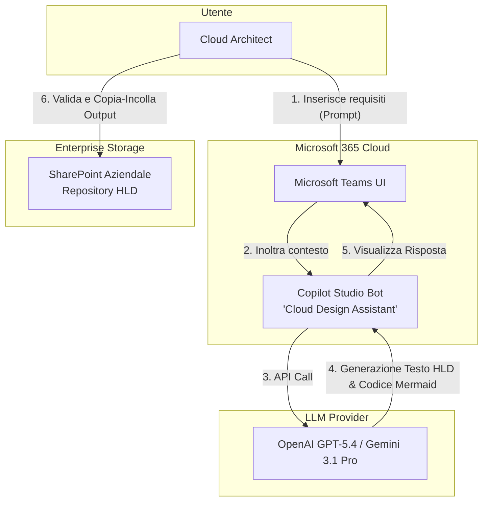
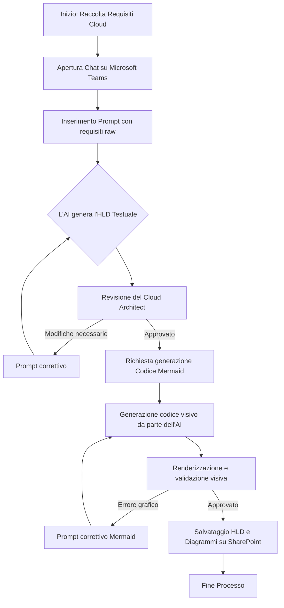
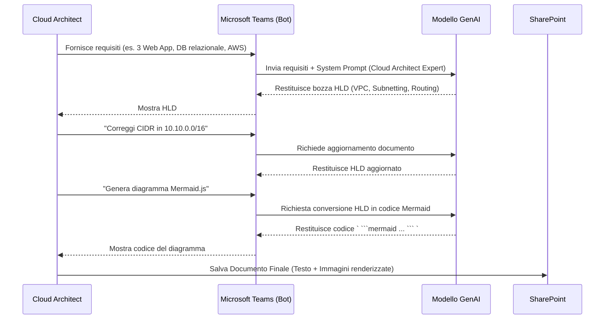

# Blueprint GenAI: Efficentamento del "Disegno Architetturale Cloud Base"

## 1. Descrizione del Caso d'Uso
**Categoria:** Architecture & Design
**Titolo:** Disegno Architetturale Cloud Base
**Ruolo:** Cloud Architect
**Obiettivo Originale (da CSV):** Progettazione dell'architettura di base per ambienti cloud (pubblici, privati o ibridi). Include la definizione di reti virtuali, subnetting, regole di routing e componenti di base necessari per ospitare le applicazioni aziendali, assicurando scalabilità e sicurezza fin dal principio.
**Obiettivo GenAI:** Automatizzare la stesura del documento di High Level Design (HLD) e la generazione di diagrammi architetturali vettoriali a partire da requisiti scritti in linguaggio naturale o appunti di riunione.

## 2. Fasi del Processo Efficentato

### Fase 1: Ingestion dei Requisiti e Generazione HLD
L'architetto inserisce i requisiti di base del progetto (es. numero di applicazioni, requisiti di compliance, cloud provider di destinazione) conversando in linguaggio naturale all'interno di un chatbot. L'AI analizza i requisiti e genera una bozza strutturata del documento HLD, includendo raccomandazioni su VPC, classi IP, subnetting e regole di routing.
*   **Tool Principale Consigliato:** Copilot Studio (su Microsoft Teams)
*   **Alternative:** 1. Accenture Amethyst, 2. ChatGPT Agent (Enterprise)
*   **Modelli LLM Suggeriti:** OpenAI GPT-5.4 o Google Gemini 3.1 Pro
*   **Modalità di Utilizzo:** Configurazione di un Chatbot su Microsoft Teams. L'interfaccia familiare permette al Cloud Architect di avviare il task rapidamente.
    *Bozza del System Prompt per il Bot:*
    ```markdown
    Sei un Cloud Architect Expert. Il tuo compito è ricevere in input dei requisiti destrutturati per un'infrastruttura cloud e generare un documento di High Level Design (HLD).
    Il documento DEVE includere le seguenti sezioni:
    1. Executive Summary
    2. Architettura di Rete (VPC, Subnet Pubbliche/Private, CIDR blocks suggeriti)
    3. Regole di Routing e Security Group/Firewall di base
    4. Componenti di calcolo e storage
    Non inventare requisiti non forniti, ma suggerisci best practice di sicurezza (es. segmentazione) in base al provider cloud target.
    ```
*   **Azione Umana Richiesta:** Il Cloud Architect deve revisionare attentamente le scelte architetturali proposte (in particolare classi IP e segmentazione di rete) e richiedere eventuali aggiustamenti iterando nella chat.
*   **Stima Reale di Efficienza:** 
    *   *Tempo As-Is (Manuale):* 8 ore
    *   *Tempo To-Be (GenAI):* 1 ora
    *   *Risparmio %:* 87.5%
    *   *Motivazione:* L'AI abbatte la "sindrome del foglio bianco" redigendo istantaneamente la struttura e i contenuti standard del documento documentale, permettendo all'esperto di concentrarsi solo sulla validazione tecnica.

### Fase 2: Generazione Automatica dei Diagrammi Architetturali
Una volta approvato l'HLD testuale, l'esperto richiede all'AI di convertire la descrizione logica in codice per diagrammi, ottenendo una rappresentazione visiva immediata da allegare alla documentazione.
*   **Tool Principale Consigliato:** Copilot Studio (stessa sessione della Fase 1)
*   **Alternative:** 1. gemini-cli, 2. visualstudio + copilot
*   **Modelli LLM Suggeriti:** OpenAI GPT-5.4 o Google Gemini 3.1 Pro
*   **Modalità di Utilizzo:** Prompting diretto all'interno della stessa conversazione su Teams.
    *Esempio di Prompt Utente:*
    ```text
    Sulla base dell'HLD appena concordato, genera il codice Mermaid.js (flowchart TD) che rappresenti visivamente questa architettura cloud. Includi i confini della VPC, le subnet pubbliche e private, l'Internet Gateway e i componenti applicativi. Usa i subgraph per separare logicamente le zone.
    ```
*   **Azione Umana Richiesta:** Validazione visiva del diagramma renderizzato (es. tramite un editor Markdown o un visualizzatore Mermaid online) per assicurarsi che i flussi di rete siano rappresentati in modo accurato. Copia-incolla del risultato sulla documentazione ufficiale.
*   **Stima Reale di Efficienza:** 
    *   *Tempo As-Is (Manuale):* 4 ore (uso di tool come Visio o Draw.io)
    *   *Tempo To-Be (GenAI):* 15 minuti
    *   *Risparmio %:* 93.7%
    *   *Motivazione:* Il tracciamento manuale di forme e connessioni richiede molto tempo e precisione; la traduzione da logica a codice grafico (Mermaid) azzera lo sforzo di impaginazione.

## 3. Descrizione del Flusso Logico
Il processo segue un approccio **Single-Agent** per mantenere la massima semplicità, essendo un task concettuale di design. Il Cloud Architect apre Microsoft Teams, interagisce con il "Cloud Design Assistant" (bot creato via Copilot Studio) e fornisce gli appunti della riunione coi referenti aziendali. Il bot genera prima il testo strutturato dell'HLD. L'architetto affina il risultato con alcune correzioni conversazionali ("cambia la classe IP in 10.0.0.0/16"). Approvato il testo, chiede al bot di generare il codice del diagramma Mermaid. L'intero output (testo + codice diagramma) viene copiato e salvato dall'architetto nello SharePoint aziendale. Questo workflow elimina la necessità di orchestrare più agenti, mantenendo il controllo saldamente nelle mani dell'umano (Human-in-the-loop).

## 4. Diagrammi UML (Mermaid.js)

### 4.1 Architecture Diagram


### 4.2 Process Diagram


### 4.3 Sequence Diagram


## 5. Guida all'Implementazione Tecnica

### Prerequisiti
- Licenza aziendale Microsoft Copilot Studio.
- Abilitazione alla creazione e pubblicazione di bot sul tenant Microsoft Teams.
- Policy aziendali che permettono il trattamento di dati di design architetturale su servizi cloud (Enterprise Data Protection attiva).

### Step 1: Creazione del Bot in Copilot Studio
1. Accedere al portale di Microsoft Copilot Studio.
2. Cliccare su **Crea un nuovo Copilot**.
3. Inserire il nome (es. "Cloud Design Assistant") e selezionare la lingua (Italiano).
4. Navigare nella sezione **Generative AI** (o "Impostazioni Copilot") e definire il **System Prompt** primario fornito nella Fase 1. Questo darà al bot il "ruolo" specifico di Architetto Cloud.

### Step 2: Integrazione e Pubblicazione su Teams
1. Nella dashboard di Copilot Studio, andare su **Pubblica** e cliccare su *Pubblica*.
2. Spostarsi sulla scheda **Canali**.
3. Selezionare **Microsoft Teams** e cliccare su *Attiva Teams*.
4. Scegliere l'opzione **Apri bot in Teams** o copiare il link di condivisione per distribuirlo ai Cloud Architect.
5. Il bot apparirà ora come una normale chat nell'elenco conversazioni dell'utente, pronto a ricevere i requisiti.

### Step 3: Utilizzo nel Lavoro Quotidiano
1. Il Cloud Architect, dopo una riunione di kick-off di un progetto, apre la chat con il bot.
2. Digita: *"Ho bisogno di un'architettura AWS per un e-commerce. Serve alta affidabilità su 2 AZ, un Application Load Balancer, istanze EC2 in private subnet e un RDS PostgreSQL. Preparami l'HLD."*
3. Gestisce l'output, lo raffina e richiede i diagrammi direttamente dalla finestra di Teams.

## 6. Rischi e Mitigazioni
- **Rischio 1: Allucinazioni su limiti o funzionalità del Cloud Provider:** L'AI potrebbe suggerire configurazioni di routing non valide o dimensioni di subnet non supportate (es. CIDR troppo piccoli per servizi specifici).
  -> **Mitigazione:** La fase di validazione del Cloud Architect (Human-in-the-loop) è obbligatoria. L'AI funge da "redattore accelerato", non da decisore finale.
- **Rischio 2: Esposizione di Dati Sensibili o IP Aziendali:** Inserimento di IP pubblici reali, nomi di server sensibili o credenziali nel prompt.
  -> **Mitigazione:** Utilizzare una piattaforma enterprise (come Copilot Studio connesso al tenant aziendale) che garantisca la non-ritenzione dei dati per il training dei modelli pubblici. Istruire gli architetti a usare nomi generici in fase di stesura dell'HLD.
- **Rischio 3: Complessità Visiva dei Diagrammi Mermaid:** L'AI potrebbe generare codice Mermaid non renderizzabile o sovraffollato se l'architettura è troppo estesa.
  -> **Mitigazione:** Istruire l'AI (nel prompt) a scomporre architetture complesse in diagrammi multipli più piccoli (es. uno per il Networking, uno per il Compute).