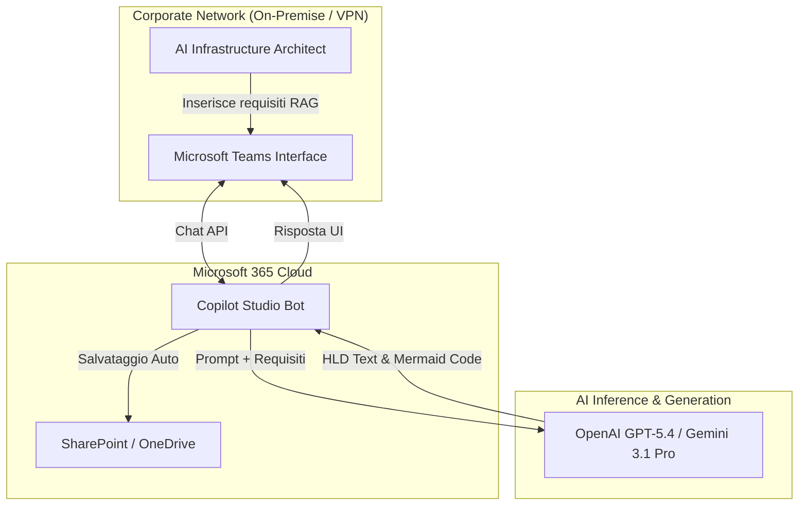
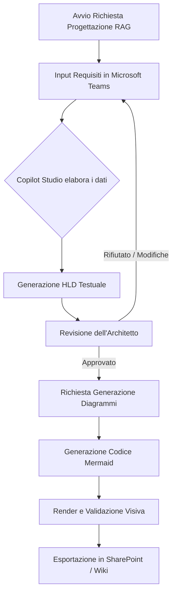
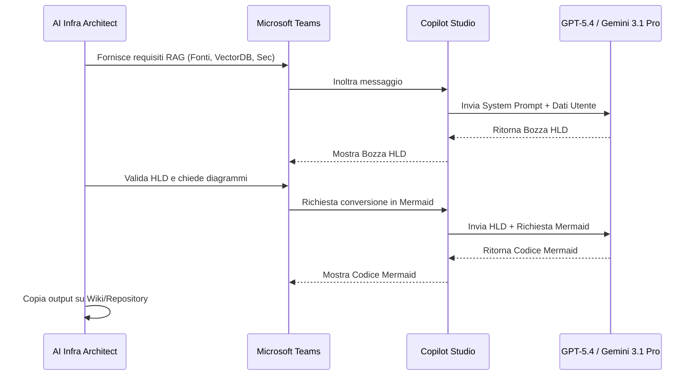

# Blueprint GenAI: Efficentamento del "Progettazione Architettura RAG (Retrieval-Augmented Generation)"

## 1. Descrizione del Caso d'Uso
**Categoria:** Architecture & Design
**Titolo:** Progettazione Architettura RAG (Retrieval-Augmented Generation)
**Ruolo:** AI Infrastructure Architect
**Obiettivo Originale (da CSV):** Definizione dell'infrastruttura necessaria per supportare sistemi di AI generativa aziendale. Include la progettazione del repository documentale (es. SharePoint), pipeline di ingestion dati, Vector Database (es. Pinecone/Qdrant) e regole di network security per isolare le query ai modelli LLM.
**Obiettivo GenAI:** Automatizzare la stesura del documento di High-Level Design (HLD) per infrastrutture RAG, generando sia la descrizione dei componenti (SharePoint, VectorDB, Pipeline, Sicurezza) sia la relativa schematizzazione architetturale (tramite diagrammi-as-code), partendo da un semplice input di requisiti.

## 2. Fasi del Processo Efficentato

### Fase 1: Ingestione Requisiti e Generazione HLD (High-Level Design)
L'AI Infrastructure Architect fornisce i requisiti macroscopici del sistema (es. volumi di dati, fonti aziendali come SharePoint, vincoli di sicurezza) a un assistente conversazionale. L'assistente elabora immediatamente un documento strutturato che descrive il dimensionamento, le scelte tecnologiche (es. Qdrant vs Pinecone) e le regole di segregazione di rete necessarie per i modelli LLM.
*   **Tool Principale Consigliato:** Microsoft Teams (Chatbot UI tramite Copilot Studio)
*   **Alternative:** 1. Accenture Amethyst, 2. ChatGPT Agent
*   **Modelli LLM Suggeriti:** OpenAI GPT-5.4 o Google Gemini 3.1 Pro
*   **Modalità di Utilizzo:** Interazione diretta via chat su Microsoft Teams. L'assistente è pre-istruito con le best practice aziendali in ambito RAG e sicurezza cloud. Il documento generato viene salvato automaticamente in formato Markdown o Word sul OneDrive dell'utente.
    *Esempio di System Prompt per Copilot Studio:*
    ```markdown
    Sei un AI Infrastructure Architect senior. Il tuo compito è generare un HLD per architetture RAG aziendali.
    Dati i requisiti in input dell'utente (Fonti dati, Volume, Sicurezza), devi produrre un documento che includa:
    1. Architettura di Ingestion (da SharePoint a VectorDB).
    2. Scelta e dimensionamento del Vector Database.
    3. Network Security (Private Endpoint, VNet integration per isolare l'LLM).
    Sii tecnico, preciso e usa elenchi puntati per massima leggibilità.
    ```
*   **Azione Umana Richiesta (Human-in-the-loop):** L'architetto deve validare l'HLD proposto, verificando la correttezza del dimensionamento e la conformità delle regole di network security alle policy aziendali.
*   **Stima Reale di Efficienza (ROI strutturato):** 
    *   *Tempo As-Is (Manuale):* 6 ore
    *   *Tempo To-Be (GenAI):* 20 minuti
    *   *Risparmio %:* 94%
    *   *Motivazione:* Si elimina il "blank page syndrome" e il lavoro di copia-incolla da architetture precedenti. L'AI compone rapidamente un template strutturato adattato allo specifico contesto.

### Fase 2: Generazione dei Diagrammi Architetturali (Diagrams-as-Code)
Una volta approvato il testo dell'HLD, l'architetto chiede al bot di generare la rappresentazione visiva dell'infrastruttura RAG proposta utilizzando la sintassi Mermaid.js, ottenendo schemi pronti da incollare su GitHub, Azure DevOps o documentazione wiki.
*   **Tool Principale Consigliato:** Microsoft Teams (Chatbot UI tramite Copilot Studio)
*   **Alternative:** 1. gemini-cli, 2. VisualStudio + Copilot
*   **Modelli LLM Suggeriti:** Google Gemini 3.1 Pro (eccellente per la generazione di codice Mermaid accurato)
*   **Modalità di Utilizzo:** Prompt di follow-up nella stessa sessione di chat.
    *Esempio di Prompt Utente:* "Converti l'HLD appena generato in un diagramma architetturale Mermaid `graph TD` includendo i flussi di rete e i confini logici tra rete aziendale e cloud provider."
*   **Azione Umana Richiesta (Human-in-the-loop):** L'architetto effettua il render del codice Mermaid e apporta eventuali correzioni minimali alla topologia.
*   **Stima Reale di Efficienza (ROI strutturato):** 
    *   *Tempo As-Is (Manuale):* 3 ore (uso di Visio o Draw.io)
    *   *Tempo To-Be (GenAI):* 10 minuti
    *   *Risparmio %:* 94%
    *   *Motivazione:* Disegnare manualmente scatole e frecce richiede molto tempo; la generazione as-code è istantanea e standardizzata.

## 3. Descrizione del Flusso Logico
Il flusso adotta un approccio **Single-Agent** per mantenere la soluzione estremamente semplice e di immediata fruizione. L'architetto interagisce unicamente con il chatbot su Microsoft Teams. L'utente avvia la conversazione inserendo i parametri base del nuovo sistema RAG da progettare. L'AI genera l'High-Level Design testuale. Dopo una rapida revisione a schermo, l'architetto approva e chiede all'AI di produrre i diagrammi Mermaid correlati. Alla fine, l'architetto copia l'output finale (Testo + Codice Mermaid) per inserirlo nella repository ufficiale del progetto o sul wiki SharePoint.

## 4. Diagrammi UML (Mermaid.js)

### 4.1 Architecture Diagram


### 4.2 Process Diagram


### 4.3 Sequence Diagram


## 5. Guida all'Implementazione Tecnica

### Prerequisiti
- Licenza Microsoft 365 con accesso a Copilot Studio.
- Abilitazione per la creazione e distribuzione di bot sul tenant aziendale Microsoft Teams.
- Accesso ai modelli LLM aziendali (Azure OpenAI o API Gemini) integrabili tramite le connessioni di Power Platform/Copilot Studio.

### Step 1: Creazione del Bot in Copilot Studio
1. Accedi al portale di Microsoft Copilot Studio.
2. Clicca su **"Nuovo copilot"** e assegna il nome "RAG Architecture Assistant".
3. Nella sezione **Configurazione > AI generativa**, imposta il comportamento conversazionale e abilita le risposte dinamiche.

### Step 2: Configurazione del System Prompt
1. Naviga in **Argomenti > Argomenti di sistema > Conversazione potenziata (Boosted conversation)** o crea un argomento personalizzato "Genera HLD RAG".
2. Inserisci il **System Prompt** fornito nella Fase 1 di questo documento all'interno delle istruzioni del nodo AI.
3. Se desiderato, aggiungi un'azione (tramite Power Automate) che prenda l'output finale e lo salvi automaticamente in una specifica cartella SharePoint.

### Step 3: Integrazione e Pubblicazione su Microsoft Teams
1. Vai nella sezione **Pubblica** e pubblica l'ultima versione del bot.
2. Vai nella sezione **Canali**, seleziona **Microsoft Teams**.
3. Clicca su **Attiva Teams** e segui la procedura guidata.
4. Scarica il manifesto dell'app o invialo direttamente all'admin di Teams per l'approvazione, rendendolo disponibile ai membri del gruppo Technology & Architecture.

## 6. Rischi e Mitigazioni
- **Rischio 1: Allucinazioni architetturali o design non sicuri.** L'AI potrebbe suggerire configurazioni di rete vulnerabili (es. esposizione pubblica del VectorDB).
  -> **Mitigazione:** Il processo prevede rigorosamente l'azione *Human-in-the-loop*. L'AI Infrastructure Architect deve leggere, validare ed eventualmente correggere il documento prima di considerarlo definitivo. Il System Prompt deve includere esplicitamente il divieto di esporre endpoint pubblici.
- **Rischio 2: Esposizione di dati sensibili aziendali nell'input.** Inserimento di IP o nomi di server reali nei prompt.
  -> **Mitigazione:** Utilizzare istanze enterprise di LLM (es. Azure OpenAI) che non usano i dati aziendali per l'addestramento. Istruire gli architetti a usare placeholder (es. `<VNET_ID>`) durante la fase di progettazione.
