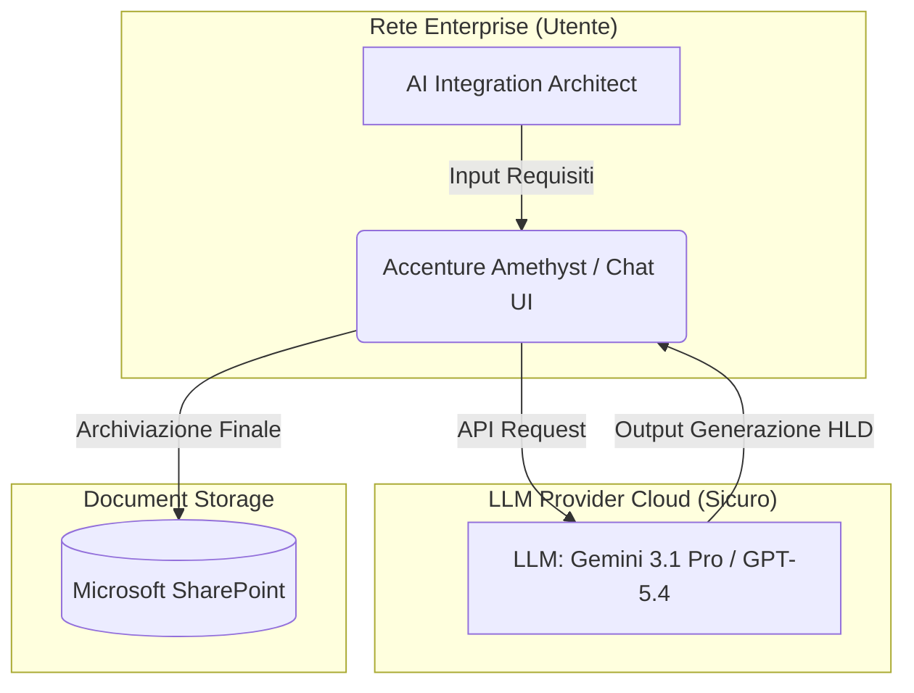
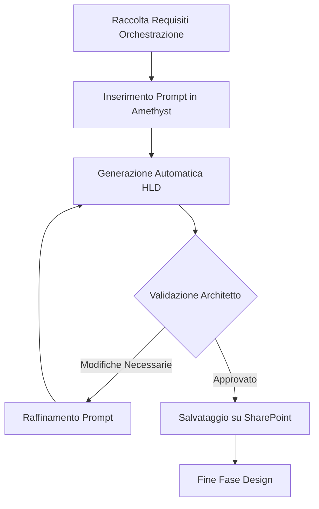
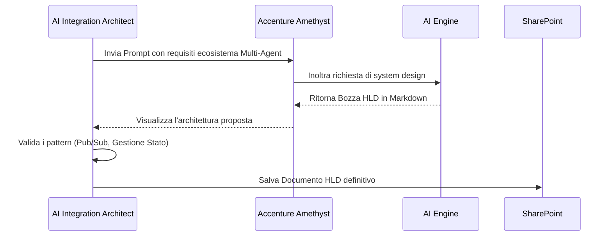

# Blueprint GenAI: Efficentamento del "Design Orchestrazione Multi-Agent"

## 1. Descrizione del Caso d'Uso
**Categoria:** Architecture & Design
**Titolo:** Design Orchestrazione Multi-Agent
**Ruolo:** AI Integration Architect
**Obiettivo Originale (da CSV):** Progettazione di un'architettura a microservizi o serverless per ospitare e orchestrare un ecosistema Multi-Agent (es. tramite Google Antigravity o LangGraph). Include la definizione dei pattern di comunicazione asincrona (code/pub-sub), gestione dello stato e provisioning delle risorse computazionali.
**Obiettivo GenAI:** Automatizzare la generazione del documento di High Level Design (HLD) e delle specifiche architetturali per l'infrastruttura di orchestrazione Multi-Agent, partendo dai requisiti di business, limitandosi strettamente alla fase di design senza invadere l'implementazione del codice IaC.

## 2. Fasi del Processo Efficentato

### Fase 1: Generazione dell'HLD e dei Pattern di Orchestrazione
L'architetto fornisce i requisiti di base all'LLM. L'AI analizza la richiesta e genera un documento strutturato che definisce in modo puntuale i pattern di comunicazione (es. Pub/Sub), la gestione dello stato e i servizi cloud necessari per il provisioning computazionale degli agenti.
*   **Tool Principale Consigliato:** `accenture ametyst`
*   **Alternative:** 1. `chatgpt agent` (Enterprise), 2. `gemini-cli`
*   **Modelli LLM Suggeriti:** Google Gemini 3.1 Pro o OpenAI GPT-5.4
*   **Modalità di Utilizzo:** L'AI Integration Architect interagisce tramite chat, utilizzando il seguente prompt strutturato per garantire un output pronto all'uso:
    ```markdown
    Agisci come un Enterprise GenAI Integration Architect.
    Basandoti sui seguenti requisiti di business: [INSERIRE REQUISITI],
    genera un High Level Design (HLD) per un'architettura serverless su [GCP/AWS/Azure] destinata a orchestrare un ecosistema Multi-Agent.
    
    Il documento deve includere:
    1. Scelta motivata del framework (es. Google Antigravity o LangGraph).
    2. Pattern di comunicazione asincrona tra agenti (es. Pub/Sub, Code).
    3. Soluzione per la gestione dello stato (es. Redis/Memorystore, DB Vettoriali).
    4. Elenco dei servizi Cloud specifici per il provisioning computazionale.
    Genera il risultato formattato in Markdown, pronto per SharePoint.
    ```
*   **Azione Umana Richiesta:** L'architetto deve supervisionare e validare (Human-in-the-loop) l'architettura proposta, accertandosi che i pattern asincroni e i servizi scelti rispettino le policy aziendali.
*   **Stima Reale di Efficienza:** 
    *   *Tempo As-Is (Manuale):* 6 ore
    *   *Tempo To-Be (GenAI):* 20 minuti
    *   *Risparmio %:* 94%
    *   *Motivazione:* La concettualizzazione iniziale e la stesura materiale del documento architetturale vengono demandate all'LLM. L'architetto riduce drasticamente i tempi morti passando da un ruolo di "creatore" a "revisore e decisore".

## 3. Descrizione del Flusso Logico
Il flusso inizia con la raccolta dei requisiti di business dell'ecosistema Multi-Agent. L'AI Integration Architect fornisce queste informazioni ad Accenture Amethyst. L'LLM elabora i dati e genera una documentazione architetturale coerente, suggerendo le topologie di rete e i sistemi di messaggistica ottimali. Una volta validato dall'umano, il documento viene salvato su SharePoint.
**Architettura Agentica:** Per automatizzare questa specifica fase di design viene adottato un approccio **Single-Agent**, in quanto la generazione di un HLD partendo da requisiti testuali è un compito diretto in cui un modello avanzato centralizzato fornisce risultati eccellenti in tempi rapidi. Non è necessaria un'orchestrazione complessa per redigere documentazione architetturale.

## 4. Diagrammi UML (Mermaid.js)

### 4.1 Architecture Diagram


### 4.2 Process Diagram


### 4.3 Sequence Diagram


## 5. Guida all'Implementazione Tecnica
### Prerequisiti
- Accesso utente alla piattaforma enterprise GenAI aziendale (es. Accenture Amethyst).
- Credenziali valide per l'accesso a Microsoft SharePoint.
- Requisiti di progetto preliminarmente raccolti in testo semplice.

### Step 1: Preparazione dei Dati
- Compilare in un file di appunti i vincoli infrastrutturali (es. Cloud Provider preferito, volumi stimati, necessità di isolamento di rete).

### Step 2: Generazione Assistita
- Accedere all'interfaccia web di Accenture Amethyst.
- Avviare una nuova chat e assicurarsi di selezionare il modello LLM più performante disponibile (es. Google Gemini 3.1 Pro).
- Incollare il prompt suggerito nella Fase 1, valorizzando il campo `[INSERIRE REQUISITI]` con gli appunti creati al punto precedente.
- Avviare la richiesta.

### Step 3: Validazione e Archiviazione
- Rivedere criticamente le scelte architetturali proposte per i microservizi o il serverless computing.
- Se necessario, richiedere modifiche iterative (es. "Sostituisci la gestione dello stato basata su Redis con GCP Firestore").
- Copiare l'output validato e incollarlo in un file Markdown o Word.
- Caricare e condividere il file nel repository SharePoint del progetto.

## 6. Rischi e Mitigazioni
- **Rischio 1:** Allucinazioni tecnologiche (es. invenzione di servizi cloud inesistenti o deprecati). -> **Mitigazione:** Validazione obbligatoria dell'output da parte di un Architect esperto prima della fase di sviluppo (Human-in-the-loop).
- **Rischio 2:** Inserimento di dati sensibili del cliente nel prompt. -> **Mitigazione:** Utilizzo esclusivo di interfacce sicure e contrattualizzate (come Accenture Amethyst) che assicurano la non-ritenzione dei dati e il mancato addestramento dei modelli pubblici.