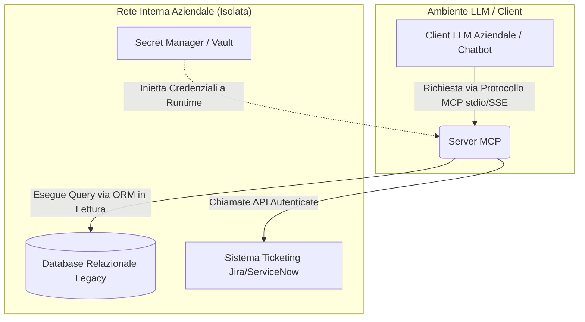
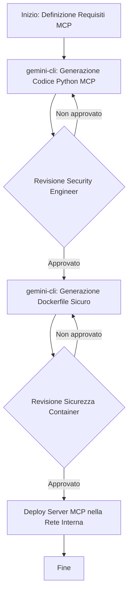
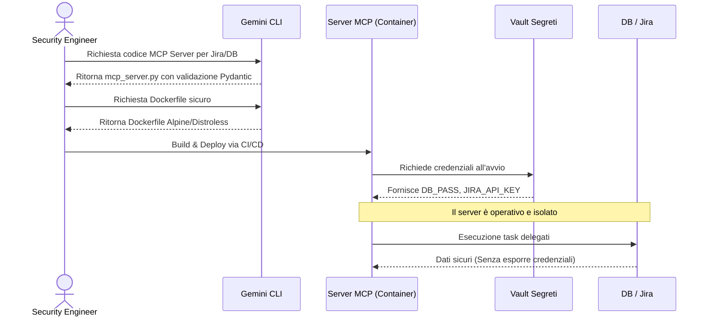

# Blueprint GenAI: Efficentamento del "Implementazione Model Context Protocol (MCP)"

## 1. Descrizione del Caso d'Uso
**Categoria:** Architecture & Design
**Titolo:** Implementazione Model Context Protocol (MCP)
**Ruolo:** Security Engineer
**Obiettivo Originale (da CSV):** Progettazione e rilascio di server MCP sicuri all'interno della rete aziendale per consentire agli agenti LLM di interrogare in sicurezza database relazionali legacy, API interne e sistemi di ticketing (es. Jira/ServiceNow) senza esporre credenziali.
**Obiettivo GenAI:** Automatizzare la generazione del codice boilerplate e delle configurazioni di sicurezza per i server MCP (in Python/TypeScript), includendo la gestione sicura dei segreti (variabili d'ambiente) e gli schemi di validazione dei tool per l'accesso controllato a Jira/ServiceNow e ai database relazionali.

## 2. Fasi del Processo Efficentato

### Fase 1: Generazione Boilerplate del Server MCP e Tool Schema
Generazione del codice sorgente di base del server MCP, definizione degli endpoint (Tool) per Jira e DB relazionali e implementazione degli schemi di validazione dati.
*   **Tool Principale Consigliato:** `gemini-cli`
*   **Alternative:** 1. `visualstudio + copilot`, 2. `claude-code`
*   **Modelli LLM Suggeriti:** Google Gemini 3.1 Pro (o Claude Sonnet 4.6)
*   **Modalità di Utilizzo:** Tramite `gemini-cli`, si fornisce un prompt testuale con i requisiti di sicurezza e architetturali del server MCP, ottenendo uno script pronto all'uso.
    ```bash
    gemini "Scrivi un server MCP in Python usando l'SDK ufficiale 'mcp'. Il server deve esporre due tool: 'get_jira_issue' e 'query_db'. Deve leggere le credenziali (JIRA_API_KEY, DB_PASS) in modo sicuro esclusivamente dalle variabili d'ambiente tramite os.environ. Includi la validazione Pydantic rigorosa per gli input dei tool, vietando caratteri speciali per prevenire injection." > mcp_server.py
    ```
*   **Azione Umana Richiesta:** Il Security Engineer deve verificare che la gestione delle variabili d'ambiente segua le policy aziendali e validare i pattern di query al DB (assicurandosi che le query non siano distruttive e usino prepared statements).
*   **Stima Reale di Efficienza:** 
    *   *Tempo As-Is (Manuale):* 8 ore
    *   *Tempo To-Be (GenAI):* 30 minuti
    *   *Risparmio %:* 93%
    *   *Motivazione:* L'AI genera istantaneamente il boilerplate dell'SDK MCP e gli schemi Pydantic, eliminando la necessità di leggere l'intera documentazione del protocollo e scrivere codice strutturale ripetitivo.

### Fase 2: Configurazione Sicura e Distribuzione (Containerizzazione)
Creazione automatica del Dockerfile e delle istruzioni di avvio per il rilascio sicuro del server MCP all'interno della rete aziendale, limitando l'esposizione di rete (es. comunicazione via stdio).
*   **Tool Principale Consigliato:** `gemini-cli`
*   **Alternative:** 1. `visualstudio + copilot`
*   **Modelli LLM Suggeriti:** Google Gemini 3.1 Pro
*   **Modalità di Utilizzo:** Generazione rapida di configurazioni sicure tramite CLI.
    ```bash
    gemini "Crea un Dockerfile minimale e sicuro (basato su python:3.11-alpine o distroless) per eseguire lo script Python 'mcp_server.py' come utente non di root. Il server deve comunicare unicamente via stdio. Aggiungi commenti su come mappare in modo sicuro un vault dei segreti come variabili d'ambiente a runtime." > Dockerfile
    ```
*   **Azione Umana Richiesta:** Validazione del Dockerfile per l'assenza di vulnerabilità note, verifica dell'utente non privilegiato e integrazione con le pipeline CI/CD aziendali o sistemi di Secret Management (es. HashiCorp Vault).
*   **Stima Reale di Efficienza:** 
    *   *Tempo As-Is (Manuale):* 2 ore
    *   *Tempo To-Be (GenAI):* 10 minuti
    *   *Risparmio %:* 91%
    *   *Motivazione:* Container file generati in pochi secondi con le best practice di sicurezza pre-applicate, abbattendo i tempi di configurazione manuale.

## 3. Descrizione del Flusso Logico
L'architettura adotta un approccio **Single-Agent** orientato allo sviluppo assistito. L'agente (GenAI via CLI) affianca il Security Engineer generando sequenzialmente il codice applicativo del Server MCP, definendo rigorosamente gli schemi di input (per mitigare injection) e successivamente creando l'ambiente di runtime sicuro (Dockerfile). Il Server MCP risultante agirà come "ponte" sicuro nella rete aziendale: riceverà richieste dagli agenti LLM via protocollo MCP, validerà i parametri in ingresso tramite Pydantic, e interrogherà internamente i DB o i sistemi di ticketing usando credenziali conservate esclusivamente sul server stesso. I risultati verranno restituiti all'agente chiamante senza mai esporre token o password. Il Security Engineer (Human-in-the-loop) supervisiona esclusivamente l'aderenza delle query e dei container alle policy di sicurezza aziendali prima del deployment.

## 4. Diagrammi UML (Mermaid.js)

### 4.1 Architecture Diagram


### 4.2 Process Diagram


### 4.3 Sequence Diagram


## 5. Guida all'Implementazione Tecnica
### Prerequisiti
- Installazione di `gemini-cli` con API Key (o account Enterprise) validata sulla postazione del Security Engineer.
- Ambiente Python 3.11+ e Docker per i test locali.
- Accesso ai sistemi target (es. API Token di Jira con privilegi minimi, credenziali DB di sola lettura).

### Step 1: Generazione del Server MCP Base
1. Aprire il terminale e lanciare il comando `gemini-cli` con il prompt suggerito nella Fase 1.
2. Esaminare il file `mcp_server.py` generato. Assicurarsi che le dipendenze dichiarate (es. `mcp[cli]`, `pydantic`, `requests`, `sqlalchemy`) siano presenti e che la validazione degli input sia rigorosa.
3. Creare un ambiente virtuale locale e testare la sintassi: `python -m py_compile mcp_server.py`.

### Step 2: Containerizzazione Sicura
1. Lanciare il prompt della Fase 2 tramite `gemini-cli` per ottenere il `Dockerfile`.
2. Verificare che il Dockerfile imposti la direttiva `USER` verso un account non privilegiato (es. `appuser`).
3. Effettuare la build dell'immagine Docker: `docker build -t mcp-internal-server:v1 .`

### Step 3: Deployment e Integrazione
1. Definire le variabili d'ambiente necessarie (`JIRA_API_KEY`, `DB_PASS`) nel sistema di orchestrazione aziendale o nel Secret Manager.
2. Avviare il container o configurare il client LLM (es. applicazione frontend o bot Teams) affinché esegua il container Docker usando `stdio` come canale di trasporto MCP. Esempio di comando per l'agent: `docker run -i --rm --env-file .env.secrets mcp-internal-server:v1`.
3. Validare l'integrazione lanciando un prompt di test dall'LLM ("Qual è lo stato del ticket JIRA-123?").

## 6. Rischi e Mitigazioni
- **Rischio 1: Prompt Injection con SQL Injection.** Un utente malevolo potrebbe indurre l'LLM a passare parametri di query distruttivi. -> **Mitigazione:** Il server MCP non deve mai eseguire query SQL raw. Devono essere utilizzati rigorosamente ORM (es. SQLAlchemy) o prepared statements, validando i parametri con Pydantic. L'utenza DB usata dal server deve essere limitata a `SELECT`.
- **Rischio 2: Esposizione accidentale dei segreti nel codice.** -> **Mitigazione:** Verificare rigorosamente che il codice generato dall'AI usi `os.environ.get()` e non contenga stringhe hardcoded. Configurare scanner di secret (es. Gitleaks) prima di eventuali commit.
- **Rischio 3: Accesso non autorizzato ai tool MCP.** -> **Mitigazione:** Configurare il server MCP per comunicare esclusivamente via `stdio` (isolando i processi) oppure, se esposto in HTTP/SSE, applicare meccanismi di autenticazione robusti come mTLS o JWT, proteggendo il traffico all'interno della VPN aziendale.