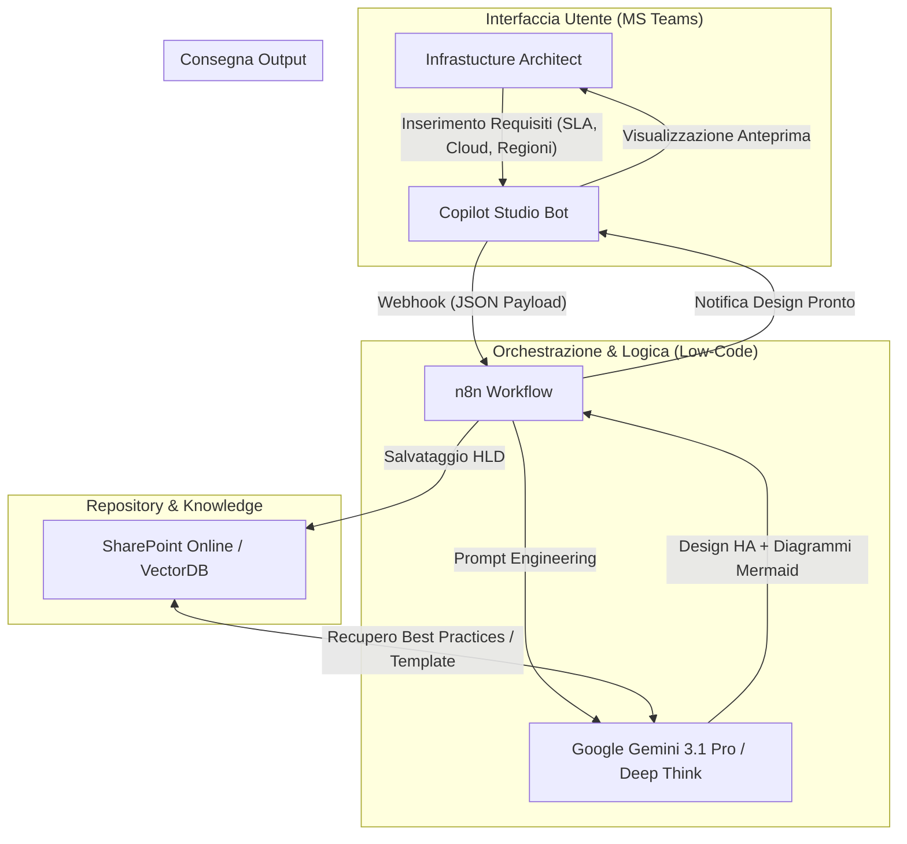
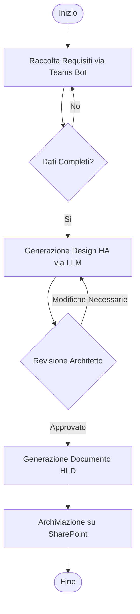
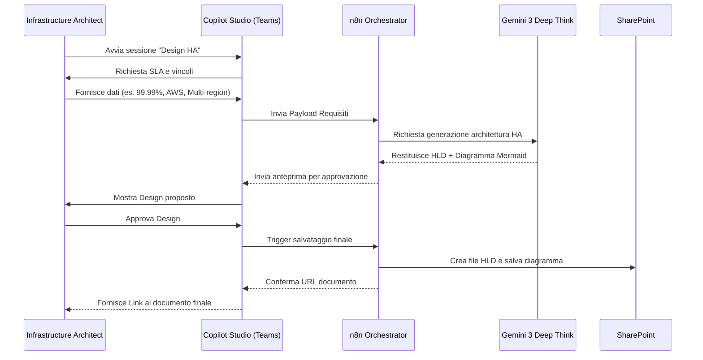

# Blueprint GenAI: Efficentamento del "Design Alta Affidabilità (HA)"

## 1. Descrizione del Caso d'Uso
**Categoria:** Architecture & Design
**Titolo:** Design Alta Affidabilità (HA)
**Ruolo:** Infrastructure Architect
**Obiettivo Originale (da CSV):** Progettazione di sistemi resilienti in grado di garantire la continuità operativa. Include la configurazione di cluster attivo-attivo, bilanciatori di carico L4/L7, auto-scaling group e ridondanza geografica multi-region sui cloud provider.
**Obiettivo GenAI:** Automatizzare la generazione di un High-Level Design (HLD) focalizzato sulla resilienza, producendo raccomandazioni tecniche per pattern di clustering, configurazioni di bilanciamento (L4/L7) e strategie di ridondanza multi-regione basate su requisiti di SLA e traffico forniti dall'utente.

## 2. Fasi del Processo Efficentato

### Fase 1: Raccolta Requisiti e Vincoli (Ingestion)
In questa fase, l'Infrastructure Architect interagisce con un bot per definire i parametri critici: SLA richiesto (es. 99.99%), tipo di traffico, budget di latenza, cloud provider di riferimento e regioni geografiche coinvolte.
*   **Tool Principale Consigliato:** **Microsoft Teams (Chatbot UI)** tramite **Copilot Studio**.
*   **Alternative:** 1. Accenture Amethyst, 2. ChatGPT Agent.
*   **Modelli LLM Suggeriti:** Google Gemini 3.1 Pro (via API).
*   **Modalità di Utilizzo:** Creazione di un Copilot che guida l'utente attraverso una serie di domande strutturate. Il bot utilizza un prompt di sistema per estrarre informazioni tecniche precise.
    *   **Bozza Prompt Bot:** `"Agisci come un Esperto di High Availability. Chiedi all'utente: 1. Qual è lo SLA obiettivo? 2. È necessario un approccio Attivo-Attivo o Attivo-Passivo? 3. Quali sono i volumi di traffico attesi? 4. Su quale Cloud Provider dobbiamo operare? Invia questi dati al workflow di progettazione."`
*   **Azione Umana Richiesta:** L'architetto inserisce i dati e conferma la sintesi dei requisiti prodotta dal bot.
*   **Stima Reale di Efficienza:** 
    *   *Tempo As-Is (Manuale):* 2 ore (riunioni e check-list manuali).
    *   *Tempo To-Be (GenAI):* 10 minuti.
    *   *Risparmio %:* 92%.
    *   *Motivazione:* Eliminazione di iterazioni multiple per la raccolta dei dati minimi necessari al design.

### Fase 2: Elaborazione del Design Architetturale (Pattern Matching)
L'LLM elabora i dati ricevuti e propone un'architettura ottimizzata selezionando i componenti (Load Balancers, ASG, Database Replicas) e descrivendo le interconnessioni tra le regioni.
*   **Tool Principale Consigliato:** **n8n** (Orchestratore) integrato con **Gemini 3.1 Pro**.
*   **Alternative:** 1. Google Antigravity, 2. OpenClaw (per dati on-prem).
*   **Modelli LLM Suggeriti:** Google Gemini 3 Deep Think (per ragionamento complesso sulla topologia di rete e tolleranza ai guasti).
*   **Modalità di Utilizzo:** Un workflow n8n riceve il JSON dal bot di Teams, interroga Gemini fornendo un **System Prompt** specifico per il design HA e riceve in output la descrizione tecnica e il codice Mermaid per lo schema.
    *   **Bozza System Prompt:** `"Sei un Senior Cloud Architect certificato AWS/Azure/GCP. Basandoti sui requisiti [REQUISITI], genera un design di Alta Affidabilità che includa: 1. Schema del Load Balancing (L4/L7). 2. Configurazione Auto-scaling. 3. Strategia di replica DB (Sync/Async). 4. Gestione del failover DNS (es. Route53/Traffic Manager). Fornisci l'output in formato Markdown con diagrammi Mermaid."`
*   **Azione Umana Richiesta:** Revisione tecnica della proposta architetturale generata.
*   **Stima Reale di Efficienza:** 
    *   *Tempo As-Is (Manuale):* 6 ore (disegno e stesura documentazione).
    *   *Tempo To-Be (GenAI):* 5 minuti.
    *   *Risparmio %:* 98%.
    *   *Motivazione:* La generazione istantanea di schemi complessi e configurazioni standard riduce drasticamente il tempo di "foglio bianco".

### Fase 3: Documentazione e Archiviazione
Il design approvato viene trasformato in un documento HLD formale e salvato nel repository di progetto.
*   **Tool Principale Consigliato:** **SharePoint Online** (Integrazione via n8n).
*   **Alternative:** 1. Confluence, 2. GitHub Wiki.
*   **Modelli LLM Suggeriti:** Anthropic Claude Sonnet 4.6 (per la rifinitura linguistica e formale del documento).
*   **Modalità di Utilizzo:** Il workflow n8n invia il testo finale alle API di SharePoint per creare una pagina o un file .docx strutturato secondo il template aziendale.
*   **Azione Umana Richiesta:** Approvazione finale del documento e condivisione con gli stakeholder.
*   **Stima Reale di Efficienza:** 
    *   *Tempo As-Is (Manuale):* 2 ore (formattazione e upload).
    *   *Tempo To-Be (GenAI):* 2 minuti.
    *   *Risparmio %:* 98%.
    *   *Motivazione:* Automazione completa del processo di pubblicazione.

## 3. Descrizione del Flusso Logico
Il flusso è lineare e segue un approccio **Single-Agent** ("The Resiliency Architect"). L'interazione inizia su Microsoft Teams, dove l'utente fornisce i parametri. n8n funge da "sistema nervoso", trasportando i dati all'LLM (Gemini 3 Deep Think) che applica le best-practice di architettura cloud (Well-Architected Framework) per generare il design. L'output include sia la descrizione testuale che i diagrammi grafici pronti per la visualizzazione. Se l'architetto richiede modifiche, il bot gestisce il ciclo di feedback aggiornando il design in tempo reale.

## 4. Diagrammi UML (Mermaid.js)

### 4.1 Application & System Architecture

### 4.2 Process Diagram

### 4.3 Sequence Diagram

## 5. Guida all'Implementazione Tecnica

### Prerequisiti
- Licenza **Microsoft 365** (per Teams e SharePoint).
- Account **Copilot Studio** abilitato.
- Istanza **n8n** (Cloud o Self-hosted).
- API Key per **Google Gemini** (via Google Cloud Vertex AI o AI Studio).

### Step 1: Configurazione Copilot Studio
1.  Crea un nuovo Copilot denominato "Resiliency ArchBot".
2.  Configura i **Topics** per porre le domande chiave (SLA, Load Balancing type, Regions).
3.  Crea un nodo "Call an Action" che invia un output JSON verso un Webhook di n8n.

### Step 2: Creazione Workflow n8n
1.  **Webhook Node:** Riceve i dati da Teams.
2.  **HTTP Request (Gemini API):** Invia un prompt strutturato (vedi bozza fase 2) includendo i dati del Webhook.
3.  **Code Node (opzionale):** Per formattare l'output Mermaid in modo che sia visualizzabile.
4.  **SharePoint Node:** Utilizza le credenziali OAuth2 per creare un file o aggiornare una lista con il design generato.

### Step 3: Integrazione Canale Teams
1.  Pubblica il Copilot creato nello step 1.
2.  Configura l'accesso per il team "Technology & Architecture".
3.  Testa il flusso end-to-end partendo da una richiesta di design per un'applicazione mission-critical.

## 6. Rischi e Mitigazioni
- **Rischio 1: Allucinazioni su limiti tecnici cloud (es. limiti di throughput di un LB specifico) -> **Mitigazione:** Integrare nel prompt di Gemini l'accesso (via RAG o MCP) alla documentazione ufficiale del cloud provider scelto o aggiungere un disclaimer di validazione umana obbligatoria.
- **Rischio 2: Complessità eccessiva del design proposto -> **Mitigazione:** Istruire l'LLM nel System Prompt a seguire il principio di "KISS" (Keep It Simple, Stupid) e a proporre opzioni basate sul costo/efficacia.
- **Rischio 3: Sicurezza dei dati di rete -> **Mitigazione:** Non inserire indirizzi IP reali o segreti nel prompt; utilizzare nomi logici per i componenti (es. `lb-frontend-01`).
