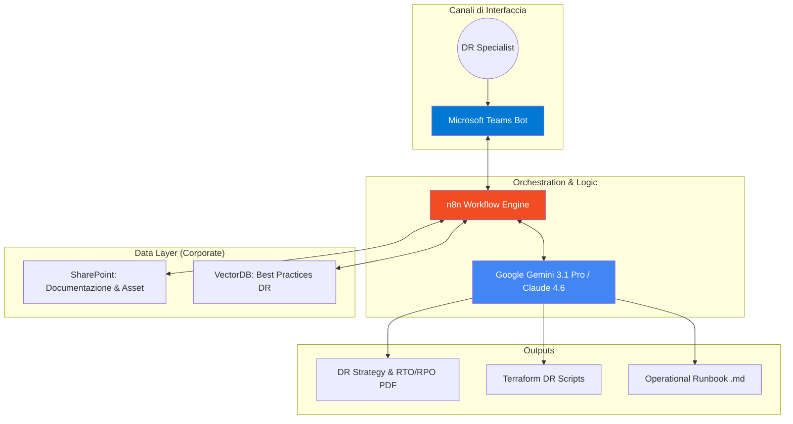
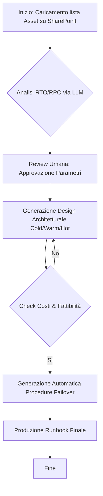
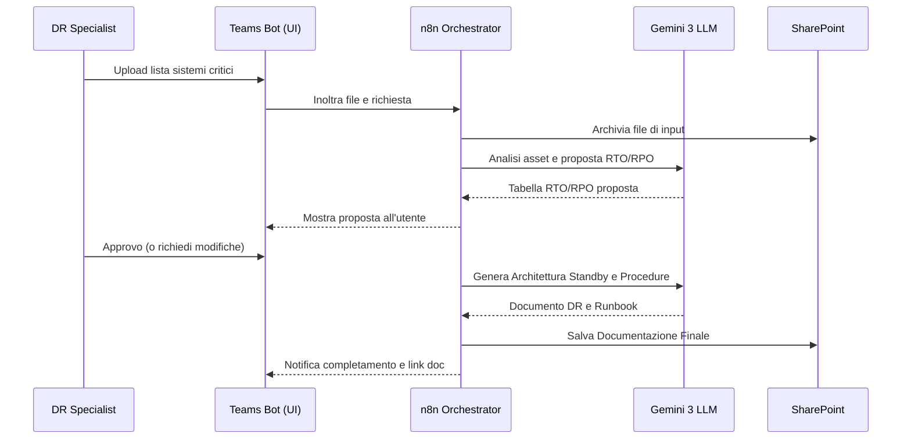

# Blueprint GenAI: Efficentamento del "Design Disaster Recovery (DR)"

## 1. Descrizione del Caso d'Uso
**Categoria:** Architecture & Design
**Titolo:** Design Disaster Recovery (DR)
**Ruolo:** Disaster Recovery Specialist
**Obiettivo Originale (da CSV):** Definizione delle strategie e delle tempistiche (RTO e RPO) per il ripristino dei servizi IT a seguito di eventi disastrosi. Include la progettazione di siti secondari in cold/warm standby e la stesura delle procedure di failover e failback.
**Obiettivo GenAI:** Automatizzare la definizione dei parametri di resilienza (RTO/RPO), la selezione del modello di DR (Cold/Warm/Hot) e la generazione automatica delle procedure operative (Runbook) basandosi sull'analisi degli asset critici caricati su SharePoint.

## 2. Fasi del Processo Efficentato

### Fase 1: Analisi Asset e Definizione RTO/RPO
L'utente interagisce con un bot su Teams per fornire l'elenco dei sistemi critici (o punta a una cartella SharePoint). L'AI analizza i requisiti di business e propone valori di RTO (Recovery Time Objective) e RPO (Recovery Point Objective) coerenti con le best practice di settore (es. ISO 22301).
*   **Tool Principale Consigliato:** `Microsoft Teams (Chatbot UI)` integrato con `n8n`
*   **Alternative:** 1. Accenture Amethyst, 2. ChatGPT Agent
*   **Modelli LLM Suggeriti:** Google Gemini 3 Deep Think (per ragionamento analitico sui vincoli di business)
*   **Modalità di Utilizzo:** Creazione di un workflow n8n che riceve un file Excel/CSV di asset tramite webhook da Teams e interroga l'LLM per classificare la criticità.
    *   *Prompt suggerito:* "Analizza questo elenco di applicazioni [Asset_List]. Per ogni applicazione, suggerisci RTO e RPO basandoti su una classificazione Gold/Silver/Bronze e motiva la scelta in base all'impatto sul business descritto."
*   **Azione Umana Richiesta:** Validazione della tabella RTO/RPO proposta prima di procedere alla fase tecnica.
*   **Stima Reale di Efficienza:** 
    *   *Tempo As-Is (Manuale):* 8 ore (meeting e analisi manuale)
    *   *Tempo To-Be (GenAI):* 30 minuti
    *   *Risparmio %:* 94%
    *   *Motivazione:* L'AI standardizza istantaneamente i parametri basandosi su pattern consolidati, eliminando discussioni preliminari infinite.

### Fase 2: Progettazione Architettura di Ripristino
L'AI elabora la soluzione tecnica (es. Multi-region Azure/AWS, Cloud-to-OnPrem) e seleziona la modalità di standby (Cold, Warm, Hot) ottimizzando il rapporto costi/resilienza.
*   **Tool Principale Consigliato:** `accenture ametyst` (per la sicurezza dei dati architetturali)
*   **Alternative:** 1. AI-Studio Google (per visualizzare il costo stimato), 2. gemini-cli
*   **Modelli LLM Suggeriti:** Anthropic Claude Opus 4.6 (eccellente per sintesi architetturali complesse)
*   **Modalità di Utilizzo:** Caricamento del diagramma HLD (High Level Design) esistente come immagine o testo. L'LLM genera il capitolo "Disaster Recovery Design" del documento di progetto.
*   **Azione Umana Richiesta:** Revisione tecnica della connettività di rete tra sito primario e secondario.
*   **Stima Reale di Efficienza:** 
    *   *Tempo As-Is (Manuale):* 12 ore
    *   *Tempo To-Be (GenAI):* 45 minuti
    *   *Risparmio %:* 93%
    *   *Motivazione:* La generazione del design documentale è quasi istantanea partendo dai requisiti approvati nella Fase 1.

### Fase 3: Generazione Runbook (Procedure Failover/Failback)
Creazione automatica delle liste di controllo (checklists) e degli script di automazione per il passaggio al sito secondario.
*   **Tool Principale Consigliato:** `visualstudio + copilot`
*   **Alternative:** 1. gemini-cli, 2. claude-code
*   **Modelli LLM Suggeriti:** Google Gemini 3.1 Pro (ottimizzato per script IaC e procedure step-by-step)
*   **Modalità di Utilizzo:** L'AI scrive le procedure operative in formato Markdown partendo dai diagrammi di flusso. Può anche generare script Terraform/Bicep per il "pilot light" del DR.
*   **Azione Umana Richiesta:** Test dei comandi suggeriti in un ambiente di sandbox.
*   **Stima Reale di Efficienza:** 
    *   *Tempo As-Is (Manuale):* 16 ore
    *   *Tempo To-Be (GenAI):* 2 ore
    *   *Risparmio %:* 87%
    *   *Motivazione:* Scrivere procedure di failover dettagliate è un task ripetitivo che l'AI esegue senza dimenticare passaggi critici (es. aggiornamento DNS o mount dei volumi).

## 3. Descrizione del Flusso Logico
Il processo è strutturato come un approccio **Single-Agent** (denominato "DR Architect Agent"). L'agente mantiene il contesto tra l'analisi dei requisiti (Fase 1), il design dell'infrastruttura (Fase 2) e la scrittura dei manuali operativi (Fase 3). Il dato fluisce da SharePoint (input degli asset) verso l'LLM tramite un'interfaccia Teams che funge da orchestratore per l'esperto umano. L'interazione è lineare: l'esperto approva ogni output prima che l'agente passi allo step successivo.

## 4. Diagrammi UML (Mermaid.js)

### 4.1 Architecture Diagram

### 4.2 Process Diagram

### 4.3 Sequence Diagram

## 5. Guida al Implementazione Tecnica

### Prerequisiti
- Licenza **Microsoft Teams** e accesso a **n8n** (self-hosted o cloud).
- API Key per **Google Gemini API** (Vertex AI) o Anthropic.
- Accesso in lettura/scrittura a un sito **SharePoint** dedicato.

### Step 1: Configurazione Bot Teams & n8n
1.  Crea un workflow in **n8n** con un nodo "Microsoft Teams Trigger" che ascolta messaggi contenenti allegati.
2.  Configura un nodo "HTTP Request" o il nodo nativo "Google Gemini" per inviare il contenuto degli asset all'LLM.
3.  Inserisci nel nodo LLM il **System Prompt**: 
    > "Sei un esperto certificato in Business Continuity. Analizza gli asset forniti e definisci una strategia di DR basata sui criteri Gold (RTO<4h), Silver (RTO<24h) e Bronze (RTO>48h). Produci una tabella Markdown e motiva ogni scelta."

### Step 2: Integrazione SharePoint per i Runbook
1.  Configura il nodo "Microsoft SharePoint" in n8n per creare una cartella specifica per ogni progetto di DR.
2.  Usa l'output dell'LLM (Fase 3) per generare file `.md` o `.docx` e caricali automaticamente su SharePoint per la firma finale.

## 6. Rischi e Mitigazioni
- **Rischio:** RTO/RPO proposti non realistici per i limiti di banda/rete.
- **Mitigazione:** Inserire nel prompt dell'LLM i parametri di capacità della rete aziendale come vincoli (MCP con tool di monitoraggio rete).
- **Rischio:** Comandi di failover obsoleti o pericolosi.
- **Mitigazione:** Obbligo di validazione umana (Human-in-the-loop) e test degli script in ambiente di pre-produzione (DR Drill).
