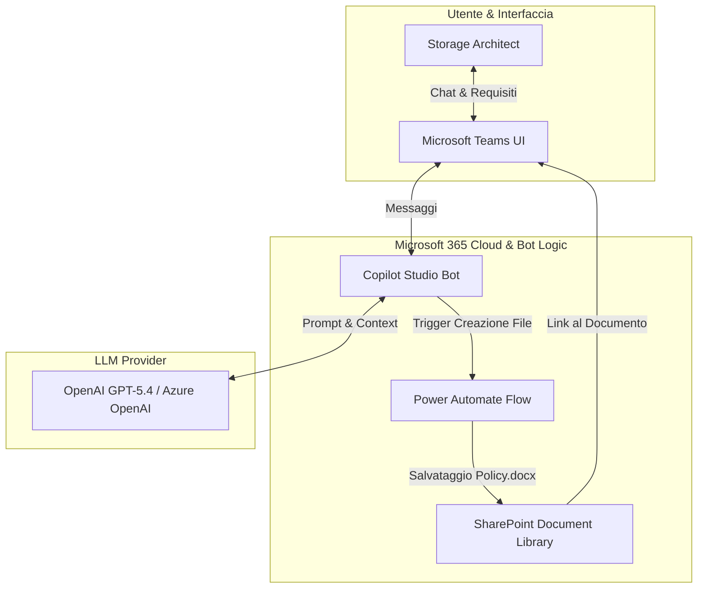
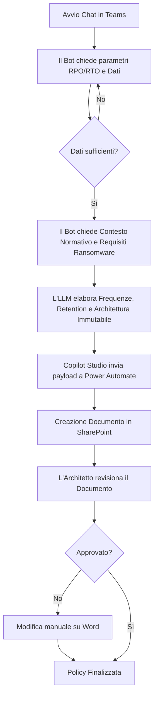
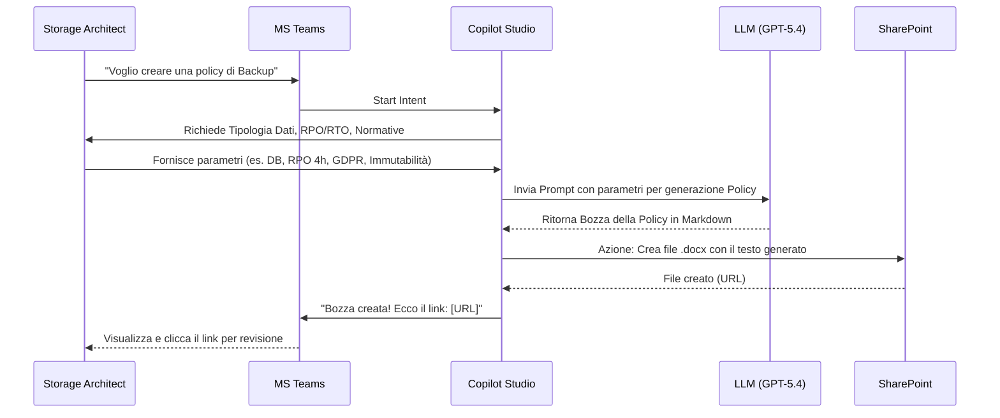

# Blueprint GenAI: Efficentamento del "Design Backup e Retention"

## 1. Descrizione del Caso d'Uso
**Categoria:** Architecture & Design
**Titolo:** Design Backup e Retention
**Ruolo:** Storage & Backup Architect
**Obiettivo Originale (da CSV):** Progettazione delle politiche di salvataggio dei dati aziendali. Definizione della frequenza di backup (giornalieri, settimanali, mensili), della tipologia (completi, incrementali), implementazione di storage immutabili contro i ransomware e calcolo del periodo di conservazione normativo.
**Obiettivo GenAI:** Creare un assistente conversazionale integrato in Microsoft Teams in grado di acquisire i requisiti (RPO/RTO, normative, tipologia di dati) e generare automaticamente una bozza completa della policy di Backup e Retention (inclusiva di configurazioni per storage immutabile e calcoli di conservazione), salvandola in SharePoint per la revisione.

## 2. Fasi del Processo Efficentato

### Fase 1: Raccolta Requisiti e Generazione Policy
L'architetto interagisce con un Chatbot su Microsoft Teams. Il bot pone domande mirate (es. "Quali sono i vincoli normativi? GDPR, HIPAA?", "Qual è l'RPO richiesto?", "Ci sono requisiti di immutabilità per protezione ransomware?"). Sulla base delle risposte, l'LLM elabora e calcola il periodo di conservazione e la frequenza ideale, generando un documento di Design delle Policy.
*   **Tool Principale Consigliato:** `copilot studio` (per creazione bot e pubblicazione su Microsoft Teams)
*   **Alternative:** `Accenture Amethyst`, `n8n` (con trigger via form web e generazione su Google Docs/Word)
*   **Modelli LLM Suggeriti:** OpenAI GPT-5.4 (eccellente per comprensione normativa e strutturazione documentale) o Google Gemini 3.1 Pro.
*   **Modalità di Utilizzo:** Interfaccia Chatbot su Teams. Il bot utilizza un System Prompt preconfigurato per agire da "Backup Policy Generator". Al termine, utilizza i connettori Power Automate integrati per creare un file Word su SharePoint.
    
    *Bozza del System Prompt per il Bot:*
    ```markdown
    Sei un "Storage & Backup Policy Assistant". Il tuo obiettivo è redigere una policy di backup dettagliata.
    Chiedi all'utente i seguenti parametri uno alla volta se non forniti:
    1. Tipologia di dati e criticità (es. DB transazionali, File server).
    2. RPO (Recovery Point Objective) e RTO (Recovery Time Objective) desiderati.
    3. Contesto normativo (es. GDPR, conservazione decennale fiscale).
    4. Necessità di storage immutabile (es. WORM) contro i ransomware.
    
    Una volta raccolti, genera un documento strutturato che includa:
    - Frequenza (Full, Incremental, Differential) per giorno/settimana/mese.
    - Calcolo esatto dei periodi di retention basato sulle normative indicate.
    - Raccomandazioni per l'implementazione di storage immutabile (es. S3 Object Lock, Azure Blob Immutability).
    Restituisci il testo in formato professionale e preparalo per il salvataggio su SharePoint.
    ```
*   **Azione Umana Richiesta:** L'architetto deve rispondere alle domande del bot e, alla fine, aprire il documento generato su SharePoint per validarlo formalmente e approvarlo.
*   **Stima Reale di Efficienza:** 
    *   *Tempo As-Is (Manuale):* 6 ore (ricerca normative, calcoli, stesura documento).
    *   *Tempo To-Be (GenAI):* 20 minuti (intervista col bot e lettura/revisione).
    *   *Risparmio %:* 94%
    *   *Motivazione:* L'AI conosce già i framework normativi standard (es. i 10 anni per i dati contabili in Italia o i principi GDPR) e mappa istantaneamente RPO/RTO nelle frequenze ottimali (es. RPO di 1h = snapshot orarie + backup incrementale serale), eliminando il tempo di stesura e formattazione.

## 3. Descrizione del Flusso Logico
L'architettura proposta è basata su un approccio **Single-Agent** conversazionale, ideale per semplificare l'interazione. Lo Storage Architect avvia una chat su Microsoft Teams con il bot "Backup Designer". Il bot raccoglie i parametri chiave attraverso un flusso di domande e risposte. Una volta completato il set di informazioni, l'Agente LLM formula la policy. Copilot Studio, tramite un'azione nativa (Power Automate flow), prende l'output testuale dell'LLM e crea un nuovo documento su una libreria SharePoint designata. L'utente riceve il link diretto al file in chat per la validazione "Human-in-the-loop".

## 4. Diagrammi UML (Mermaid.js)

### 4.1 Architecture Diagram


### 4.2 Process Diagram


### 4.3 Sequence Diagram


## 5. Guida all'Implementazione Tecnica

### Prerequisiti
- Licenza Microsoft 365 con accesso a **Copilot Studio** (ex Power Virtual Agents).
- Licenza Power Automate (spesso inclusa in M365) per i flussi di salvataggio.
- Una Document Library SharePoint configurata per il team di Architettura.

### Step 1: Creazione del Bot in Copilot Studio
1. Accedi a [Copilot Studio](https://copilotstudio.microsoft.com/).
2. Crea un nuovo Copilot (es. "Backup Policy Designer").
3. Vai nella sezione **Generative AI** (o "IA generativa") e configura il nodo di conversazione globale incollando la *Bozza del System Prompt* fornita nella Fase 1.

### Step 2: Configurazione dell'Azione di Salvataggio (Power Automate)
1. All'interno del Topic principale di Copilot Studio, aggiungi un nodo "Call an Action" (Chiama un'azione) -> "Create a flow".
2. In Power Automate, crea un flusso che accetta un input testuale (il testo della policy generata dal bot).
3. Aggiungi il connettore **Word Online (Business)** o **SharePoint (Crea file)**. Se usi SharePoint, imposta:
   - *Site Address:* URL del sito SharePoint del team.
   - *Folder Path:* /Shared Documents/Backup_Policies.
   - *File Name:* `Backup_Policy_Draft_@{utcNow()}.txt` (o .docx se generato tramite template Word).
   - *File Content:* L'input proveniente dal bot.
4. Salva il flusso e torna a Copilot Studio per mappare l'output dell'LLM a questa azione.
5. Fai restituire al bot un messaggio finale contenente l'URL del file appena creato.

### Step 3: Pubblicazione su Microsoft Teams
1. Nel menu a sinistra di Copilot Studio, vai su **Publish** (Pubblica).
2. Vai su **Channels** -> **Microsoft Teams**.
3. Clicca su "Turn on Teams" e segui la procedura per rendere il bot disponibile.
4. Distribuisci il bot inviando il link generato o aggiungendolo al catalogo app di Teams dell'azienda.

## 6. Rischi e Mitigazioni
- **Rischio 1: Calcolo errato delle retention normative.** L'AI potrebbe interpretare male una legge locale (es. confondere 5 anni con 10 anni per specifici log di sicurezza).
  -> **Mitigazione:** Il prompt deve istruire l'AI a citare sempre la normativa di riferimento applicata. La validazione umana finale sul documento Word è obbligatoria per approvare le tempistiche legali.
- **Rischio 2: Formattazione non standard.** L'output testuale potrebbe non rispettare i template aziendali esatti.
  -> **Mitigazione:** Utilizzare Power Automate per popolare un *Template Word (.docx)* predefinito aziendale tramite "Populate a Microsoft Word template", iniettando il testo dell'AI in campi specifici del documento.
