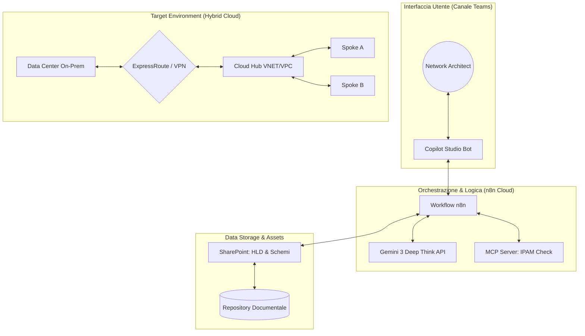
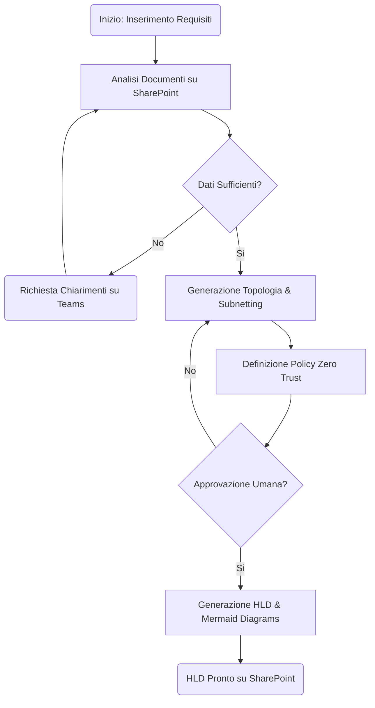
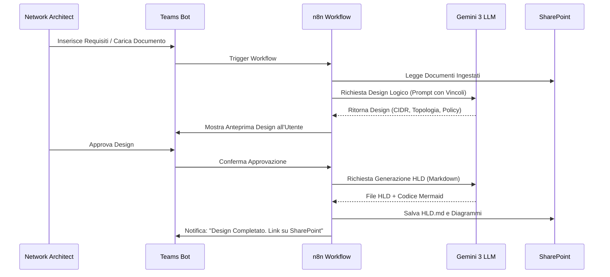

# Blueprint GenAI: Efficentamento del "Design Network e Connettività"

## 1. Descrizione del Caso d'Uso
**Categoria:** Architecture & Design
**Titolo:** Design Network e Connettività
**Ruolo:** Network Architect
**Obiettivo Originale (da CSV):** Progettazione dell'infrastruttura di rete logica e fisica ibrida. Include la definizione di topologie Hub&Spoke, VPN Site-to-Site, connessioni dedicate (es. AWS Direct Connect/Azure ExpressRoute), firewalling di perimetro e segmentazione interna Zero Trust.
**Obiettivo GenAI:** Automatizzare la generazione di schemi di rete logica, configurazioni di connettività ibrida e definizioni di policy Zero Trust partendo dai requisiti di business e vincoli tecnici, riducendo drasticamente il tempo di drafting iniziale dell'architettura di rete.

## 2. Fasi del Processo Efficentato

### Fase 1: Ingestione Requisiti e Analisi Vincoli
L'architetto di rete fornisce i requisiti (es. numero di VPC/VNET, location on-premise, banda necessaria, standard di sicurezza) tramite un'interfaccia familiare.
*   **Tool Principale Consigliato:** Accenture Amethyst
*   **Alternative:** 1. Microsoft Teams (Chatbot UI) via Copilot Studio, 2. Google Antigravity
*   **Modelli LLM Suggeriti:** Google Gemini 3 Deep Think (per ragionamento logico complesso sui vincoli di rete)
*   **Modalità di Utilizzo:** Caricamento di un documento di "Business Requirements" su SharePoint. Amethyst analizza il documento e interroga l'utente su Teams per colmare eventuali lacune (es. "Qual è il range CIDR on-premise da non sovrapporre?").
*   **Azione Umana Richiesta:** Validazione della lista dei requisiti tecnici estratti dall'AI.
*   **Stima Reale di Efficienza:** 
    *   *Tempo As-Is (Manuale):* 2 ore (riunioni e analisi documenti)
    *   *Tempo To-Be (GenAI):* 10 minuti
    *   *Risparmio %:* 92%
    *   *Motivazione:* L'AI estrae istantaneamente parametri tecnici da testi discorsivi.

### Fase 2: Progettazione Topologia e Connettività
Generazione della topologia Hub&Spoke e definizione dei tunnel VPN o circuiti dedicati.
*   **Tool Principale Consigliato:** n8n (Orchestratore) + Gemini 3.1 Pro
*   **Alternative:** 1. Visual Studio + Copilot (per IaC networking), 2. ChatGPT Agent
*   **Modelli LLM Suggeriti:** Anthropic Claude 4.6 Sonnet (eccellente per schemi logici e sintassi di configurazione)
*   **Modalità di Utilizzo:** Un workflow n8n riceve i dati dalla Fase 1 e invia un prompt strutturato all'LLM per generare la configurazione logica.
    *   **Bozza Prompt:**
        ```text
        Agisci come Senior Network Architect. Basandoti su questi requisiti [REQUISITI], progetta una topologia Hub&Spoke su Azure.
        - Definisci il VNET Hub e 3 VNET Spoke.
        - Configura un Azure ExpressRoute con Gateway Subnet dedicata.
        - Implementa una segmentazione Zero Trust usando Network Security Groups (NSG) e Application Security Groups (ASG).
        - Fornisci l'output in formato JSON per la mappatura dei CIDR e un elenco testuale delle regole di firewalling primarie.
        ```
*   **Azione Umana Richiesta:** Revisione critica della topologia proposta e verifica assenza di conflitti IP.
*   **Stima Reale di Efficienza:** 
    *   *Tempo As-Is (Manuale):* 6 ore
    *   *Tempo To-Be (GenAI):* 20 minuti
    *   *Risparmio %:* 94%
    *   *Motivazione:* L'AI genera istantaneamente schemi complessi che richiederebbero calcoli manuali di subnetting e design ripetitivo.

### Fase 3: Generazione Documentazione HLD e Diagrammi
Produzione automatica del documento High Level Design (HLD) e del codice per i diagrammi.
*   **Tool Principale Consigliato:** gemini-cli
*   **Alternative:** 1. AI-Studio Google (per export WebApp dei dati), 2. Microsoft Teams (per report finale)
*   **Modelli LLM Suggeriti:** Google Gemini 3.1 Pro
*   **Modalità di Utilizzo:** Script CLI che aggrega i risultati delle fasi precedenti e genera un file Markdown strutturato con diagrammi Mermaid.js integrati.
*   **Azione Umana Richiesta:** Approvazione finale del documento HLD per l'invio al cliente/stakeholder.
*   **Stima Reale di Efficienza:** 
    *   *Tempo As-Is (Manuale):* 4 ore
    *   *Tempo To-Be (GenAI):* 5 minuti
    *   *Risparmio %:* 98%
    *   *Motivazione:* La redazione documentale è il task più automatizzabile una volta definiti i parametri tecnici.

## 3. Descrizione del Flusso Logico
Il flusso è progettato come un'architettura **Single-Agent** potenziata da workflow di automazione (**n8n**). L'utente interagisce esclusivamente tramite **Microsoft Teams**. 
1. L'utente avvia la sessione caricando un file su SharePoint o scrivendo i requisiti in chat.
2. Il bot (Copilot Studio) invia i dati a n8n.
3. n8n interroga l'LLM (Gemini 3 Deep Think) per elaborare la strategia di rete.
4. L'output (JSON/Markdown) viene salvato su SharePoint e presentato all'utente su Teams per la revisione.
L'approccio Single-Agent è preferito per mantenere la coerenza nel subnetting e nella gestione dei range IP, evitando conflitti tra agenti diversi.

## 4. Diagrammi UML (Mermaid.js)

### 4.1 Architecture Diagram


### 4.2 Process Diagram


### 4.3 Sequence Diagram


## 5. Guida all'Implementazione Tecnica

### Prerequisiti
- Licenza **Microsoft 365** con accesso a Teams e SharePoint.
- Accesso a **n8n** (self-hosted o cloud).
- API Key per **Google Gemini API** (Vertex AI).
- Licenza **Accenture Amethyst** configurata per l'accesso ai dati aziendali.

### Step 1: Configurazione n8n e Ingestione
1. Crea un workflow in n8n con un nodo "Webhook" o "Microsoft Teams Trigger".
2. Configura un nodo "Microsoft SharePoint" per monitorare la cartella "Progetti_Rete".
3. Usa il nodo "AI Agent" di n8n collegandolo al modello `gemini-3-deep-think`.

### Step 2: System Prompt per il Network Agent
Configura il prompt dell'agente con le linee guida aziendali:
```markdown
# SYSTEM PROMPT
Sei un esperto di Network Cloud Architecture con focus su Azure e AWS.
Regole fisse:
1. Usa sempre topologie Hub&Spoke.
2. La segmentazione deve essere Zero Trust (nega tutto per default).
3. Non usare mai CIDR sovrapposti a [RANGE_AZIENDALE_ONPREM].
4. Output preferito: Markdown per testo e Mermaid per diagrammi.
```

### Step 3: Integrazione Teams via Copilot Studio
1. Crea un nuovo bot in **Copilot Studio**.
2. Configura un'azione "Call a flow" che punta al webhook di n8n creato nello Step 1.
3. Pubblica il bot sul canale Teams dedicato al team "Network & Connectivity".

## 6. Rischi e Mitigazioni
- **Rischio 1: Sovrapposizione IP (IP Overlap) ->** **Mitigazione:** Integrare un check tramite MCP (Model Context Protocol) verso il database IPAM aziendale prima di validare il design.
- **Rischio 2: Allucinazioni su limiti di banda/quote cloud ->** **Mitigazione:** Fornire all'LLM (tramite RAG su SharePoint) i documenti ufficiali aggiornati sulle "Service Limits" del cloud provider specifico.
- **Rischio 3: Complessità di configurazione firewall ->** **Mitigazione:** Human-in-the-loop obbligatorio per la revisione delle regole NSG/Firewall generate prima dell'applicazione.
