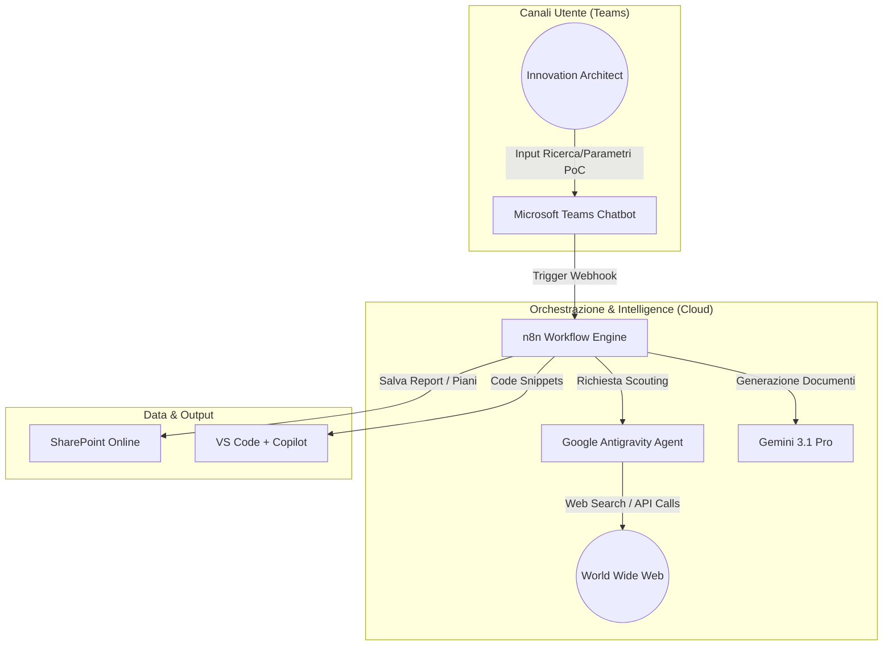
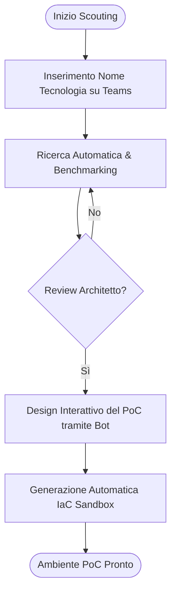
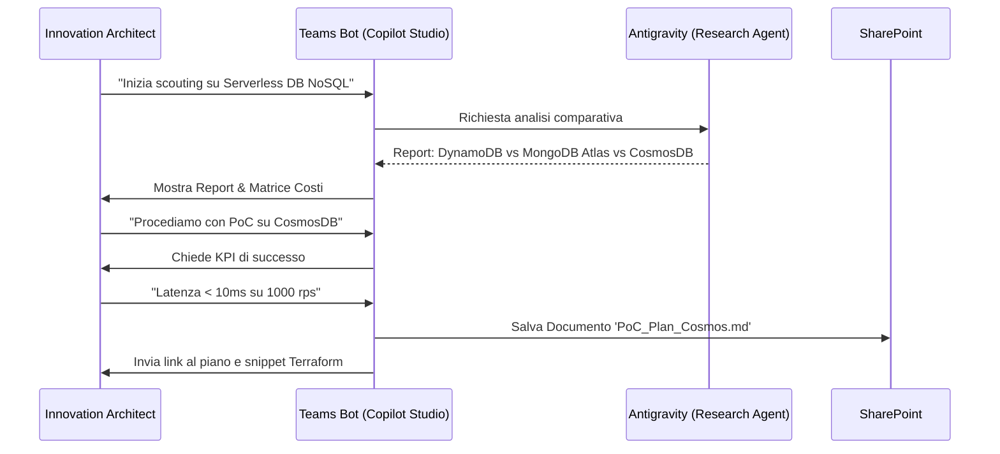

# Blueprint GenAI: Efficentamento del "Scouting Tecnologico e PoC"

## 1. Descrizione del Caso d'Uso
**Categoria:** Architecture & Design
**Titolo:** Scouting Tecnologico e PoC
**Ruolo:** Innovation Architect
**Obiettivo Originale (da CSV):** Ricerca, analisi comparativa e realizzazione di Proof of Concept (PoC) per nuove tecnologie infrastrutturali o servizi cloud emergenti, al fine di valutarne l'applicabilità, i costi e i benefici all'interno dell'ecosistema del cliente.
**Obiettivo GenAI:** Automatizzare la fase di ricerca tecnologica, la comparazione competitiva e la generazione del piano di test per il PoC, riducendo drasticamente il tempo di "benchmarking" iniziale tramite agenti di ricerca specializzati.

## 2. Fasi del Processo Efficentato

### Fase 1: Deep Research & Comparative Benchmarking
Questa fase automatizza la raccolta di informazioni su nuove tecnologie, estraendo pro, contro, costi e benchmark di performance da documentazione ufficiale e forum tecnici.
*   **Tool Principale Consigliato:** `Google Antigravity` (per l'orchestrazione di agenti di ricerca con accesso web in tempo reale).
*   **Alternative:** 1. `gemini-cli` (per script di scouting rapido), 2. `accenture ametyst` (per analisi sicura di documenti vendor).
*   **Modelli LLM Suggeriti:** Google Gemini 3 Deep Think (ottimizzato per ragionamento complesso e sintesi di grandi moli di dati).
*   **Modalità di Utilizzo:** Configurazione di un agente Antigravity con capacità di "Search & Synthesis".
    *   **Bozza Prompt di Ricerca:**
        ```markdown
        Agisci come Senior Cloud Researcher. Analizza la tecnologia [NOME_TECNOLOGIA]. 
        1. Identifica i 3 principali competitor.
        2. Crea una matrice comparativa basata su: Scalabilità, Costo (Pay-per-use), Facilità di integrazione.
        3. Identifica "Known Limitations" da forum tecnici (Reddit, StackOverflow, GitHub Issues).
        4. Produci un Executive Summary per un CTO.
        ```
*   **Azione Umana Richiesta:** L'Innovation Architect valida la matrice comparativa e seleziona la tecnologia vincitrice per il PoC.
*   **Stima Reale di Efficienza:** 
    *   *Tempo As-Is (Manuale):* 12 ore (ricerca web, lettura whitepaper, sintesi).
    *   *Tempo To-Be (GenAI):* 15 minuti.
    *   *Risparmio %:* 98%
    *   *Motivazione:* L'agente analizza migliaia di fonti web in parallelo, operazione impossibile per un umano in tempi brevi.

### Fase 2: Interactive PoC Design (Microsoft Teams)
L'architetto interagisce con un chatbot per definire i parametri specifici del PoC (obiettivi, KPI di successo, risorse necessarie).
*   **Tool Principale Consigliato:** `Microsoft Teams (Chatbot UI)` integrato via `Copilot Studio`.
*   **Alternative:** 1. `chatgpt agent`, 2. `n8n` (per il workflow di backend).
*   **Modelli LLM Suggeriti:** OpenAI GPT-5.4.
*   **Modalità di Utilizzo:** Un bot su Teams guida l'utente attraverso un questionario dinamico. I dati vengono salvati su SharePoint.
    *   **Bozza System Prompt Bot:**
        ```text
        Sei il "PoC Designer Assistant". Il tuo obiettivo è aiutare l'architetto a definire i test case.
        Chiedi all'utente: 1. Qual è l'obiettivo principale del PoC? 2. Quali sono i 3 KPI di successo? 3. Quale infrastruttura di base è necessaria?
        Al termine, genera un documento 'PoC_Plan.md' formattato.
        ```
*   **Azione Umana Richiesta:** Definizione dei requisiti specifici del business e approvazione finale del piano.
*   **Stima Reale di Efficienza:** 
    *   *Tempo As-Is (Manuale):* 4 ore (riunioni e stesura documento).
    *   *Tempo To-Be (GenAI):* 20 minuti.
    *   *Risparmio %:* 91%
    *   *Motivazione:* Eliminazione della necessità di template manuali; il bot redige il piano in tempo reale durante la conversazione.

### Fase 3: IaC Bootstrapping per Ambiente di Test
Generazione del codice necessario (Terraform/Ansible) per creare l'ambiente di PoC in modo isolato (Sandbox).
*   **Tool Principale Consigliato:** `visualstudio + copilot`.
*   **Alternative:** 1. `claude-code`, 2. `OpenAI Codex`.
*   **Modelli LLM Suggeriti:** Anthropic Claude Sonnet 4.6 (eccellente per la generazione di codice infrastrutturale preciso).
*   **Modalità di Utilizzo:** Utilizzo di Copilot all'interno dell'IDE per trasformare il "PoC Plan" della Fase 2 in codice IaC pronto all'uso.
*   **Azione Umana Richiesta:** Revisione del codice e attivazione della pipeline di deploy (Security Gate).
*   **Stima Reale di Efficienza:** 
    *   *Tempo As-Is (Manuale):* 8 ore (scrittura script da zero).
    *   *Tempo To-Be (GenAI):* 1 ora (generazione + debug assistito).
    *   *Risparmio %:* 87.5%
    *   *Motivazione:* Copilot accelera la scrittura della sintassi specifica dei nuovi servizi cloud appena scoperti.

## 3. Descrizione del Flusso Logico
Il processo è di tipo **Single-Agent Orchestrated**. L'Innovation Architect avvia il processo tramite un comando su **Microsoft Teams**. Un orchestratore (n8n o Antigravity) attiva un agente di ricerca che scansiona il web e produce un report comparativo salvandolo su **SharePoint**. L'architetto revisiona il report e, tramite il chatbot di Teams, definisce i dettagli del PoC. L'output finale (PoC Plan + IaC Draft) viene consegnato all'architetto nel suo IDE (**Visual Studio**) per la finalizzazione.

## 4. Diagrammi UML (Mermaid.js)

### 4.1 Application & System Architecture


### 4.2 Process Diagram


### 4.3 Sequence Diagram


## 5. Guida all'Implementazione Tecnica

### Prerequisiti
- Licenza **Copilot Studio** e accesso a **Microsoft Teams**.
- API Key per **Google Gemini API** (tramite Google Cloud Vertex AI o AI-Studio).
- Instance di **n8n** (self-hosted o cloud) per l'orchestrazione.
- Accesso in scrittura a una cartella dedicata su **SharePoint Online**.

### Step 1: Configurazione Agente di Ricerca (Antigravity/n8n)
1. Crea un workflow in n8n che accetta un input testuale (nome tecnologia).
2. Utilizza il nodo "Google Search" o un'integrazione con un LLM con capacità di navigazione (es. Gemini 3.1 Pro con Search Tool).
3. Configura il prompt per estrarre dati strutturati (JSON) contenenti Pro, Contro e Prezzi.

### Step 2: Creazione Bot su Copilot Studio
1. Accedi a Copilot Studio e crea un nuovo bot "Tech Scout".
2. Configura un **Topic** chiamato "Inizia Scouting" che richiama il webhook di n8n creato allo Step 1.
3. Configura le **Generative Answers** puntando alla documentazione interna in SharePoint per garantire che lo scouting consideri anche gli standard aziendali esistenti.

### Step 3: Integrazione VS Code
1. Assicurati che l'Innovation Architect abbia l'estensione **GitHub Copilot** installata.
2. Fornisci un file `.prompt` o una istruzione specifica da incollare in chat: `"/generate-iac basandoti sul file PoC_Plan.md presente in questa cartella"`.

## 6. Rischi e Mitigazioni
- **Rischio:** Dati sui costi non aggiornati (i listini cloud cambiano spesso). -> **Mitigazione:** L'agente deve obbligatoriamente citare le fonti (URL) e la data di scansione; validazione umana finale dei costi su calcolatori ufficiali.
- **Rischio:** Allucinazioni su feature tecniche non ancora rilasciate. -> **Mitigazione:** L'agente incrocia i dati tra documentazione ufficiale e blog post tecnici di terze parti per confermare la disponibilità (GA vs Preview).
- **Rischio:** IaC non conforme a policy di sicurezza aziendali. -> **Mitigazione:** Il codice generato deve essere passato attraverso un tool di scansione statica (es. Checkov o Terrascan) prima del deploy.
