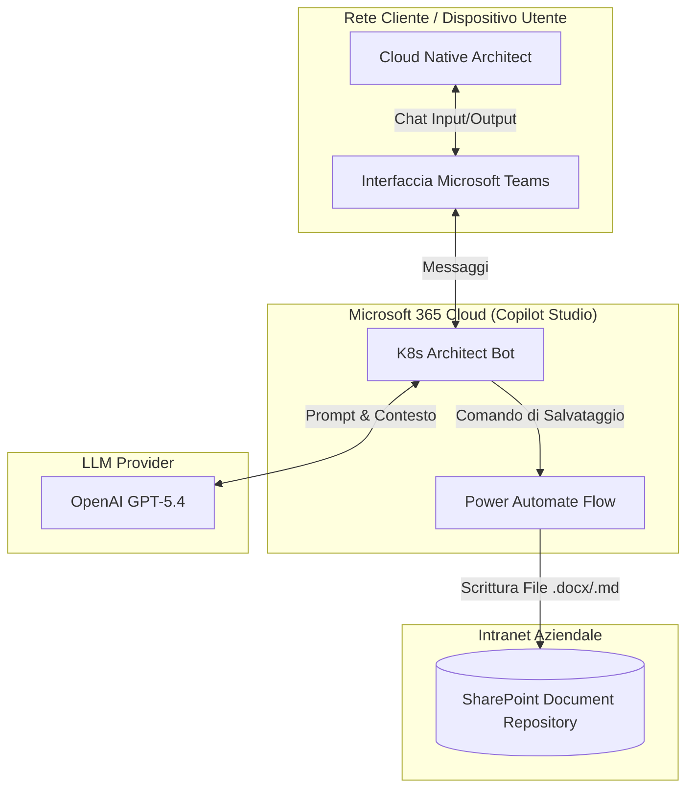
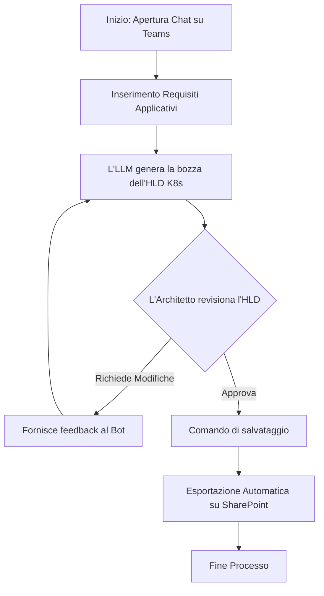
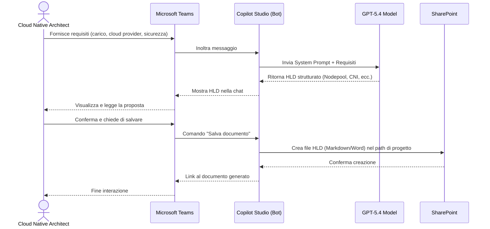

# Blueprint GenAI: Efficentamento del "Design Piattaforma Container (Kubernetes)"

## 1. Descrizione del Caso d'Uso
**Categoria:** Architecture & Design
**Titolo:** Design Piattaforma Container (Kubernetes)
**Ruolo:** Cloud Native Architect
**Obiettivo Originale (da CSV):** Progettazione dell'infrastruttura sottostante cluster Kubernetes (AKS, EKS, GKE). Definizione di nodepool, Ingress Controller, policy di rete Calico/Cilium e regole per l'autoscaling dei pod e dei nodi worker.
**Obiettivo GenAI:** Automatizzare la generazione dell'High Level Design (HLD) e delle specifiche architetturali di un cluster Kubernetes (sizing dei nodepool, configurazione Ingress, CNI e policy di autoscaling) partendo dai requisiti applicativi base, attraverso un'interfaccia conversazionale.

## 2. Fasi del Processo Efficentato

### Fase 1: Acquisizione Requisiti e Generazione Specifiche K8s
L'architetto inserisce i requisiti di carico, sicurezza e il Cloud Provider target (AKS, EKS o GKE) all'interno di una chat in Microsoft Teams. L'LLM elabora questi dati e produce immediatamente una bozza strutturata dell'architettura del cluster, suggerendo il numero e il tipo di nodi (nodepool), il CNI ottimale (Calico o Cilium), le classi di Ingress e le metriche di autoscaling (HPA/VPA e Cluster Autoscaler).
*   **Tool Principale Consigliato:** Copilot Studio (con pubblicazione su Microsoft Teams)
*   **Alternative:** 1. Accenture Amethyst, 2. ChatGPT Agent (Enterprise)
*   **Modelli LLM Suggeriti:** OpenAI GPT-5.4
*   **Modalità di Utilizzo:** Interfaccia Chatbot su Microsoft Teams. Il bot è configurato con un System Prompt specifico per agire come Cloud Native Architect Senior. Prevede l'integrazione nativa con **SharePoint** per esportare il design finale in un documento Word/Markdown nel repository di progetto.
    
    *Bozza del System Prompt per Copilot Studio:*
    ```text
    Sei un Cloud Native Architect Senior specializzato in Kubernetes (AKS, EKS, GKE).
    Il tuo compito è ricevere in input i requisiti di un'applicazione (es. traffico stimato, stack tecnologico, requisiti di isolamento rete, cloud provider) e restituire un design infrastrutturale strutturato in Markdown.
    Devi sempre includere:
    1. Dimensionamento e tipologia dei Nodepool (es. System, User, GPU).
    2. Suggerimento e giustificazione per il CNI (es. Cilium per eBPF o Calico per network policy standard).
    3. Strategia di Ingress Controller (es. Nginx, Istio, o nativo cloud).
    4. Regole di Autoscaling raccomandate (HPA per pod, Cluster Autoscaler per nodi).
    Non generare codice IaC (Terraform o YAML), limitati al design architetturale testuale e in forma tabellare.
    ```
*   **Azione Umana Richiesta (Human-in-the-loop):** Il Cloud Native Architect deve leggere le specifiche proposte dall'AI nella chat, chiedere eventuali raffinamenti (es. "Cambia le istanze del worker pool in ARM") e approvare l'esportazione finale su SharePoint.
*   **Stima Reale di Efficienza:** 
    *   *Tempo As-Is (Manuale):* 6 ore
    *   *Tempo To-Be (GenAI):* 30 minuti
    *   *Risparmio %:* 91%
    *   *Motivazione:* La redazione manuale della documentazione di design, delle tabelle di sizing e la consultazione delle best practice dei cloud provider richiedono tempo. L'LLM aggrega istantaneamente le best practice e formatta il documento pronto per la revisione.

## 3. Descrizione del Flusso Logico
Il flusso adotta un approccio **Single-Agent** per mantenere la massima semplicità, dato che il task richiede unicamente l'aggregazione logica di best practice architetturali senza interagire con sistemi esterni complessi. 
L'utente (Cloud Native Architect) apre Microsoft Teams e avvia una conversazione con il bot "K8s Architect Bot". Fornisce i requisiti di base (es. "Devo progettare un cluster EKS per un'app microservizi Java con alto traffico HTTP e isolamento strict"). Il bot, sfruttando il modello LLM sottostante, elabora la richiesta e risponde direttamente nella chat con le sezioni del design (Nodepool, CNI, Ingress, Autoscaling). L'utente valuta le scelte, suggerisce modifiche iterativamente e, una volta soddisfatto, utilizza un comando rapido (es. "Approvo, salva il documento") che innesca un'automazione (tramite Power Automate integrato in Copilot Studio) per generare un file nel folder SharePoint del progetto.

## 4. Diagrammi UML (Mermaid.js)

### 4.1 Architecture Diagram


### 4.2 Process Diagram


### 4.3 Sequence Diagram


## 5. Guida all'Implementazione Tecnica

### Prerequisiti
- Licenza Microsoft 365 con accesso a Copilot Studio e Power Automate.
- Accesso in scrittura al sito SharePoint/Teams del team di Architecture.
- Autorizzazioni per pubblicare Bot custom sul tenant Microsoft Teams aziendale.

### Step 1: Creazione e Configurazione in Copilot Studio
1. Accedere al portale di **Microsoft Copilot Studio**.
2. Cliccare su "Nuovo Copilot" e nominarlo `K8s Architect Bot`.
3. Nelle impostazioni del Copilot, accedere alla sezione dell'AI Generativa e incollare la *Bozza del System Prompt* fornita nella Fase 1 per definire il comportamento, il perimetro e il ruolo dell'agente.

### Step 2: Configurazione dell'Automazione di Salvataggio
1. All'interno del Copilot, creare un "Topic" (Argomento) personalizzato chiamato "Salvataggio Design".
2. Come "Trigger Phrase", inserire frasi come: "Approvo il design", "Salva su SharePoint", "Genera documento".
3. Aggiungere un nodo di tipo "Call an action" e creare un nuovo flusso **Power Automate**.
4. Nel flusso Power Automate, utilizzare l'input di testo dal bot (contenente l'ultimo HLD generato).
5. Aggiungere l'azione SharePoint "Crea file", specificando il Site Address del team di infrastruttura, il nome del file (es. `K8s_HLD_Design.md`) e inserendo il contenuto testuale ricevuto in input.
6. Salvare e collegare il flusso al nodo del Copilot.

### Step 3: Pubblicazione su Microsoft Teams
1. Nella dashboard di Copilot Studio, navigare su "Pubblica" e selezionare "Microsoft Teams" nei canali (Channels).
2. Seguire il wizard per l'aggiunta al tenant aziendale.
3. Condividere il link del bot o l'App Teams direttamente con i Cloud Native Architect per l'utilizzo immediato.

## 6. Rischi e Mitigazioni
- **Rischio Allucinazioni su Limiti Cloud:** L'LLM potrebbe suggerire limiti di istanze o versioni di Kubernetes deprecate per uno specifico provider (es. vecchie versioni EKS). -> **Mitigazione:** Il prompt istruisce l'LLM a fornire solo design architetturali generici di alto livello (HLD). L'architetto umano esegue un controllo obbligatorio sulle versioni e sulle quote prima dell'approvazione finale. Nessun comando IaC viene applicato in automatico.
- **Rischio di Lock-in o Design Sub-ottimale:** L'AI potrebbe preferire pattern standard ignorando specificità legacy dell'azienda. -> **Mitigazione:** Integrazione dell'agente tramite RAG (opzionale e successiva) con il repository aziendale contenente le "Kubernetes Best Practices Aziendali", in modo che i suggerimenti rispettino gli standard interni.