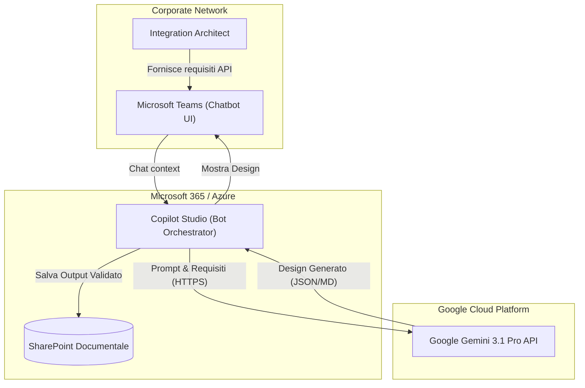
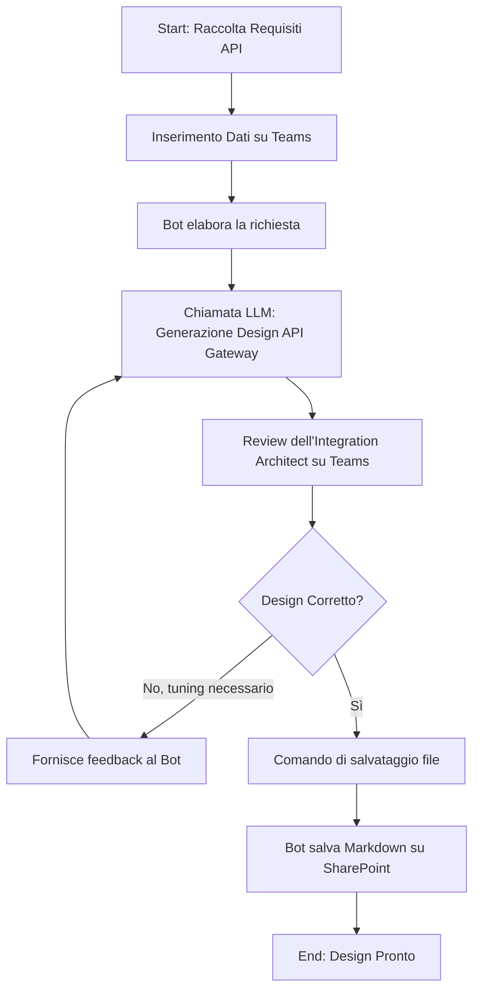
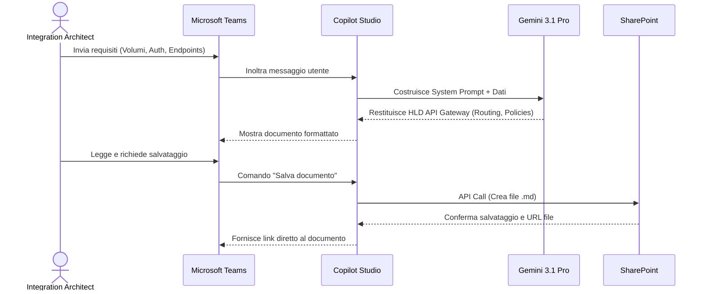

# Blueprint GenAI: Efficentamento del "Design API Gateway"

## 1. Descrizione del Caso d'Uso
**Categoria:** Architecture & Design
**Titolo:** Design API Gateway
**Ruolo:** Integration Architect
**Obiettivo Originale (da CSV):** Progettazione dell'infrastruttura di front-end per l'esposizione sicura delle API aziendali verso l'esterno. Configurazione di logiche di autenticazione, rate limiting, throttling e routing avanzato verso i servizi backend.
**Obiettivo GenAI:** Automatizzare la generazione del documento di design architetturale dell'API Gateway, definendo in modo strutturato le policy di sicurezza (autenticazione, rate limiting, throttling) e le regole di routing basate sui requisiti forniti, limitando l'effort alla sola stesura dell'HLD.

## 2. Fasi del Processo Efficentato

### Fase 1: Ingestion dei Requisiti e Generazione del Design HLD
L'architetto descrive i requisiti delle API da esporre, i carichi previsti e i meccanismi di autenticazione richiesti (es. OAuth2, JWT). L'AI analizza questi input e genera un documento di High Level Design (HLD) strutturato contenente le configurazioni consigliate per l'API Gateway.
*   **Tool Principale Consigliato:** `Microsoft Teams (Chatbot UI)` (orchestrato via Copilot Studio)
*   **Alternative:** `accenture ametyst`, `chatgpt agent`
*   **Modelli LLM Suggeriti:** Google Gemini 3.1 Pro (eccellente per analisi strutturata, ragionamento logico e generazione di documentazione tecnica)
*   **Modalità di Utilizzo:** Interazione conversazionale su Teams. L'utente fornisce i parametri chiave tramite chat.
    *Esempio di System Prompt per il Bot:*
    ```markdown
    Sei un Integration Architect Senior. Il tuo compito è progettare la configurazione di un API Gateway.
    Riceverai in input i requisiti delle API (volumetrie, tipologia di client, backend).
    Devi produrre un documento in formato Markdown contenente:
    1. Scelta tecnologica suggerita (se non esplicitata).
    2. Regole di Routing (path in ingresso e backend target).
    3. Policy di Sicurezza (AuthN/AuthZ consigliata, es. JWT validation).
    4. Policy di Traffic Management (soglie di Rate Limiting e Throttling suggerite, motivate numericamente in base ai volumi attesi).
    Rispondi in modo schematico, estremamente tecnico e privo di discorsi generici.
    ```
*   **Azione Umana Richiesta (Human-in-the-loop):** L'Integration Architect deve revisionare criticamente le soglie di rate limiting proposte e verificare che le logiche di routing e autenticazione siano compatibili con gli standard aziendali prima di finalizzare il design.
*   **Stima Reale di Efficienza:** 
    *   *Tempo As-Is (Manuale):* 4 ore
    *   *Tempo To-Be (GenAI):* 20 minuti
    *   *Risparmio %:* 91%
    *   *Motivazione:* L'AI azzera il tempo speso per la strutturazione formale del documento e per il calcolo base delle soglie di throttling, restituendo una bozza tecnica solida pronta per la sola validazione umana.

## 3. Descrizione del Flusso Logico
L'approccio scelto è **Single-Agent**, per garantire la massima semplicità implementativa tramite un bot su Microsoft Teams, ideale poiché la task non richiede l'orchestrazione di ruoli multipli. 
L'Integration Architect avvia una chat con l'agente dedicato, inserendo i parametri di traffico e di sicurezza richiesti dal progetto. L'agente elabora la richiesta, applica le best practice di design e genera il documento di configurazione dell'API Gateway. Una volta generato l'output, l'utente lo legge direttamente nella chat, può chiedere modifiche puntuali ("aumenta il throttling sul path /v1/users") e, infine, approva la versione definitiva. Al termine, il bot si occupa di salvare automaticamente il file documentale sulla repository SharePoint del team.

## 4. Diagrammi UML (Mermaid.js)

### 4.1 Architecture Diagram


### 4.2 Process Diagram


### 4.3 Sequence Diagram


## 5. Guida all'Implementazione Tecnica

### Prerequisiti
- Licenza Microsoft Copilot Studio valida.
- Chiave API di Google Cloud per l'utilizzo di Gemini 3.1 Pro.
- Permessi di pubblicazione app custom sul canale aziendale di Microsoft Teams.
- Sito SharePoint di destinazione per il salvataggio dei documenti di design.

### Step 1: Configurazione Bot in Copilot Studio
1. Accedere al portale di Microsoft Copilot Studio e creare un nuovo Copilot denominato "API Gateway Designer".
2. Andare nella sezione "Argomenti" (Topics) e creare un trigger basato su frasi come "Progetta API Gateway", "Nuova esposizione API", "Design API".
3. Aggiungere il nodo iniziale per istruire l'agente, inserendo il *System Prompt* definito nella Fase 1 all'interno delle istruzioni di comportamento globale.
4. (Opzionale ma consigliato) Aggiungere nodi "Domanda" per farsi esplicitare dall'utente dati chiave mancanti (es. "Qual è il limite di Rate Limiting atteso?").

### Step 2: Integrazione LLM Esterno
1. All'interno del topic, aggiungere un nodo "Chiama un'azione" (Call an action) e creare un nuovo flusso Power Automate.
2. Nel flusso, configurare una chiamata HTTP POST diretta alle API di Google Gemini 3.1 Pro, passando il contenuto della conversazione come payload.
3. Estrarre il testo della risposta generato dal modello (parsing JSON) e restituirlo a Copilot Studio come variabile testuale.
4. Inserire un nodo "Messaggio" in Copilot Studio per mostrare la variabile testuale all'utente in Teams.

### Step 3: Integrazione SharePoint e Rilascio su Teams
1. Creare un nodo condizionale finale in cui l'agente chiede: "Vuoi salvare questo design su SharePoint?".
2. Se la risposta è positiva, richiamare un secondo flusso Power Automate che utilizza l'azione nativa "SharePoint - Crea file". Passare come nome file una stringa generata dinamicamente e come contenuto del file il Markdown approvato.
3. Spostarsi nella scheda "Pubblica" (Publish) in Copilot Studio.
4. Selezionare "Microsoft Teams" nella lista dei canali disponibili e seguire la procedura guidata per abilitare e distribuire il bot nel tenant aziendale.

## 6. Rischi e Mitigazioni
- **Rischio:** **Configurazioni di sicurezza deboli o obsolete** (es. l'LLM propone l'uso di Basic Auth per API pubbliche).
  **Mitigazione:** Definire in modo rigido nel System Prompt dell'agente le policy di sicurezza obbligatorie (es. "Utilizzare sempre e solo OAuth2/OIDC per l'autenticazione"). L'Integration Architect è tenuto alla validazione formale prima dell'implementazione effettiva.
- **Rischio:** **Allucinazioni sui calcoli per il Throttling e Rate Limiting.**
  **Mitigazione:** Inserire nel prompt la direttiva di giustificare numericamente i calcoli. L'architetto deve eseguire un sanity check sui valori proposti.
- **Rischio:** **Esposizione di dettagli sensibili dell'infrastruttura backend.**
  **Mitigazione:** Istruire gli utenti a utilizzare nomi logici o generici per i backend interni (es. `backend-anagrafiche` invece di IP reali o FQDN interni) durante l'inserimento dei dati nel chatbot.