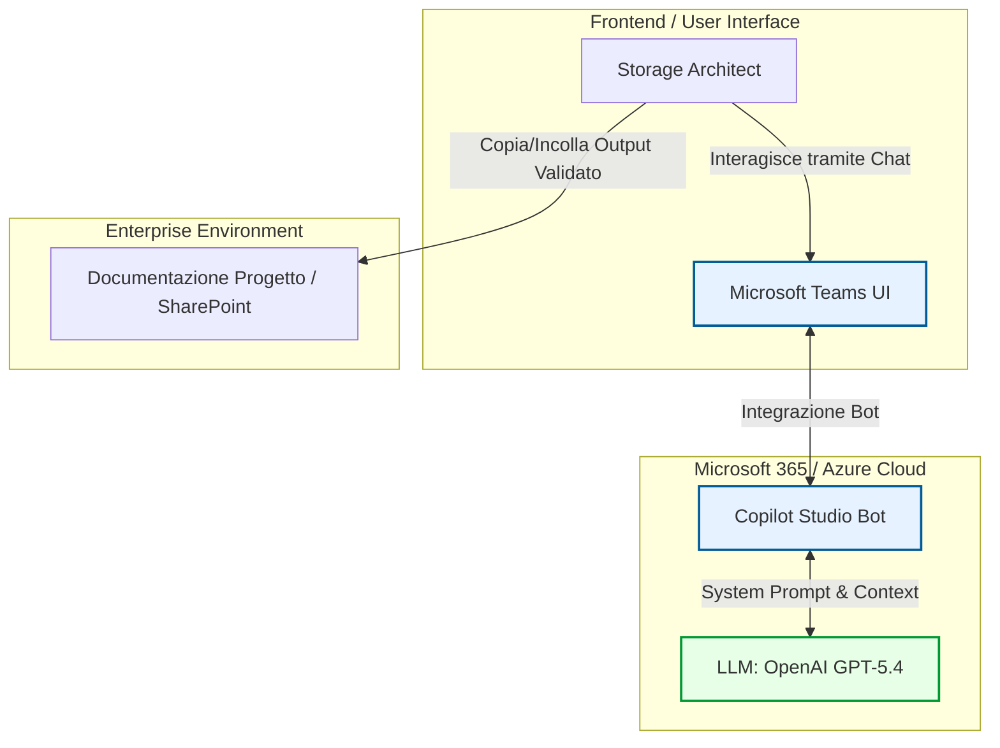
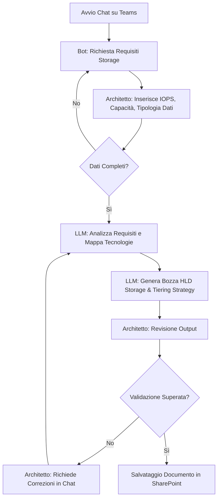
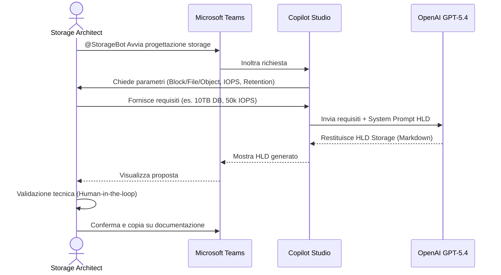

# Blueprint GenAI: Efficentamento del "Progettazione Storage Enterprise"

## 1. Descrizione del Caso d'Uso
**Categoria:** Architecture & Design
**Titolo:** Progettazione Storage Enterprise
**Ruolo:** Storage Architect
**Obiettivo Originale (da CSV):** Selezione e design della soluzione di archiviazione dati ottimale (Block Storage per DB, File Storage per file server, Object Storage per backup/archiviazione). Ottimizzazione in base a requisiti di IOPS, throughput e tiering freddo.
**Obiettivo GenAI:** Automatizzare e velocizzare il processo di raccolta dei requisiti (IOPS, throughput, retention, tipologia dati), la selezione della tecnologia di storage adeguata (Block, File, Object) e la generazione di una bozza di High-Level Design (HLD) focalizzata sullo storage tiering, attraverso un assistente conversazionale integrato in Microsoft Teams.

## 2. Fasi del Processo Efficentato

### Fase 1: Raccolta Guidata dei Requisiti Storage
L'assistente AI interagisce con lo Storage Architect o con il team di progetto ponendo domande mirate per estrarre i parametri chiave (volume di dati, crescita attesa, IOPS necessari, RPO/RTO, necessità di tiering caldo/freddo).
*   **Tool Principale Consigliato:** `Copilot Studio` (integrazione Microsoft Teams)
*   **Alternative:** 1. `Accenture Amethyst`, 2. `ChatGPT Agent`
*   **Modelli LLM Suggeriti:** OpenAI GPT-5.4 o Anthropic Claude 3.7 Sonnet (via Copilot Studio/Azure)
*   **Modalità di Utilizzo:** Configurazione di un bot in Teams. Il bot utilizza un prompt di sistema per agire come "Storage Requirement Gatherer".
    ```markdown
    **System Prompt - Storage Architect Assistant**
    Sei un esperto Enterprise Storage Architect. Il tuo obiettivo è raccogliere i requisiti per progettare una soluzione storage.
    Poni all'utente le seguenti domande, una alla volta, in modo conciso:
    1. Qual è la tipologia principale di dato da memorizzare (Database relazionali, file non strutturati, archiviazione a lungo termine/backup)?
    2. Quali sono i requisiti di performance stimati (IOPS, Throughput)?
    3. Qual è la capacità iniziale richiesta e il tasso di crescita annuale previsto?
    4. Ci sono requisiti normativi di retention o necessità di tiering (es. passaggio automatico a storage freddo dopo 90 giorni)?
    
    Una volta raccolte tutte le informazioni, ringrazia l'utente e procedi alla generazione della proposta di design.
    ```
*   **Azione Umana Richiesta:** L'utente (Storage Architect) risponde alle domande o fornisce direttamente un documento di requisiti grezzo in chat.
*   **Stima Reale di Efficienza:** 
    *   *Tempo As-Is (Manuale):* 2 ore (meeting e scambi email per chiarire i parametri)
    *   *Tempo To-Be (GenAI):* 15 minuti
    *   *Risparmio %:* 87%
    *   *Motivazione:* L'AI standardizza la raccolta e non dimentica nessun parametro critico per il dimensionamento.

### Fase 2: Analisi, Selezione Tecnologica e Generazione Design HLD
Basandosi sulle risposte della Fase 1, l'LLM elabora una proposta strutturata, selezionando i servizi cloud/on-premise appropriati (es. AWS EBS vs EFS vs S3, Azure Disk vs Files vs Blob) e calcolando il tiering ottimale.
*   **Tool Principale Consigliato:** `Copilot Studio`
*   **Alternative:** `n8n` (se si vuole generare un documento Word automatizzato)
*   **Modelli LLM Suggeriti:** OpenAI GPT-5.4
*   **Modalità di Utilizzo:** Il bot genera e formatta direttamente in chat l'output, che include raccomandazioni tecnologiche e calcoli base.
    ```markdown
    **System Prompt - HLD Generator**
    Ricevuti i requisiti dall'utente, genera un "Storage High-Level Design" formattato in Markdown con le seguenti sezioni:
    - **Executive Summary:** Riassunto dei requisiti.
    - **Scelta Tecnologica:** Selezione tra Block, File e Object storage giustificata dalle performance (IOPS/Throughput).
    - **Tiering Strategy:** Politiche di data lifecycle management (es. Hot -> Cool -> Archive).
    - **Dimensionamento Preliminare:** Stima dei costi e della scalabilità.
    ```
*   **Azione Umana Richiesta:** Lo Storage Architect deve revisionare criticamente le scelte tecnologiche proposte dall'AI (soprattutto i calcoli sugli IOPS e sui costi) e validare la strategia di tiering.
*   **Stima Reale di Efficienza:** 
    *   *Tempo As-Is (Manuale):* 4 ore (stesura documento, calcoli dimensionamento e policy)
    *   *Tempo To-Be (GenAI):* 10 minuti (generazione e prima lettura)
    *   *Risparmio %:* 95%
    *   *Motivazione:* La stesura di boilerplate, la strutturazione logica e l'associazione automatica requisiti->tecnologia viene fatta istantaneamente dall'LLM.

## 3. Descrizione del Flusso Logico
Il flusso adotta un approccio **Single-Agent** estremamente lineare tramite Microsoft Teams, poiché la competenza richiesta è circoscritta al dominio Storage. Lo Storage Architect avvia una conversazione con il "Storage Design Bot" su Teams. Il bot guida l'utente nella raccolta dei requisiti tecnici (capacità, performance, data lifecycle). Acquisiti i dati, l'LLM integrato processa le informazioni ed elabora una proposta architetturale (identificando la corretta combinazione di Block, File e Object storage) completa di regole di tiering. L'output testuale in formato Markdown viene restituito direttamente in chat. A questo punto, lo Storage Architect applica la validazione umana (*Human-in-the-loop*), copia il design validato e lo inserisce nella documentazione ufficiale del progetto.

## 4. Diagrammi UML (Mermaid.js)

### 4.1 Architecture Diagram


### 4.2 Process Diagram


### 4.3 Sequence Diagram


## 5. Guida all'Implementazione Tecnica

### Prerequisiti
- Licenza Microsoft 365 con accesso a **Copilot Studio** (o Power Virtual Agents).
- Modelli LLM abilitati in tenant Azure OpenAI (es. GPT-4o o GPT-5.x se disponibile) o tramite connessione Copilot nativa.
- Client Microsoft Teams installato.

### Step 1: Creazione del Bot in Copilot Studio
1. Accedi a [Copilot Studio](https://copilotstudio.microsoft.com/).
2. Crea un nuovo copilot denominandolo "Storage Design Assistant".
3. Nella sezione "Generative AI" o "Instructions" (System Prompt), inserisci il prompt indicato nella Fase 1 per configurare il comportamento dell'assistente.

### Step 2: Configurazione della Conversazione
1. Disabilita gli argomenti (Topics) predefiniti non necessari per evitare risposte fuori contesto.
2. Assicurati che il bot sia impostato per rispondere dinamicamente usando la "Generative Answers" basata sulle istruzioni di base fornite.
3. Se desideri che il bot si basi su linee guida interne (es. policy aziendali sullo storage), usa la funzionalità "Knowledge" per caricare un file PDF contenente le best practice aziendali su Block/File/Object storage. Il bot userà la RAG (Retrieval-Augmented Generation) per proporre soluzioni conformi agli standard interni.

### Step 3: Pubblicazione su Microsoft Teams
1. Vai nella scheda "Publish" all'interno di Copilot Studio e pubblica l'ultima versione.
2. Spostati su "Channels" e seleziona "Microsoft Teams".
3. Abilita il canale e clicca su "Open in Teams" per testare il bot.
4. (Opzionale) Scarica il pacchetto app (Manifest) e richiedi agli amministratori di Teams di approvarlo e distribuirlo nel workspace del team T&A.

## 6. Rischi e Mitigazioni
- **Rischio:** *Sottostima degli IOPS e del Throughput.* L'AI potrebbe proporre un tiering o una tecnologia troppo economica che crea colli di bottiglia sui Database.
  - **Mitigazione:** Validazione *Human-in-the-loop* obbligatoria. Il bot deve inserire un disclaimer: "Verificare le metriche di IOPS dichiarate con i vendor hardware/cloud".
- **Rischio:** *Violazione di compliance sui dati.* L'AI potrebbe suggerire l'utilizzo di Object Storage cloud (es. S3) per dati che richiedono data residency locale per motivi normativi.
  - **Mitigazione:** Aggiunta di una domanda specifica nel prompt di raccolta requisiti: "I dati sono soggetti a GDPR o vincoli di Data Residency stretti?". L'output sarà condizionato da questa risposta.
