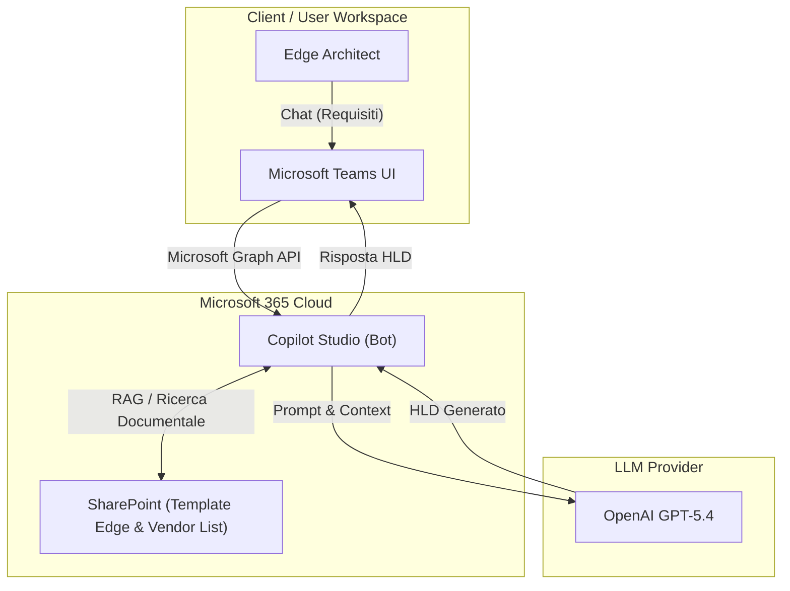
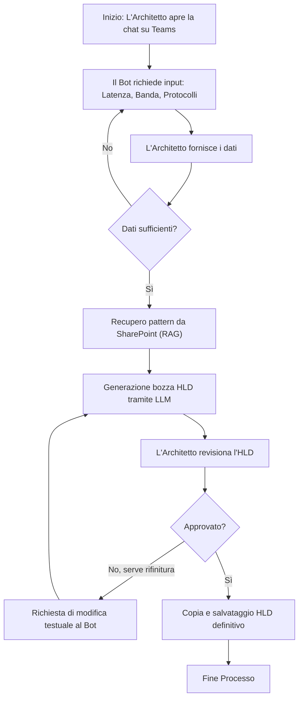
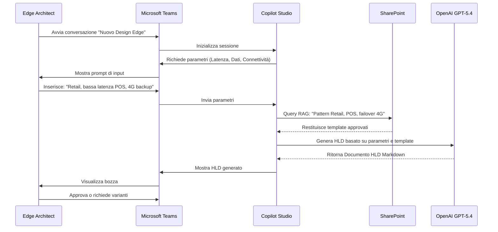

# Blueprint GenAI: Efficentamento del "Design Edge Computing Infrastructure"

## 1. Descrizione del Caso d'Uso
**Categoria:** Architecture & Design
**Titolo:** Design Edge Computing Infrastructure
**Ruolo:** Edge Computing Architect
**Obiettivo Originale (da CSV):** Progettazione di infrastrutture di calcolo distribuite ai margini della rete (es. stabilimenti IoT, negozi retail) per l'elaborazione dei dati a bassissima latenza prima dell'invio asincrono verso il cloud centrale.
**Obiettivo GenAI:** Automatizzare e standardizzare la progettazione dell'High-Level Design (HLD) per l'infrastruttura Edge, raccogliendo i requisiti tramite interfaccia conversazionale e generando le specifiche hardware, il flusso dati Edge-to-Cloud e le configurazioni di rete basate sui pattern architetturali aziendali.

## 2. Fasi del Processo Efficentato

### Fase 1: Ingestion Requisiti e Generazione Bozza HLD
L'Architetto interagisce con un Chatbot su Teams, fornendo i requisiti di base (es. numero di siti, volume di dati IoT, vincoli di latenza, connettività disponibile). Il bot, utilizzando RAG sui pattern Edge aziendali (SharePoint), elabora istantaneamente una bozza architetturale documentata.
*   **Tool Principale Consigliato:** `copilot studio` (pubblicato su Microsoft Teams)
*   **Alternative:** 1. `accenture ametyst`, 2. `chatgpt agent`
*   **Modelli LLM Suggeriti:** OpenAI GPT-5.4 (eccellente per contesti agentici e ragionamento architetturale).
*   **Modalità di Utilizzo:** Integrazione SharePoint attivata per leggere i document block dei template Edge (es. "Pattern IoT Manifattura", "Pattern Retail"). 
    *Bozza di System Prompt per il Bot:*
    ```text
    Sei un "Edge Architecture Assistant". Il tuo scopo è guidare l'utente nella progettazione di un'infrastruttura Edge.
    1. Chiedi all'utente: tipologia di sito (IoT, Retail, ecc.), requisiti di latenza, banda disponibile e protocolli (MQTT, OPC-UA).
    2. Cerca nei documenti SharePoint i pattern architetturali approvati per questi requisiti.
    3. Genera un High-Level Design (HLD) formattato in Markdown contenente: Componenti Edge (Gateway/Server), Flusso di elaborazione locale, Meccanismo di buffering e sincronizzazione asincrona verso il Cloud, e specifiche di sicurezza.
    ```
*   **Azione Umana Richiesta (Human-in-the-loop):** L'Edge Computing Architect deve revisionare l'HLD generato, validare il dimensionamento hardware suggerito e confermare i pattern di sincronizzazione asincrona prima di approvare il documento.
*   **Stima Reale di Efficienza:** 
    *   *Tempo As-Is (Manuale):* 6 ore
    *   *Tempo To-Be (GenAI):* 30 minuti
    *   *Risparmio %:* 91%
    *   *Motivazione:* L'AI elimina il tempo speso per cercare template, copiare/incollare specifiche da progetti passati e redigere il documento di design da zero, permettendo all'architetto di concentrarsi solo sulle eccezioni e sulla validazione.

## 3. Descrizione del Flusso Logico
Il flusso adotta un approccio **Single-Agent**, scelto per mantenere la soluzione estremamente semplice e integrabile direttamente nell'ambiente di lavoro quotidiano (Microsoft Teams). L'Edge Computing Architect avvia una chat con il bot sviluppato in Copilot Studio. Il bot raccoglie le specifiche del sito periferico tramite domande mirate. Una volta ottenuti i dati, il bot interroga (via RAG nativo) i repository SharePoint aziendali contenenti le linee guida architetturali e i vendor hardware approvati. Successivamente, consolida le informazioni e genera il design document, proponendolo nella chat. L'architetto può richiedere modifiche iterative (es. "cambia il vendor Edge da Dell a HPE") e infine esportare l'output.

## 4. Diagrammi UML (Mermaid.js)

### 4.1 Architecture Diagram


### 4.2 Process Diagram


### 4.3 Sequence Diagram


## 5. Guida all'Implementazione Tecnica

### Prerequisiti
- Licenza Microsoft Copilot Studio (inclusa nei piani Enterprise o acquistata separatamente).
- Accesso in lettura a un sito SharePoint aziendale contenente i documenti di design standard (PDF, Word, PPT).
- Permessi di pubblicazione app su Microsoft Teams aziendale.

### Step 1: Creazione e Configurazione del Copilot
1. Accedere al portale Copilot Studio (https://copilotstudio.microsoft.com/).
2. Creare un nuovo Copilot denominato "Edge Design Assistant".
3. Nella sezione "Generative AI" o "Knowledge", aggiungere il link al sito SharePoint aziendale in cui sono archiviati i template di Edge Computing. Questo abiliterà il RAG automatico del bot sui documenti interni.

### Step 2: Definizione del Comportamento e Prompt
1. Andare nella sezione "Copilot details" -> "Instructions" (o System Prompt).
2. Inserire la bozza di System Prompt descritta nella Fase 1, assicurandosi di istruire il bot a formattare sempre l'output finale come documento di design chiaro (titoli, elenchi puntati per l'hardware, diagrammi testuali).
3. Testare il bot nella console integrata simulando una richiesta per un "Sito IoT manifatturiero".

### Step 3: Pubblicazione su Microsoft Teams
1. Nella barra laterale di Copilot Studio, selezionare "Publish" e cliccare sul pulsante di pubblicazione.
2. Spostarsi nella sezione "Channels" e selezionare "Microsoft Teams".
3. Seguire la procedura guidata per abilitare il bot su Teams.
4. (Opzionale) Cliccare su "Submit for admin approval" se le policy aziendali richiedono un'autorizzazione per far apparire l'app nel catalogo interno di Teams.
5. Una volta approvato, l'architetto potrà cercare "Edge Design Assistant" su Teams e "pinnarlo" nella barra laterale.

## 6. Rischi e Mitigazioni
- **Rischio 1:** Allucinazioni nella scelta dell'hardware (es. suggerimento di appliance Edge inesistenti o end-of-life) -> **Mitigazione:** Limitare strettamente le fonti del bot (tramite RAG) ai soli cataloghi e template ufficiali caricati su SharePoint. Richiedere sempre la validazione umana finale.
- **Rischio 2:** Sottostima dei vincoli di banda per l'invio asincrono al cloud -> **Mitigazione:** Inserire nel System Prompt l'obbligo di chiedere esplicitamente la banda di upload (Uplink) disponibile e generare un alert nel documento HLD se il volume dati teorico supera la capacità della rete.