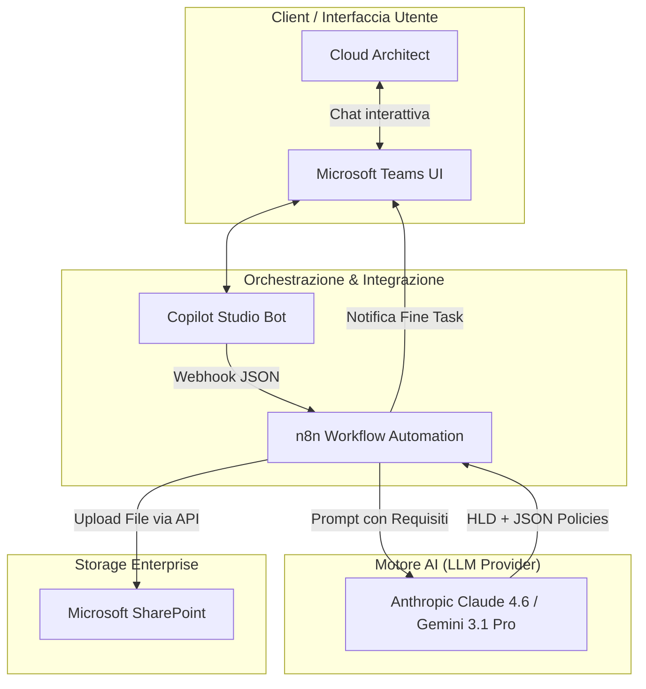
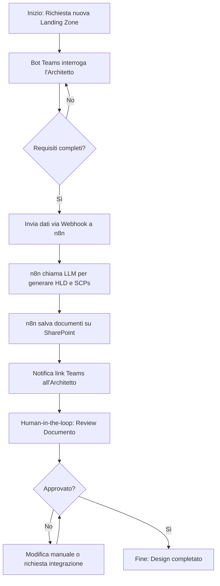
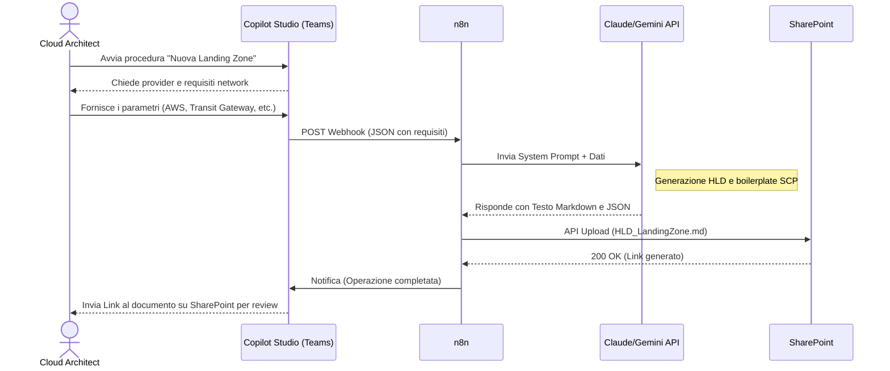

# Blueprint GenAI: Efficentamento del "Design Landing Zone Cloud"

## 1. Descrizione del Caso d'Uso
**Categoria:** Architecture & Design
**Titolo:** Design Landing Zone Cloud
**Ruolo:** Cloud Architect
**Obiettivo Originale (da CSV):** Progettazione dell'architettura di base (Landing Zone) su cloud provider con setup di multi-account, IAM centralizzato, SCPs (Service Control Policies) e configurazione di base del network e logging (es. AWS Control Tower / Azure Landing Zone).
**Obiettivo GenAI:** Automatizzare la generazione del documento di High Level Design (HLD) per una Cloud Landing Zone (definizione struttura multi-account, IAM, Service Control Policies, topologia network e logging) partendo dai requisiti di business e applicando le best practice (es. AWS Well-Architected Framework o Cloud Adoption Framework per Azure).

## 2. Fasi del Processo Efficentato

### Fase 1: Raccolta Strutturata dei Requisiti
La fase iniziale in cui il Cloud Architect inserisce i parametri chiave del progetto (Cloud Provider, compliance richiesta, ambienti necessari) tramite un'interfaccia conversazionale.
*   **Tool Principale Consigliato:** Microsoft Teams (Chatbot UI) + Copilot Studio
*   **Alternative:** 1. Accenture Amethyst, 2. ChatGPT Agent
*   **Modelli LLM Suggeriti:** OpenAI GPT-5.4
*   **Modalità di Utilizzo:** Il Cloud Architect avvia una chat su Teams con il "Landing Zone Assistant". Il bot pone domande mirate (es. "Quali ambienti sono previsti oltre a Prod e Non-Prod?", "Ci sono requisiti PCI-DSS?"). 
    *Esempio di System Prompt per il Bot:*
    ```markdown
    Sei un Cloud Architect Assistant esperto in AWS e Azure. Il tuo compito è raccogliere i requisiti per una nuova Landing Zone. Fai una domanda alla volta riguardo: 
    1. Cloud Provider preferito (AWS/Azure/GCP).
    2. Struttura degli account/subscription (es. Sandbox, Dev, QA, Prod, Security, Shared Services).
    3. Requisiti di rete (Hub & Spoke, Transit Gateway, VPN/Direct Connect).
    4. Requisiti di compliance (GDPR, PCI-DSS).
    Quando hai tutte le risposte, conferma all'utente e invia un payload JSON tramite Webhook per la generazione.
    ```
*   **Azione Umana Richiesta:** Il Cloud Architect risponde alle domande del bot per fornire il contesto.
*   **Stima Reale di Efficienza:** 
    *   *Tempo As-Is (Manuale):* 2 ore (riunioni e stesura appunti)
    *   *Tempo To-Be (GenAI):* 15 minuti (interazione asincrona con il bot)
    *   *Risparmio %:* 87%
    *   *Motivazione:* Il bot standardizza e velocizza la raccolta di tutti gli elementi essenziali senza dispersioni.

### Fase 2: Generazione dell'HLD e delle Policy Baseline (SCPs)
Ricevuti i requisiti, l'LLM genera il documento completo di design architetturale (HLD) e le bozze in JSON delle regole di sicurezza (SCP/Azure Policies).
*   **Tool Principale Consigliato:** n8n
*   **Alternative:** 1. Google Antigravity, 2. gemini-cli
*   **Modelli LLM Suggeriti:** Anthropic Claude Opus 4.6 o Google Gemini 3.1 Pro (eccellenti per documenti tecnici lunghi e strutturati).
*   **Modalità di Utilizzo:** Un workflow n8n riceve il webhook da Teams, esegue un prompt complesso verso l'LLM iniettando i requisiti raccolti e genera un file Markdown o Word (docx). Nello stesso output, genera le bozze JSON per le policy di base (es. blocco regioni non autorizzate). Il documento viene poi salvato automaticamente in una cartella SharePoint dedicata al progetto.
*   **Azione Umana Richiesta:** L'architetto legge il documento generato su SharePoint, lo rifinisce e ne approva i contenuti. Particolare attenzione deve essere posta alle SCPs generate.
*   **Stima Reale di Efficienza:** 
    *   *Tempo As-Is (Manuale):* 14 ore (disegno architettura, stesura capitoli, ricerca best practice SCPs)
    *   *Tempo To-Be (GenAI):* 45 minuti (generazione automatica + review approfondita)
    *   *Risparmio %:* 94%
    *   *Motivazione:* L'LLM elimina il "foglio bianco" producendo istantaneamente un HLD formattato con tutti i capitoli standard (Organigramma Account, Network Topology, Security Baseline, Centralized Logging) e il boilerplate delle policy.

## 3. Descrizione del Flusso Logico
Il processo sfrutta un approccio **Single-Agent orchestrato tramite n8n** per mantenere l'architettura lineare. Il flusso inizia con il Cloud Architect che interagisce con un Chatbot nativo su Microsoft Teams (creato con Copilot Studio). Il bot funge solo da "intervistatore intelligente" per raccogliere i parametri della Landing Zone. Una volta ottenuti i dati, il bot lancia una chiamata HTTP (Webhook) verso n8n. Il motore n8n prende in carico l'automazione, inviando un prompt elaborato a un modello di fascia alta (es. Claude Opus 4.6). L'LLM redige il documento architetturale completo e le bozze JSON delle policy. Infine, n8n carica i file generati (HLD.md e policies.json) su una directory SharePoint specificata e risponde sul canale Teams avvisando l'utente che il design è pronto per la revisione (Human-in-the-loop).

## 4. Diagrammi UML (Mermaid.js)

### 4.1 Architecture Diagram


### 4.2 Process Diagram


### 4.3 Sequence Diagram


## 5. Guida all'Implementazione Tecnica

### Prerequisiti
- Licenza Microsoft Copilot Studio (o accesso a Power Virtual Agents).
- Istanza n8n (Cloud o self-hosted) con accesso alla rete aziendale.
- API Key attiva per Anthropic Claude (Opus 4.6) o Google Gemini (3.1 Pro).
- Microsoft Entra ID (Azure AD) App Registration per le API Graph (necessarie per upload su SharePoint).

### Step 1: Configurazione del Webhook su n8n
1. Aprire n8n e creare un nuovo workflow.
2. Aggiungere il nodo `Webhook`. Impostarlo in ascolto su metodo `POST`.
3. Copiare l'URL di Test/Production generato dal nodo Webhook; servirà nello Step 2.

### Step 2: Creazione del Bot su Copilot Studio
1. Accedere a [Copilot Studio](https://copilotstudio.microsoft.com/).
2. Creare un nuovo Copilot chiamato "LZ Designer Bot".
3. Nella sezione "Topics", creare un nuovo argomento "Genera Landing Zone".
4. Aggiungere nodi "Question" per chiedere all'utente le informazioni necessarie (Cloud Provider, Network type, Compliance). Salvare le risposte in variabili (es. `varProvider`, `varNetwork`).
5. Al termine delle domande, aggiungere un nodo "Call an Action" o "HTTP Request".
6. Inserire l'URL Webhook di n8n (copiato allo Step 1), inviando il payload JSON con le variabili raccolte.
7. Pubblicare il bot e abilitare il canale **Microsoft Teams**.

### Step 3: Integrazione AI e Generazione File in n8n
1. Tornare in n8n. Dopo il nodo Webhook, aggiungere un nodo `LLM Chain` (o un nodo HTTP Request diretto verso le API Anthropic/Google).
2. Configurare le credenziali con l'API Key.
3. Nel campo Prompt, usare un template simile a:
   `Crea un documento di High Level Design per una Landing Zone su {{ $json.body.varProvider }}. Requisiti di rete: {{ $json.body.varNetwork }}. Genera i capitoli: Account Structure, Network Topology, Security Baseline, Centralized Logging. Includi anche 2 Service Control Policies (o Azure Policies) essenziali in formato JSON.`
4. Collegare in uscita un nodo `Microsoft SharePoint`.
5. Autenticare il nodo con le credenziali OAuth2 o Service Principal (Graph API).
6. Configurare l'operazione su `File: Upload` indicando l'ID del Drive/Folder SharePoint di destinazione e passando l'output dell'LLM come contenuto del file.
7. Aggiungere un nodo finale `Microsoft Teams` per inviare un messaggio al Cloud Architect con il link al file appena caricato.

## 6. Rischi e Mitigazioni
- **Rischio:** *Allucinazioni sulle limitazioni dei Cloud Provider.* L'AI potrebbe suggerire architetture di rete o limiti di SCP non supportati nativamente dal provider selezionato in quella specifica regione.
  -> **Mitigazione:** Obbligo di Human-in-the-loop. L'HLD è una bozza avanzata, ma l'Architetto deve verificare i "quota limits" e le "service availability" reali.
- **Rischio:** *Regole JSON non valide.* Le Service Control Policies o Azure Policies generate in JSON potrebbero contenere errori di sintassi o logiche pericolose.
  -> **Mitigazione:** I JSON generati devono essere trattati come *boilerplate*. Devono passare attraverso una pipeline CI/CD con linting (es. `cfn-lint` o validator per terraform) o testati in un ambiente Sandbox prima dell'applicazione in Produzione.
- **Rischio:** *Dispersione dei documenti architetturali.*
  -> **Mitigazione:** n8n forza il salvataggio diretto su SharePoint, evitando che l'HLD rimanga solo nella chat di Teams e garantendo l'accesso e il versioning documentale centralizzato.
