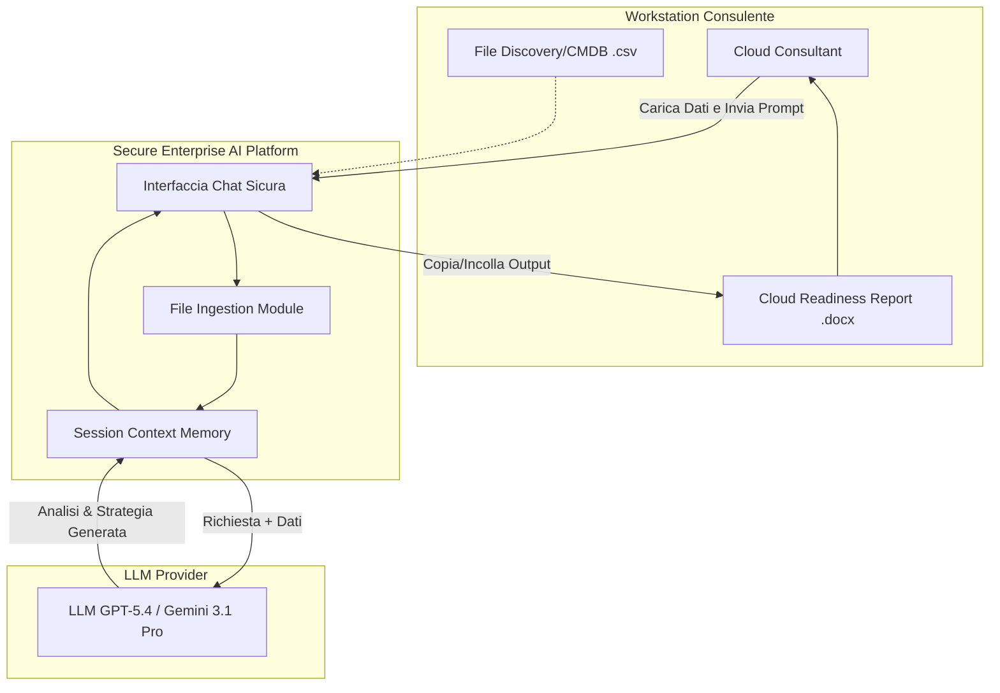
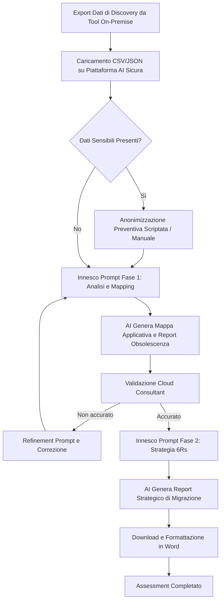
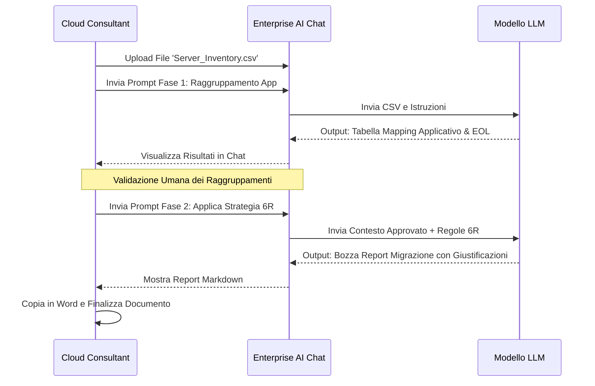

# Blueprint GenAI: Efficentamento del "Assessment Infrastruttura Cliente (Cloud Readiness)"

## 1. Descrizione del Caso d'Uso
**Categoria:** Assessment & Analysis
**Titolo:** Assessment Infrastruttura Cliente (Cloud Readiness)
**Ruolo:** Cloud Consultant
**Obiettivo Originale (da CSV):** Analisi dello stato di fatto dell'infrastruttura IT on-premise di un cliente per valutarne la prontezza alla migrazione cloud. Include l'inventario degli asset (discovery), l'identificazione delle dipendenze applicative e la produzione di un report con la strategia di migrazione (Rehost, Refactor, Rearchitect).
**Obiettivo GenAI:** Automatizzare l'analisi e la normalizzazione degli output dei tool di discovery (es. export CSV dal CMDB, log di rete) per raggruppare automaticamente le risorse in landscape applicativi e generare una bozza di report strutturato contenente le raccomandazioni di migrazione (framework 6Rs) per ciascun carico di lavoro.

## 2. Fasi del Processo Efficentato

### Fase 1: Ingestion, Normalizzazione Dati e Mappatura Dipendenze
L'AI analizza i file grezzi estratti dai tool di IT discovery, correggendo inconsistenze e raggruppando macchine virtuali, database e storage in "gruppi applicativi" logici basandosi su tag, naming convention o connessioni di rete riportate nei dati.
*   **Tool Principale Consigliato:** `accenture ametyst` (per garantire la massima segregazione e sicurezza dei dati infrastrutturali del cliente).
*   **Alternative:** `OpenClaw` (per modelli locali on-premise in caso di dati ultra-sensibili), `chatgpt agent` (versione Enterprise).
*   **Modelli LLM Suggeriti:** Google Gemini 3.1 Pro (eccellente per contesti estesi e tabelle dati di grandi dimensioni) o OpenAI GPT-5.4.
*   **Modalità di Utilizzo:** Il consulente carica l'export (es. file CSV) direttamente nella chat enterprise e fornisce un prompt di istruzione.
    *Bozza del Prompt:*
    > "Ti fornisco in allegato un export CSV del CMDB del cliente. Agisci come Cloud Architect. Il tuo compito è: 1. Pulire i dati da colonne ridondanti. 2. Raggruppare i server in 'Applicazioni' basandoti sulla colonna 'App_Tag' e sui prefissi dei nomi host. 3. Evidenziare in una tabella riassuntiva tutti i Sistemi Operativi in End of Life (EOL) o i Database non supportati. Fornisci l'output in formato Markdown tabellare."
*   **Azione Umana Richiesta:** Il Cloud Consultant deve revisionare i raggruppamenti applicativi generati per confermare che l'AI abbia colto correttamente le dipendenze logiche tra frontend, middleware e backend.
*   **Stima Reale di Efficienza:** 
    *   *Tempo As-Is (Manuale):* 16 ore (incrocio manuale di VLOOKUP su Excel per migliaia di righe).
    *   *Tempo To-Be (GenAI):* 1 ora (upload e validazione).
    *   *Risparmio %:* 93%
    *   *Motivazione:* L'AI processa e correla migliaia di righe istantaneamente, sostituendo il dispendioso lavoro di data-cleansing e consolidamento manuale su fogli di calcolo.

### Fase 2: Generazione della Strategia di Migrazione (6Rs)
Sulla base del landscape applicativo mappato nella Fase 1, l'LLM valuta ogni applicazione e suggerisce la strategia di migrazione cloud più idonea (Rehost, Replatform, Refactor, Retire, Retain, Repurchase) basandosi su best practice architetturali pubbliche (es. AWS/Azure Cloud Adoption Framework).
*   **Tool Principale Consigliato:** `accenture ametyst` (continuazione della sessione precedente).
*   **Alternative:** `Microsoft Teams (Chatbot UI)` integrato a un motore documentale.
*   **Modelli LLM Suggeriti:** OpenAI GPT-5.4 o Anthropic Claude Opus 4.6 (per l'alta capacità di ragionamento su best practice architetturali).
*   **Modalità di Utilizzo:** Prompt di follow-up nella stessa finestra di contesto.
    *Bozza del Prompt:*
    > "Ottimo lavoro. Ora, per ciascuna delle applicazioni identificate, proponi una strategia di migrazione Cloud utilizzando il framework delle 6Rs. Applica queste regole aziendali:
    > - 'Replatform' automatico per DB relazionali (es. SQL Server, MySQL) verso servizi PaaS.
    > - 'Retire' per server di test inattivi da oltre 90 giorni.
    > - 'Rehost' come fallback per applicativi legacy custom.
    > Genera il capitolo 'Raccomandazioni di Migrazione' pronto per essere inserito in un documento Word finale, includendo per ogni app una breve giustificazione della strategia scelta."
*   **Azione Umana Richiesta:** Validazione tecnica e commerciale: il consulente adatta la strategia proposta al reale budget del cliente e alle tempistiche contrattuali (fattori che l'AI potrebbe ignorare).
*   **Stima Reale di Efficienza:** 
    *   *Tempo As-Is (Manuale):* 8 ore.
    *   *Tempo To-Be (GenAI):* 1 ora.
    *   *Risparmio %:* 87%
    *   *Motivazione:* Eliminata la stesura da zero ('blank page syndrome') del documento di design. L'esperto si limita a correggere e rifinire un testo già strutturato e coerente con i dati.

## 3. Descrizione del Flusso Logico
Il flusso adotta un approccio **Single-Agent** conversazionale strutturato, gestito interamente tramite una piattaforma di Enterprise AI chat per garantire la sicurezza del dato. Il processo è sequenziale: il Cloud Consultant fa l'upload dei dati grezzi estratti dagli ambienti on-premise del cliente (fase di data ingestion). L'AI agisce come motore di normalizzazione, processando il file CSV/JSON per estrarre insight, individuare obsolescenze e mappare i raggruppamenti. A questo punto subentra un ciclo di Human-in-the-loop dove il consulente valida la mappa logica. Approvata la mappa, un secondo prompt innesca il ragionamento architetturale dell'AI, che applica regole predefinite (es. PaaS first) per assegnare i pattern di migrazione e compilare un report testuale finale esportabile.

## 4. Diagrammi UML (Mermaid.js)

### 4.1 Architecture Diagram

### 4.2 Process Diagram

### 4.3 Sequence Diagram

## 5. Guida all'Implementazione Tecnica

### Prerequisiti
- Accesso a una piattaforma di Chat AI Enterprise (es. Accenture Amethyst, o equivalente approvata per il caricamento di dati confidenziali di livello aziendale).
- Export in formato tabellare (.csv, .xlsx) o .json dal sistema di discovery del cliente (es. ServiceNow, RVTools, Movere, AWS Application Discovery Service).

### Step 1: Preparazione e Sanitizzazione dei Dati
1. Aprire il file estratto dal tool di discovery.
2. Assicurarsi che non siano presenti colonne contenenti password, chiavi crittografiche o informazioni personali (PII) non rilevanti per l'assessment infrastrutturale.
3. Rinominare eventualmente le intestazioni delle colonne in modo parlante (es. cambiare `os_v_r2` in `Operating_System`).

### Step 2: Esecuzione dell'Assessment Assistito (Fase 1)
1. Accedere all'interfaccia web della piattaforma AI sicura (es. Amethyst).
2. Selezionare un modello ad alto ragionamento come `GPT-5.4` o `Gemini 3.1 Pro`.
3. Utilizzare la funzione di "Upload File" per caricare il file preparato allo Step 1.
4. Incollare il "Prompt Fase 1" (descritto nella sezione 2) per generare la mappatura applicativa.
5. Analizzare la risposta a schermo. Se l'AI ha unito due applicazioni distinte, fornire istruzioni correttive: *"Correggi la tabella separando l'app HR_Frontend dall'app Finance_Backend"*.

### Step 3: Generazione del Report Strategico (Fase 2)
1. Nello stesso thread di conversazione (per mantenere il contesto dei dati appena mappati), inviare il "Prompt Fase 2".
2. Attendere la generazione della tabella strategica con le 6Rs.
3. Esaminare le giustificazioni.
4. Selezionare l'output Markdown prodotto dall'AI, copiarlo e incollarlo nel template Word/PowerPoint standard aziendale per la presentazione finale al cliente.

## 6. Rischi e Mitigazioni
- **Rischio: Esposizione di Dati Confidenziali (IP Leaks):** L'upload di indirizzi IP, nomi host e topologie di rete del cliente su modelli pubblici viola le policy di sicurezza.
  - **Mitigazione:** È **tassativo** utilizzare solo piattaforme Enterprise "Zero Data Retention" (dove i dati non vengono usati per il training del modello) come Amethyst. Se non disponibili, i dati devono essere mascherati preventivamente.
- **Rischio: Allucinazioni Strategiche:** L'AI potrebbe suggerire il refactoring verso PaaS per un'applicazione legacy (es. COBOL) che tecnicamente non lo supporta.
  - **Mitigazione:** Obbligo formale di Human-in-the-loop. L'output dell'AI è considerato una *bozza* (draft) e deve essere tecnicamente validato dal Cloud Consultant prima di essere condiviso con il cliente.
- **Rischio: Limiti di Contesto (Token Limit):** Un export di discovery con decine di migliaia di server potrebbe superare la context window del modello, causando un troncamento dell'analisi.
  - **Mitigazione:** Selezionare i modelli con finestre di contesto ampie (es. Gemini 3.1 Pro) o dividere il file di discovery in batch più piccoli (es. analizzare un dipartimento/ambiente alla volta).