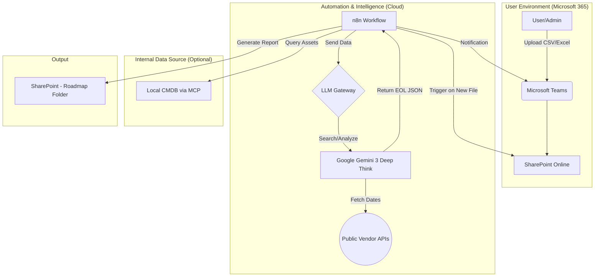
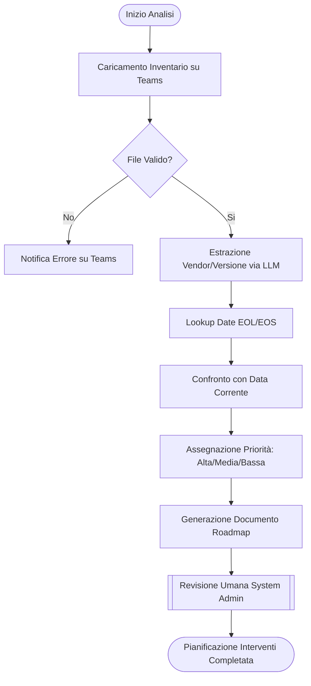
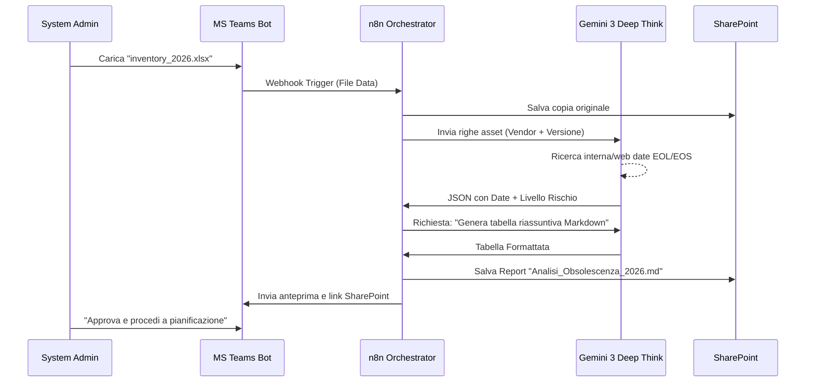

# Blueprint GenAI: Efficentamento dell' "Analisi Obsolescenza HW/SW (End of Life)"

## 1. Descrizione del Caso d'Uso
**Categoria:** Assessment & Analysis
**Titolo:** Analisi Obsolescenza HW/SW (End of Life)
**Ruolo:** System Administrator
**Obiettivo Originale (da CSV):** Valutazione sistematica del ciclo di vita di server, sistemi operativi, middleware e database. Identificazione dei sistemi prossimi alla fine del supporto ufficiale (EOL/EOS) e pianificazione degli interventi di refresh o upgrade tecnologico.
**Obiettivo GenAI:** Automatizzare l'identificazione delle date di End-of-Life (EOL) e End-of-Support (EOS) incrociando l'inventario aziendale con database pubblici e vendor, generando automaticamente una roadmap di prioritizzazione degli upgrade.

## 2. Fasi del Processo Efficentato

### Fase 1: Ingestion Inventario e Scouting Date EOL/EOS
Il System Administrator carica un file (Excel/CSV) contenente l'elenco degli asset (HW, OS, DB, Middleware) su un canale Microsoft Teams dedicato. Un agente AI estrae le versioni specifiche e interroga database aggiornati per recuperare le date esatte di fine supporto.
*   **Tool Principale Consigliato:** `n8n` (per l'orchestrazione del file e l'invio all'LLM)
*   **Alternative:** 1. `accenture amethyst` (per analisi sicura di file sensibili), 2. `Microsoft Teams (Chatbot UI)` via Copilot Studio.
*   **Modelli LLM Suggeriti:** Google Gemini 3 Deep Think (eccellente per web-search e data mining accurato su versioni software).
*   **Modalità di Utilizzo:** Workflow n8n che monitora una cartella SharePoint. All'upload, lo script invia l'elenco all'LLM con un prompt strutturato per mappare ogni riga a una data EOL certa.
*   **Bozza Prompt (System Prompt):**
    ```text
    Sei un esperto di IT Lifecycle Management. Riceverai una lista di versioni HW/SW. 
    Per ogni voce, identifica: 1. Data EOL (End of Life), 2. Data EOS (End of Support). 
    Usa solo fonti ufficiali (es. Microsoft Lifecycle, Red Hat, Oracle, Cisco). 
    Se una versione è già EOL, segnalala come "CRITICA". Restituisci un file JSON strutturato.
    ```
*   **Azione Umana Richiesta:** Verifica di eventuali versioni "custom" o legacy non identificate automaticamente.
*   **Stima Reale di Efficienza:** 
    *   *Tempo As-Is (Manuale):* 16 ore (ricerca manuale per centinaia di componenti)
    *   *Tempo To-Be (GenAI):* 20 minuti
    *   *Risparmio %:* 98%
    *   *Motivazione:* L'AI elimina la ricerca manuale su decine di portali vendor differenti.

### Fase 2: Analisi Rischi e Generazione Roadmap Refresh
L'agente confronta la data odierna con le date EOL trovate, calcola i mesi rimanenti e assegna uno score di criticità basato sull'esposizione (es. DB di produzione vs Test). Produce una bozza di piano di migrazione.
*   **Tool Principale Consigliato:** `accenture amethyst`
*   **Alternative:** 1. `claude-code` (se l'analisi richiede il controllo di script di automazione esistenti), 2. `ChatGPT Agent`.
*   **Modelli LLM Suggeriti:** Anthropic Claude Sonnet 4.6 (per la precisione nella classificazione e nel ragionamento logico).
*   **Modalità di Utilizzo:** Input dell'output della Fase 1 in un agente Amethyst specializzato in "IT Compliance". L'agente genera un documento Word/PDF con grafici di obsolescenza (tramite Python tool se disponibile).
*   **Azione Umana Richiesta:** Validazione delle priorità proposte in base al budget e alle finestre di manutenzione aziendali.
*   **Stima Reale di Efficienza:** 
    *   *Tempo As-Is (Manuale):* 8 ore (scrittura report e pianificazione)
    *   *Tempo To-Be (GenAI):* 10 minuti
    *   *Risparmio %:* 97%
    *   *Motivazione:* La sintesi dei dati in un piano d'azione strutturato è immediata per un LLM di ultima generazione.

## 3. Descrizione del Flusso Logico
Il flusso è di tipo **Single-Agent Orchestrated via n8n**. 
1. L'utente interagisce esclusivamente via **Microsoft Teams**, caricando il file di asset.
2. **n8n** agisce come "braccio operativo", salvando il file su **SharePoint** e attivando l'LLM (**Gemini 3 Deep Think**) per il recupero dati.
3. Se necessario, un server **MCP (Model Context Protocol)** può essere usato per interrogare direttamente il database di configurazione (CMDB) interno in modo sicuro.
4. L'output viene poi raffinato da un secondo passaggio logico (o un agente dedicato) che trasforma le date in una roadmap temporale (Roadmap-as-a-Service).

## 4. Diagrammi UML (Mermaid.js)

### 4.1 Application & System Architecture Schematic


### 4.2 Process Diagram


### 4.3 Sequence Diagram


## 5. Guida all'Implementazione Tecnica

### Prerequisiti
- Licenza **n8n** (Self-hosted o Cloud).
- API Key per **Google Gemini API** (Google AI Studio).
- Accesso a **Microsoft Graph API** (per integrazione Teams/SharePoint).
- Un file Excel di esempio con colonne: `HostName`, `Vendor`, `Product`, `Version`.

### Step 1: Configurazione n8n
1. Crea un workflow con un nodo **HTTP Webhook** o un nodo **Microsoft Teams Trigger** per intercettare l'upload dei file.
2. Inserisci un nodo **Binary File** per leggere il contenuto dell'Excel.
3. Aggiungi un nodo **AI Agent** (n8n native) o un nodo **HTTP Request** verso le API di Gemini.
4. Configura il nodo LLM con il System Prompt definito nella Fase 1.

### Step 2: Integrazione Ricerca EOL
L'LLM di ultima generazione (Gemini 3) ha già nel suo knowledge base la maggior parte delle date EOL. Per precisione assoluta, configura il nodo n8n per utilizzare lo strumento "Google Search" (se abilitato nell'agente) per verificare le date più recenti o di nicchia.

### Step 3: Output e Notifica
1. Usa il nodo **Microsoft Word** o **Markdown to PDF** in n8n per formattare il report finale.
2. Configura un nodo **Microsoft Teams - Send Message** per inviare al System Admin un riepilogo immediato con:
   - Totale Asset analizzati.
   - Numero di sistemi "Critici" (già EOL).
   - Link al report completo su SharePoint.

## 6. Rischi e Mitigazioni
- **Rischio:** Allucinazione sulle date EOL (specialmente per versioni minor).
  - **Mitigazione:** L'LLM deve citare la fonte (URL) nel JSON di output; validazione umana obbligatoria per gli asset critici.
- **Rischio:** Caricamento di dati sensibili (nomi server reali).
  - **Mitigazione:** Utilizzo di **accenture amethyst** per l'anonimizzazione preventiva o esecuzione dell'analisi solo su "Vendor + Versione" senza includere nomi host reali.
- **Rischio:** Versioni custom non documentate.
  - **Mitigazione:** L'AI segnalerà "Data non trovata" richiedendo l'intervento manuale per quelle specifiche righe.
