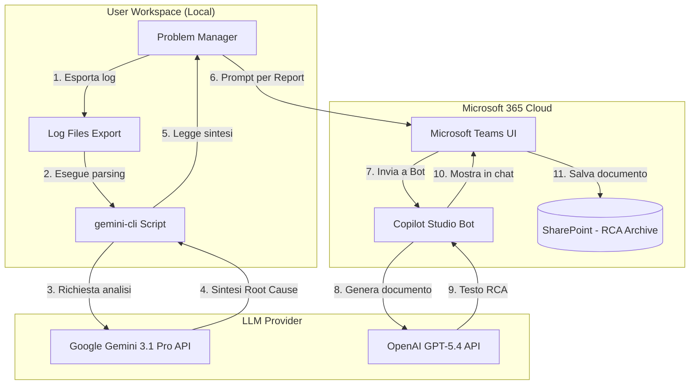
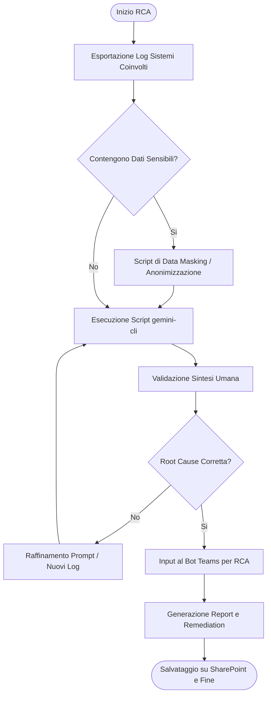
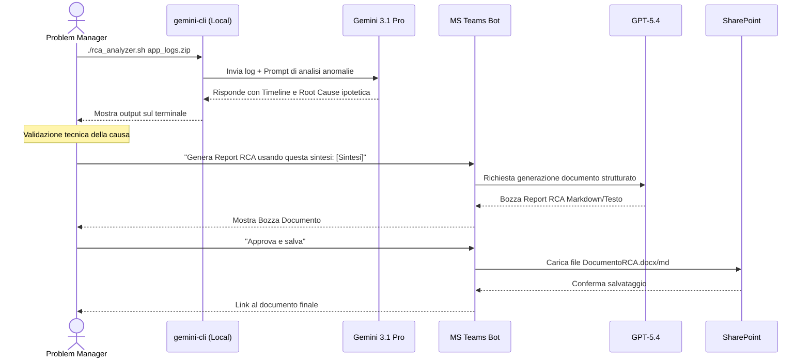

# Blueprint GenAI: Efficentamento dell' "Analisi Root Cause Incidenti (RCA)"

## 1. Descrizione del Caso d'Uso
**Categoria:** Assessment & Analysis
**Titolo:** Analisi Root Cause Incidenti (RCA)
**Ruolo:** Problem Manager
**Obiettivo Originale (da CSV):** Indagine approfondita a seguito di incidenti critici (Sev 1/Sev 2). Analisi di log di sistema, metriche applicative e configurazioni di rete per identificare la vera causa radice del malfunzionamento e definizione dei piani di remediation per evitarne la ricorrenza.
**Obiettivo GenAI:** Automatizzare l'analisi di voluminosi file di log e metriche per estrarre rapidamente anomalie, correlare gli eventi temporali, e generare in automatico una bozza di report RCA con suggerimenti per i piani di remediation.

## 2. Fasi del Processo Efficentato

### Fase 1: Analisi Massiva dei Log e Individuazione Anomalie
Il Problem Manager esporta i log dei sistemi coinvolti (applicativi, DB, rete) in un file di testo strutturato o archivio e lo sottopone all'analisi dell'LLM per trovare il momento esatto in cui la catena di errori è iniziata.
*   **Tool Principale Consigliato:** `gemini-cli` (tramite script bash per sfruttare l'enorme context window e parsare file locali)
*   **Alternative:** `claude-code`, `OpenClaw` (se i log contengono dati altamente sensibili non anonimizzati)
*   **Modelli LLM Suggeriti:** Google Gemini 3.1 Pro (ideale per l'ingestion di milioni di token di log) o Anthropic Claude Sonnet 4.6
*   **Modalità di Utilizzo:** Utilizzo di uno script shell che invoca la CLI passando i file di log come contesto.
    ```bash
    #!/bin/bash
    # Script: rca_analyzer.sh
    # Uso: ./rca_analyzer.sh error_logs_app_X.txt
    
    LOG_FILE=$1
    
    gemini-cli prompt "Agisci da Senior System Administrator e Problem Manager. 
    Analizza i log allegati per un incidente Sev 1 avvenuto nelle ultime 24 ore.
    1. Identifica la prima anomalia temporale (il trigger).
    2. Crea una timeline degli eventi (Timestamp - Errore - Sistema).
    3. Ipotizza le 3 cause radice più probabili.
    Sii tecnico e conciso." --file "$LOG_FILE"
    ```
*   **Azione Umana Richiesta:** Il Problem Manager deve fornire log pertinenti (filtrati per finestra temporale) ed eseguire il data masking di eventuali password in chiaro prima dell'analisi. Deve inoltre validare la timeline proposta dall'IA.
*   **Stima Reale di Efficienza:** 
    *   *Tempo As-Is (Manuale):* 5 ore
    *   *Tempo To-Be (GenAI):* 20 minuti
    *   *Risparmio %:* 93%
    *   *Motivazione:* L'AI esegue una ricerca semantica e di pattern matching su migliaia di righe di log in pochi secondi, sostituendo le query manuali (grep/awk) necessarie per ricostruire la timeline.

### Fase 2: Stesura del Report RCA e Remediation tramite Teams
Una volta identificata la causa, la sintesi viene passata a un Chatbot aziendale che applica il template standard aziendale per redigere il documento finale di Root Cause Analysis e suggerire i passi di mitigazione.
*   **Tool Principale Consigliato:** `Microsoft Teams (Chatbot UI)` (integrato via Copilot Studio o n8n)
*   **Alternative:** `accenture ametyst`, `chatgpt agent`
*   **Modelli LLM Suggeriti:** OpenAI GPT-5.4 o Google Gemini 3.1 Pro
*   **Modalità di Utilizzo:** Il Problem Manager interagisce con il bot in Teams, incollando l'output della Fase 1.
    ```text
    Utente: "Crea un report RCA per il seguente incidente. Sistema: E-commerce. 
    Causa trovata: Out of Memory sul nodo DB causato da una query non ottimizzata lanciata 
    dal microservizio di reporting. 
    Aggiungi raccomandazioni per la remediation a breve e lungo termine."
    ```
    Il bot risponde con il documento formattato (Executive Summary, Timeline, Root Cause, Action Plan) pronto per essere salvato su SharePoint.
*   **Azione Umana Richiesta:** Il Problem Manager deve revisionare il testo generato, correggere eventuali dettagli di processo aziendale e approvare il piano d'azione prima della diffusione.
*   **Stima Reale di Efficienza:** 
    *   *Tempo As-Is (Manuale):* 2 ore
    *   *Tempo To-Be (GenAI):* 15 minuti
    *   *Risparmio %:* 87%
    *   *Motivazione:* Il superamento della "sindrome da pagina bianca" e l'utilizzo di un modello che conosce i template ITSM standard riduce drasticamente il tempo di redazione e formattazione.

## 3. Descrizione del Flusso Logico
L'architettura proposta è di tipo **Single-Agent** a due stadi disaccoppiati, privilegiando la semplicità. 
Nel primo stadio, un tool CLI locale (gestito dall'umano) si occupa del lavoro pesante e "sporco": il parsing e l'estrazione di significato da log destrutturati. Questo garantisce che file di log pesanti non debbano essere incollati manualmente in un'interfaccia web.
Nel secondo stadio, l'output condensato (poche righe di sintesi della root cause) viene inviato al Chatbot aziendale su Microsoft Teams. Il bot elabora questi dati strutturati per produrre documentazione business-ready. L'umano agisce da ponte ("Human-in-the-loop") tra l'analisi tecnica e la rendicontazione, garantendo il controllo sulla validità tecnica delle conclusioni prima che diventino un documento ufficiale.

## 4. Diagrammi UML (Mermaid.js)

### 4.1 Architecture Diagram


### 4.2 Process Diagram


### 4.3 Sequence Diagram


## 5. Guida all'Implementazione Tecnica

### Prerequisiti
- Installazione di Node.js e `gemini-cli` sulla workstation del Problem Manager.
- Chiave API di Google Gemini (Gemini 3.1 Pro) salvata nelle variabili d'ambiente (`GEMINI_API_KEY`).
- Licenza Microsoft 365 con accesso a Copilot Studio e SharePoint.

### Step 1: Creazione dello Script CLI per l'Analisi Log
1. Creare una cartella locale `~/rca_tools`.
2. Creare il file `rca_analyzer.sh` incollando il codice bash fornito nella sezione 2 (Fase 1).
3. Rendere lo script eseguibile: `chmod +x rca_analyzer.sh`.
4. Testare lo script con un piccolo file di log di esempio: `./rca_analyzer.sh test_log.txt`.

### Step 2: Configurazione del Bot RCA su Copilot Studio
1. Accedere a [Copilot Studio](https://copilotstudio.microsoft.com/).
2. Creare un nuovo Copilot chiamato "RCA Assistant".
3. Nella sezione "Generative AI" o "System Prompt", inserire le istruzioni di sistema:
   *"Sei un esperto IT Problem Manager. Il tuo compito è prendere sintesi tecniche di incidenti e trasformarle in un report RCA formale. Struttura sempre la risposta con: 1. Executive Summary, 2. Timeline, 3. Root Cause, 4. Action Plan (Remediation a breve e lungo termine). Usa un tono professionale."*
4. Configurare le azioni del bot per permettere il salvataggio dei risultati tramite l'integrazione Power Automate (nodo "Crea file in SharePoint").

### Step 3: Integrazione in Microsoft Teams
1. Dalla dashboard di Copilot Studio, andare su "Channels" (Canali) e selezionare "Microsoft Teams".
2. Cliccare su "Turn on Teams" e poi "Publish".
3. Distribuire il link del bot al team o aggiungerlo al catalogo app di Teams dell'organizzazione.

## 6. Rischi e Mitigazioni
- **Rischio 1: Data Leakage di informazioni sensibili.** I log potrebbero contenere PII, password o token in chiaro che non devono essere inviati a LLM cloud. -> **Mitigazione:** Implementare uno step obbligatorio di sanitizzazione log (tramite regex o tool come `sed`/`awk`) nello script bash prima dell'invio all'API, oppure adottare modelli on-premise (OpenClaw) per incidenti che coinvolgono dati altamente classificati.
- **Rischio 2: Allucinazione della Root Cause.** L'IA potrebbe creare false correlazioni tra eventi temporali non legati causalmente. -> **Mitigazione:** L'IA viene usata *solo* per suggerire ipotesi e raggruppare i log ("assistente"). L'indagine e l'approvazione finale della vera causa radice spetta unicamente all'analisi critica del Problem Manager umano.