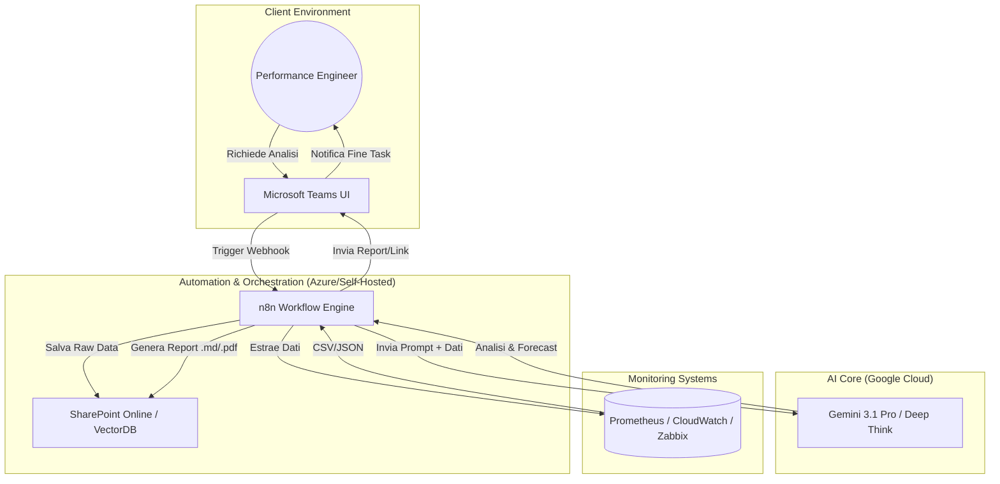
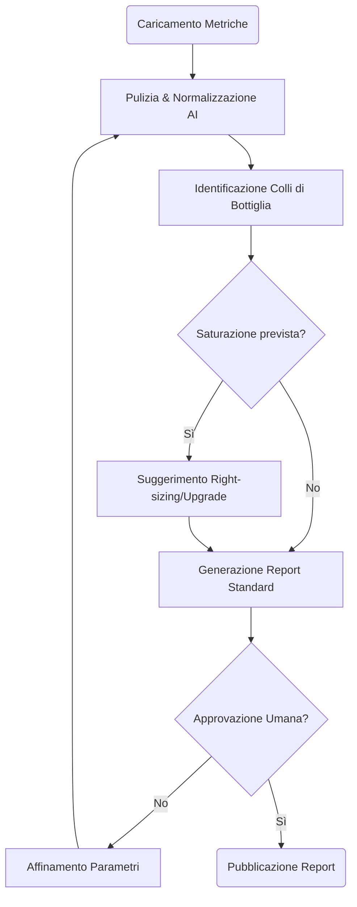
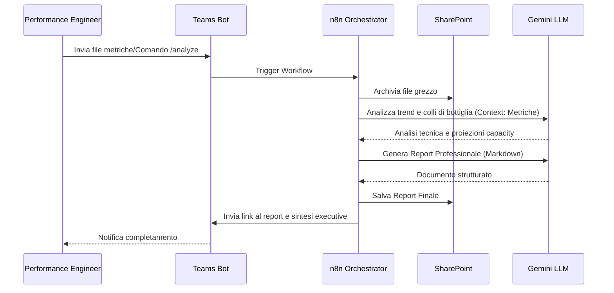

# Blueprint GenAI: Efficentamento del "Analisi Performance e Capacity"

## 1. Descrizione del Caso d'Uso
**Categoria:** Assessment & Analysis
**Titolo:** Analisi Performance e Capacity
**Ruolo:** Performance Engineer
**Obiettivo Originale (da CSV):** Monitoraggio storico e valutazione delle prestazioni infrastrutturali. Analisi dei colli di bottiglia (CPU, RAM, I/O disco) e produzione di piani di capacity planning per adeguare le risorse ai futuri carichi di lavoro previsti.
**Obiettivo GenAI:** Automatizzare l'interpretazione di grandi moli di dati di monitoraggio (serie temporali) per identificare automaticamente anomalie, saturazioni e colli di bottiglia, generando istantaneamente un report di Capacity Planning con raccomandazioni di dimensionamento (Right-sizing).

## 2. Fasi del Processo Efficentato

### Fase 1: Ingestione e Sintesi delle Metriche
In questa fase, i dati grezzi estratti dai sistemi di monitoraggio (es. Prometheus, Zabbix, CloudWatch in formato CSV/JSON) vengono normalizzati e sintetizzati dall'AI per evidenziare i trend significativi, eliminando il "rumore" dei picchi estemporanei.
*   **Tool Principale Consigliato:** `n8n` (per l'orchestrazione del flusso dati)
*   **Alternative:** 1. `gemini-cli`, 2. `Google Antigravity`
*   **Modelli LLM Suggeriti:** Google Gemini 3.1 Pro (ottimizzato per l'analisi di dataset testuali lunghi)
*   **Modalità di Utilizzo:** Workflow n8n che recupera i file da una cartella **SharePoint**, invia il contenuto via API a Gemini con un prompt specifico di "Data Cleaning & Summarization".
*   **Azione Umana Richiesta:** Caricamento del file di export metriche nella cartella dedicata o attivazione del bot su Teams.
*   **Stima Reale di Efficienza:** 
    *   *Tempo As-Is (Manuale):* 2 ore (pulizia dati e creazione grafici base)
    *   *Tempo To-Be (GenAI):* 2 minuti
    *   *Risparmio %:* 98%
    *   *Motivazione:* L'AI processa migliaia di righe di metriche istantaneamente identificando i range di normalità.

### Fase 2: Analisi Colli di Bottiglia e Forecasting
L'LLM analizza la correlazione tra le metriche (es. aumento latenza disco vs saturazione RAM) per individuare la "root cause" delle scarse performance e proietta il consumo futuro basandosi sui trend storici.
*   **Tool Principale Consigliato:** `gemini-cli` (tramite script Python per analisi batch)
*   **Alternative:** 1. `Accenture Amethyst`, 2. `ChatGPT Agent`
*   **Modelli LLM Suggeriti:** Google Gemini 3 Deep Think (ideale per ragionamento logico complesso e correlazione dati)
*   **Modalità di Utilizzo:** Script Python che invoca Gemini passando le metriche sintetizzate e richiedendo un'analisi inferenziale.
    *   **Bozza Prompt:** *"Analizza queste metriche di CPU/RAM/IOPS degli ultimi 30 giorni. Identifica se la saturazione della CPU al venerdì è correlata ai job di backup. Prevedi il superamento della soglia dell'80% della RAM nei prossimi 6 mesi assumendo una crescita lineare del 5% mensile."*
*   **Azione Umana Richiesta:** Validazione tecnica delle correlazioni identificate.
*   **Stima Reale di Efficienza:** 
    *   *Tempo As-Is (Manuale):* 4 ore (analisi esperta e proiezioni su Excel)
    *   *Tempo To-Be (GenAI):* 10 minuti
    *   *Risparmio %:* 96%
    *   *Motivazione:* L'LLM agisce come un analista senior che "legge" i numeri e trova pattern non evidenti.

### Fase 3: Generazione Report di Capacity Planning
Produzione automatica del documento finale (Markdown o PDF) contenente l'executive summary, il dettaglio tecnico e le azioni di rimedio consigliate.
*   **Tool Principale Consigliato:** `Microsoft Teams (Chatbot UI)` tramite **Copilot Studio**
*   **Alternative:** 1. `n8n` (modulo PDF Generator), 2. `AI-Studio Google` (per dashboard interattiva)
*   **Modelli LLM Suggeriti:** OpenAI GPT-5.4
*   **Modalità di Utilizzo:** Il bot su Teams notifica l'utente al termine dell'analisi e fornisce il link al report salvato su **SharePoint**.
*   **Azione Umana Richiesta:** Approvazione finale del piano di capacity e invio agli stakeholder.
*   **Stima Reale di Efficienza:** 
    *   *Tempo As-Is (Manuale):* 2 ore (redazione documento e formattazione)
    *   *Tempo To-Be (GenAI):* 3 minuti
    *   *Risparmio %:* 97%
    *   *Motivazione:* Generazione di testo strutturato professionale a partire dai dati analizzati nella fase precedente.

## 3. Descrizione del Flusso Logico
Il processo è configurato come un approccio **Single-Agent** orchestrato da **n8n**. L'agente (basato su Gemini) riceve in input i dati storici, esegue internamente tre "task" sequenziali (pulizia, analisi, reporting) e interagisce con l'utente finale tramite Microsoft Teams. L'utilizzo di SharePoint come repository garantisce la persistenza e la sicurezza dei dati analizzati, permettendo all'agente di confrontare l'analisi attuale con quelle dei mesi precedenti (RAG su documentazione storica).

## 4. Diagrammi UML (Mermaid.js)

### 4.1 Application & System Architecture Schematic

### 4.2 Process Diagram

### 4.3 Sequence Diagram

## 5. Guida all'Implementazione Tecnica

### Prerequisiti
- Licenza **n8n** (Cloud o Self-hosted).
- API Key per **Google Gemini** (tramite Google Cloud Vertex AI o AI Studio).
- Accesso alle API di SharePoint (Microsoft Graph) per n8n.
- Un canale Microsoft Teams dedicato per le notifiche.

### Step 1: Configurazione Workflow n8n
1.  Crea un workflow che parta da un nodo **Webhook** (attivato da Teams) o un nodo **Schedule** (per analisi periodiche).
2.  Configura un nodo **HTTP Request** per estrarre le metriche dal tuo sistema di monitoraggio (es. query API a Prometheus).
3.  Utilizza il nodo **AI Agent** di n8n collegandolo al modello `gemini-3.1-pro`.

### Step 2: Definizione del System Prompt (Core Analysis)
Configura il nodo AI con il seguente System Prompt:
> "Sei un esperto Performance Engineer. Riceverai dati di monitoraggio in formato CSV/JSON. Il tuo compito è: 1) Identificare anomalie nei consumi CPU/RAM/Disco. 2) Correlare i picchi di carico con orari o eventi specifici. 3) Eseguire un calcolo di Capacity Planning proiettando i dati sui prossimi 12 mesi. 4) Suggerire azioni di right-sizing (es. riduci CPU su VM sottoutilizzate, aumenta RAM su DB server). Rispondi sempre in formato Markdown professionale."

### Step 3: Integrazione Teams e SharePoint
1.  Usa il nodo **Microsoft Teams** in n8n per inviare messaggi adattivi con i risultati.
2.  Usa il nodo **Microsoft SharePoint** per caricare il report finale in una cartella condivisa accessibile al team T&A.

## 6. Rischi e Mitigazioni
- **Rischio:** Allucinazioni sulle proiezioni matematiche (es. calcolo errato del trend). -> **Mitigazione:** Integrare nel prompt istruzioni per utilizzare tool di calcolo (Python Sandbox in Gemini) per eseguire le proiezioni matematiche in modo deterministico.
- **Rischio:** Dati sensibili nei log di performance (es. nomi utente o IP). -> **Mitigazione:** Inserire uno step di anonimizzazione dati in n8n prima dell'invio all'LLM o utilizzare modelli via **OpenClaw** on-premise se la policy è restrittiva.
- **Rischio:** Mancanza di contesto su eventi straordinari (es. migrazioni pianificate). -> **Mitigazione:** Permettere all'utente di inserire una nota di contesto (es. "Iniziata migrazione il 15/03") tramite il bot Teams, da iniettare nel prompt di analisi.
