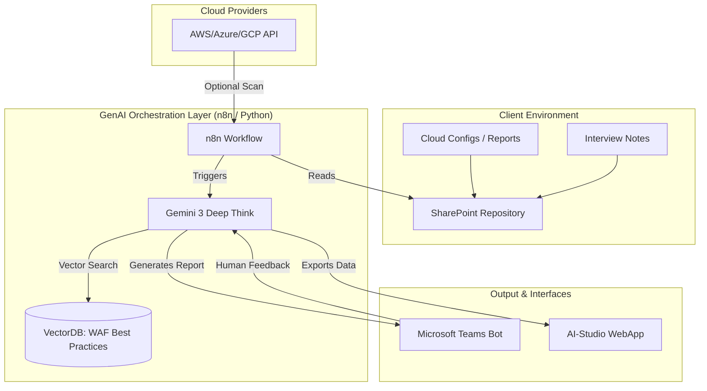
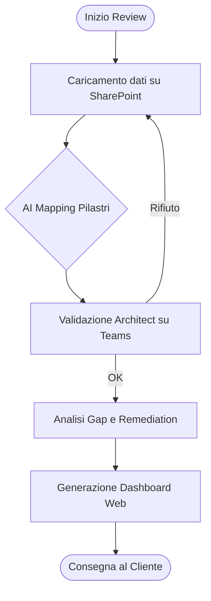
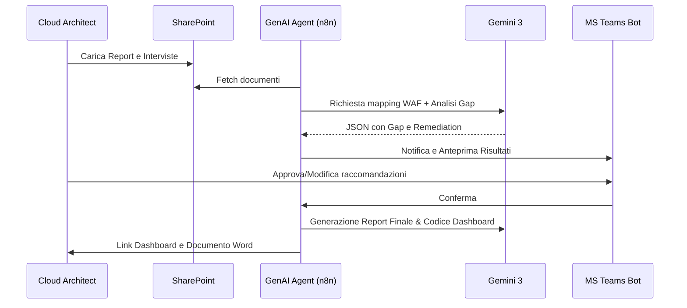

# Blueprint GenAI: Efficentamento del "Review Architetturale e Well-Architected Framework"

## 1. Descrizione del Caso d'Uso
**Categoria:** Assessment & Analysis
**Titolo:** Review Architetturale e Well-Architected Framework
**Ruolo:** Cloud Architect
**Obiettivo Originale (da CSV):** Sessioni periodiche di revisione di un'infrastruttura cloud esistente misurandola contro i pilastri del Well-Architected Framework (Sicurezza, Affidabilità, Costi, Performance, Operation) per individuare margini di miglioramento.
**Obiettivo GenAI:** Automatizzare l'analisi della configurazione infrastrutturale e delle interviste tecniche correlandole ai 5/6 pilastri del Well-Architected Framework (WAF), identificando istantaneamente gap critici e suggerendo azioni di remediation prioritarizzate.

## 2. Fasi del Processo Efficentato

### Fase 1: Ingestion e Mapping Pilastri
In questa fase, l'AI processa file di configurazione (es. JSON/YAML di Terraform, export di Azure Advisor/AWS Trusted Advisor) e verbali di intervista caricati su SharePoint.
*   **Tool Principale Consigliato:** `accenture amethyst` (per l'analisi sicura di documenti e report di conformità).
*   **Alternative:** 1. `n8n` (per estrarre dati via API da Cloud provider), 2. `ChatGPT Agent` (Enterprise).
*   **Modelli LLM Suggeriti:** Google Gemini 3 Deep Think (per ragionamento cross-pillar estremo).
*   **Modalità di Utilizzo:** Caricamento dei report tecnici in una cartella SharePoint monitorata. L'LLM esegue il mapping automatico tra i dati tecnici e i pilastri WAF (es. "Mancanza di Multi-AZ" -> Pilastro Affidabilità).
    *   **Bozza System Prompt:** 
    ```text
    Sei un Cloud Architect esperto in Well-Architected Framework. 
    Analizza i file forniti e mappa ogni evidenza su uno dei pilastri: Sicurezza, Affidabilità, Efficienza dei Costi, Eccellenza Operativa, Performance. 
    Produci una tabella JSON con: [Pilastro, Evidenza, Score (1-5), Riferimento Documentale].
    ```
*   **Azione Umana Richiesta:** Validazione del mapping iniziale per assicurarsi che il contesto specifico del cliente sia rispettato.
*   **Stima Reale di Efficienza:** 
    *   *Tempo As-Is (Manuale):* 8 ore (lettura report e mapping manuale).
    *   *Tempo To-Be (GenAI):* 20 minuti.
    *   *Risparmio %:* 96%
    *   *Motivazione:* L'AI elimina la lettura sequenziale di centinaia di pagine di log/report di assessment.

### Fase 2: Gap Analysis e Remediation Planning
Generazione automatica di un piano d'azione basato sui gap identificati, con stima dello sforzo e dell'impatto.
*   **Tool Principale Consigliato:** `gemini-cli` (per elaborazione batch dei risultati e generazione reportistica).
*   **Alternative:** 1. `claude-code`, 2. `visualstudio + copilot`.
*   **Modelli LLM Suggeriti:** Anthropic Claude 4.6 Sonnet.
*   **Modalità di Utilizzo:** Scripting che prende il JSON della Fase 1 e interroga l'LLM per generare raccomandazioni tecniche specifiche (es. script di configurazione o modifiche IaC).
*   **Azione Umana Richiesta:** Revisione critica delle priorità di intervento basata sul budget del cliente.
*   **Stima Reale di Efficienza:** 
    *   *Tempo As-Is (Manuale):* 6 ore (scrittura del piano di remediation).
    *   *Tempo To-Be (GenAI):* 15 minuti.
    *   *Risparmio %:* 95%
    *   *Motivazione:* L'AI attinge a una base di conoscenza vastissima sulle best practice cloud per proporre soluzioni standardizzate istantanee.

### Fase 3: Visualizzazione e Dashboarding
Presentazione dei risultati tramite una dashboard interattiva per gli stakeholder.
*   **Tool Principale Consigliato:** `ai-studio google` (per build rapido della WebApp di frontend).
*   **Alternative:** 1. `Microsoft Teams (Chatbot UI)` per consultazione rapida via bot.
*   **Modelli LLM Suggeriti:** Google Gemini 3.1 Pro.
*   **Modalità di Utilizzo:** Generazione di una Single Page Application (React/Angular) che visualizza grafici a ragnatela (Radar Chart) sui pilastri WAF e la lista delle "Top 5 Priority Actions".
*   **Azione Umana Richiesta:** Presentazione della dashboard al cliente finale.
*   **Stima Reale di Efficienza:** 
    *   *Tempo As-Is (Manuale):* 4 ore (creazione slide e grafici Excel).
    *   *Tempo To-Be (GenAI):* 10 minuti (generazione codice dashboard).
    *   *Risparmio %:* 95%
    *   *Motivazione:* Passaggio diretto da dati strutturati a visualizzazione senza passaggi manuali di data entry.

## 3. Descrizione del Flusso Logico
Il flusso è progettato come un'architettura **Single-Agent** (orchestrata via n8n o script Python) che funge da "WAF Reviewer". 
1. I dati (configurazioni e interviste) vengono depositati su **SharePoint**.
2. L'agente analizza i dati, estrae i gap e li confronta con una Knowledge Base (RAG) contenente le ultime linee guida AWS/Azure/GCP.
3. L'output viene inviato a un bot su **Microsoft Teams** che notifica l'Architect del completamento dell'analisi.
4. L'Architect interagisce con il bot per affinare i suggerimenti.
5. Il sistema genera infine la dashboard su **AI-Studio** per la presentazione finale.

## 4. Diagrammi UML (Mermaid.js)

### 4.1 Architecture Diagram


### 4.2 Process Diagram


### 4.3 Sequence Diagram


## 5. Guida all'Implementazione Tecnica

### Prerequisiti
- Accesso a **Microsoft Teams** e licenza **Power Automate/Copilot Studio**.
- API Key per **Google Gemini API** (Vertex AI).
- Repository **SharePoint** dedicato.
- Istanza **n8n** (Cloud o Self-hosted) per l'orchestrazione.

### Step 1: Configurazione n8n e SharePoint
1. Crea un workflow in n8n che utilizzi il nodo "Microsoft SharePoint" per monitorare i nuovi file in una cartella specifica.
2. Usa il nodo "Extract Text" (per PDF/DOCX) per convertire i documenti in stringhe di testo.

### Step 2: Prompt Engineering (The Brain)
Configura un nodo "AI Agent" in n8n con il seguente System Prompt:
```markdown
# SYSTEM PROMPT
Sei l'assistente ufficiale per il Well-Architected Framework Review.
Il tuo compito è analizzare i testi in input e produrre un report strutturato.
1. Identifica il pilastro coinvolto.
2. Descrivi il rischio (High/Medium/Low).
3. Suggerisci la "Best Practice" ufficiale violata.
4. Fornisci un comando CLI o uno snippet di codice per risolvere il problema.
Output richiesto: JSON validato.
```

### Step 3: Interfaccia Teams via Webhook
1. Utilizza il nodo "Microsoft Teams" in n8n per inviare una "Adaptive Card" all'Architect.
2. La card deve contenere i pulsanti "Approva" o "Richiedi Modifiche".

### Step 4: Dashboard AI-Studio
1. In AI-Studio, usa la funzione "Build" caricando il JSON prodotto per generare istantaneamente una dashboard React con grafici `recharts` per visualizzare i punteggi dei pilastri.

## 6. Rischi e Mitigazioni
- **Rischio:** Allucinazione su configurazioni di rete complesse. -> **Mitigazione:** Human-in-the-loop obbligatorio; l'Architect deve confermare ogni suggerimento prima della dashboard finale.
- **Rischio:** Esposizione dati sensibili nel prompt. -> **Mitigazione:** Utilizzo di istanze Enterprise (Amethyst o Vertex AI con data privacy attiva) per garantire che i dati non istruiscano modelli pubblici.
- **Rischio:** Report Cloud Provider obsoleti. -> **Mitigazione:** Inserimento di un timestamp di controllo nei file di input analizzati dall'AI.
