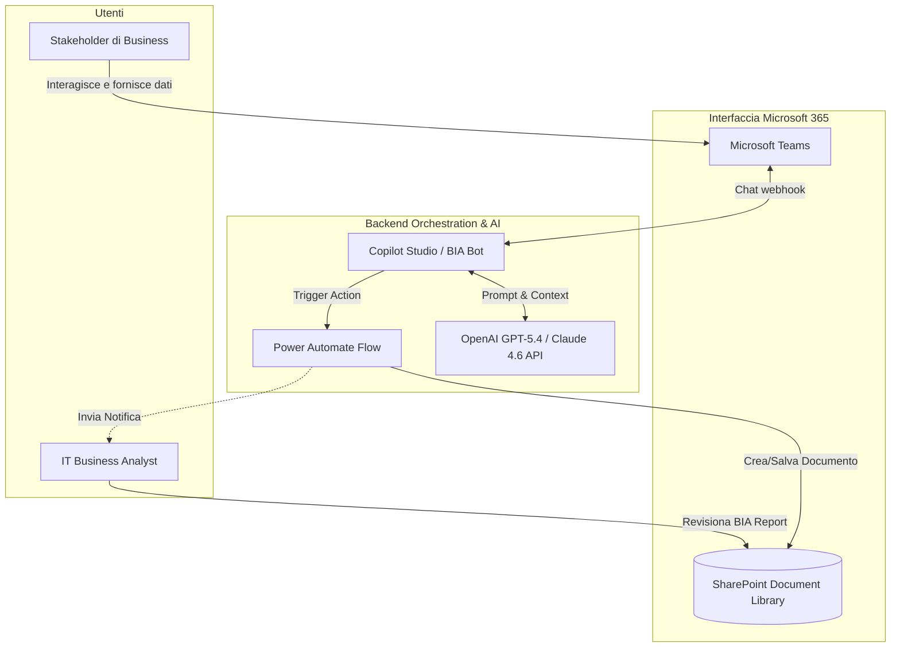
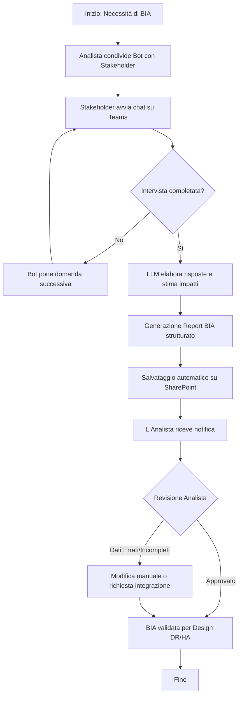
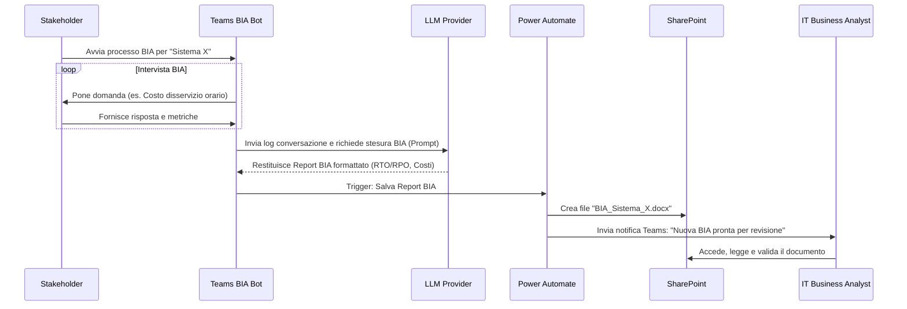

# Blueprint GenAI: Efficentamento del "Analisi Impatto di Business (BIA) IT"

## 1. Descrizione del Caso d'Uso
**Categoria:** Assessment & Analysis
**Titolo:** Analisi Impatto di Business (BIA) IT
**Ruolo:** IT Business Analyst
**Obiettivo Originale (da CSV):** Collaborazione con gli stakeholder di business per quantificare l'impatto economico e operativo di un potenziale disservizio dei sistemi IT, al fine di giustificare o calibrare gli investimenti in soluzioni di DR e HA.
**Obiettivo GenAI:** Automatizzare la fase di intervista agli stakeholder per la raccolta dei dati di impatto (economico e operativo) tramite un assistente virtuale e generare automaticamente un report BIA strutturato con le metriche calcolate (es. RTO/RPO suggeriti e perdite stimate).

## 2. Fasi del Processo Efficentato

### Fase 1: Intervista Conversazionale agli Stakeholder
L'assistente virtuale guida gli stakeholder di business attraverso un'intervista strutturata direttamente su Microsoft Teams, ponendo domande mirate sui costi orari di disservizio, processi critici dipendenti e impatti reputazionali.
*   **Tool Principale Consigliato:** `copilot studio` (Bot su Microsoft Teams)
*   **Alternative:** `accenture ametyst`, `Microsoft Teams (Chatbot UI)` tramite n8n
*   **Modelli LLM Suggeriti:** OpenAI GPT-5.4 o Anthropic Claude Sonnet 4.6 (per empatia e ragionamento logico strutturato)
*   **Modalità di Utilizzo:** Configurazione di un Topic in Copilot Studio che si attiva su richiesta.
    *Bozza del System Prompt del Bot:*
    ```text
    Sei un IT Business Analyst Assistant. Il tuo compito è intervistare l'utente (Stakeholder di Business) per raccogliere dati per la Business Impact Analysis (BIA) del sistema IT di cui è responsabile.
    Procedi ponendo una domanda alla volta.
    1. Qual è il nome del sistema o dell'applicazione?
    2. Quali sono i processi di business primari che dipendono da questo sistema?
    3. Qual è la stima del danno economico orario (in Euro) in caso di blocco totale del sistema?
    4. Ci sono impatti normativi, legali o reputazionali in caso di disservizio prolungato oltre le 4 ore?
    5. Qual è il tempo massimo tollerabile di disservizio (MTPD) prima che l'azienda subisca danni irreversibili?
    Raccogli tutte le risposte in modo cortese. Se una risposta è vaga, chiedi chiarimenti. Al termine, conferma la ricezione dei dati.
    ```
*   **Azione Umana Richiesta:** Gli stakeholder rispondono alle domande. Non è richiesta supervisione IT in questa fase.
*   **Stima Reale di Efficienza:**
    *   *Tempo As-Is (Manuale):* 3 ore (organizzazione meeting, intervista, trascrizione)
    *   *Tempo To-Be (GenAI):* 15 minuti (tempo di risposta dell'utente via chat asincrona)
    *   *Risparmio %:* 91%
    *   *Motivazione:* Si eliminano i tempi di setup dei meeting e l'analista non deve trascrivere manualmente gli appunti; i dati vengono strutturati all'origine.

### Fase 2: Elaborazione BIA e Generazione Documento
I dati raccolti dalla chat vengono aggregati dall'LLM che calcola un riepilogo finanziario, suggerisce RTO/RPO target e formatta un report BIA in Markdown/PDF, salvandolo automaticamente nello SharePoint aziendale.
*   **Tool Principale Consigliato:** `copilot studio` (Integrazione con Power Automate/SharePoint)
*   **Alternative:** `n8n` (Workflow automation)
*   **Modelli LLM Suggeriti:** OpenAI GPT-5.4 o Google Gemini 3.1 Pro
*   **Modalità di Utilizzo:** Azione (Action) in Copilot Studio che passa i dati JSON raccolti all'LLM per la sintesi finale e chiama un flusso Power Automate per creare il file.
    *Bozza del Prompt di Generazione BIA:*
    ```text
    Basandoti sui dati raccolti dall'intervista allo stakeholder:
    [INSERIRE DATI JSON]
    Genera un report di "Business Impact Analysis".
    Il report deve includere:
    - Executive Summary
    - Processi di Business Impattati
    - Quantificazione del Danno Economico (calcolo su base 1h, 4h, 8h, 24h)
    - Impatti Non-Finanziari (Legali/Reputazionali)
    - Suggerimento Obiettivi: RTO (Recovery Time Objective) e RPO (Recovery Point Objective) giustificati dai dati.
    Formatta il tutto in modo professionale e tabellare.
    ```
*   **Azione Umana Richiesta:** L'IT Business Analyst apre il report generato su SharePoint, lo revisiona, applica eventuali correttivi e lo approva per giustificare gli investimenti in DR/HA.
*   **Stima Reale di Efficienza:**
    *   *Tempo As-Is (Manuale):* 4 ore (analisi appunti, calcoli su Excel, stesura documento Word)
    *   *Tempo To-Be (GenAI):* 10 minuti (revisione del documento generato)
    *   *Risparmio %:* 95%
    *   *Motivazione:* La redazione del documento, l'estrapolazione dei calcoli base e la formattazione sono completamente automatizzate.

## 3. Descrizione del Flusso Logico
Il flusso adotta un'architettura **Single-Agent** (l'Assistente BIA su Teams) supportata da automazioni di backend. L'IT Business Analyst istruisce gli stakeholder a interagire con il BIA Bot su Microsoft Teams. L'agente conduce un'intervista conversazionale guidata per estrarre le metriche di impatto. Una volta completata l'intervista, il bot passa il contesto testuale a un'azione integrata (es. tramite Power Automate) che invoca l'LLM per generare un report strutturato. Questo documento viene salvato automaticamente in una specifica cartella SharePoint. Infine, l'IT Business Analyst viene notificato per eseguire l'"Human-in-the-loop": legge il report BIA pre-compilato, ne valida le assunzioni finanziare e lo utilizza per i successivi design architetturali di Disaster Recovery e High Availability.

## 4. Diagrammi UML (Mermaid.js)

### 4.1 Architecture Diagram


### 4.2 Process Diagram


### 4.3 Sequence Diagram


## 5. Guida all'Implementazione Tecnica

### Prerequisiti
- Licenza Microsoft Copilot Studio (o licenza Premium per Power Automate/Teams se si usa framework custom).
- Accesso a Microsoft Teams e uno spazio SharePoint aziendale predefinito.
- Sottoscrizione a un modello LLM (se non si usano le capacità native di Copilot, ma si opta per un HTTP request verso OpenAI API / Azure OpenAI).

### Step 1: Creazione e Configurazione in Copilot Studio
1. Accedere al portale Microsoft Copilot Studio.
2. Creare un nuovo Copilot denominandolo "BIA Assistant".
3. Andare nella sezione **Topics** (Argomenti) e creare un nuovo Topic (es. "Avvio Intervista BIA") con frasi di trigger come "Voglio fare una BIA", "Analisi impatto", "Nuovo sistema".
4. Utilizzare i nodi **Question** per implementare le domande presenti nella Bozza del System Prompt (Fase 1). Salvare le risposte in variabili testuali/numeriche (es. `var_SystemName`, `var_DowntimeCost`).

### Step 2: Integrazione LLM e Generazione Testo
1. Al termine delle domande, aggiungere un nodo **Create Generative Answers** o utilizzare un nodo **Call an Action** per chiamare un flusso Power Automate.
2. Nel flusso Power Automate, utilizzare il connettore *AI Builder* o una chiamata HTTP diretta alle API di OpenAI (Azure OpenAI consigliato per sicurezza).
3. Passare al prompt dell'LLM le variabili raccolte, chiedendo di generare il testo del documento secondo la struttura desiderata.

### Step 3: Salvataggio su SharePoint e Notifica
1. Nel medesimo flusso Power Automate, aggiungere l'azione **Crea file** (SharePoint).
2. Definire il percorso (Site Address e Folder Path), usare la variabile `var_SystemName` per il nome del file (es. `BIA_@{var_SystemName}.md` o convertirlo in PDF) e il testo generato dall'LLM come *Content*.
3. Aggiungere l'azione **Invia un messaggio di chat** (Teams) indirizzato all'IT Business Analyst, contenente il link al file appena creato.

### Step 4: Pubblicazione
1. Tornare in Copilot Studio, testare il bot nell'apposito pannello e cliccare su **Publish**.
2. Andare su **Channels**, selezionare **Microsoft Teams** e distribuire l'app all'interno del tenant aziendale affinché gli stakeholder possano cercarla e interagirvi.

## 6. Rischi e Mitigazioni
- **Rischio 1: Allucinazioni o calcoli finanziari errati da parte dell'LLM.** -> **Mitigazione:** Il prompt deve istruire esplicitamente l'LLM a non inventare cifre, ma eseguire solo moltiplicazioni matematiche esatte basate sui dati utente (es. Costo orario x 4 ore). La validazione umana finale da parte dell'analista (Human-in-the-loop) è obbligatoria.
- **Rischio 2: Esposizione di dati sensibili/finanziari aziendali.** -> **Mitigazione:** Utilizzare versioni Enterprise dei modelli (es. Azure OpenAI M365 Copilot o istanze dedicate OpenClaw) che non utilizzano i dati di input per l'addestramento dei modelli pubblici. Il salvataggio avviene in un SharePoint protetto con RBAC.
- **Rischio 3: Lo stakeholder non conosce i dati finanziari o fornisce risposte inesatte.** -> **Mitigazione:** Istruire il bot a fornire esempi guida durante l'intervista (es. "Se non hai la cifra esatta, fornisci un range basato sul fatturato medio giornaliero") e permettere all'utente di dire "Non lo so" per far scalare la domanda all'analista in un secondo momento.