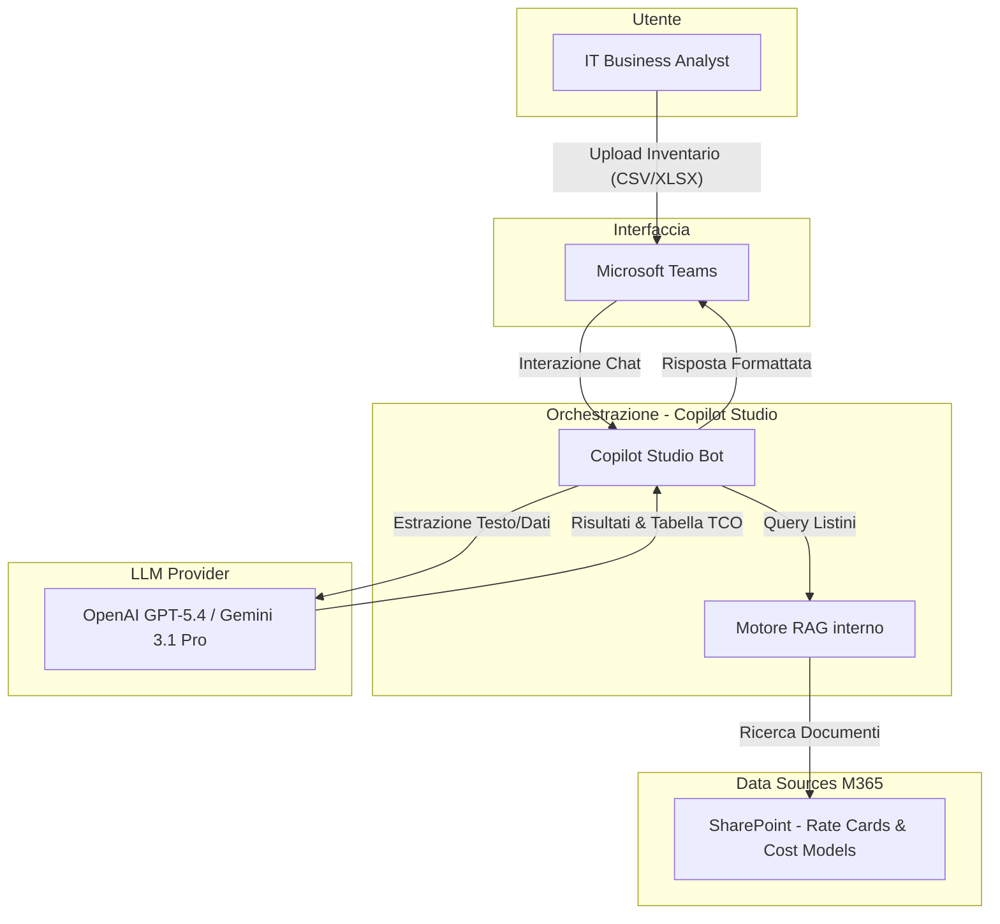
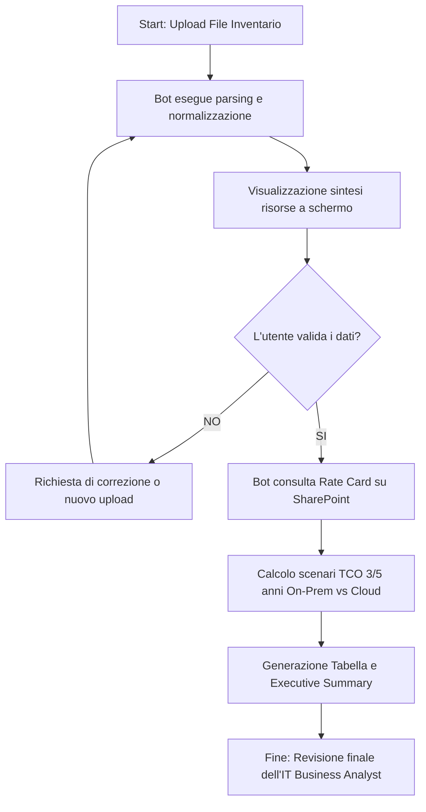
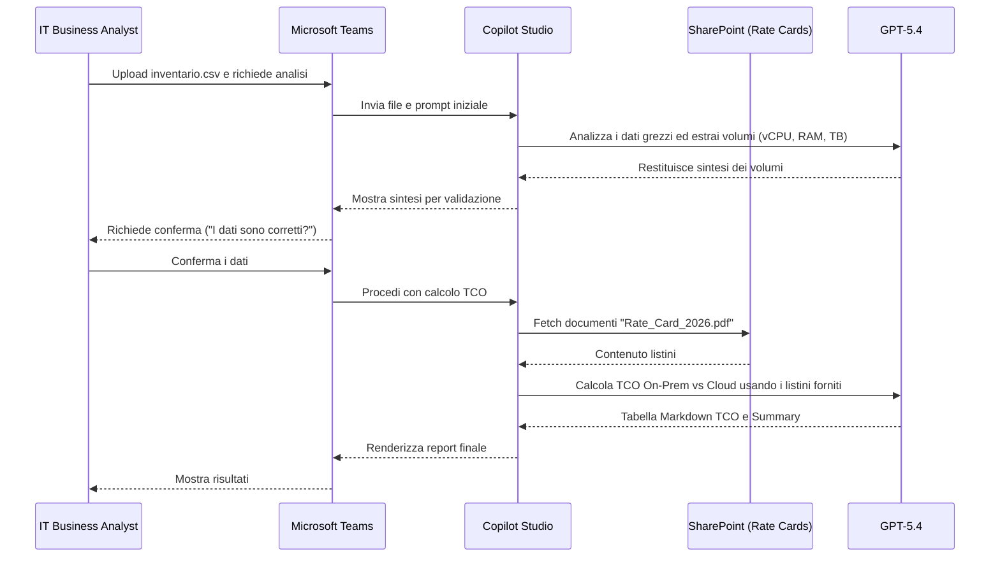

# Blueprint GenAI: Efficentamento di "Analisi TCO (Total Cost of Ownership)"

## 1. Descrizione del Caso d'Uso
**Categoria:** Assessment & Analysis
**Titolo:** Analisi TCO (Total Cost of Ownership)
**Ruolo:** IT Business Analyst
**Obiettivo Originale (da CSV):** Conduzione di analisi finanziarie approfondite per confrontare il costo totale di mantenimento di un'infrastruttura on-premise (CapEx+OpEx) rispetto a molteplici scenari di migrazione in cloud pubblico, includendo licenze, energia e personale.
**Obiettivo GenAI:** Automatizzare l'estrazione dei dati di inventario on-premise e la generazione di una stima comparativa del TCO (On-Premise vs Cloud) tramite un'interfaccia conversazionale, producendo un report di sintesi.

## 2. Fasi del Processo Efficentato

### Fase 1: Ingestion e Categorizzazione dell'Inventario
L'IT Business Analyst carica l'inventario hardware e software (es. file CSV/Excel esportato da un CMDB) direttamente in chat. L'AI interpreta i dati, normalizzando CPU, RAM, Storage e licenze in categorie standard.
*   **Tool Principale Consigliato:** `Microsoft Teams (Chatbot UI)` tramite `copilot studio`
*   **Alternative:** 1. `ChatGPT Agent` (Enterprise), 2. `accenture ametyst`
*   **Modelli LLM Suggeriti:** OpenAI GPT-5.4 o Google Gemini 3.1 Pro (ottimi per l'analisi di dati strutturati)
*   **Modalità di Utilizzo:** Interazione diretta via Microsoft Teams. Il bot viene configurato per accettare allegati.
    ```text
    Prompt suggerito per il bot:
    "Sei un IT Financial Analyst esperto. Analizza il file Excel allegato contenente l'inventario on-premise. Estrai e raggruppa le risorse per Compute, Storage, Network e Licenze. Identifica i parametri chiave (vCPU, RAM GB, Storage TB) necessari per una stima di dimensionamento Cloud."
    ```
*   **Azione Umana Richiesta:** L'analista deve verificare che l'AI abbia letto correttamente i totali dell'inventario (es. totale vCPU, totale TB) prima di procedere al calcolo.
*   **Stima Reale di Efficienza:** 
    *   *Tempo As-Is (Manuale):* 8 ore (pulizia dati e normalizzazione)
    *   *Tempo To-Be (GenAI):* 15 minuti
    *   *Risparmio %:* 96%
    *   *Motivazione:* L'AI esegue il parsing e la normalizzazione dei dati estratti da CMDB disordinati in pochi secondi, evitando ore di VLOOKUP e Pivot in Excel.

### Fase 2: Calcolo del TCO e Generazione Scenari Comparativi
Una volta confermati i dati, l'AI applica modelli di costo noti (recuperati da un documento di "Rate Card" aziendale o dai costi Cloud standard al 2026) per calcolare il CapEx/OpEx on-premise e stimare i costi equivalenti su AWS/Azure/GCP, includendo stime per energia e personale.
*   **Tool Principale Consigliato:** `Microsoft Teams (Chatbot UI)` tramite `copilot studio` (con knowledge base su SharePoint)
*   **Alternative:** 1. `n8n` (per chiamate API dirette ai Cloud Pricing Calculator), 2. Script Python con `gemini-cli`
*   **Modelli LLM Suggeriti:** OpenAI GPT-5.4 o Google Gemini 3.1 Pro
*   **Modalità di Utilizzo:** Il bot utilizza i documenti di Rate Card salvati su SharePoint aziendale come Knowledge Base (RAG nativo di Copilot Studio) per garantire l'aderenza ai contratti specifici del cliente.
    ```text
    Prompt per la generazione scenari:
    "Basandoti sull'inventario normalizzato e sulle Rate Card Cloud presenti su SharePoint, genera una tabella comparativa TCO a 3 e 5 anni. Confronta lo scenario 'As-Is On-Premise' (includendo stime di energia e personale al 15% del costo HW) con due scenari: 'Lift & Shift su Cloud Pubblico' e 'Cloud Ottimizzato (PaaS)'. Formatta il risultato in una tabella Markdown leggibile e fornisci un breve executive summary."
    ```
*   **Azione Umana Richiesta:** L'IT Business Analyst deve revisionare criticamente le assunzioni fatte dall'AI sui costi nascosti (energia, facilities) e approvare il report finale.
*   **Stima Reale di Efficienza:** 
    *   *Tempo As-Is (Manuale):* 16 ore (costruzione e valorizzazione del business case)
    *   *Tempo To-Be (GenAI):* 45 minuti (inclusa la revisione accurata)
    *   *Risparmio %:* 95%
    *   *Motivazione:* L'LLM applica istantaneamente euristiche di sizing e pricing, generando scenari complessi che richiederebbero lunghi calcoli manuali e consultazione di listini.

## 3. Descrizione del Flusso Logico
Il flusso adotta un approccio **Single-Agent** per mantenere la massima semplicità, orchestrato direttamente tramite Copilot Studio. L'IT Business Analyst interagisce esclusivamente con l'interfaccia familiare di Microsoft Teams. Il flusso inizia con l'upload del file di inventario (es. esportazione da vCenter o ServiceNow). Il bot di Teams analizza il file, estrae i requisiti capacitivi e li presenta all'utente per validazione. Una volta ricevuta la conferma (Human-in-the-loop), il bot interroga la sua Knowledge Base (connessa via RAG a una cartella SharePoint contenente i listini e le Rate Card aggiornate) per elaborare la stima finanziaria. Infine, l'agente restituisce una tabella di comparazione TCO direttamente in chat e offre la possibilità di esportare il riepilogo testuale.

## 4. Diagrammi UML (Mermaid.js)

### 4.1 Architecture Diagram


### 4.2 Process Diagram


### 4.3 Sequence Diagram


## 5. Guida all'Implementazione Tecnica

### Prerequisiti
- Licenza Microsoft Copilot Studio associata al tenant aziendale.
- Accesso in lettura a un sito SharePoint designato per ospitare i documenti finanziari e i listini (Rate Cards).
- File di test (CSV/Excel) rappresentativo di un inventario infrastrutturale.

### Step 1: Configurazione di Copilot Studio e Knowledge Base
1. Accedere a [Copilot Studio](https://copilotstudio.microsoft.com/) e cliccare su "Crea un nuovo copilot".
2. Assegnare un nome (es. "TCO Estimator Bot") e selezionare la lingua Italiana.
3. Nella sezione "Conoscenza" (Knowledge), cliccare su "Aggiungi conoscenza" e collegare l'URL della cartella SharePoint in cui verranno depositati i PDF/Excel dei listini cloud aziendali (Rate Cards).
4. Assicurarsi che l'autenticazione sia impostata su "Require users to sign in" per garantire che solo gli utenti autorizzati accedano al bot e ai listini.

### Step 2: Definizione del System Prompt (Generative AI)
1. Andare nelle impostazioni del Copilot -> "Intelligenza Artificiale Generativa".
2. Configurare le "Istruzioni di base" (System Prompt) inserendo:
   *Sei un IT Financial Analyst. Il tuo compito è aiutare gli utenti a calcolare il TCO. Quando un utente carica un file di inventario, analizza le colonne relative a CPU, RAM e Storage. Chiedi sempre conferma dei totali estratti. Una volta confermati, usa ESCLUSIVAMENTE i documenti di listino caricati su SharePoint per calcolare i costi e generare scenari comparativi a 3 e 5 anni (On-Prem vs Cloud).*

### Step 3: Gestione dell'Upload e Pubblicazione
1. Attivare la funzionalità di "File upload" nelle impostazioni di chat del bot, affinché gli utenti possano allegare il CSV/Excel direttamente nella chat di Teams.
2. Eseguire un test nella console laterale caricando un file dummy.
3. Cliccare su "Pubblica" (Publish).
4. Andare su "Canali", selezionare "Microsoft Teams" e abilitare il bot. Seguire la procedura per "Aprire in Teams" e aggiungerlo alla barra laterale dell'IT Business Analyst.

## 6. Rischi e Mitigazioni
- **Rischio 1: Allucinazioni sui costi Cloud.** L'AI potrebbe inventare prezzi non realistici o basarsi su listini obsoleti. -> **Mitigazione:** Limitare l'LLM tramite RAG a leggere i costi *esclusivamente* dai documenti PDF/Excel ufficiali caricati su SharePoint (Rate Cards approvate dall'azienda). Aggiungere un disclaimer nel prompt che l'output è una stima da validare.
- **Rischio 2: Errata interpretazione dell'inventario.** Il file CSV potrebbe avere colonne ambigue (es. "Memoria" scambiata per Storage invece di RAM). -> **Mitigazione:** Inserire un "Human-in-the-loop" bloccante: il bot *deve* restituire a video i totali estratti (es. "Ho trovato 1500 vCPU e 20 TB Storage") prima di calcolare i costi, attendendo un "OK" dall'operatore.
- **Rischio 3: Privacy dei dati del cliente.** L'inventario caricato potrebbe contenere hostname o IP sensibili. -> **Mitigazione:** Il bot su Teams risiede nel tenant M365 aziendale protetto (Enterprise Data Protection). Istruire l'analista a inviare solo i campi capacitivi e omettere colonne di rete o hostname dal CSV prima dell'upload.