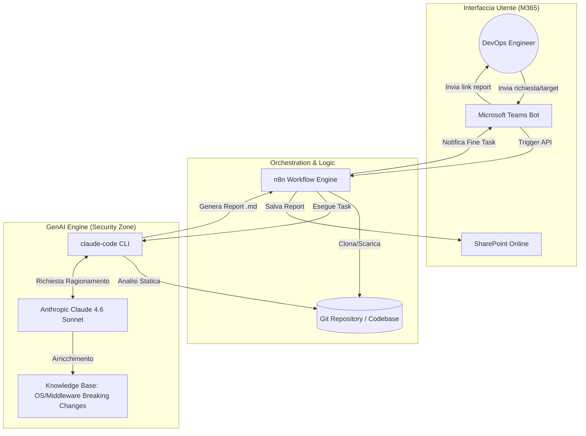
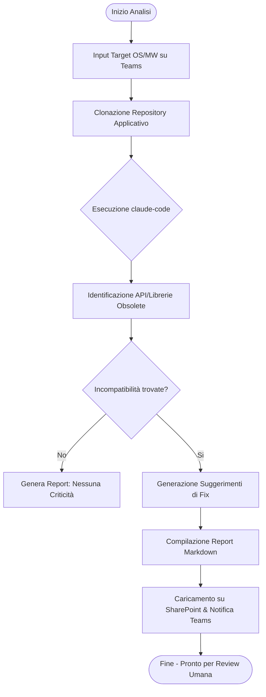
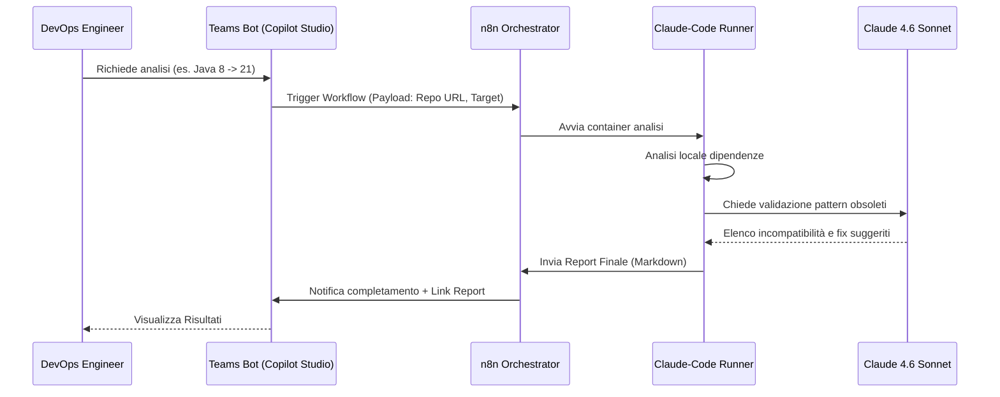

# Blueprint GenAI: Efficentamento del "Analisi Codice Sorgente per Obsolescenza Middleware/OS"

## 1. Descrizione del Caso d'Uso
**Categoria:** Assessment & Analysis
**Titolo:** Analisi Codice Sorgente per Obsolescenza Middleware/OS
**Ruolo:** DevOps Engineer
**Obiettivo Originale (da CSV):** Scansione profonda di repository applicativi (Java, .NET, ecc.) per individuare librerie, API o chiamate di sistema incompatibili con le nuove versioni target del sistema operativo o del middleware, producendo un report di remediation.
**Obiettivo GenAI:** Automatizzare l'analisi statica del codice (SAST-like) focalizzata sull'identificazione di pattern obsoleti, librerie deprecate e dipendenze incompatibili con i nuovi stack target, generando automaticamente un piano di migrazione/remediation.

## 2. Fasi del Processo Efficentato

### Fase 1: Ingestione e Definizione Target
L'utente carica il link al repository (o i file di configurazione dipendenze come `pom.xml`, `.csproj`, `package.json`) tramite un'interfaccia Teams e specifica la versione target del Middleware/OS (es. "Migrazione da Java 8 su RHEL 7 a Java 21 su RHEL 9").
*   **Tool Principale Consigliato:** Microsoft Teams (Chatbot UI) + n8n
*   **Alternative:** 1. Accenture Amethyst, 2. AI-Studio Google
*   **Modelli LLM Suggeriti:** OpenAI GPT-5.4
*   **Modalità di Utilizzo:** Un bot su Teams raccoglie i parametri della scansione. n8n riceve il trigger, clona il repository in un'area temporanea sicura (o legge da SharePoint) e prepara il contesto per l'analisi.
*   **Azione Umana Richiesta:** Definizione accurata delle versioni di destinazione.
*   **Stima Reale di Efficienza:** 
    *   *Tempo As-Is (Manuale):* 1 ora (raccolta info e setup ambiente)
    *   *Tempo To-Be (GenAI):* 5 minuti
    *   *Risparmio %:* 92%
    *   *Motivazione:* Eliminazione dei tempi di setup manuale e passaggio dati via mail.

### Fase 2: Deep Code Scan & Incompatibility Mapping
Scansione automatizzata dell'intera codebase per mappare chiamate a librerie non più supportate o API di sistema che cambiano comportamento nel nuovo OS.
*   **Tool Principale Consigliato:** claude-code
*   **Alternative:** 1. visualstudio + copilot, 2. OpenAI Codex
*   **Modelli LLM Suggeriti:** Anthropic Claude Sonnet 4.6
*   **Modalità di Utilizzo:** `claude-code` viene eseguito nel repository. Grazie alle sue capacità di analisi multi-file, identifica le interconnessioni tra le librerie e il codice custom. Viene fornito un file di "Context" che contiene le breaking changes note del middleware target.
    *   *Esempio Prompt/Command:*
    ```bash
    claude analyze --task "Trova tutte le dipendenze e chiamate API incompatibili con il passaggio da JBoss EAP 6.4 a Wildfly 30 e da RHEL 7 a RHEL 9. Produci un elenco puntato dei file impattati."
    ```
*   **Azione Umana Richiesta:** Revisione dei "falsi positivi" su librerie interne custom.
*   **Stima Reale di Efficienza:** 
    *   *Tempo As-Is (Manuale):* 16-24 ore (scansione manuale di migliaia di righe di codice)
    *   *Tempo To-Be (GenAI):* 30 minuti
    *   *Risparmio %:* 98%
    *   *Motivazione:* L'LLM "legge" e comprende il codice alla velocità della luce, identificando pattern complessi che i semplici `grep` ignorerebbero.

### Fase 3: Generazione Report di Remediation
Creazione di un documento dettagliato che non solo elenca i problemi, ma suggerisce il codice sostitutivo (code snippets) per risolvere le incompatibilità.
*   **Tool Principale Consigliato:** visualstudio + copilot
*   **Alternative:** 1. Accenture Amethyst (per il report executive), 2. Gemini-cli
*   **Modelli LLM Suggeriti:** Google Gemini 3 Deep Think
*   **Modalità di Utilizzo:** Utilizzo di Copilot in VS Code per applicare le patch suggerite o generare un file Markdown consolidato su SharePoint con la tabella di remediation.
*   **Azione Umana Richiesta:** Approvazione del piano di remediation e validazione dei suggerimenti di codice tramite test unitari.
*   **Stima Reale di Efficienza:** 
    *   *Tempo As-Is (Manuale):* 8 ore (scrittura report e ricerca soluzioni)
    *   *Tempo To-Be (GenAI):* 20 minuti
    *   *Risparmio %:* 95%
    *   *Motivazione:* Suggerimenti di codice pronti all'uso basati sulla documentazione ufficiale delle nuove versioni.

## 3. Descrizione del Flusso Logico
Il flusso è di tipo **Single-Agent** potenziato da strumenti CLI specializzati. Il DevOps Engineer interagisce con un bot su **Microsoft Teams** per avviare il processo. Un workflow su **n8n** orchestra l'attivazione di un runner che esegue **claude-code** direttamente sul codice sorgente (prelevato da Git o SharePoint). L'agente analizza i file, confrontandoli con una knowledge base aggiornata sulle obsolescenze middleware/OS fornita nel prompt di sistema. L'output finale è un report di remediation salvato su **SharePoint** e notificato via Teams, pronto per essere utilizzato all'interno di **Visual Studio Code** per l'applicazione delle modifiche.

## 4. Diagrammi UML (Mermaid.js)

### 4.1 Architecture Diagram


### 4.2 Process Diagram


### 4.3 Sequence Diagram


## 5. Guida all'Implementazione Tecnica
### Prerequisiti
- Licenza **Anthropic API** (per `claude-code`).
- Istanza **n8n** (self-hosted o cloud) con accesso alla rete dei repository.
- **Microsoft Teams** con accesso a Copilot Studio o abilitazione Webhook.
- Accesso a un repository **SharePoint** per l'archiviazione dei report.

### Step 1: Configurazione dell'Ambiente di Analisi (Runner)
1. Predisporre un container Docker o una VM "Runner" con installato `Node.js` e `claude-code` (`npm install -g @anthropic-ai/claude-code`).
2. Configurare la variabile d'ambiente `ANTHROPIC_API_KEY`.
3. Creare un file `system_instructions.md` che descriva le versioni target (es. le novità di RHEL 9 rispetto a RHEL 7).

### Step 2: Orchestrazione con n8n
1. Creare un webhook in n8n per ricevere il segnale da Teams.
2. Aggiungere un nodo "Execute Command" che:
   - Esegue `git clone` del repository.
   - Lancia `claude analyze --task "..."` puntando alla cartella del codice.
3. Aggiungere un nodo "SharePoint" per caricare l'output `.md` prodotto.

### Step 3: Interfaccia Teams
1. Utilizzare Copilot Studio per creare un bot semplice che chieda: "URL Repository" e "Stack di destinazione".
2. Configurare il bot per chiamare l'endpoint di n8n tramite un'azione (Power Automate o HTTP Request).

## 6. Rischi e Mitigazioni
- **Rischio: Codice Sensibile inviato all'LLM** -> **Mitigazione:** Utilizzare solo versioni "Enterprise" con clausole di zero-data retention (es. tramite AWS Bedrock o Google Vertex AI se si sceglie Gemini).
- **Rischio: Falsi Positivi su librerie proprietarie** -> **Mitigazione:** L'analisi di `claude-code` deve essere supervisionata dal DevOps Engineer; il report è una *guida*, non un'esecuzione automatica di commit.
- **Rischio: Complessità delle dipendenze transitive** -> **Mitigazione:** Fornire all'LLM l'albero completo delle dipendenze (es. output di `mvn dependency:tree`).
