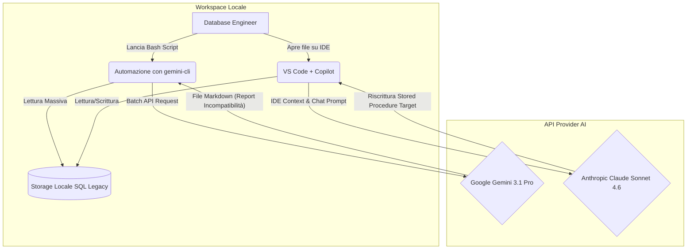
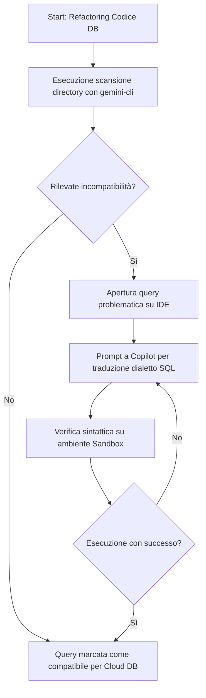
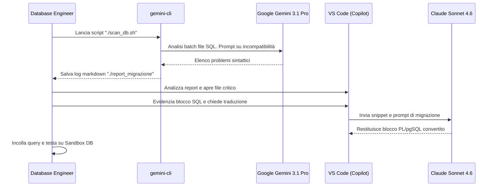

# Blueprint GenAI: Efficentamento del "Analisi Codice per Migrazione Database"

## 1. Descrizione del Caso d'Uso
**Categoria:** Assessment & Analysis
**Titolo:** Analisi Codice per Migrazione Database
**Ruolo:** Database Engineer
**Obiettivo Originale (da CSV):** Utilizzo di AI per analizzare il codice sorgente delle applicazioni e le stored procedure del database legacy per identificare costrutti SQL incompatibili con il database target in cloud (es. da Oracle a PostgreSQL), suggerendo le riscritture ottimali.
**Obiettivo GenAI:** Automatizzare l'individuazione di sintassi SQL e Stored Procedure incompatibili con il RDBMS target cloud, generando report dettagliati e proponendo la conversione esatta del codice. Non copre l'esecuzione materiale della migrazione dei dati.

## 2. Fasi del Processo Efficentato

### Fase 1: Scansione Massiva e Analisi Incompatibilità
Identificazione massiva delle porzioni di codice legacy (es. Oracle PL/SQL) che non sono compatibili nativamente con il nuovo database (es. PostgreSQL).
*   **Tool Principale Consigliato:** `gemini-cli`
*   **Alternative:** 1. `claude-code`, 2. `n8n`
*   **Modelli LLM Suggeriti:** Google Gemini 3.1 Pro
*   **Modalità di Utilizzo:** Script Bash che invoca la CLI passando ciclicamente i file SQL e interrogando il modello sui problemi di compatibilità.
    ```bash
    #!/bin/bash
    mkdir -p ./report_migrazione
    for file in ./sql_legacy/*.sql; do
      gemini-cli "Agisci come un esperto Database Engineer. Analizza il seguente codice legacy. Identifica funzioni o tipi di dato incompatibili con PostgreSQL 16 (target). Genera un report Markdown elencando la riga, il costrutto errato e la traduzione equivalente. Sii sintetico." --file "$file" > "./report_migrazione/$(basename "$file" .sql)_report.md"
    done
    ```
*   **Azione Umana Richiesta:** L'ingegnere deve revisionare i report generati per validare le incompatibilità bloccanti e identificare pattern di business logico complessi.
*   **Stima Reale di Efficienza:** 
    *   *Tempo As-Is (Manuale):* 4 ore (lettura manuale di centinaia di script e consultazione reference ufficiali)
    *   *Tempo To-Be (GenAI):* 10 minuti (esecuzione batch e revisione veloce)
    *   *Risparmio %:* 95%
    *   *Motivazione:* L'AI abbatte drasticamente i tempi morti dedicati alla ricerca testuale delle incompatibilità note, svolgendo il pattern matching contestuale in pochi secondi.

### Fase 2: Conversione e Generazione Codice Target
Riscrittura puntuale delle Stored Procedure, dei Trigger e delle View per renderle funzionanti sul database cloud target.
*   **Tool Principale Consigliato:** `visualstudio + copilot`
*   **Alternative:** 1. `claude-code`, 2. `OpenAI Codex`
*   **Modelli LLM Suggeriti:** Anthropic Claude Sonnet 4.6
*   **Modalità di Utilizzo:** Interazione in tempo reale tramite Copilot Chat direttamente nell'IDE dell'ingegnere.
    **Prompt Consigliato (in VS Code):**
    ```text
    Converti questa stored procedure Oracle PL/SQL nel dialetto PL/pgSQL per PostgreSQL 16.
    Assicurati di:
    1. Gestire correttamente la sintassi per cursori ed eccezioni.
    2. Sostituire funzioni proprietarie Oracle (es. SYSDATE, NVL) con equivalenti standard (es. CURRENT_TIMESTAMP, COALESCE).
    Restituisci solo il codice SQL pronto per l'esecuzione, senza spiegazioni aggiuntive.
    ```
*   **Azione Umana Richiesta:** Il Database Engineer deve inserire il codice tradotto in un ambiente Sandbox per eseguire la validazione funzionale e i test unitari sui dati.
*   **Stima Reale di Efficienza:** 
    *   *Tempo As-Is (Manuale):* 2 ore (per riscrittura e debug di una procedura complessa)
    *   *Tempo To-Be (GenAI):* 15 minuti (prompting, generazione e test)
    *   *Risparmio %:* 87%
    *   *Motivazione:* L'esperto non deve scrivere il dialetto target da zero, ma opera come revisore di un draft sintatticamente corretto all'origine.

## 3. Descrizione del Flusso Logico
Il flusso adotta un'architettura **Single-Agent** applicata in maniera iterativa. La scelta del Single-Agent è motivata dalla natura puramente "tecnica e traduttiva" del task, che non richiede orchestrazione di agenti con ruoli separati, massimizzando la semplicità implementativa. Inizialmente, lo sviluppatore avvia in locale uno script che sfrutta la `gemini-cli` per processare in blocco tutti i sorgenti del vecchio DB e produrre file Markdown di report. Ricevute queste evidenze, l'esperto umano adotta un approccio "Human-in-the-loop", intervenendo tramite IDE (Visual Studio Code). In questo contesto circoscritto, chiede l'aiuto di Copilot (con modello Claude Sonnet) per ottenere immediatamente la riscrittura del blocco SQL incompatibile, riducendo le possibilità di errore di battitura e standardizzando il formato in uscita verso PostgreSQL.

## 4. Diagrammi UML (Mermaid.js)

### 4.1 Architecture Diagram


### 4.2 Process Diagram


### 4.3 Sequence Diagram


## 5. Guida all'Implementazione Tecnica

### Prerequisiti
- **Licenze e Tool:** `gemini-cli` installato globalmente e configurato con credenziali valide; Visual Studio Code con estensione Copilot/Claude-code attiva (modello Claude Sonnet 4.6).
- **Codice:** Accesso in lettura alla cartella contenente i file sorgente (`.sql`, `.pkb`, `.pls`) dell'architettura legacy.
- **Ambiente di Test:** Disponibilità di un'istanza database di destinazione (es. PostgreSQL 16) popolata con dati di test.

### Step 1: Configurazione dello Script di Scansione
1. Aprire il terminale e posizionarsi alla radice del progetto dove risiedono i file legacy.
2. Assicurarsi che la CLI di Gemini sia autenticata testando un ping rapido (es. `gemini-cli "Ciao"`).
3. Creare lo script `scan_db.sh` copiando il codice fornito nella Fase 1. Modificare i path di input/output se l'alberatura locale lo richiede.
4. Concedere i permessi d'esecuzione allo script: `chmod +x scan_db.sh`.
5. Lanciare il batch job: `./scan_db.sh`. I risultati verranno popolati sequenzialmente nella cartella `./report_migrazione`.

### Step 2: Sessione di Traduzione via IDE
1. Aprire VS Code sulla directory root del progetto.
2. Controllare le evidenze nei file markdown per decidere a quali procedure o trigger dare la priorità.
3. Aprire il file SQL da tradurre, selezionare le righe indicate come incompatibili (o l'intera stored procedure se molto complessa).
4. Premere la scorciatoia per attivare la chat inline (es. `Cmd+I` su Mac o `Ctrl+I` su Windows).
5. Digitare il prompt suggerito nella Fase 2 adattandolo agli specifici linguaggi (es. T-SQL -> MySQL).
6. Applicare i cambiamenti (pulsante 'Apply' o 'Accept') per sovrascrivere o affiancare la funzione originale.
7. Effettuare la validazione umana avviando uno script di unit test connesso al database in Sandbox.

## 6. Rischi e Mitigazioni
- **Rischio 1: Alterazione della logica aziendale (Allucinazioni)**
  Il modello potrebbe interpretare male una logica matematica asimmetrica o la gestione dei lock transazionali del database legacy.
  *Mitigazione:* Validazione umana tassativa dei risultati; implementare test regressivi sui dati in uscita dalle stored procedure prima e dopo il refactoring.
- **Rischio 2: Ottimizzazione Subottimale delle Query**
  Una traduzione letterale 1:1 dei costrutti potrebbe essere sintatticamente valida ma non sfruttare gli engine di ottimizzazione del nuovo DB (es. table partitioning su PostgreSQL).
  *Mitigazione:* L'ingegnere deve sottoporre a `EXPLAIN PLAN` le nuove query per verificare i piani di esecuzione sui dataset di volume elevato.
- **Rischio 3: Privacy del Codice Sorgente**
  Passaggio di informazioni riservate sulle tabelle (es. regole di business, nomi cliente) a LLM non Enterprise.
  *Mitigazione:* Utilizzare versioni aziendali dei provider o oscurare tramite sanitizzazione le variabili sensibili prima dell'upload massivo, se non coperti da accordi Zero Data Retention.
