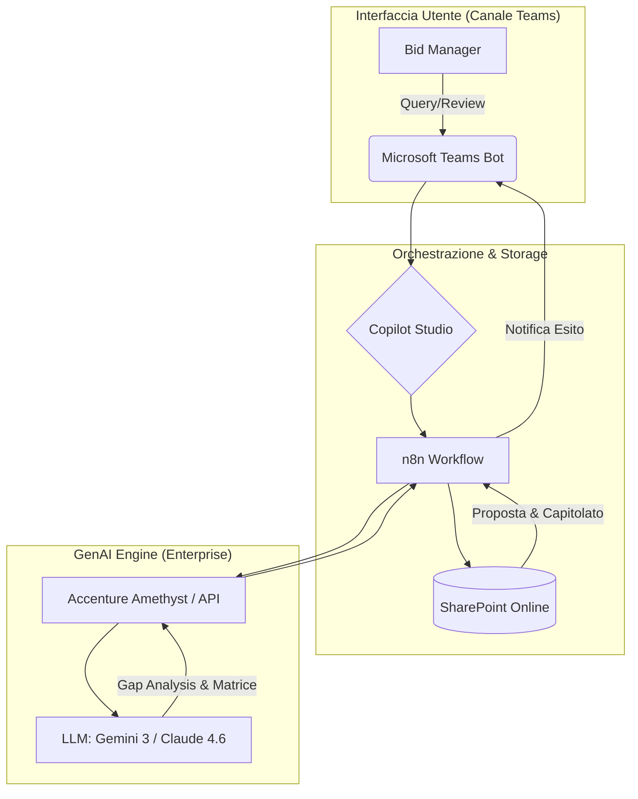
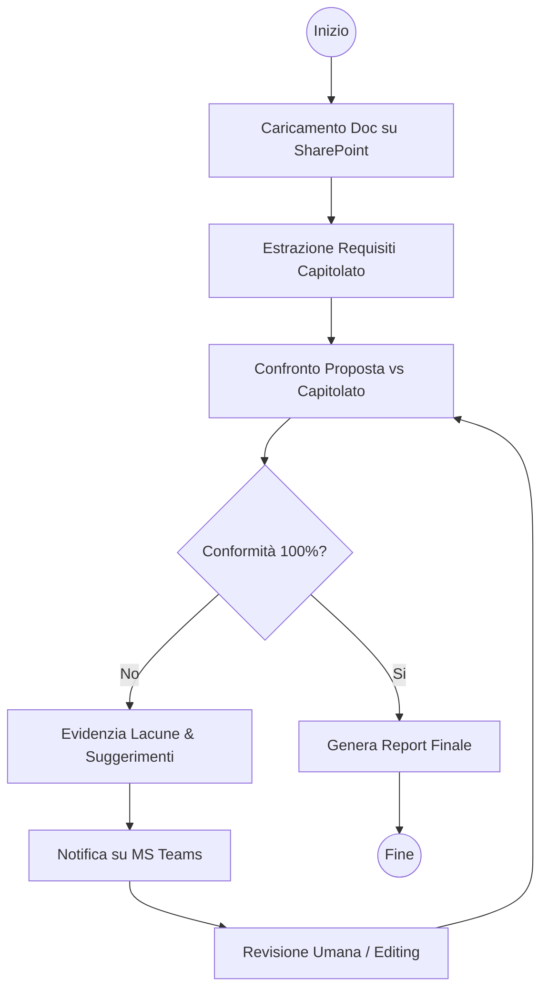
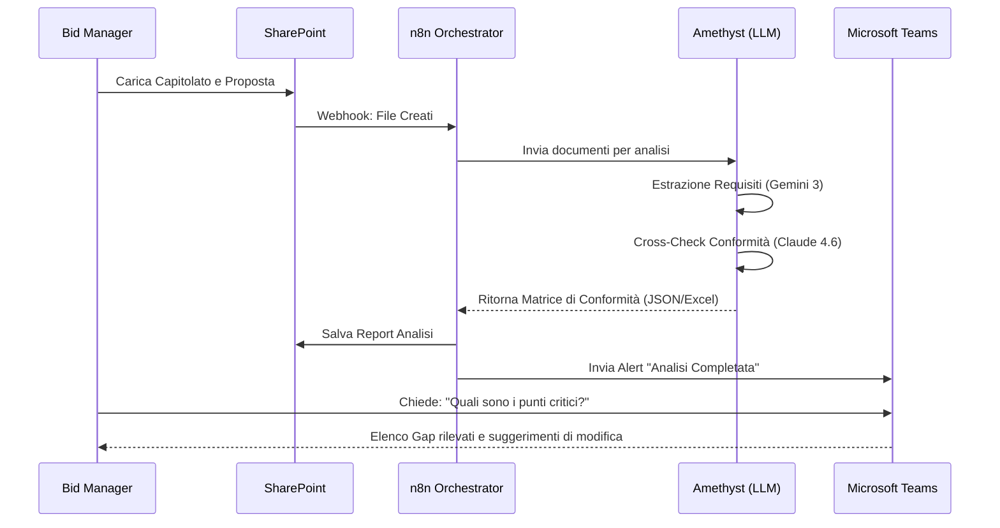

# Blueprint GenAI: Efficentamento del "Analisi Conformità Risposta a Gara Pubblica"

## 1. Descrizione del Caso d'Uso
**Categoria:** Bid Management & Tenders
**Titolo:** Analisi Conformità Risposta a Gara Pubblica
**Ruolo:** Bid Manager
**Obiettivo Originale (da CSV):** Analisi automatizzata della documentazione di risposta a bandi di gara pubblici. Confronto massivo tra la documentazione prodotta e i requisiti del capitolato tecnico per evidenziare lacune, non conformità o requisiti non indirizzati adeguatamente.
**Obiettivo GenAI:** Automatizzare il "Cross-Check" tra la Proposta Tecnica prodotta e il Capitolato Tecnico della gara, generando una matrice di conformità automatica che identifichi punti di debolezza, omissioni o risposte non aderenti ai criteri di valutazione.

## 2. Fasi del Processo Efficentato

### Fase 1: Ingestione e Parsing Requisiti (RAG Setup)
In questa fase, il sistema acquisisce il Capitolato Tecnico e la Proposta Tecnica da una cartella SharePoint dedicata. L'AI estrae i requisiti puntuali dal capitolato (es. clausole "must", "should", criteri premiali).
*   **Tool Principale Consigliato:** `n8n` (Orchestratore) + `accenture ametyst` (Analisi Documentale Sicura)
*   **Alternative:** 1. `claude-code` (per analisi strutturata), 2. `Microsoft Teams (Chatbot UI)`
*   **Modelli LLM Suggeriti:** Google Gemini 3 Deep Think (eccellente per il ragionamento logico su documenti lunghi)
*   **Modalità di Utilizzo:** Workflow n8n che monitora una cartella SharePoint. Al caricamento dei file, invia i documenti ad Amethyst tramite API per estrarre una lista strutturata (JSON) di tutti i requisiti tecnici rilevati nel capitolato.
*   **Azione Umana Richiesta:** Il Bid Manager verifica che la lista dei requisiti estratti sia completa prima di procedere al confronto.
*   **Stima Reale di Efficienza:** 
    *   *Tempo As-Is (Manuale):* 3 ore (lettura e mapping manuale)
    *   *Tempo To-Be (GenAI):* 10 minuti
    *   *Risparmio %:* 94%
    *   *Motivazione:* L'estrazione automatica elimina la necessità di leggere centinaia di pagine per isolare i singoli vincoli tecnici.

### Fase 2: Analisi di Conformità e Gap Analysis
L'AI confronta ogni requisito estratto dal capitolato con le sezioni corrispondenti della Proposta Tecnica. Per ogni punto, determina se il requisito è: Soddisfatto, Parzialmente Soddisfatto, o Non Soddisfatto.
*   **Tool Principale Consigliato:** `accenture ametyst`
*   **Alternative:** 1. `chatgpt agent`, 2. `OpenClaw` (per dati altamente sensibili)
*   **Modelli LLM Suggeriti:** Anthropic Claude 4.6 Sonnet (per l'alta precisione nel confronto testuale e assenza di allucinazioni)
*   **Modalità di Utilizzo:** Utilizzo di un System Prompt specifico che agisce come "Legal & Technical Auditor". 
    *   *Bozza Prompt:* "Agisci come un Auditor Senior di Gare Pubbliche. Confronta l'elenco dei requisiti del Capitolato (Input A) con la Proposta Tecnica (Input B). Per ogni requisito, scrivi: 1. Stato (Verde/Giallo/Rosso), 2. Riferimento pagina Proposta, 3. Giustificazione, 4. Suggerimento per migliorare la risposta se non conforme."
*   **Azione Umana Richiesta:** Validazione critica della Gap Analysis prodotta, focalizzandosi sui punti contrassegnati come "Rossi" o "Gialli".
*   **Stima Reale di Efficienza:** 
    *   *Tempo As-Is (Manuale):* 8 ore (confronto riga per riga)
    *   *Tempo To-Be (GenAI):* 20 minuti
    *   *Risparmio %:* 96%
    *   *Motivazione:* L'AI esegue il confronto semantico istantaneamente su migliaia di paragrafi, evidenziando solo le discrepanze.

### Fase 3: Reporting Interattivo su Microsoft Teams
I risultati della Gap Analysis vengono inviati al Bid Manager direttamente su Teams. Tramite un bot, l'utente può chiedere chiarimenti ("Perché il requisito 4.2 è considerato non conforme?") o richiedere una bozza di testo correttiva.
*   **Tool Principale Consigliato:** `copilot studio` + `Microsoft Teams (Chatbot UI)`
*   **Alternative:** 1. `n8n` (via Teams Webhook), 2. `ai-studio google` (per dashboard web)
*   **Modelli LLM Suggeriti:** OpenAI GPT-5.4 (per la fluidità conversazionale)
*   **Modalità di Utilizzo:** Configurazione di un Copilot in Teams che interroga il VectorDB (dove è stata salvata l'analisi della Fase 2). Il bot funge da assistente alla revisione finale.
*   **Azione Umana Richiesta:** Approvazione finale del report di conformità da allegare alla pratica di gara.
*   **Stima Reale di Efficienza:** 
    *   *Tempo As-Is (Manuale):* 2 ore (scrittura report e meeting di allineamento)
    *   *Tempo To-Be (GenAI):* 5 minuti
    *   *Risparmio %:* 95%
    *   *Motivazione:* L'interazione via chat sostituisce la stesura manuale di lunghe tabelle Excel di conformità.

## 3. Descrizione del Flusso Logico
Il flusso è progettato come un'architettura **Single-Agent** orchestrata da **n8n**. Il processo inizia quando il Bid Manager deposita i documenti su **SharePoint**. Un webhook attiva n8n, che invia i file a **Accenture Amethyst** (garantendo la privacy enterprise). Amethyst, utilizzando **Gemini 3**, estrae i requisiti e li confronta con la proposta. I risultati vengono salvati in un database (o file Excel su SharePoint) e una notifica viene inviata su **Microsoft Teams**. Attraverso **Copilot Studio**, il Bid Manager interagisce con l'esito dell'analisi per raffinare la proposta tecnica in tempo reale prima dell'invio ufficiale.

## 4. Diagrammi UML (Mermaid.js)

### 4.1 Architecture Diagram

### 4.2 Process Diagram

### 4.3 Sequence Diagram

## 5. Guida all'Implementazione Tecnica

### Prerequisiti
- Licenza **n8n** (self-hosted o cloud).
- Accesso ad **Accenture Amethyst** con API Key abilitata.
- Sottoscrizione **Microsoft 365** (SharePoint + Teams).
- Licenza **Copilot Studio**.

### Step 1: Configurazione n8n e SharePoint
1. Crea un workflow in n8n con un nodo "Microsoft SharePoint Trigger" configurato per monitorare la creazione di file in una specifica cartella di gara.
2. Aggiungi un nodo "HTTP Request" per inviare i file binari a Amethyst.

### Step 2: Definizione dei System Prompt in Amethyst
Configura due task distinti:
- **Task 1 (Parser):** "Analizza il capitolato allegato e crea una lista numerata di tutti i requisiti tecnici obbligatori (MUST) e opzionali (WANT)."
- **Task 2 (Auditor):** "Confronta la lista prodotta dal Task 1 con la Proposta Tecnica allegata. Crea una tabella con: ID Requisito, Testo Capitolato, Risposta Proposta, Valutazione (Conforme/Non Conforme/Parziale), Note Correttive."

### Step 3: Pubblicazione su Microsoft Teams
1. Apri **Copilot Studio** e crea un nuovo bot.
2. Collega il bot al workflow n8n (tramite un nodo "Power Automate" o direttamente via Webhook) per recuperare l'ultima Gap Analysis effettuata.
3. Pubblica il bot nel canale Teams utilizzato dal Bid Office.

## 6. Rischi e Mitigazioni
- **Rischio 1: Allucinazione normativa** -> L'AI potrebbe inventare requisiti non esistenti. **Mitigazione:** Obbligo di citazione della pagina e del paragrafo del capitolato per ogni gap rilevato.
- **Rischio 2: Confidenzialità dei dati** -> Invio di dati sensibili di gara a LLM pubblici. **Mitigazione:** Utilizzo esclusivo del gateway **Accenture Amethyst** che garantisce il non-addestramento dei modelli sui dati aziendali e il mascheramento dei PII.
- **Rischio 3: Complessità di layout** -> Difficoltà dell'AI nel leggere tabelle complesse nei PDF. **Mitigazione:** Pre-elaborazione dei PDF tramite tool di OCR avanzato integrati in Amethyst prima del passaggio all'LLM.
