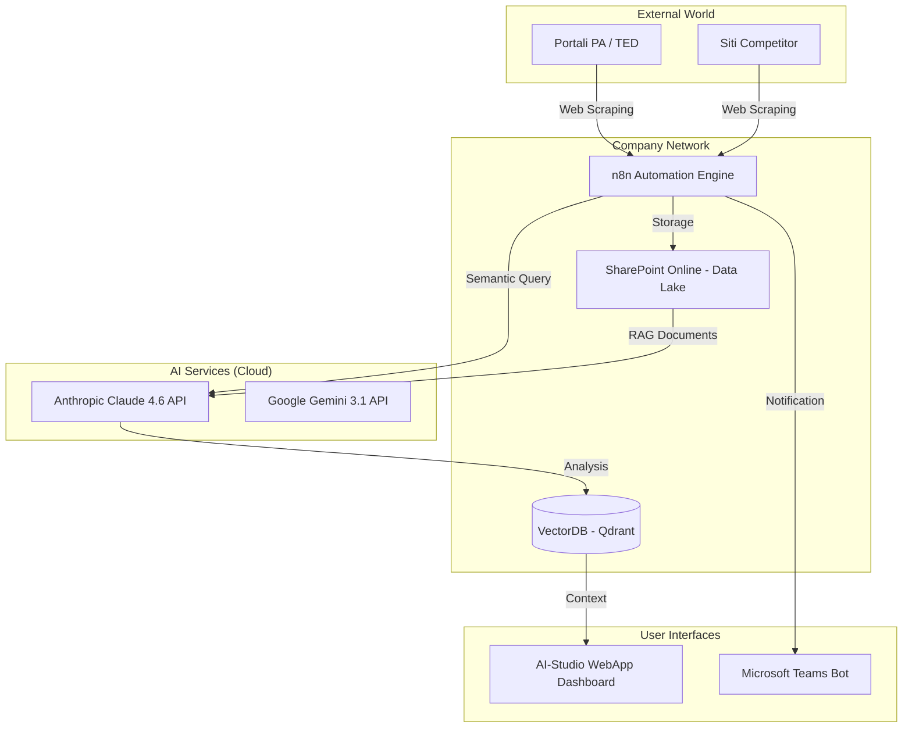
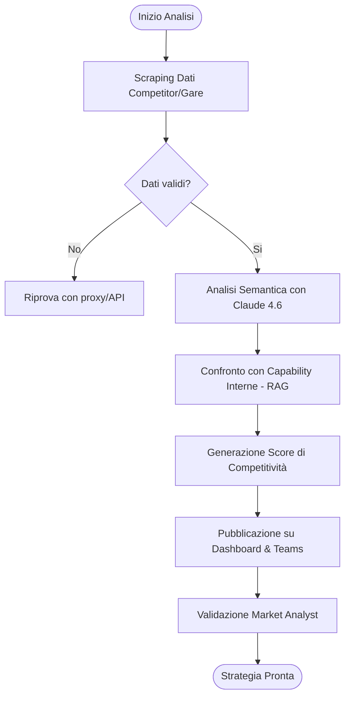
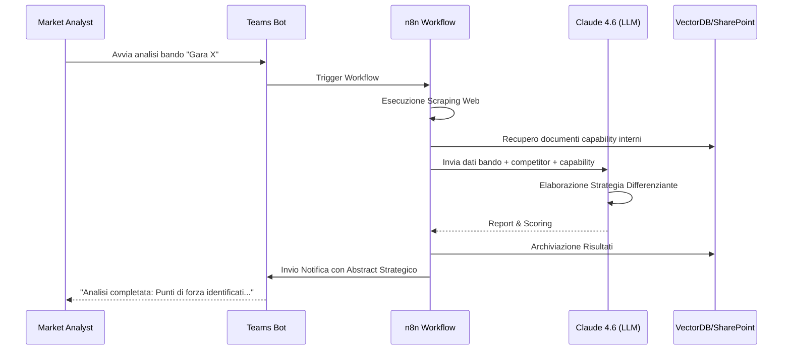

# Blueprint GenAI: Efficentamento del "Analisi Competitor e Web Scraping per Gare"

## 1. Descrizione del Caso d'Uso
**Categoria:** Bid Management & Tenders
**Titolo:** Analisi Competitor e Web Scraping per Gare
**Ruolo:** Market Analyst
**Obiettivo Originale (da CSV):** Esecuzione di scraping automatizzato su portali pubblici e siti web dei principali competitor per identificare soluzioni o risposte tecnologiche precedentemente pubblicate. Analisi semantica per stilare una classifica di competitività e suggerire strategie differenzianti.
**Obiettivo GenAI:** Automatizzare la raccolta di dati non strutturati dai portali di gara e dai siti competitor, trasformando le informazioni grezze in un'analisi comparativa strategica e suggerimenti di posizionamento tramite LLM.

## 2. Fasi del Processo Efficentato

### Fase 1: Scraping Intelligente e Ingestion
Automazione della raccolta dati dai portali pubblici (es. TED, Portali Regionali) e siti competitor predefiniti.
*   **Tool Principale Consigliato:** `n8n` (utilizzando nodi HTTP Request e HTML Extract, eventualmente integrati con API di scraping come ScrapingBee per bypassare blocchi).
*   **Alternative:** 1. `gemini-cli` (tramite script Python), 2. `Google Antigravity` (per orchestrazione complessa).
*   **Modelli LLM Suggeriti:** `Google Gemini 3 Deep Think` (eccellente per navigare strutture DOM complesse e identificare dati rilevanti).
*   **Modalità di Utilizzo:** Configurazione di un workflow n8n che esegue lo scraping periodico. I dati estratti vengono passati all'LLM per una prima pulizia (data cleaning) e salvati su uno **SharePoint** aziendale in formato JSON/Markdown.
*   **Azione Umana Richiesta:** Definizione dell'elenco degli URL target e validazione periodica delle fonti.
*   **Stima Reale di Efficienza:** 
    *   *Tempo As-Is (Manuale):* 16 ore (navigazione manuale, copia-incolla, lettura bandi).
    *   *Tempo To-Be (GenAI):* 30 minuti (esecuzione automatica e check rapido).
    *   *Risparmio %:* 97%
    *   *Motivazione:* L'automazione elimina la ricerca manuale e la lettura preliminare per capire se un bando è pertinente.

### Fase 2: Analisi Semantica e Scoring Competitivo
Confronto tra le capacità interne e le soluzioni identificate dai competitor per generare una "Competitiveness Matrix".
*   **Tool Principale Consigliato:** `accenture amethyst` (per garantire la massima sicurezza nell'analisi di dati sensibili di gara).
*   **Alternative:** 1. `claude-code` (per analisi documentale massiva), 2. `ChatGPT Agent` (Custom GPT).
*   **Modelli LLM Suggeriti:** `Anthropic Claude Opus 4.6` (per la precisione superiore nell'analisi semantica e nel ragionamento deduttivo).
*   **Modalità di Utilizzo:** Creazione di un Agente con un System Prompt specifico che riceve in input i dati dello scraping e i documenti di "Capability" aziendali (da SharePoint via RAG). 
    *   *Esempio Prompt:* "Analizza i documenti allegati relativi alle risposte tecniche dei competitor X e Y. Confrontali con la nostra offerta standard. Identifica 3 punti di debolezza dei competitor e suggerisci una strategia di differenziazione basata sull'innovazione infrastrutturale."
*   **Azione Umana Richiesta:** Revisione critica dei punti di forza/debolezza identificati.
*   **Stima Reale di Efficienza:** 
    *   *Tempo As-Is (Manuale):* 8 ore (confronto incrociato tra più documenti).
    *   *Tempo To-Be (GenAI):* 10 minuti.
    *   *Risparmio %:* 98%
    *   *Motivazione:* L'LLM processa migliaia di pagine in pochi secondi evidenziando pattern invisibili all'occhio umano.

### Fase 3: Dashboarding e Strategy Delivery
Visualizzazione dei risultati e suggerimenti strategici tramite un'interfaccia semplice.
*   **Tool Principale Consigliato:** `ai-studio google` (per la generazione rapida di una WebApp/Dashboard FE in React/Next.js che visualizza la classifica).
*   **Alternative:** 1. `Microsoft Teams (Chatbot UI)` (per notifiche e report sintetici), 2. `Copilot Studio`.
*   **Modelli LLM Suggeriti:** `Google Gemini 3.1 Pro`.
*   **Modalità di Utilizzo:** Utilizzo della funzione "Build" di AI-Studio per creare una dashboard che legge i dati analizzati da un **VectorDB (Qdrant)** e mostra grafici di competitività e suggerimenti di "Win Themes" per la prossima gara.
*   **Azione Umana Richiesta:** Utilizzo della dashboard per la decisione finale sul "Go/No-Go" per la gara.
*   **Stima Reale di Efficienza:** 
    *   *Tempo As-Is (Manuale):* 4 ore (creazione presentazioni PPT per il management).
    *   *Tempo To-Be (GenAI):* Tempo reale (aggiornamento automatico della dashboard).
    *   *Risparmio %:* 100% (sul reporting ricorsivo).
    *   *Motivazione:* Reportistica self-service sempre aggiornata.

## 3. Descrizione del Flusso Logico
Il flusso è orchestrato come un sistema **Single-Agent** gestito centralmente da **n8n**. 
1. Il workflow si attiva (trigger temporale o manuale da Teams).
2. n8n richiama i siti target, estrae il testo e lo invia a Claude 4.6 per l'analisi.
3. L'analisi viene arricchita con dati interni prelevati da **SharePoint** (tramite Model Context Protocol - MCP per accedere ai file).
4. Il risultato viene salvato e visualizzato sulla WebApp generata da AI-Studio.
5. Un bot su **Microsoft Teams** notifica il Market Analyst con un abstract della strategia consigliata.

## 4. Diagrammi UML (Mermaid.js)

### 4.1 Application & System Architecture Schematic


### 4.2 Process Diagram


### 4.3 Sequence Diagram


## 5. Guida all'Implementazione Tecnica
### Prerequisiti
- Account **n8n** (Cloud o Self-hosted).
- API Key per **Anthropic Claude 4.6** e **Google Gemini 3.1**.
- Accesso a **Microsoft Teams** con permessi per creare bot (via Copilot Studio).
- Licenza **AI-Studio** per la parte dashboard.

### Step 1: Configurazione Workflow n8n
1. Crea un nuovo workflow.
2. Usa il nodo `HTTP Request` per interrogare i portali di gara (o usa un servizio come *ScrapingBee* per gestire il rendering JS).
3. Inserisci un nodo `HTML Extract` per isolare i campi: Titolo Gara, Descrizione Tecnica, Scadenza, Criteri di Aggiudicazione.
4. Connetti un nodo `AI Agent` di n8n che punti a Claude 4.6.

### Step 2: System Prompt per l'Agente Analista
Configura l'LLM con il seguente System Prompt:
```markdown
# Ruolo
Sei un esperto Market Analyst specializzato in gare d'appalto IT Infrastructure.
# Compito
Confronta le specifiche tecniche del bando fornito con le soluzioni dei competitor estratti. 
# Output
Genera una tabella con: Competitor, Soluzione Proposta (dedotta), Punti di Debolezza, Strategia Consigliata per noi.
```

### Step 3: Distribuzione su Teams
1. Apri **Copilot Studio**.
2. Crea un bot che riceve in input l'URL di un bando.
3. Configura un'azione "Power Automate" o un webhook verso il workflow n8n creato nello Step 1.
4. Pubblica il bot sul canale del team "Bid Management".

## 6. Rischi e Mitigazioni
- **Rischio 1: Cambiamento struttura siti (Scraping break):** -> **Mitigazione:** Utilizzo di LLM per il parsing dinamico dei contenuti invece di selettori CSS statici rigidi.
- **Rischio 2: Informazioni obsolete dei competitor:** -> **Mitigazione:** Inserimento di un "Confidence Score" basato sulla data dell'ultima pubblicazione trovata.
- **Rischio 3: Privacy Dati Gara:** -> **Mitigazione:** Utilizzo di istanze Enterprise (Amethyst) che garantiscono che i dati inseriti non vengano usati per il training dei modelli pubblici.
