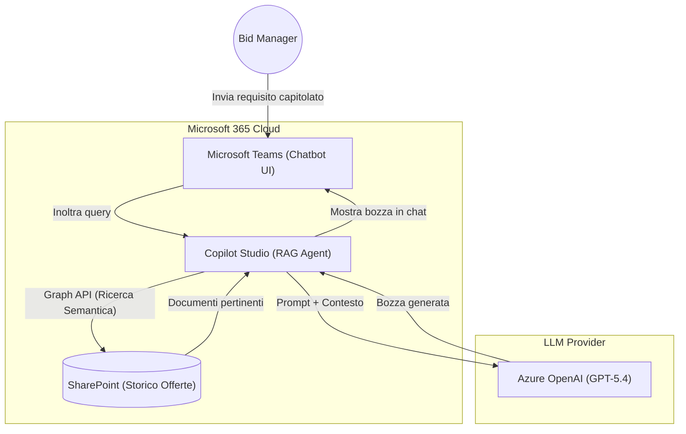
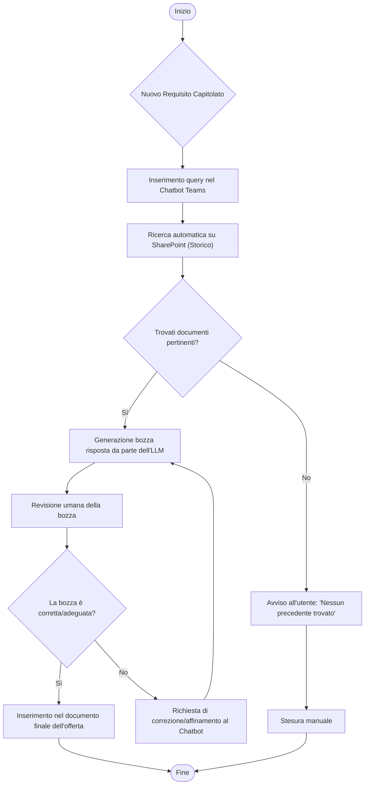
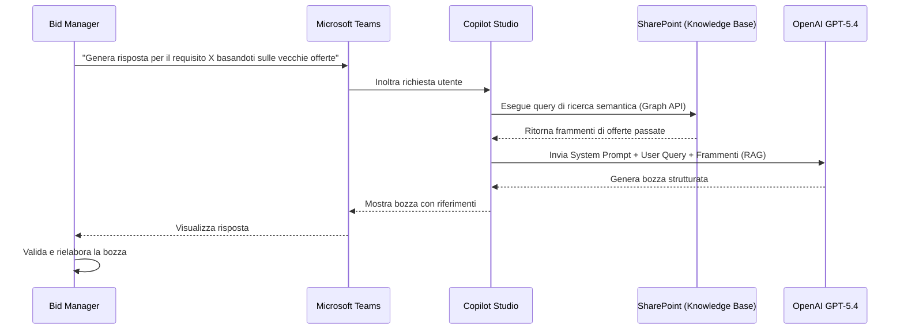

# Blueprint GenAI: Efficentamento dell'"Automazione Generazione Risposte a Gare"

## 1. Descrizione del Caso d'Uso
**Categoria:** Bid Management & Tenders
**Titolo:** Automazione Generazione Risposte a Gare
**Ruolo:** Bid Manager
**Obiettivo Originale (da CSV):** Sviluppo di una pipeline RAG che, interrogando uno storico di offerte vincenti aziendali (SharePoint/VectorDB), genera automaticamente le prime bozze dei paragrafi tecnici per la risposta a nuovi capitolati, mantenendo la coerenza stilistica e tecnica.
**Obiettivo GenAI:** Automatizzare la ricerca delle informazioni nello storico delle offerte vincenti su SharePoint e la generazione di bozze di testo tecnico coerenti per la stesura di risposte a nuove gare d'appalto.

## 2. Fasi del Processo Efficentato

### Fase 1: Ingestion e Ricerca Documentale (Knowledge Base)
L'utente carica il paragrafo del nuovo capitolato o la richiesta specifica nel bot. Il sistema interroga automaticamente la cartella SharePoint aziendale contenente lo storico delle offerte vincenti tramite funzionalità nativa di ricerca semantica.
*   **Tool Principale Consigliato:** `copilot studio` (connesso nativamente a SharePoint)
*   **Alternative:** 1. `accenture ametyst`, 2. `n8n` (con VectorDB Qdrant)
*   **Modelli LLM Suggeriti:** OpenAI GPT-5.4 (Azure OpenAI integrato in Copilot)
*   **Modalità di Utilizzo:** Il Bid Manager utilizza il Chatbot su Teams. Non è necessario sviluppare un VectorDB esterno se si sfruttano le "Generative Answers" di Copilot Studio puntate direttamente sul sito SharePoint (tramite Graph API).
    *Prompt di sistema per il Bot:*
    ```text
    Sei un Bid Manager AI Assistant. Il tuo compito è generare la prima bozza per la risposta a un capitolato tecnico.
    Cerca esclusivamente nei documenti caricati nello SharePoint aziendale (storico offerte vincenti).
    Mantieni il tono formale, tecnico e persuasivo tipico delle offerte.
    Usa la query dell'utente per trovare i paragrafi pertinenti e uniscili per formare una risposta coerente alla nuova richiesta.
    Cita sempre il nome del documento originale da cui hai estratto le informazioni.
    ```
*   **Azione Umana Richiesta:** Il Bid Manager formula la richiesta inserendo il testo del capitolato da soddisfare.
*   **Stima Reale di Efficienza:** 
    *   *Tempo As-Is (Manuale):* 4 ore (ricerca manuale nei vecchi file word e copia/incolla/riadattamento)
    *   *Tempo To-Be (GenAI):* 10 minuti (generazione automatica basata sui documenti trovati)
    *   *Risparmio %:* 95%
    *   *Motivazione:* L'AI recupera in pochi secondi il contesto dalle vecchie offerte e redige istantaneamente una bozza coerente, eliminando il tempo di ricerca manuale nelle cartelle di rete.

### Fase 2: Generazione e Revisione della Bozza
Il chatbot restituisce la bozza di risposta direttamente nella chat di Teams. Il Bid Manager la copia, la revisiona e la inserisce nel documento finale dell'offerta.
*   **Tool Principale Consigliato:** `Microsoft Teams (Chatbot UI)`
*   **Alternative:** Nessuna (interfaccia utente finale).
*   **Modelli LLM Suggeriti:** OpenAI GPT-5.4
*   **Modalità di Utilizzo:** L'interazione avviene in linguaggio naturale. L'utente può chiedere affinamenti ("Rendilo più conciso", "Aggiungi enfasi sulla sicurezza").
*   **Azione Umana Richiesta:** Il Bid Manager DEVE rileggere criticamente la bozza, verificare l'applicabilità delle soluzioni storiche al nuovo contesto e correggere eventuali incongruenze tecniche prima dell'uso ufficiale.
*   **Stima Reale di Efficienza:** 
    *   *Tempo As-Is (Manuale):* 2 ore (scrittura da zero o pesante rielaborazione)
    *   *Tempo To-Be (GenAI):* 20 minuti (sola revisione e affinamento)
    *   *Risparmio %:* 83%
    *   *Motivazione:* Il punto di partenza non è più un foglio bianco, ma un testo già strutturato e stilisticamente adeguato all'azienda.

## 3. Descrizione del Flusso Logico
Il processo segue un approccio **Single-Agent** per la massima semplicità, orchestrato direttamente tramite Microsoft Copilot Studio. Il Bid Manager interagisce con un Chatbot all'interno di Microsoft Teams. Quando l'utente inserisce la richiesta (es. il requisito di un nuovo capitolato), il Copilot interroga nativamente lo SharePoint aziendale (che funge da Knowledge Base per le offerte passate). Il modello LLM recupera i paragrafi pertinenti, sintetizza le informazioni e genera una nuova bozza di risposta coerente con lo stile aziendale, restituendola in chat. L'umano esegue il refinement iterativo ("Human-in-the-loop") interagendo col bot, valida il contenuto tecnico e infine lo copia nel documento di risposta ufficiale. L'uso del Single-Agent è ideale poiché l'attività è mirata al recupero e rielaborazione di testi in un unico dominio di conoscenza.

## 4. Diagrammi UML (Mermaid.js)

### 4.1 Architecture Diagram


### 4.2 Process Diagram


### 4.3 Sequence Diagram


## 5. Guida all'Implementazione Tecnica
### Prerequisiti
- Licenza Microsoft 365 Copilot o Copilot Studio.
- Una directory SharePoint o un Sito di Comunicazione contenente l'archivio ben organizzato delle offerte tecniche vincenti passate (preferibilmente in formato Word/PDF).
- Permessi di accesso alla directory SharePoint per il creatore del bot e per gli utenti finali (Bid Managers).

### Step 1: Creazione del Bot in Copilot Studio
1. Accedere a Copilot Studio (copilotstudio.microsoft.com).
2. Selezionare "Crea un copilota", assegnargli un nome (es. "Bid Assistant") e impostare la lingua principale su Italiano.

### Step 2: Configurazione del "Generative Answers" (RAG su SharePoint)
1. Nel menu del Copilot, andare sulla sezione dedicata alla Conoscenza (Knowledge) o "Generative AI".
2. Cliccare su "Aggiungi sito web" o "Aggiungi origine SharePoint".
3. Inserire l'URL esatto del sito SharePoint aziendale o della Document Library contenente le vecchie offerte.
4. Assicurarsi che l'opzione per l'uso dell'IA generativa sia attivata per rispondere dinamicamente alle query basandosi su questa origine dati.

### Step 3: Definizione del System Prompt
1. All'interno delle impostazioni di generazione dell'IA di Copilot Studio, localizzare l'area per le istruzioni personalizzate del bot.
2. Inserire le istruzioni di comportamento: *"Sei un assistente per Bid Manager. Rispondi alle domande basandoti ESCLUSIVAMENTE sui documenti di SharePoint. Formula le risposte in tono professionale, tecnico e persuasivo, tipico delle proposte commerciali. Cita sempre la fonte."*

### Step 4: Integrazione Canale Teams
1. Andare nella sezione "Pubblica" (Publish) nel menu laterale e cliccare su "Pubblica".
2. Andare nella sezione "Canali" (Channels) e selezionare "Microsoft Teams".
3. Cliccare su "Attiva su Teams" e poi su "Apri il bot" per testarlo.
4. Richiedere l'approvazione dell'amministratore Teams per distribuire l'app a tutto il gruppo dei Bid Manager.

## 6. Rischi e Mitigazioni
- **Rischio 1:** Allucinazioni tecniche o inserimento di tecnologie obsolete presenti nei vecchi documenti. -> **Mitigazione:** La fase di revisione ("Human-in-the-loop") da parte del Bid Manager è obbligatoria. L'AI funge da generatore di bozze, non da decisore finale.
- **Rischio 2:** Il bot genera risposte basate su offerte perdenti o incomplete. -> **Mitigazione:** Segregare i documenti su SharePoint: collegare il bot SOLO a una specifica Document Library verificata, contenente esclusivamente offerte "Vincitrici" e aggiornate.
- **Rischio 3:** Accesso a dati sensibili o commerciali non destinati a tutti gli utenti. -> **Mitigazione:** Copilot Studio rispetta nativamente i permessi di Microsoft Graph. Il bot restituirà informazioni solo in base ai documenti a cui l'utente loggato su Teams ha già accesso su SharePoint. Garantire che le policy IAM di SharePoint siano rigide.