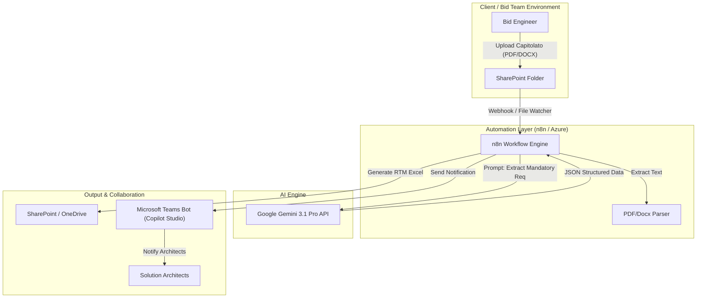
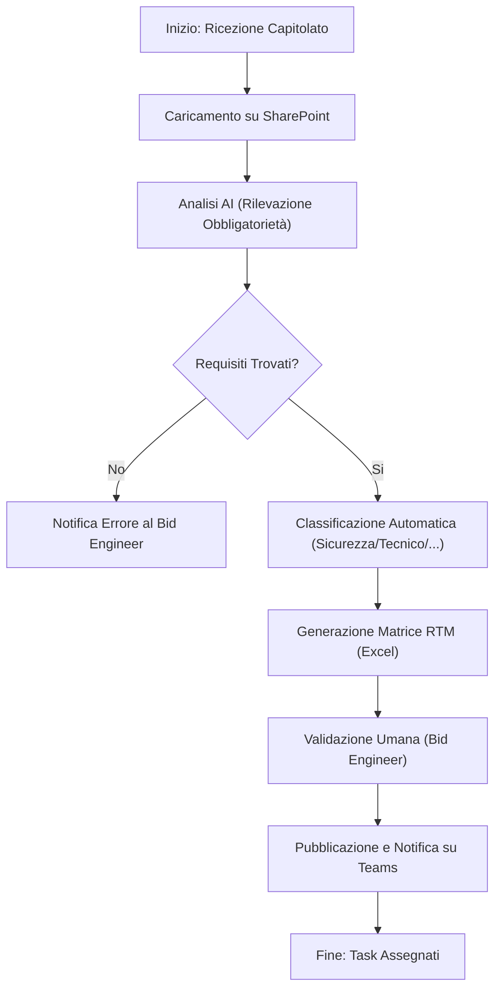
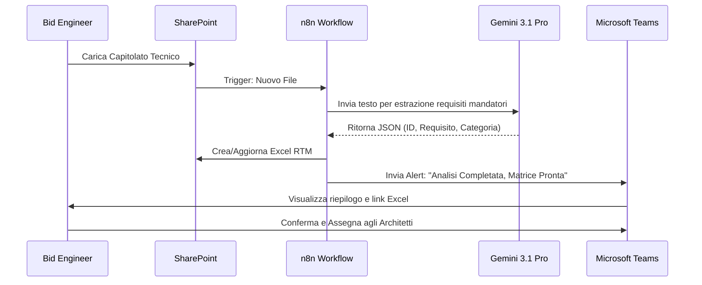

# Blueprint GenAI: Efficentamento del "Analisi Requisiti Capitolato Tecnico (SAC/Consip)"

## 1. Descrizione del Caso d'Uso
**Categoria:** Bid Management & Tenders
**Titolo:** Analisi Requisiti Capitolato Tecnico (SAC/Consip)
**Ruolo:** Bid Engineer
**Obiettivo Originale (da CSV):** Estrazione automatica e classificazione dei requisiti mandatori (tecnici, di sicurezza, di compliance) dai capitolati tecnici di gare pubbliche o Accordi Quadro (es. SPC/SAC Consip), generando una matrice di tracciabilità (Requirements Traceability Matrix) da assegnare agli architetti.
**Obiettivo GenAI:** Automatizzare il parsing di documenti di gara complessi (centinaia di pagine) per estrarre, classificare e formattare i requisiti mandatori in una matrice Excel strutturata, riducendo drasticamente il tempo di lettura manuale e il rischio di sviste.

## 2. Fasi del Processo Efficentato

### Fase 1: Ingestion e Ingegneria dei Requisiti
In questa fase, il documento (PDF/DOCX) viene caricato nel sistema. L'AI analizza il testo per identificare le clausole che indicano obbligatorietà.
*   **Tool Principale Consigliato:** `accenture ametyst`
*   **Alternative:** 1. `n8n` (con nodo PDF Parser), 2. `gemini-cli`
*   **Modelli LLM Suggeriti:** Google Gemini 3.1 Pro (per l'ampia context window necessaria a leggere interi capitolati).
*   **Modalità di Utilizzo:** Caricamento del capitolato su Amethyst o via Webhook n8n. Utilizzo di un System Prompt specifico per l'identificazione di keyword mandatorie ("deve", "obbligatorio", "pena esclusione", "requisito minimo").
*   **Azione Umana Richiesta:** Il Bid Engineer verifica che il perimetro dei documenti caricati sia completo.
*   **Stima Reale di Efficienza:** 
    *   *Tempo As-Is (Manuale):* 6-8 ore (per capitolati complessi).
    *   *Tempo To-Be (GenAI):* 10 minuti.
    *   *Risparmio %:* 98%
    *   *Motivazione:* L'AI esegue una scansione semantica istantanea, eliminando la necessità di lettura riga per riga per trovare i vincoli.

### Fase 2: Classificazione e Generazione RTM
L'AI classifica i requisiti estratti in categorie (Sicurezza, Performance, Compliance, Prezzo) e genera la Requirements Traceability Matrix (RTM).
*   **Tool Principale Consigliato:** `gemini-cli`
*   **Alternative:** 1. `n8n`, 2. `ChatGPT Agent`
*   **Modelli LLM Suggeriti:** Google Gemini 3 Deep Think (per la capacità di categorizzazione logica).
*   **Modalità di Utilizzo:** Scripting via `gemini-cli` per trasformare l'output JSON dell'estrazione in un file CSV/Excel formattato.
    *   *Esempio Prompt:* "Analizza i seguenti frammenti di testo estratti dal capitolato. Per ogni requisito mandatorio, crea una riga con: ID_Requisito, Categoria (Tecnico/Sicurezza/Compliance), Descrizione Requisito, Livello di Criticità (Alto/Medio), e una colonna vuota 'Assegnatario'."
*   **Azione Umana Richiesta:** Revisione della classificazione automatica per correggere eventuali falsi positivi.
*   **Stima Reale di Efficienza:** 
    *   *Tempo As-Is (Manuale):* 4 ore.
    *   *Tempo To-Be (GenAI):* 5 minuti.
    *   *Risparmio %:* 97%
    *   *Motivazione:* La formattazione automatica in tabella pronta all'uso sostituisce il copia-incolla manuale.

### Fase 3: Distribuzione e Task Assignment via Teams
La matrice generata viene pubblicata su SharePoint e notificata agli architetti competenti tramite Teams.
*   **Tool Principale Consigliato:** `Microsoft Teams (Chatbot UI)` tramite `Copilot Studio`
*   **Alternative:** 1. `n8n` (Adaptive Cards), 2. `Power Automate`
*   **Modelli LLM Suggeriti:** OpenAI GPT-5.4 (per la gestione dell'interazione conversazionale).
*   **Modalità di Utilizzo:** Un bot su Teams notifica il team tecnico dell'avvenuta analisi, fornisce il link alla RTM su SharePoint e permette di assegnare i singoli pacchetti di requisiti tramite comando chat.
*   **Azione Umana Richiesta:** Il Bid Engineer assegna i pacchetti di requisiti agli architetti specifici.
*   **Stima Reale di Efficienza:** 
    *   *Tempo As-Is (Manuale):* 1 ora (email, messaggi, follow-up).
    *   *Tempo To-Be (GenAI):* 2 minuti.
    *   *Risparmio %:* 96%
    *   *Motivazione:* Centralizzazione della comunicazione e accesso immediato al dato strutturato.

## 3. Descrizione del Flusso Logico
Il flusso è di tipo **Single-Agent** orchestrato da un workflow **n8n**. Il Bid Engineer carica il capitolato su una cartella SharePoint monitorata. Il workflow n8n intercetta il file, lo invia alle API di **Gemini 3.1 Pro** con un prompt di estrazione strutturata (JSON). Una volta ottenuti i requisiti, un secondo passaggio di raffinamento classifica i dati. Infine, n8n aggiorna un file Excel master su SharePoint e invia una notifica su **Microsoft Teams** tramite un bot di **Copilot Studio**, permettendo al Bid Engineer di validare e procedere all'assegnazione dei task agli architetti.

## 4. Diagrammi UML (Mermaid.js)

### 4.1 Architecture Diagram

### 4.2 Process Diagram

### 4.3 Sequence Diagram

## 5. Guida all'Implementazione Tecnica

### Prerequisiti
- Accesso a **n8n** (Cloud o Self-hosted).
- API Key per **Google Gemini API** (Vertex AI o AI Studio).
- Licenza **Microsoft 365** con accesso a SharePoint e Teams.
- Licenza **Copilot Studio** (per il bot di interfaccia).

### Step 1: Configurazione Workflow n8n
1.  Crea un workflow con un nodo "SharePoint Trigger" che monitora una cartella specifica.
2.  Aggiungi un nodo "Binary to Text" per estrarre il contenuto dei file PDF/DOCX.
3.  Inserisci un nodo "AI Agent" o "HTTP Request" verso le API Gemini.
    - **System Prompt:** "Sei un esperto Bid Manager specializzato in gare Consip. Analizza il capitolato fornito. Estrai solo i requisiti mandatori (specificati da termini come 'obbligatorio', 'deve', 'pena esclusione'). Restituisci un array JSON con i campi: id, testo_originale, categoria, criticità."

### Step 2: Generazione Matrice RTM
1.  Usa il nodo "Spreadsheet File" in n8n per scrivere i dati ricevuti da Gemini in un file Excel.
2.  Salva il file in una cartella SharePoint dedicata al progetto di gara.

### Step 3: Integrazione Teams (Chatbot)
1.  In **Copilot Studio**, crea un bot che interroga il workflow n8n.
2.  Configura un'azione che permetta al bot di inviare un messaggio nel canale "Bid Management" non appena l'Excel è pronto.
3.  Il messaggio deve contenere un link diretto al file e un pulsante "Approva e Notifica Architetti".

## 6. Rischi e Mitigazioni
- **Rischio 1: Allucinazione (omissione di un requisito critico):** -> **Mitigazione:** Il prompt richiede all'AI di includere il riferimento al numero di pagina/paragrafo originale per una verifica rapida (Human-in-the-loop).
- **Rischio 2: Documenti scansionati male (OCR):** -> **Mitigazione:** Utilizzare la funzione "Vision" di Gemini 3.1 Pro se il PDF è un'immagine per garantire un'estrazione testuale accurata.
- **Rischio 3: Privacy Dati:** -> **Mitigazione:** Utilizzare istanze Enterprise di Gemini via Vertex AI (Google Cloud) per garantire che i dati del capitolato non vengano usati per il training pubblico dei modelli.
