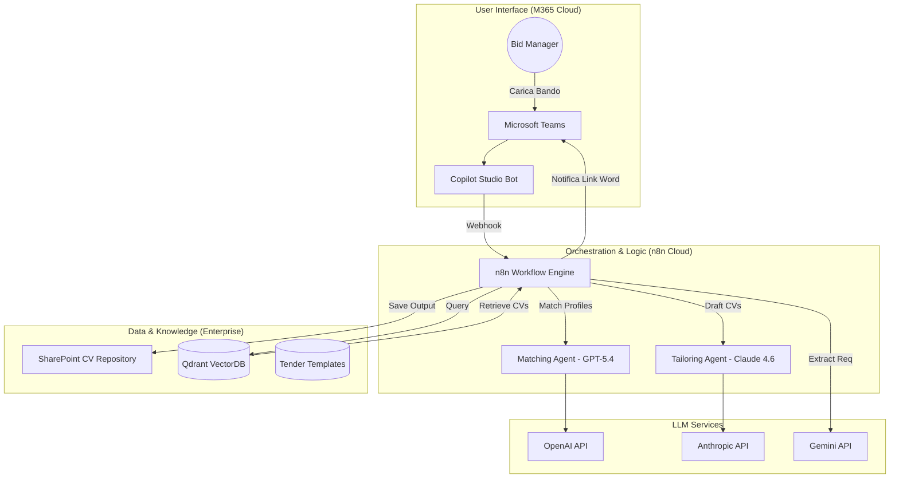
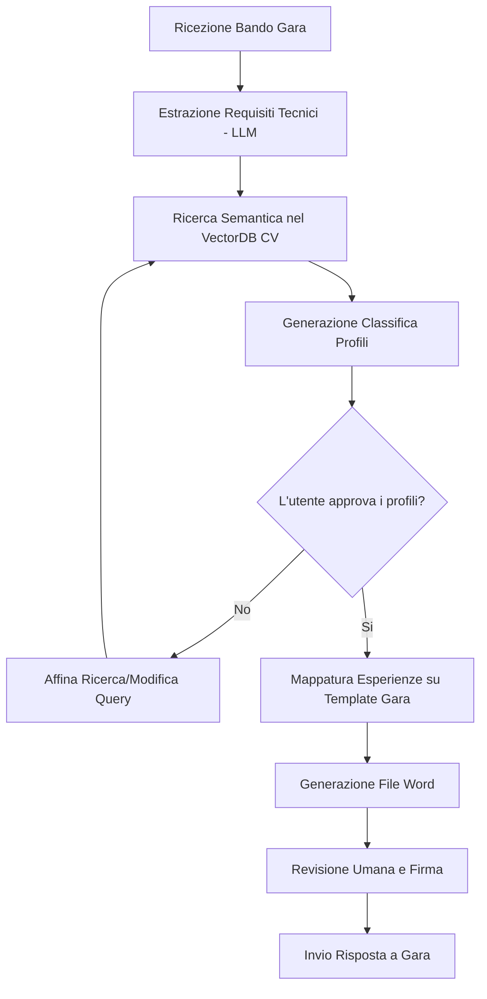
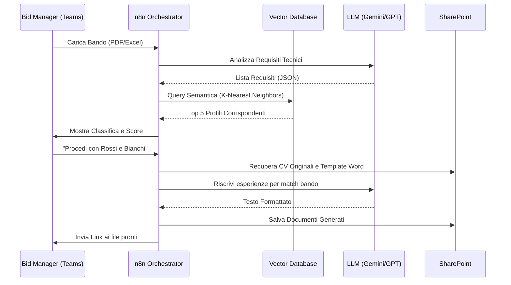

# Blueprint GenAI: Efficentamento della "Generazione CV e Matrice Competenze"

## 1. Descrizione del Caso d'Uso
**Categoria:** Bid Management & Tenders  
**Titolo:** Generazione CV e Matrice Competenze  
**Ruolo:** Bid Manager  
**Obiettivo Originale (da CSV):** Analisi automatica del database aziendale dei CV per individuare i profili T&A più aderenti ai requisiti stringenti di una gara pubblica o Accordo Quadro, impaginando automaticamente i CV nel formato richiesto dal bando.  
**Obiettivo GenAI:** Automatizzare il matching semantico tra i requisiti tecnici di un bando di gara e il database dei CV aziendali, producendo una classifica di adeguatezza e generando i file CV pre-compilati nel template specifico richiesto (Word/PDF).

## 2. Fasi del Processo Efficentato

### Fase 1: Ingestione e Indicizzazione Semantica (RAG)
In questa fase, il database dei CV esistenti (solitamente in formato PDF o DOCX su SharePoint) viene analizzato e trasformato in vettori per consentire la ricerca semantica (non solo per parole chiave, ma per competenze affini).
*   **Tool Principale Consigliato:** `n8n` (per l'orchestrazione del workflow di ingestion).
*   **Alternative:** 1. `Google Antigravity` (per pipeline dati complesse), 2. `Pinecone` (come VectorDB standalone).
*   **Modelli LLM Suggeriti:** `Google Gemini 3.1 Pro` (eccellente per estrazione di metadati strutturati da documenti non strutturati).
*   **Modalità di Utilizzo:** Uno script `n8n` monitora una cartella SharePoint. Ogni nuovo CV viene letto, l'LLM estrae competenze, anni di esperienza e certificazioni, salvando i dati in un VectorDB (es. Qdrant).
*   **Azione Umana Richiesta:** Nessuna (processo batch in background).
*   **Stima Reale di Efficienza:** 
    *   *Tempo As-Is (Manuale):* 20 ore (per catalogare 100 CV).
    *   *Tempo To-Be (GenAI):* 5 minuti (tempo di esecuzione script).
    *   *Risparmio %:* 99%
    *   *Motivazione:* L'AI elimina la necessità di leggere e taggare manualmente ogni singolo profilo.

### Fase 2: Analisi Requisiti e Matching Profili
Il Bid Manager carica il "Capitolato Tecnico" o la "Tabella dei Requisiti" su Microsoft Teams. L'AI analizza i requisiti e interroga il VectorDB per trovare i 5-10 profili migliori.
*   **Tool Principale Consigliato:** `Microsoft Teams (Chatbot UI)` via `Copilot Studio`.
*   **Alternative:** 1. `Accenture Amethyst` (per analisi sicura di documenti di gara), 2. `ChatGPT Agent`.
*   **Modelli LLM Suggeriti:** `OpenAI GPT-5.4` (per ragionamento logico superiore nel matching).
*   **Modalità di Utilizzo:** Il bot su Teams riceve il documento di gara, estrae i requisiti (es. "Senior Cloud Architect con 10 anni di esperienza AWS") e genera una query semantica verso il VectorDB, restituendo una "Matrice delle Competenze" preliminare.
*   **Azione Umana Richiesta:** Validazione della classifica dei profili suggeriti dal Bid Manager.
*   **Stima Reale di Efficienza:** 
    *   *Tempo As-Is (Manuale):* 8 ore (ricerca manuale e confronto profili).
    *   *Tempo To-Be (GenAI):* 10 minuti.
    *   *Risparmio %:* 98%
    *   *Motivazione:* Il motore semantico trova correlazioni che la ricerca "Ctrl+F" classica non individua.

### Fase 3: Generazione CV in Formato Bando
Una volta scelti i profili, l'AI estrae le informazioni dai CV originali e le "mappa" nel template Word specifico richiesto dal bando di gara.
*   **Tool Principale Consigliato:** `n8n` con nodo `Word Template`.
*   **Alternative:** 1. `Google Antigravity` (per generazione massiva), 2. Script Python custom.
*   **Modelli LLM Suggeriti:** `Anthropic Claude Sonnet 4.6` (per la precisione estrema nel riassumere esperienze mantenendo il tono richiesto).
*   **Modalità di Utilizzo:** L'LLM riscrive le esperienze lavorative dell'utente evidenziando le competenze richieste dal bando (senza inventare nulla, ma dando enfasi ai progetti pertinenti). Il file Word finale viene salvato su SharePoint.
*   **Azione Umana Richiesta:** Revisione finale del Word generato per conformità formale.
*   **Stima Reale di Efficienza:** 
    *   *Tempo As-Is (Manuale):* 4 ore per CV (copia-incolla e formattazione).
    *   *Tempo To-Be (GenAI):* 2 minuti per CV.
    *   *Risparmio %:* 99%
    *   *Motivazione:* L'automazione della formattazione e del "tailoring" del testo abbatte i tempi morti di editing.

## 3. Descrizione del Flusso Logico
Il flusso è di tipo **Single-Agent** orchestrato da **n8n**. 
L'utente interagisce esclusivamente tramite **Microsoft Teams**. Quando il Bid Manager carica un bando, il bot (Copilot Studio) invia il file a n8n tramite Webhook. n8n attiva un agente (Gemini 3.1 Pro) che estrae i requisiti tecnici. Successivamente, viene eseguita una ricerca RAG su un VectorDB contenente l'intero database dei CV aziendali. L'agente restituisce una classifica dei candidati migliori. Una volta che l'umano conferma i nomi, n8n recupera i CV originali, li processa con Claude 4.6 per adattare i testi al template di gara e genera i file Word pronti per l'invio.

## 4. Diagrammi UML (Mermaid.js)

### 4.1 Architecture Diagram


### 4.2 Process Diagram


### 4.3 Sequence Diagram


## 5. Guida all'Implementazione Tecnica
### Prerequisiti
- **n8n:** Licenza self-hosted o Cloud con accesso a nodi HTTP e Word Template.
- **API Keys:** OpenAI (GPT-5.4), Google (Gemini 3.1), Anthropic (Claude 4.6).
- **VectorDB:** Istanza Qdrant o Pinecone (Free tier sufficiente per database < 1000 CV).
- **Microsoft 365:** Accesso a SharePoint e licenza Copilot Studio.

### Step 1: Ingestion Pipeline (n8n)
1.  Crea un workflow n8n che legga i file `.docx`/`.pdf` dalla cartella SharePoint "CV_Repository".
2.  Usa il nodo "AI Transformation" per estrarre JSON strutturati (Nome, Competenze, Progetti).
3.  Invia i testi al nodo "Embeddings" (usando `text-embedding-3-large`) e caricali sul VectorDB.

### Step 2: Configurazione Bot Teams
1.  Apri Copilot Studio e crea un nuovo bot "Bid Assistant".
2.  Configura un trigger di tipo "File Upload".
3.  Invia il file bando a un Webhook di n8n.
4.  Definisci un'azione di risposta che attenda il JSON dei risultati da n8n per visualizzarli come card adattive in Teams.

### Step 3: Prompt per il Tailoring (Fase di Scrittura)
Utilizzare il seguente System Prompt per l'agente di scrittura:
```markdown
Sei un esperto Bid Manager specializzato in gare IT. 
Il tuo compito è prendere il CV originale dell'utente e riscriverlo nel template fornito.
REGOLE:
1. Non inventare esperienze mai avvenute.
2. Enfatizza i progetti che corrispondono esattamente ai requisiti del bando [REQ].
3. Usa un linguaggio tecnico formale e asciutto.
4. Mantieni la lunghezza dei testi entro i limiti del box del template.
```

## 6. Rischi e Mitigazioni
- **Rischio 1: Allucinazioni sulle competenze** -> **Mitigazione:** Il sistema deve sempre fornire un link al CV originale per permettere al Bid Manager di verificare i dati.
- **Rischio 2: Privacy dei dati (GDPR)** -> **Mitigazione:** Utilizzare istanze Enterprise degli LLM (es. Azure OpenAI o Google Cloud Vertex AI) che garantiscono che i dati dei dipendenti non vengano usati per il training. I CV devono essere anonimizzati nel VectorDB se richiesto dalla policy aziendale.
- **Rischio 3: Formattazione Word complessa** -> **Mitigazione:** Utilizzare tag specifici nel template Word (es. `{{nome}}`, `{{progetto_1}}`) per assicurare che il motore n8n inserisca il testo esattamente dove previsto.
