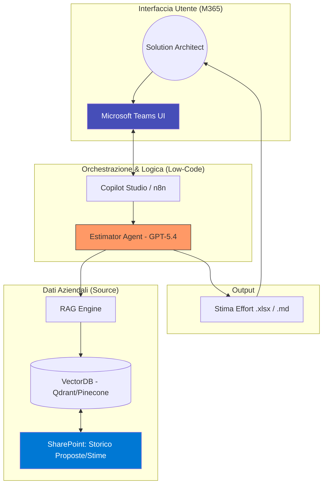
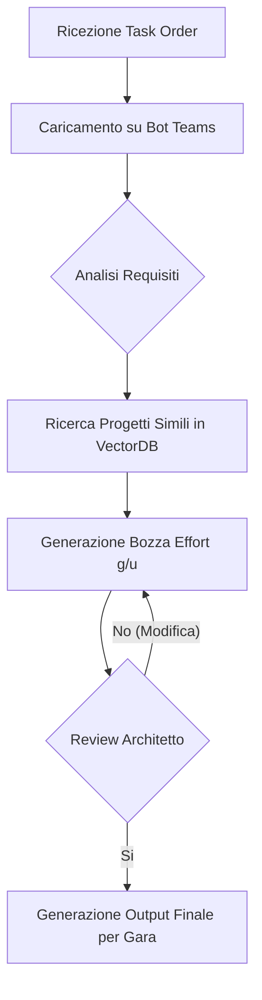
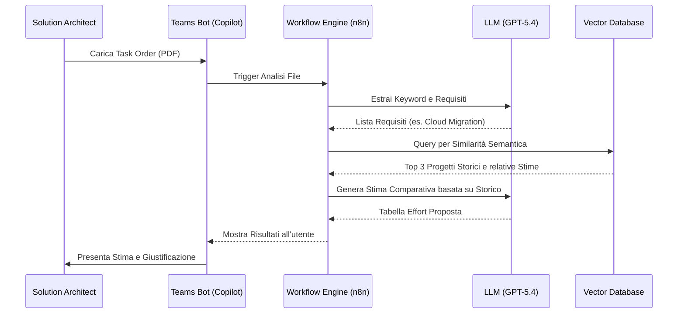

# Blueprint GenAI: Efficentamento della "Stima Automatica Effort per Accordi Quadro"

## 1. Descrizione del Caso d'Uso
**Categoria:** Bid Management & Tenders
**Titolo:** Stima Automatica Effort per Accordi Quadro
**Ruolo:** Solution Architect
**Obiettivo Originale (da CSV):** Utilizzo di modelli LLM addestrati sui dati storici aziendali per stimare rapidamente l'effort infrastrutturale (giornate/uomo, tipologia di profili) richiesto dai task order di un Accordo Quadro, riducendo i tempi di risposta al cliente.
**Obiettivo GenAI:** Automatizzare la generazione di stime preliminari di effort (man-days) e l'identificazione delle competenze (profili senior/junior) incrociando i requisiti di un nuovo Task Order con lo storico dei progetti/proposte simili archiviati in SharePoint, utilizzando un approccio RAG (Retrieval-Augmented Generation).

## 2. Fasi del Processo Efficentato

### Fase 1: Ingestion e Indicizzazione Storico (RAG)
In questa fase, il sistema analizza i documenti di stima storici (file Excel, PDF di proposte passate, verbali di chiusura progetto) caricati su SharePoint per creare una base di conoscenza vettoriale.
*   **Tool Principale Consigliato:** `n8n` (per l'orchestrazione della pipeline di ingestion)
*   **Alternative:** 1. `Azure AI Search`, 2. `OpenClaw` (per indicizzazione locale on-premise)
*   **Modelli LLM Suggeriti:** *Meta Llama 4 Scout (109B)* via OpenClaw per l'embedding e la classificazione iniziale dei dati sensibili.
*   **Modalità di Utilizzo:** Configurazione di un workflow n8n che monitora una cartella SharePoint "Storico_Stime". Ogni nuovo file viene chunkizzato e inviato a un VectorDB (es. Qdrant) tramite un nodo LLM per l'estrazione dei metadati (es. `tecnologia`, `effort_totale`, `n_risorse`).
*   **Azione Umana Richiesta:** L'utente deve assicurarsi che i file storici siano puliti e organizzati per tipologia di servizio.
*   **Stima Reale di Efficienza:** 
    *   *Tempo As-Is (Manuale):* 2 ore (ricerca manuale tra vecchie cartelle)
    *   *Tempo To-Be (GenAI):* 5 minuti (indicizzazione automatica)
    *   *Risparmio %:* 96%
    *   *Motivazione:* L'indicizzazione automatica elimina la necessità di ricordare "chi ha fatto cosa" e dove sono i file.

### Fase 2: Analisi Requisiti e Matching via Teams
L'architetto interagisce con un Bot su Microsoft Teams caricando il nuovo Task Order (PDF/Docx) per ottenere la stima.
*   **Tool Principale Consigliato:** `Microsoft Teams (Chatbot UI)` + `Copilot Studio`
*   **Alternative:** 1. `Accenture Amethyst`
*   **Modelli LLM Suggeriti:** *OpenAI GPT-5.4* (per l'eccellente capacità di ragionamento comparativo).
*   **Modalità di Utilizzo:** Creazione di un Copilot che accetta in input il file del Task Order. Il bot estrae i requisiti chiave (es. "Migrazione 50 VM", "Setup Backup") e interroga il VectorDB per trovare i 3 progetti passati più simili.
    *   **Bozza System Prompt:**
    ```text
    Sei un Senior Solution Architect specializzato in gare e accordi quadro.
    Il tuo compito è analizzare il Task Order fornito dall'utente e confrontarlo con gli esempi storici recuperati dal database.
    1. Identifica i task principali.
    2. Proponi una tabella di effort (Giornate/Uomo) divisa per profilo (Architect, Engineer, PM).
    3. Giustifica la stima citando il progetto storico di riferimento (es. 'Simile al Progetto X del 2024').
    Sii conservativo nelle stime e segnala eventuali rischi tecnici non coperti dai dati storici.
    ```
*   **Azione Umana Richiesta:** Caricamento del documento e review della stima proposta.
*   **Stima Reale di Efficienza:** 
    *   *Tempo As-Is (Manuale):* 4-6 ore (analisi documento e calcoli manuali)
    *   *Tempo To-Be (GenAI):* 10 minuti
    *   *Risparmio %:* 97%
    *   *Motivazione:* L'AI estrae i requisiti e propone i numeri in secondi, lasciando all'umano solo il compito di validatore.

## 3. Descrizione del Flusso Logico
Il flusso è lineare e centralizzato. L'utente carica il documento del Task Order nella chat di **Microsoft Teams**. Il backend (**n8n** o **Copilot Studio**) invia il testo all'LLM (**GPT-5.4**) che, tramite una ricerca semantica (**VectorDB/RAG**) su dati **SharePoint**, identifica i pattern di effort passati. Il sistema restituisce una tabella strutturata pronta per essere copiata nel template di risposta ufficiale.

**Architettura Agentica:** Si adotta un approccio **Single-Agent** ("Estimator Agent") configurato per il "Retrieval Augmented Generation". Non è necessario un approccio multi-agente poiché il task di estrazione e calcolo è sequenziale e ben gestito da un modello di frontiera come GPT-5.4.

## 4. Diagrammi UML (Mermaid.js)

### 4.1 Application & System Architecture Schematic


### 4.2 Process Diagram


### 4.3 Sequence Diagram


## 5. Guida all'Implementazione Tecnica
### Prerequisiti
- Licenza **Microsoft Copilot Studio** o istanza **n8n** (self-hosted o cloud).
- Account **SharePoint** con permessi di lettura sulla cartella dello storico stime.
- API Key per **OpenAI** (GPT-5.4) o accesso tramite **Azure OpenAI**.
- Database Vettoriale (es. **Qdrant** o la funzionalità vettoriale integrata in Azure AI Search).

### Step 1: Preparazione della Knowledge Base
1.  Raccogli i file Excel/PDF degli ultimi 2 anni relativi a Task Order gestiti.
2.  Caricali in una libreria SharePoint dedicata.
3.  Configura n8n per leggere periodicamente questa cartella, estrarre il testo e salvarlo nel VectorDB (usando un modello di embedding come `text-embedding-3-large`).

### Step 2: Configurazione dell'Agente di Stima
1.  In **Copilot Studio**, crea un nuovo bot.
2.  Configura un'azione "Generative Answers" puntando alla Knowledge Base creata o usa un webhook verso n8n.
3.  Incolla il **System Prompt** fornito nella Fase 2 per istruire il bot sul formato della risposta (tabellare, divisa per profili).

### Step 3: Pubblicazione su Teams
1.  Vai nella sezione "Publish" di Copilot Studio.
2.  Seleziona il canale "Microsoft Teams".
3.  Installa il bot nell'ambiente aziendale e rendilo disponibile al team "Bid Management".

## 6. Rischi e Mitigazioni
- **Rischio 1: Allucinazione sui numeri (es. stima 1000 giorni invece di 100)** -> **Mitigazione:** Il bot deve sempre citare il progetto di riferimento e l'umano deve validare il risultato finale. Implementare un "range check" (es. avviso se la stima supera la media storica del 50%).
- **Rischio 2: Privacy dei dati sensibili di altri clienti** -> **Mitigazione:** Utilizzare istanze Enterprise di OpenAI/Azure che garantiscono che i dati non vengano usati per il training globale. Mascherare nomi di clienti specifici nel VectorDB se necessario.
- **Rischio 3: Formato file non supportato** -> **Mitigazione:** Prevedere un fall-back nel workflow n8n che utilizzi un servizio di OCR (es. AWS Textract o Azure Document Intelligence) per i PDF scansionati.
