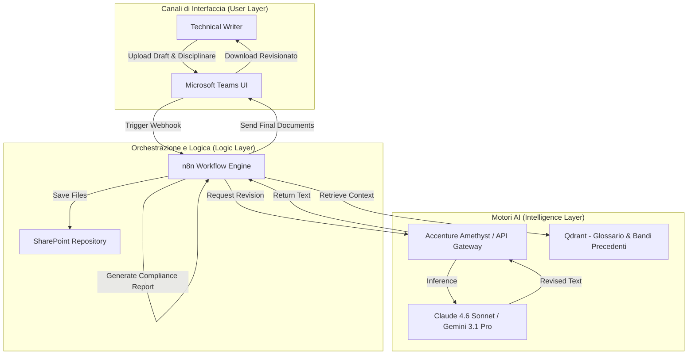
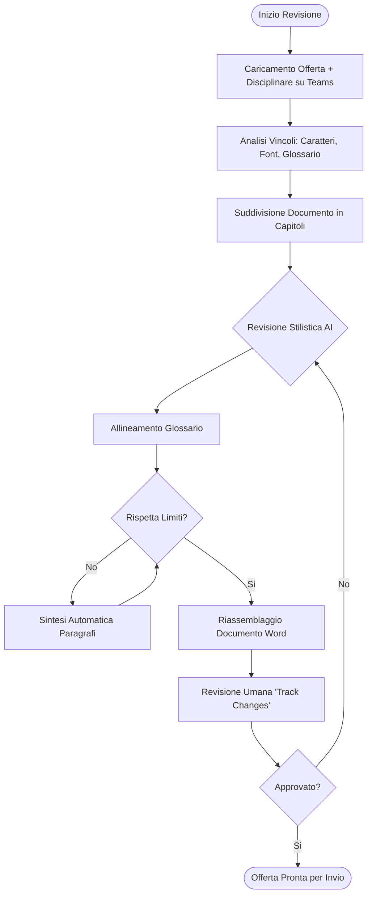
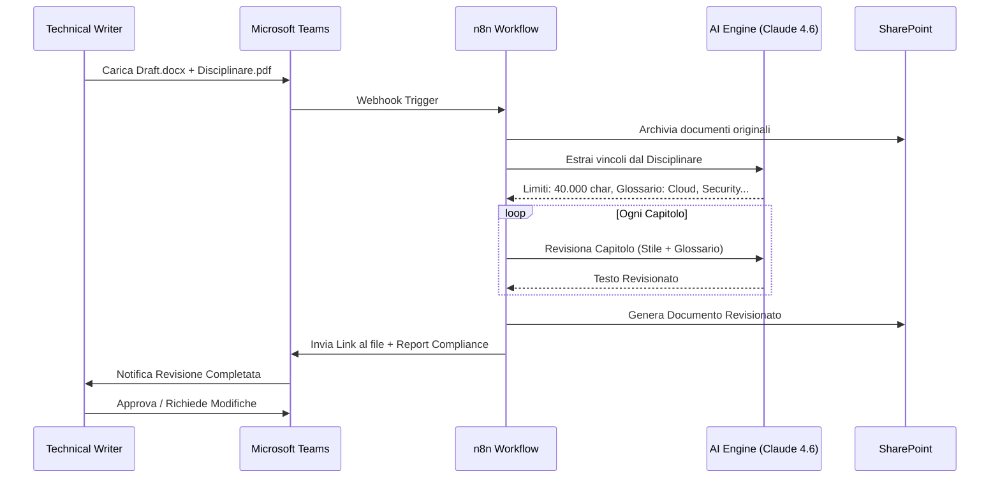

# Blueprint GenAI: Efficentamento del "Revisione Linguistica e Formale Offerta Tecnica"

## 1. Descrizione del Caso d'Uso
**Categoria:** Bid Management & Tenders
**Titolo:** Revisione Linguistica e Formale Offerta Tecnica
**Ruolo:** Technical Writer
**Obiettivo Originale (da CSV):** Revisione automatica dell'intera Offerta Tecnica prodotta dai vari team architetturali per uniformare lo stile, correggere incongruenze terminologiche e verificare il rispetto dei limiti di pagina/caratteri imposti dal disciplinare di gara pubblica.
**Obiettivo GenAI:** Automatizzare l'analisi e la correzione stilistico-formale di documenti tecnici complessi, garantendo la coerenza del glossario, l'uniformità del tono di voce (Tone of Voice) e il rigoroso rispetto dei vincoli dimensionali (pagine/caratteri) richiesti dai bandi di gara.

## 2. Fasi del Processo Efficentato

### Fase 1: Ingestion e Validazione Vincoli
Il documento (Word/PDF) viene caricato su un canale Microsoft Teams. Un agente analizza il disciplinare di gara (anch'esso caricato) per estrarre i limiti di lunghezza e le regole formali (font, margini, ecc.).
*   **Tool Principale Consigliato:** n8n (Orchestratore) + Microsoft Teams (UI)
*   **Alternative:** 1. Copilot Studio, 2. Accenture Amethyst
*   **Modelli LLM Suggeriti:** Google Gemini 3 Deep Think (per estrazione logica dei vincoli dal disciplinare)
*   **Modalità di Utilizzo:** Workflow n8n che riceve il file via Webhook da Teams, estrae il testo e lo confronta con i parametri estratti dal PDF del disciplinare.
*   **Azione Umana Richiesta:** Conferma dei vincoli estratti (es. "Limite: 50 pagine, 100.000 caratteri").
*   **Stima Reale di Efficienza:** 
    *   *Tempo As-Is (Manuale):* 1 ora (lettura disciplinare + conteggio manuale)
    *   *Tempo To-Be (GenAI):* 2 minuti
    *   *Risparmio %:* 96%
    *   *Motivazione:* L'AI estrae istantaneamente i metadati e i vincoli senza rischio di sviste umane.

### Fase 2: Uniformazione Stilistica e Terminologica
L'LLM rielabora i paragrafi scritti da diversi autori (architetti, sistemisti, manager) per applicare un unico stile editoriale e un glossario predefinito.
*   **Tool Principale Consigliato:** Accenture Amethyst (per la sicurezza dei dati)
*   **Alternative:** 1. Claude-code (per editing massivo di file testo), 2. Visual Studio Code + Copilot
*   **Modelli LLM Suggeriti:** Anthropic Claude 4.6 Sonnet (eccellenza nella prosa e sfumature linguistiche)
*   **Modalità di Utilizzo:** Caricamento del draft su Amethyst con un **System Prompt** specifico:
    ```markdown
    Agisci come un Technical Editor Senior. Revisiona il testo seguendo questi criteri:
    1. Usa la forma attiva e il "noi" aziendale.
    2. Sostituisci i sinonimi con i termini del Glossario Allegato (es. usa sempre 'Cloud Region' invece di 'Data Center Cloud').
    3. Mantieni il contenuto tecnico invariato ma rendi il linguaggio fluido e professionale.
    4. Identifica i paragrafi prolissi che possono essere sintetizzati per rientrare nei limiti.
    ```
*   **Azione Umana Richiesta:** Review delle modifiche proposte tramite "Revisioni" (Track Changes).
*   **Stima Reale di Efficienza:** 
    *   *Tempo As-Is (Manuale):* 8-12 ore (per un'offerta di 100 pagine)
    *   *Tempo To-Be (GenAI):* 30-45 minuti (editing guidato)
    *   *Risparmio %:* 94%
    *   *Motivazione:* L'AI processa intere sezioni in secondi, applicando regole sintattiche globali istantaneamente.

### Fase 3: Final Check e Report di Conformità
Generazione di un report finale che indica se l'offerta è pronta per l'invio o se necessita di ulteriori tagli per rispettare i limiti del bando.
*   **Tool Principale Consigliato:** n8n (Generazione Report)
*   **Alternative:** 1. Microsoft Teams (Chatbot notification), 2. AI-Studio Google (per dashboard di riepilogo)
*   **Modelli LLM Suggeriti:** OpenAI GPT-5.4
*   **Modalità di Utilizzo:** Script Python integrato in n8n che conta i token/caratteri finali e genera un PDF di "Compliance Check".
*   **Azione Umana Richiesta:** Approvazione finale del Technical Writer per il "Ready for Submission".
*   **Stima Reale di Efficienza:** 
    *   *Tempo As-Is (Manuale):* 2 ore (rilettura finale e conteggio incrociato)
    *   *Tempo To-Be (GenAI):* 5 minuti
    *   *Risparmio %:* 95%
    *   *Motivazione:* Automazione completa della fase di verifica finale.

## 3. Descrizione del Flusso Logico
Il processo è configurato come un approccio **Single-Agent orchestrato da Workflow (n8n)**. Un singolo Agente Editor (basato su Claude 4.6) riceve il contesto (Disciplinare + Glossario) e lavora sequenzialmente sui capitoli dell'offerta. L'orchestrazione tramite n8n permette di gestire file pesanti suddividendoli in chunk (parti) per non superare la context window dell'LLM e per mantenere un controllo granulare sulla qualità di ogni sezione. L'interazione avviene interamente su **Microsoft Teams**, dove il Technical Writer carica i file e riceve le versioni revisionate.

## 4. Diagrammi UML (Mermaid.js)

### 4.1 Architecture Diagram


### 4.2 Process Diagram


### 4.3 Sequence Diagram


## 5. Guida all'Implementazione Tecnica

### Prerequisiti
- Licenza **n8n** (Self-hosted o Cloud).
- Accesso a **Accenture Amethyst** o API Key Anthropic/Google.
- Tenant **Microsoft 365** con permessi per creare Bot su Teams (tramite App Studio o n8n).
- Repository **SharePoint** per lo storage temporaneo.

### Step 1: Configurazione Workflow n8n
1. Crea un nuovo workflow con un nodo **Webhook**.
2. Aggiungi nodi per l'integrazione con **Microsoft OneDrive/SharePoint** per scaricare i file caricati su Teams.
3. Utilizza il nodo **AI Agent** di n8n collegandolo a un modello Claude 4.6.
4. Carica il glossario aziendale in un nodo **Memory** o in un **Vector Store** (es. Qdrant) collegato all'agente.

### Step 2: Ingegneria dei Prompt (System Instruction)
Configura l'agente con il seguente System Prompt:
> "Sei l'assistente ufficiale per la revisione delle Gare d'Appalto. Il tuo compito è assicurare che il documento tecnico sia 'uno' nella voce, 'preciso' nei termini e 'conforme' nei limiti. Non inventare dati tecnici. Se un paragrafo è troppo lungo rispetto ai limiti di gara, proponi una versione sintetizzata mantenendo i punti chiave. Segnala sempre se trovi termini non presenti nel glossario approvato."

### Step 3: Pubblicazione su Microsoft Teams
1. Utilizza il modulo **Microsoft Teams** in n8n per inviare messaggi adattivi (Adaptive Cards).
2. Configura una card che mostri il progresso della revisione (es. "Analisi Capitolo 1/5...") e i risultati del Compliance Check finale.

## 6. Rischi e Mitigazioni
- **Rischio: Allucinazione dei dati tecnici** -> **Mitigazione:** L'AI è configurata per non aggiungere informazioni, ma solo revisionare la forma. L'esperto umano deve sempre validare il contenuto tecnico finale.
- **Rischio: Superamento context window** -> **Mitigazione:** Implementazione del chunking (elaborazione per capitoli separati) gestito da n8n.
- **Rischio: Formattazione Word corrotta** -> **Mitigazione:** Utilizzo di librerie Python (es. `python-docx`) via n8n per manipolare solo il testo mantenendo intatti gli stili del template originale.
