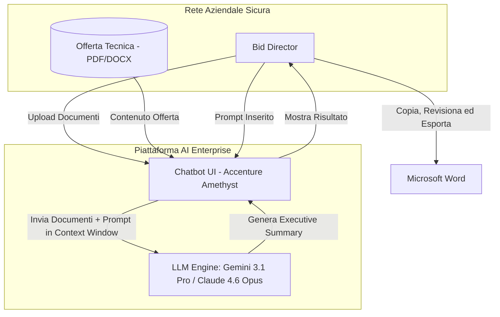
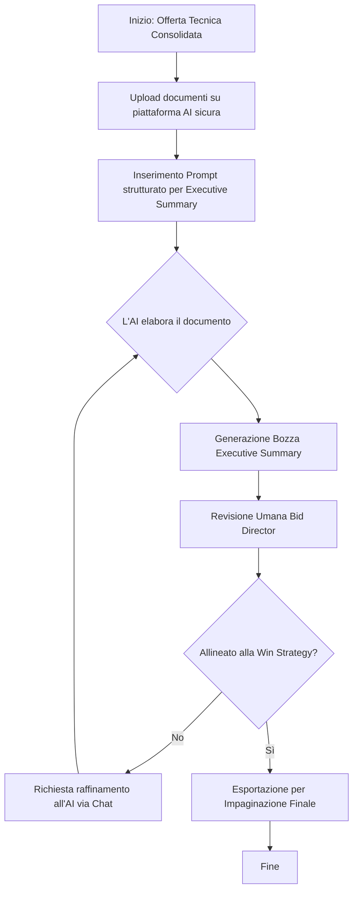
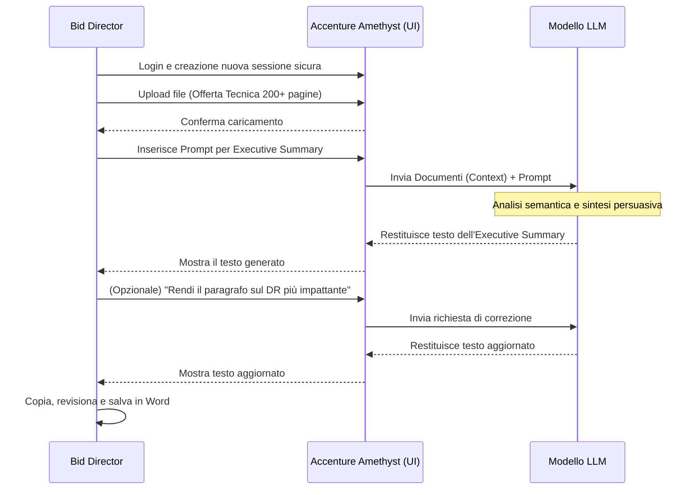

# Blueprint GenAI: Efficentamento del "Generazione Executive Summary per Gare"

## 1. Descrizione del Caso d'Uso
**Categoria:** Bid Management & Tenders
**Titolo:** Generazione Executive Summary per Gare
**Ruolo:** Bid Director
**Obiettivo Originale (da CSV):** Creazione automatica di un Executive Summary persuasivo e di alto livello, sintetizzando le centinaia di pagine dell'Offerta Tecnica infrastrutturale (soluzioni cloud, DR, sicurezza) per i decisori della Pubblica Amministrazione.
**Obiettivo GenAI:** Automatizzare la lettura, la comprensione e la sintesi dell'intera Offerta Tecnica (spesso composta da centinaia di pagine) per generare un documento riassuntivo (Executive Summary) persuasivo, orientato al valore e comprensibile per i decisori non tecnici (C-level o dirigenti PA).

## 2. Fasi del Processo Efficentato

### Fase 1: Analisi Offerta e Generazione Executive Summary
L'utente carica i documenti costituenti l'Offerta Tecnica in un ambiente AI sicuro in grado di gestire un contesto molto ampio (centinaia di pagine). L'AI estrae i punti di forza (win themes), le soluzioni architetturali chiave (Cloud, DR, Sicurezza) e redige l'Executive Summary secondo le direttive fornite nel prompt.
*   **Tool Principale Consigliato:** `accenture ametyst` (ideale per l'ingestion sicura di documenti aziendali riservati e per sfruttare modelli con large-context window).
*   **Alternative:** 1. `chatgpt agent` (Enterprise con Advanced Data Analysis), 2. `Copilot Studio` (se i documenti risiedono su SharePoint aziendale).
*   **Modelli LLM Suggeriti:** *Google Gemini 3.1 Pro* (grazie alla sua context window nativa di oltre 2 milioni di token, perfetta per ingerire centinaia di pagine senza VectorDB) o *Anthropic Claude Opus 4.6* (eccellente nella scrittura persuasiva e formale).
*   **Modalità di Utilizzo:** Caricamento manuale dei PDF/DOCX dell'Offerta Tecnica tramite l'interfaccia chat sicura. Utilizzo di un prompt strutturato per guidare la sintesi.
    **Bozza del Prompt:**
    ```text
    Agisci come un Bid Director esperto in gare d'appalto per la Pubblica Amministrazione italiana.
    Ho caricato l'Offerta Tecnica completa per il progetto [Nome Progetto].
    
    Il tuo compito è scrivere un Executive Summary di massimo 3-4 pagine destinato ai decisori della PA (Direttori Generali, CIO).
    Il documento NON deve essere un riassunto tecnico dettagliato, ma deve evidenziare:
    1. La comprensione del contesto e degli obiettivi della PA.
    2. La nostra proposta di valore (Win Themes).
    3. I vantaggi chiave della nostra architettura proposta (focus su Cloud, Disaster Recovery e Sicurezza) spiegati in termini di benefici di business e compliance.
    4. La garanzia di affidabilità, innovazione e minimizzazione dei rischi.
    
    Usa un tono formale, persuasivo, istituzionale e autorevole. Struttura il testo in paragrafi brevi e bullet points per facilitare la lettura veloce.
    ```
*   **Azione Umana Richiesta:** Il Bid Director DEVE revisionare il documento generato per assicurarsi che il tono commerciale sia perfettamente allineato con la strategia di gara (win strategy) e correggere eventuali enfasi errate.
*   **Stima Reale di Efficienza:** 
    *   *Tempo As-Is (Manuale):* 8 ore (lettura trasversale dell'offerta consolidata e stesura ex-novo)
    *   *Tempo To-Be (GenAI):* 30 minuti (ingestion, prompt, generazione e fine-tuning umano)
    *   *Risparmio %:* 93%
    *   *Motivazione:* L'AI elimina completamente il tempo necessario per ricercare, raggruppare e riassumere manualmente i contenuti sparsi in centinaia di pagine di documentazione tecnica.

## 3. Descrizione del Flusso Logico
Il processo adotta un approccio **Single-Agent**. Data la natura del task (analisi documentale e generazione di testo persuasivo), un singolo LLM con ampia context window (come Gemini 3.1 Pro) è sufficiente e rappresenta la soluzione più semplice ed efficace. Il Bid Director carica i documenti tecnici definitivi (o quasi definitivi) sulla piattaforma enterprise sicura (es. Accenture Amethyst). Fornisce il prompt con il contesto della gara. L'AI analizza l'intero corpus documentale, astrae i concetti chiave (es. soluzioni cloud, paradigmi di sicurezza) e genera una prima bozza dell'Executive Summary. Il Bid Director esegue una revisione finale (Human-in-the-loop) e l'esporta per l'impaginazione.

## 4. Diagrammi UML (Mermaid.js)

### 4.1 Architecture Diagram


### 4.2 Process Diagram


### 4.3 Sequence Diagram


## 5. Guida all'Implementazione Tecnica

### Prerequisiti
- Accesso a una piattaforma di GenAI Enterprise (es. Accenture Amethyst, o abbonamento ChatGPT Enterprise) che garantisca la non conservazione dei dati per l'addestramento.
- Disponibilità di un modello LLM con ampia Context Window (minimo 128k token, raccomandato 1M+ come Gemini 3.1 Pro) per evitare l'uso complesso di RAG/VectorDB per una singola esecuzione.

### Step 1: Preparazione dei Documenti
- Assicurarsi che l'Offerta Tecnica sia in un formato leggibile dal testo (PDF testuale, DOCX).
- Se i documenti sono multipli (es. Tomo 1 Cloud, Tomo 2 Sicurezza), possono essere caricati simultaneamente se la piattaforma supporta l'upload multiplo, altrimenti unirli in un singolo PDF.

### Step 2: Configurazione e Interazione sulla Piattaforma AI
1. Accedere all'interfaccia web della piattaforma AI Enterprise.
2. Avviare una nuova chat.
3. Utilizzare la funzione di upload (spesso icona a forma di graffetta) per caricare i file dell'Offerta Tecnica.
4. Attendere la conferma di caricamento e parsing da parte dell'interfaccia.
5. Incollare il prompt suggerito nella sezione "Fase 1" (personalizzando i campi tra parentesi quadre come il Nome Progetto).
6. Premere invio per generare l'output.

### Step 3: Iterazione e Raffinamento
- Leggere criticamente l'output prodotto.
- Se l'output è troppo tecnico, rispondere nella chat: "Semplifica i concetti tecnici nel punto 3, rendendoli più discorsivi per un Direttore Generale."
- Una volta soddisfatti, copiare l'output su Microsoft Word per l'impaginazione ufficiale.

## 6. Rischi e Mitigazioni
- **Rischio 1:** Esposizione di informazioni sensibili e architetturali in cloud pubblici (violazione di NDA). -> **Mitigazione:** Utilizzare rigorosamente piattaforme Enterprise (come Amethyst) contrattualizzate per NON utilizzare i dati utente per il training dei modelli (Zero Data Retention Policy per i log di addestramento).
- **Rischio 2:** "Loss in the middle" - L'LLM, pur avendo un contesto ampio, potrebbe dimenticare dettagli importanti posti a metà del documento originale. -> **Mitigazione:** Suddividere il prompt chiedendo di analizzare specifiche sezioni alla volta (es. "Fai prima un riassunto della parte Sicurezza, poi della parte Cloud, poi uniscili"), oppure affidarsi a modelli di ultimissima generazione garantiti per il full context retrieval.
- **Rischio 3:** Tono inadeguato o non allineato alla Win Strategy commerciale. -> **Mitigazione:** Human-in-the-loop obbligatorio. Il Bid Director deve sempre validare il testo e non inviarlo mai "as-is" al cliente.