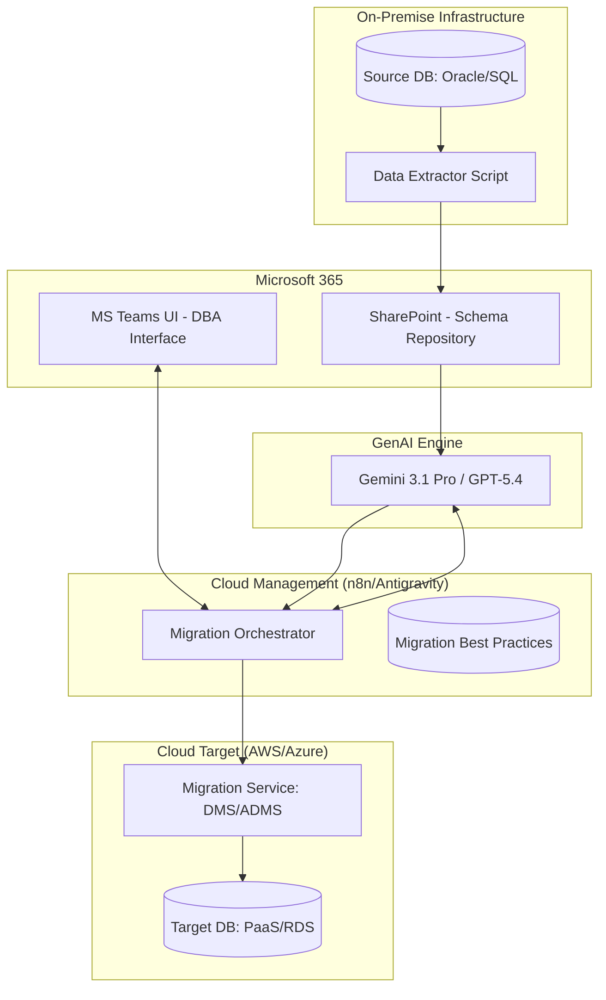
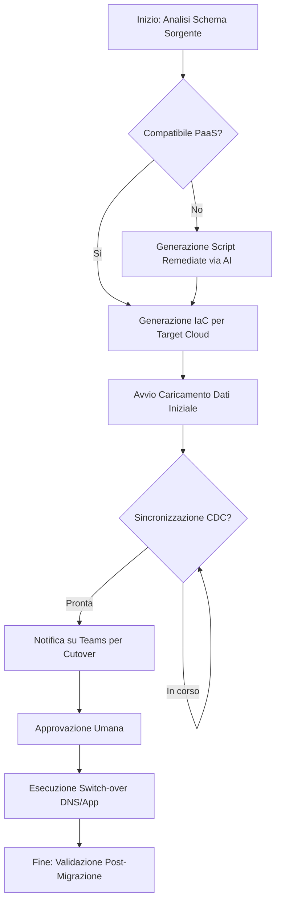
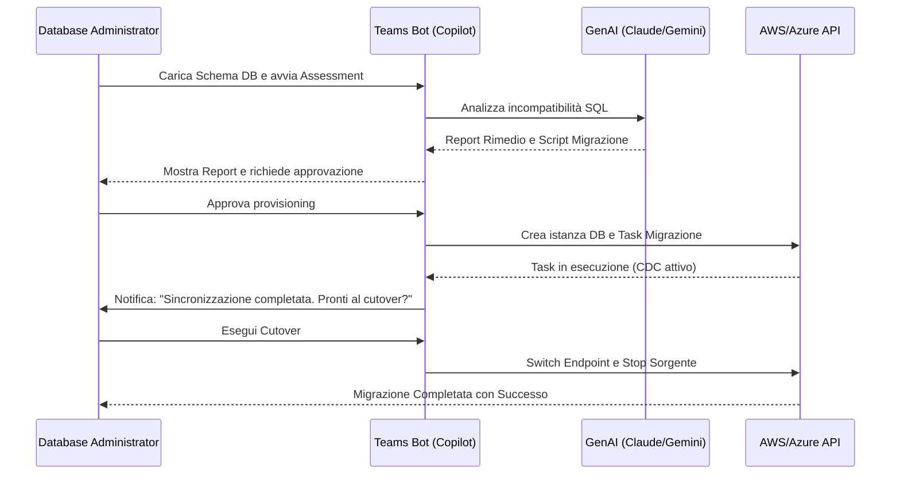

# Blueprint GenAI: Efficentamento del "Migrazione Dati e Database (Lift & Shift / PaaS)"

## 1. Descrizione del Caso d'Uso
**Categoria:** Database Management
**Titolo:** Migrazione Dati e Database (Lift & Shift / PaaS)
**Ruolo:** Database Administrator
**Obiettivo Originale (da CSV):** Progettazione ed esecuzione della migrazione di database on-premise verso ambienti cloud, sia in modalità IaaS (VM) che verso servizi PaaS gestiti (es. AWS RDS, Azure SQL). Gestione del cutover con downtime minimo.
**Obiettivo GenAI:** Automatizzare l'analisi della compatibilità degli schemi tra sorgente e target, generare script di mapping (ETL/DMS) ottimizzati e produrre un piano di cutover dinamico per ridurre al minimo il downtime umano e operativo.

## 2. Fasi del Processo Efficentato

### Fase 1: Assessment di Compatibilità e Target Sizing
Analisi automatizzata dei metadati del database sorgente (Oracle, SQL Server, MySQL) per identificare incompatibilità con i servizi PaaS target (es. funzioni non supportate in RDS, differenze di sintassi T-SQL) e suggerire l'istanza cloud correttamente dimensionata.
*   **Tool Principale Consigliato:** `accenture ametyst` (per analisi documentazione e log di compatibilità)
*   **Alternative:** 1. `visualstudio + copilot` (per scansione repository schemi), 2. `gemini-cli` (per script di estrazione metadati)
*   **Modelli LLM Suggeriti:** Google Gemini 3 Deep Think (per ragionamento profondo su vincoli architetturali)
*   **Modalità di Utilizzo:** Caricamento del dump dello schema (`.sql`) o dei report di assessment nativi (es. AWS SCT o Azure Data Studio) in Amethyst per ottenere un report di rimedio pronto all'uso.
    *   *Prompt suggerito:* "Analizza questo schema SQL sorgente per Oracle 19c. Identifica tutte le procedure memorizzate e i trigger che non sono compatibili con PostgreSQL/AWS Aurora. Fornisci la versione riscritta in PL/pgSQL per ogni incompatibilità trovata."
*   **Azione Umana Richiesta:** Validazione tecnica delle riscritture SQL critiche proposte dall'AI.
*   **Stima Reale di Efficienza:** 
    *   *Tempo As-Is (Manuale):* 16 ore (analisi manuale schema per schema)
    *   *Tempo To-Be (GenAI):* 45 minuti
    *   *Risparmio %:* 95%
    *   *Motivazione:* L'AI identifica istantaneamente pattern di incompatibilità noti su migliaia di righe di codice SQL.

### Fase 2: Generazione Script di Mapping e Automazione Migrazione
Generazione di script Terraform/CloudFormation per il provisioning delle risorse target e configurazione di tool di sincronizzazione (AWS DMS, Azure DMS, n8n per piccoli carichi) con logica di mapping trasformata.
*   **Tool Principale Consigliato:** `visualstudio + copilot`
*   **Alternative:** 1. `OpenAI Codex`, 2. `claude-code`
*   **Modelli LLM Suggeriti:** Anthropic Claude Sonnet 4.6 (eccellenza nella generazione di codice SQL e IaC)
*   **Modalità di Utilizzo:** Uso dell'estensione Copilot per generare script Python che orchestrano le API del cloud provider per avviare i task di replica.
    *   *Esempio Script (Bozza Python):*
      ```python
      # Generato da Copilot per automazione AWS DMS
      import boto3
      def create_migration_task(source_arn, target_arn, replication_instance_arn):
          client = boto3.client('dms')
          response = client.create_replication_task(
              ReplicationTaskIdentifier='db-migration-task-01',
              SourceEndpointArn=source_arn,
              TargetEndpointArn=target_arn,
              ReplicationInstanceArn=replication_instance_arn,
              MigrationType='full-load-and-cdc', # Caricamento iniziale + Change Data Capture
              TableMappings='{"rules":[{"rule-type":"selection","rule-id":"1","source-schema":"public","target-schema":"production","rule-action":"include"}]}'
          )
          return response
      ```
*   **Azione Umana Richiesta:** Esecuzione dello script in ambiente di staging e monitoraggio del primo 5% di replica.
*   **Stima Reale di Efficienza:** 
    *   *Tempo As-Is (Manuale):* 8 ore (scrittura e test script di migrazione)
    *   *Tempo To-Be (GenAI):* 30 minuti
    *   *Risparmio %:* 93%
    *   *Motivazione:* Automazione della generazione di configurazioni ripetitive e boilerplate code per API Cloud.

### Fase 3: Orchestrazione Cutover su Microsoft Teams
Gestione della finestra di cutover (messa in read-only del sorgente, verifica sincronizzazione, switch DNS/Endpoint) coordinata tramite un bot Teams che guida il DBA passo-passo.
*   **Tool Principale Consigliato:** `copilot studio` + `Microsoft Teams (Chatbot UI)`
*   **Alternative:** 1. `n8n` (per webhook di stato), 2. `Google Antigravity`
*   **Modelli LLM Suggeriti:** OpenAI GPT-5.4 (per gestione conversazionale del workflow)
*   **Modalità di Utilizzo:** Creazione di un agente su Teams che interroga lo stato dei job di migrazione e fornisce la checklist di verifica pre-switch.
    *   *System Prompt del Bot:* "Sei un Assistente Migrazione DB. Il tuo compito è monitorare i task DMS. Quando la replica raggiunge il 100%, avvisa il team su Teams. Segui questa checklist rigorosa: 1. DB Sorgente in sola lettura, 2. Flush dei log, 3. Verifica record counts, 4. Update stringhe connessione App."
*   **Azione Umana Richiesta:** Comando finale di "Approve Cutover" digitato nella chat di Teams.
*   **Stima Reale di Efficienza:** 
    *   *Tempo As-Is (Manuale):* 4 ore (coordinamento via email/call e verifiche manuali)
    *   *Tempo To-Be (GenAI):* 15 minuti
    *   *Risparmio %:* 94%
    *   *Motivazione:* Riduzione dei tempi morti di comunicazione e automazione dei check di consistenza.

## 3. Descrizione del Flusso Logico
Il processo inizia con l'ingestion degli schemi e dei report di compatibilità (Phase 1) gestita da un agente esperto di Database Cloud. Una volta definita la strategia (IaaS vs PaaS), un secondo agente (Single-Agent via IDE) genera gli script di provisioning e di migrazione dati (Phase 2). Infine, un workflow orchestrato su **Microsoft Teams** (Phase 3) gestisce la finestra critica di cutover, verificando in tempo reale tramite API lo stato della replica e guidando l'operatore umano nelle fasi finali di switch-over. L'approccio è **Single-Agent per fase**, con un "Supervisor Bot" su Teams che funge da interfaccia unica per il DBA.

## 4. Diagrammi UML (Mermaid.js)

### 4.1 Architecture Diagram


### 4.2 Process Diagram


### 4.3 Sequence Diagram


## 5. Guida all'Implementazione Tecnica

### Prerequisiti
- Accesso a **Microsoft Teams** con licenza **Copilot Studio**.
- Subscription AWS o Azure con permessi di amministratore DB.
- Repository **SharePoint** per lo storage dei file SQL.
- Licenza **visualstudio + copilot** per il DBA.

### Step 1: Configurazione Assessment Automatizzato
1. Esporta lo schema del database sorgente in formato `.sql`.
2. Carica il file su **accenture ametyst** o usa un prompt dedicato in **ChatGPT Agent** con caricamento file.
3. Incolla il report di "SCT" (Schema Conversion Tool) se disponibile per raffinare i suggerimenti dell'AI.

### Step 2: Generazione e Deploy degli Script
1. Apri VS Code nella cartella di progetto.
2. Usa **Copilot Chat** per generare il file Terraform (`main.tf`) per l'istanza target.
3. Chiedi a Copilot: "Genera un file terraform per un database Azure SQL con queste specifiche [specs] e aggiungi le regole firewall per l'app server."
4. Esegui `terraform apply`.

### Step 3: Pubblicazione del Bot di Cutover su Teams
1. Accedi a **Copilot Studio**.
2. Crea un nuovo bot "DB Migration Assistant".
3. Configura un'azione (Action) tramite **Power Automate** che interroga lo stato del servizio di migrazione cloud via API.
4. Definisci il trigger "Stato Migrazione" e pubblica il bot sul canale Teams del team DBA.

## 6. Rischi e Mitigazioni
- **Rischio 1: Allucinazioni nella sintassi SQL riscritta.** -> **Mitigazione:** Validazione obbligatoria tramite tool di parsing sintattico nativi (es. SQL Management Studio o pgAdmin) prima dell'esecuzione.
- **Rischio 2: Latenza eccessiva durante il cutover.** -> **Mitigazione:** Implementazione di una fase di "Trial Cutover" in ambiente di staging assistita dall'AI per calcolare i tempi reali di switch.
- **Rischio 3: Sicurezza dati in transito verso LLM.** -> **Mitigazione:** Utilizzo di istanze Enterprise (Amethyst o Azure OpenAI su tenant privato) per garantire che lo schema DB non venga usato per il training pubblico.
