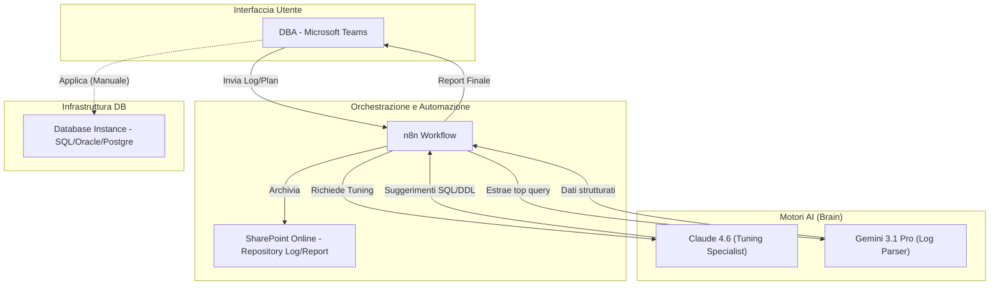
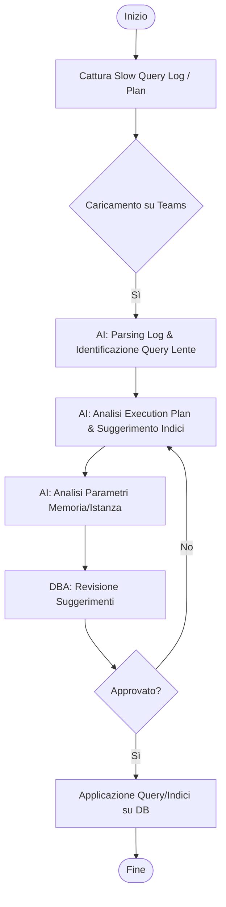
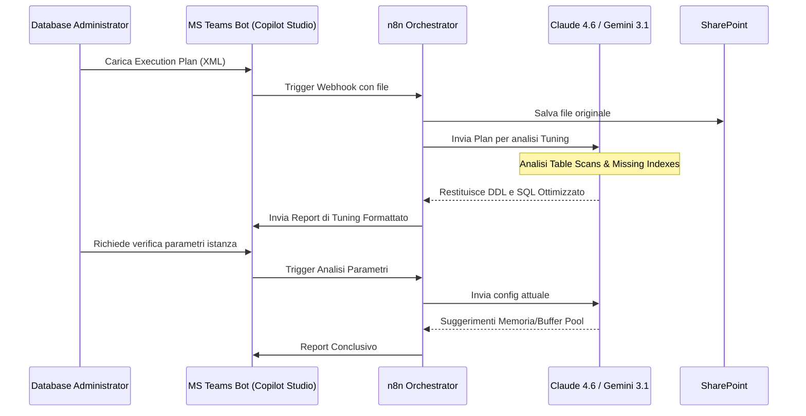

# Blueprint GenAI: Efficentamento del "Tuning e Ottimizzazione Query DB"

## 1. Descrizione del Caso d'Uso
**Categoria:** Database Management
**Titolo:** Tuning e Ottimizzazione Query DB
**Ruolo:** Database Administrator
**Obiettivo Originale (da CSV):** Analisi delle prestazioni del motore database, individuazione di query lente tramite execution plan, creazione di indici mancanti, riorganizzazione degli spazi e modifica dei parametri di memoria dell'istanza.
**Obiettivo GenAI:** Automatizzare l'analisi telemetrica e degli Execution Plan per generare raccomandazioni immediate di tuning (SQL rewriting, DDL per indici e tuning parametri istanza), riducendo i tempi di diagnosi manuale per il DBA.

## 2. Fasi del Processo Efficentato

### Fase 1: Ingestion Log e Analisi Telemetrica
In questa fase, i log delle query lente (Slow Query Logs) e i file di Execution Plan (XML/JSON/Text) vengono caricati in un'area sicura (SharePoint) o inviati via chat. L'AI analizza i pattern di esecuzione per identificare i colli di bottiglia principali (Table Scan, Join pesanti, Memory Grant eccessivi).
*   **Tool Principale Consigliato:** `n8n` (Orchestratore) + `gemini-cli`
*   **Alternative:** 1. `accenture ametyst` (per analisi documentale sicura), 2. `claude-code` (per analisi script SQL)
*   **Modelli LLM Suggeriti:** **Google Gemini 3.1 Pro** (ottimale per finestre di contesto enormi necessarie per analizzare log massivi).
*   **Modalità di Utilizzo:** Workflow `n8n` che monitora una cartella SharePoint. Al caricamento di un file di log, `gemini-cli` esegue uno script di analisi batch che estrae le top 10 query più onerose.
*   **Azione Umana Richiesta:** Il DBA seleziona quale database/istanza analizzare e carica i file di log.
*   **Stima Reale di Efficienza:** 
    *   *Tempo As-Is (Manuale):* 2 ore (estrazione e parsing manuale dei log)
    *   *Tempo To-Be (GenAI):* 5 minuti
    *   *Risparmio %:* 96%
    *   *Motivazione:* L'AI processa migliaia di righe di log e aggrega i dati in pochi secondi, operazione che un umano farebbe con script complessi o analisi visuale lenta.

### Fase 2: Diagnostica Execution Plan e Suggerimento Indici
L'AI analizza gli Execution Plan specifici forniti e suggerisce l'esatta sintassi DDL per i "Missing Indexes" e il refactoring delle query (es. rimozione di funzioni nelle clausole WHERE, ottimizzazione di subquery).
*   **Tool Principale Consigliato:** `claude-code`
*   **Alternative:** 1. `visualstudio + copilot`, 2. `ChatGPT Agent`
*   **Modelli LLM Suggeriti:** **Anthropic Claude 4.6 Sonnet** (superiore nel ragionamento logico su piani di esecuzione SQL e precisione nel codice).
*   **Modalità di Utilizzo:** Scripting via `claude-code` che riceve in input il piano di esecuzione e restituisce un file `.sql` con i suggerimenti.
    *   *Bozza System Prompt:* 
    ```text
    Agisci come un Senior Database Performance Engineer. Analizza l'Execution Plan fornito [FORMATO XML/JSON]. 
    Identifica: 1. Operatori ad alto costo (Hash Join, Sort). 2. Scan su tabelle di grandi dimensioni. 
    Produci: 1. Script DDL 'CREATE INDEX' ottimizzato. 2. Versione ottimizzata della query SQL. 
    3. Spiegazione tecnica del perché le modifiche miglioreranno il costo della query.
    ```
*   **Azione Umana Richiesta:** Validazione tecnica delle raccomandazioni (es. verifica che l'indice suggerito non impatti troppo sulle operazioni di scrittura).
*   **Stima Reale di Efficienza:** 
    *   *Tempo As-Is (Manuale):* 1.5 ore per query complessa
    *   *Tempo To-Be (GenAI):* 10 minuti
    *   *Risparmio %:* 89%
    *   *Motivazione:* L'identificazione di indici "coprenti" ottimali richiede calcoli complessi sulla cardinalità che l'LLM esegue istantaneamente.

### Fase 3: Tuning Parametri Istanza e Memoria
Analisi dei parametri di configurazione del DB (es. Buffer Pool, Max Worker Threads, TempDB configuration) rispetto al carico analizzato.
*   **Tool Principale Consigliato:** `accenture ametyst` (Knowledge Base sulle Best Practice)
*   **Alternative:** 1. `gemini-cli`
*   **Modelli LLM Suggeriti:** **OpenAI GPT-5.4**
*   **Modalità di Utilizzo:** Chatbot Enterprise che confronta la configurazione attuale (output di `sp_configure` o simili) con i log di performance e suggerisce modifiche ai parametri di memoria e storage.
*   **Azione Umana Richiesta:** Approvazione finale e applicazione delle modifiche (Change Management).
*   **Stima Reale di Efficienza:** 
    *   *Tempo As-Is (Manuale):* 3 ore (studio documentazione e tuning trial-and-error)
    *   *Tempo To-Be (GenAI):* 20 minuti
    *   *Risparmio %:* 88%
    *   *Motivazione:* L'AI correla istantaneamente i sintomi (es. Page Life Expectancy bassa) con la causa radice (es. memoria insufficiente o buffer pool misconfigured).

## 3. Descrizione del Flusso Logico
Il flusso è progettato come un approccio **Single-Agent** orchestrato da **n8n**. 
1. Il DBA interagisce tramite un bot su **Microsoft Teams**, inviando il file di log o il piano di esecuzione. 
2. n8n riceve il file, lo salva su SharePoint per audit e lo invia all'agente di analisi (Claude 4.6). 
3. L'agente genera un report in Markdown che include: Query problematiche, SQL ottimizzato e DDL per nuovi indici. 
4. Il report viene restituito su Teams come messaggio formattato o file PDF. 
L'interazione umana è fondamentale nella fase finale per l'esecuzione fisica degli script sul database di produzione.

## 4. Diagrammi UML (Mermaid.js)

### 4.1 Architecture Diagram


### 4.2 Process Diagram


### 4.3 Sequence Diagram


## 5. Guida all'Implementazione Tecnica

### Prerequisiti
- Licenza **n8n** (self-hosted o cloud).
- API Key per **Anthropic (Claude 4.6)** e **Google Gemini**.
- Accesso a **Microsoft Teams** con permessi per pubblicare Bot via **Copilot Studio**.
- Accesso in sola lettura (per estrazione log) alle istanze Database.

### Step 1: Configurazione Workflow n8n
1. Crea un webhook di ingresso per ricevere dati da Teams/Copilot Studio.
2. Configura un nodo "HTTP Request" per chiamare le API di Anthropic.
3. Inserisci il **System Prompt** (vedi Fase 2) nel nodo LLM.
4. Aggiungi un nodo "Microsoft SharePoint" per l'archiviazione dei log.

### Step 2: Configurazione Bot su Teams
1. Apri **Copilot Studio**.
2. Crea un nuovo bot "DB Tuning Assistant".
3. Configura un topic che accetti l'upload di file.
4. Collega il topic al webhook di n8n creato nello Step 1.
5. Pubblica il bot sul canale aziendale.

### Step 3: Script di Estrazione (DB side)
Fornisci al DBA uno script minimale per estrarre la configurazione e i piani di esecuzione in formato testo:
```sql
-- Esempio SQL Server per estrarre piani dalla cache
SELECT TOP 10 
    qs.total_worker_time, st.text, qp.query_plan
FROM sys.dm_exec_query_stats qs
CROSS APPLY sys.dm_exec_sql_text(qs.sql_handle) st
CROSS APPLY sys.dm_exec_query_plan(qs.plan_handle) qp
ORDER BY qs.total_worker_time DESC;
```

## 6. Rischi e Mitigazioni
- **Rischio: Suggerimento indici ridondanti.** -> **Mitigazione:** L'AI deve ricevere in input anche l'elenco degli indici esistenti (schema) per evitare duplicati.
- **Rischio: Allucinazioni nel codice SQL.** -> **Mitigazione:** Obbligo di validazione umana ("Human-in-the-loop") e test in ambiente di staging prima della produzione.
- **Rischio: Sicurezza dei dati nei log.** -> **Mitigazione:** Utilizzare istanze LLM Enterprise (Azure OpenAI o Google Vertex) che garantiscono che i dati non vengano usati per il training.
