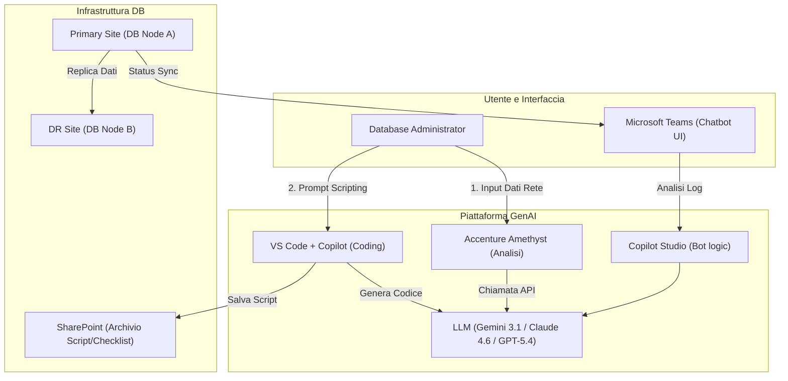
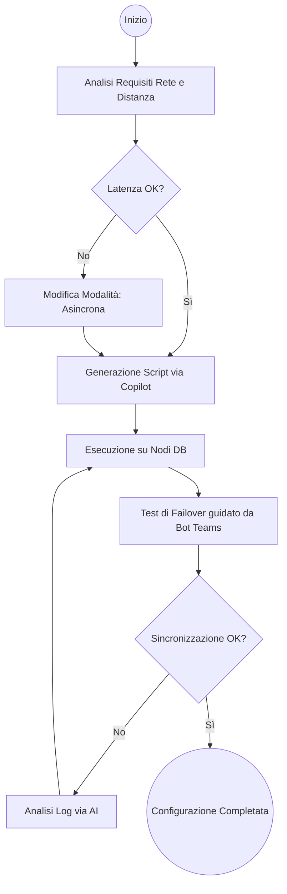
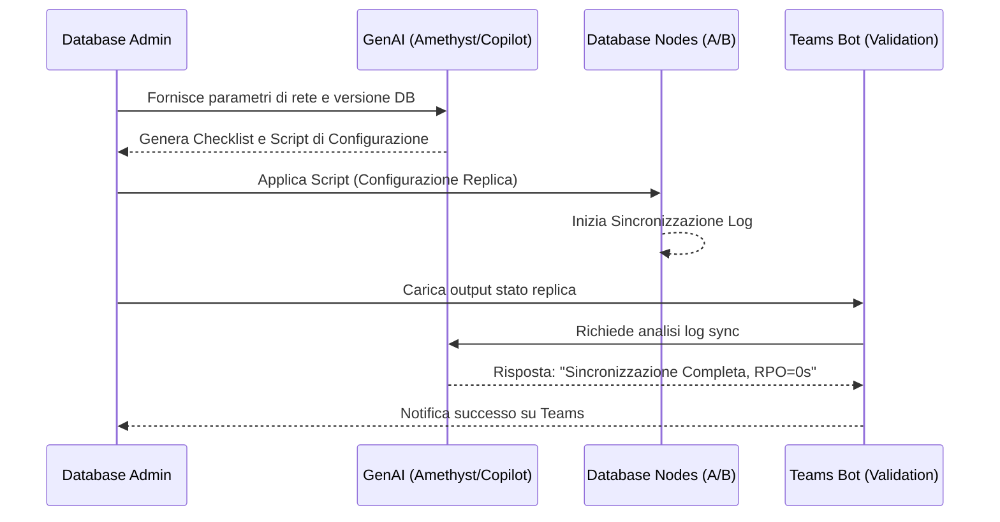

# Blueprint GenAI: Efficentamento del "Implementazione Replica e Log Shipping"

## 1. Descrizione del Caso d'Uso
**Categoria:** Database Management
**Titolo:** Implementazione Replica e Log Shipping
**Ruolo:** Database Administrator
**Obiettivo Originale (da CSV):** Configurazione di meccanismi di replica dei dati sincrona o asincrona tra datacenter geograficamente distanti per garantire tolleranza ai guasti regionali e bilanciamento dei carichi di lettura del DB.
**Obiettivo GenAI:** Automatizzare la generazione di script di configurazione (SQL, Bash o PowerShell), checklist di pre-requisiti di rete (latenza, banda) e procedure di test per il failover, riducendo gli errori manuali di configurazione cross-site.

## 2. Fasi del Processo Efficentato

### Fase 1: Analisi Requisiti e Checklist Infrastrutturale
In questa fase, l'AI analizza i parametri dei due datacenter (distanza, latenza, banda disponibile, tipologia di DB) e genera una checklist tecnica specifica per abilitare la replica senza colli di bottiglia.
*   **Tool Principale Consigliato:** `accenture ametyst`
*   **Alternative:** 1. `gemini-cli`, 2. `ChatGPT Agent`
*   **Modelli LLM Suggeriti:** Google Gemini 3.1 Pro
*   **Modalità di Utilizzo:** Caricamento dei documenti di architettura di rete su Amethyst. L'LLM estrae i parametri di latenza e consiglia la modalità di replica (Sincrona vs Asincrona) in base alla distanza tra i siti.
    *   **Prompt Suggerito:** *"Agisci come un Senior DBA esperto in Disaster Recovery. Analizza questi parametri di rete tra Site A e Site B. Genera una checklist di prerequisiti (porte firewall, latenza < 20ms per sincrona, configurazione quorum) per implementare [SQL Server AlwaysOn / Oracle Data Guard / PostgreSQL Streaming Replication]."*
*   **Azione Umana Richiesta:** Validazione della checklist di rete da parte del team Networking.
*   **Stima Reale di Efficienza:** 
    *   *Tempo As-Is (Manuale):* 3 ore (calcoli manuali e riunioni di allineamento)
    *   *Tempo To-Be (GenAI):* 15 minuti
    *   *Risparmio %:* 92%
    *   *Motivazione:* L'AI incrocia istantaneamente i requisiti del vendor del DB con i dati dell'infrastruttura cliente.

### Fase 2: Generazione Script di Configurazione
Generazione del codice necessario per stabilire il link di replica e configurare i parametri di log shipping.
*   **Tool Principale Consigliato:** `visualstudio + copilot`
*   **Alternative:** 1. `claude-code`, 2. `OpenAI Codex`
*   **Modelli LLM Suggeriti:** Anthropic Claude 4.6 Sonnet (via Copilot Extension)
*   **Modalità di Utilizzo:** Apertura di un file `.sql` o `.sh` nell'IDE. Copilot genera lo script completo basandosi sui nomi dei nodi e dei DB identificati nella Fase 1.
    *   **Snippet Proposto:** 
    ```sql
    -- Esempio per SQL Server AlwaysOn via Copilot
    CREATE AVAILABILITY GROUP [AG_Main]
    WITH (AUTOMATED_BACKUP_PREFERENCE = SECONDARY,
    FAILURE_CONDITION_LEVEL = 3,
    HEALTH_CHECK_TIMEOUT = 30000)
    FOR DATABASE [DB_Prod]
    REPLICA ON N'SITE-A-SRV' WITH (ENDPOINT_URL = N'TCP://SITE-A-SRV.corp.it:5022'...)
    REPLICA ON N'SITE-B-SRV' WITH (ENDPOINT_URL = N'TCP://SITE-B-SRV.corp.it:5022'...)
    ```
*   **Azione Umana Richiesta:** Revisione formale dello script e test in ambiente di pre-produzione (Staging).
*   **Stima Reale di Efficienza:** 
    *   *Tempo As-Is (Manuale):* 4 ore (scrittura e debugging manuale degli endpoint)
    *   *Tempo To-Be (GenAI):* 10 minuti
    *   *Risparmio %:* 96%
    *   *Motivazione:* Eliminazione di errori di sintassi e velocizzazione della parametrizzazione.

### Fase 3: Validazione Failover e Monitoring
Un assistente virtuale su Teams guida il DBA durante il test di failover, verificando l'allineamento dei log e confermando il successo dell'operazione.
*   **Tool Principale Consigliato:** `Microsoft Teams (Chatbot UI)` (via `Copilot Studio`)
*   **Alternative:** 1. `n8n` (workflow automation), 2. `ChatGPT Agent`
*   **Modelli LLM Suggeriti:** OpenAI GPT-5.4
*   **Modalità di Utilizzo:** Il bot su Teams riceve l'output del comando di status della replica (es. `SELECT * FROM sys.dm_hadr_availability_group_states`) e lo interpreta per l'utente, segnalando eventuali divergenze nei log (Log Send Queue / Redo Queue).
*   **Azione Umana Richiesta:** Esecuzione fisica del comando di switchover/failover (Human-in-the-loop).
*   **Stima Reale di Efficienza:** 
    *   *Tempo As-Is (Manuale):* 2 ore (analisi log post-failover)
    *   *Tempo To-Be (GenAI):* 5 minuti
    *   *Risparmio %:* 95%
    *   *Motivazione:* Interpretazione semantica immediata dello stato di salute del cluster.

## 3. Descrizione del Flusso Logico
Il flusso è progettato come **Single-Agent con supporto IDE**. Inizia con l'acquisizione dei dati tecnici tramite **Amethyst** (Fase 1). I parametri estratti vengono passati al DBA che, all'interno di **VS Code**, utilizza **Copilot** per generare gli script specifici (Fase 2). Una volta deployata la configurazione, il DBA interagisce con un bot su **Microsoft Teams** (Fase 3) per caricare i log di sistema e ricevere una validazione istantanea sulla corretta sincronizzazione dei dati, garantendo che il RPO (Recovery Point Objective) sia rispettato.

## 4. Diagrammi UML (Mermaid.js)

### 4.1 Architecture Diagram


### 4.2 Process Diagram


### 4.3 Sequence Diagram


## 5. Guida all'Implementazione Tecnica

### Prerequisiti
- Licenza **GitHub Copilot** per VS Code.
- Accesso ad **Accenture Amethyst**.
- Sottoscrizione **Microsoft Copilot Studio**.
- Accesso amministrativo ai nodi Database (sysadmin/root).
- Connettività di rete stabilita tra i siti (VPN/Interconnect).

### Step 1: Analisi Parametri con Amethyst
1. Accedere ad **Accenture Amethyst**.
2. Caricare i PDF/Excel relativi alla topologia di rete.
3. Utilizzare il System Prompt: *"Estrai latenza media e MTU tra i datacenter. Suggerisci la configurazione ottimale per il timeout di sessione del DB per evitare failover indesiderati dovuto a micro-interruzioni."*

### Step 2: Generazione Script con VS Code
1. Aprire **VS Code**.
2. Aprire la chat di Copilot (`Cmd+I` o `Ctrl+I`).
3. Fornire il contesto: *"Genera lo script per configurare il Log Shipping tra SRV-PROD-01 (Primary) e SRV-DR-02 (Secondary) su folder condivisa \\STORAGE-DR\Logs. Includi il job di alert se il restore non avviene entro 15 minuti."*
4. Copiare e testare lo script in ambiente sandbox.

### Step 3: Configurazione Bot su Teams
1. Accedere a **Copilot Studio**.
2. Creare un nuovo bot "DB Replication Assistant".
3. Configurare un nodo di "Generative Answers" collegato allo SharePoint aziendale contenente i manuali operativi DBA.
4. Definire un trigger per l'analisi log: l'utente incolla l'output di `status check` e il bot lo analizza tramite LLM per evidenziare errori di "Hardening" o "Sync Lag".

## 6. Rischi e Mitigazioni
- **Rischio 1: Configurazione di rete instabile (Flapping)** -> **Mitigazione:** L'AI suggerisce l'aumento dei parametri di `Health Check Timeout` durante la Fase 1 basandosi sulla qualità del link di rete.
- **Rischio 2: Script generati con nomi host errati** -> **Mitigazione:** Human-in-the-loop obbligatorio; il DBA deve convalidare i nomi dei nodi prima dell'esecuzione.
- **Rischio 3: Sicurezza delle credenziali negli script** -> **Mitigazione:** Utilizzo di variabili d'ambiente o integrazione con Azure Key Vault/HashiCorp Vault suggerito da Copilot durante la generazione del codice.
