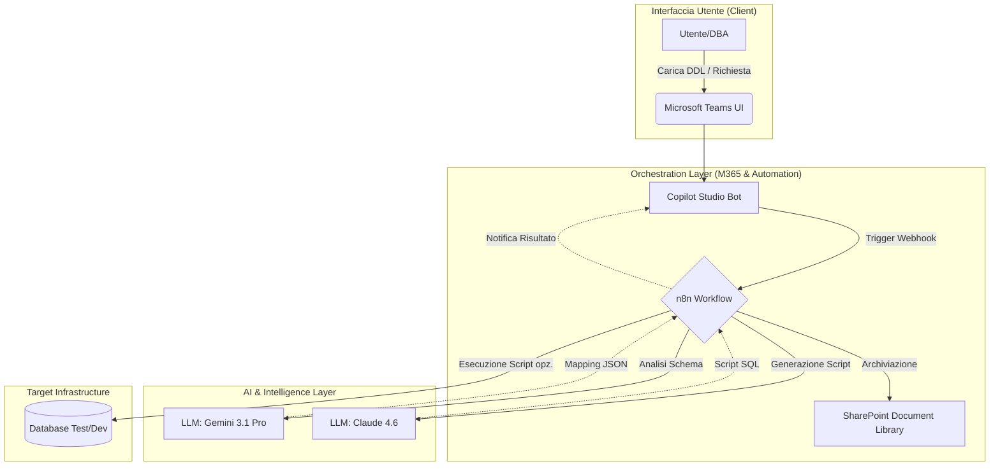
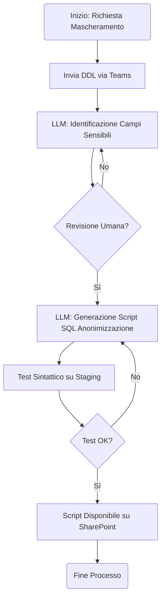
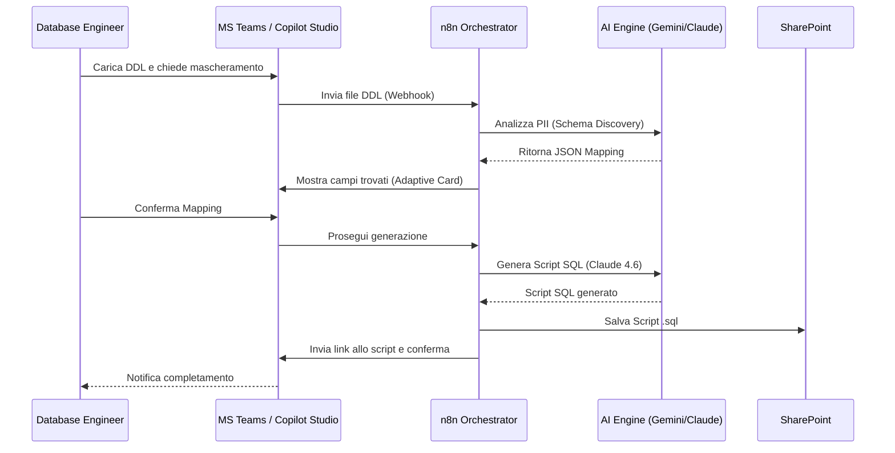

# Blueprint GenAI: Efficentamento del "Mascheramento e Anonimizzazione Dati"

## 1. Descrizione del Caso d'Uso
**ID Riga CSV:** 35
**Categoria:** Database Management
**Titolo:** Mascheramento e Anonimizzazione Dati
**Ruolo:** Database Engineer
**Obiettivo Originale (da CSV):** Implementazione di script e procedure per offuscare, anonimizzare o pseudonimizzare i dati sensibili (PII) durante le operazioni di copia dei database di produzione verso gli ambienti di test e sviluppo, garantendo compliance GDPR.
**Obiettivo GenAI:** Automatizzare l'identificazione delle colonne contenenti PII (Personally Identifiable Information) all'interno degli schemi database e generare istantaneamente script SQL di mascheramento personalizzati (Data Masking DDL/DML), riducendo l'analisi manuale degli schemi complessi.

## 2. Fasi del Processo Efficentato

### Fase 1: Discovery Intelligente PII e Mapping
L'utente carica lo schema del database (DDL) o un sample di metadati. L'AI analizza nomi delle colonne, tipi di dato e vincoli per identificare automaticamente i campi sensibili (nomi, email, IBAN, codici fiscali).
*   **Tool Principale Consigliato:** `n8n` (per orchestrazione) integrato con `gemini-cli`.
*   **Alternative:** 1. `accenture ametyst`, 2. `ChatGPT Agent`.
*   **Modelli LLM Suggeriti:** Google Gemini 3.1 Pro (ottimo per analisi di schemi massivi grazie alla finestra di contesto).
*   **Modalità di Utilizzo:** Script bash che invia il DDL al modello tramite API.
    *   **Bozza Prompt (Discovery):** 
    ```text
    Analizza il seguente schema SQL e identifica tutte le colonne che contengono dati PII (nomi, cognomi, contatti, dati finanziari). 
    Restituisci un JSON con: { "tabella": "nome_tabella", "colonna": "nome_colonna", "tipo_pii": "email/name/ecc", "azione_suggerita": "hash/mask/scramble" }.
    Schema: [INSERIRE DDL QUI]
    ```
*   **Azione Umana Richiesta:** Validazione del report JSON generato per confermare i campi identificati.
*   **Stima Reale di Efficienza:** 
    *   *Tempo As-Is (Manuale):* 4 ore (analisi manuale di centinaia di tabelle).
    *   *Tempo To-Be (GenAI):* 5 minuti.
    *   *Risparmio %:* 98%.
    *   *Motivazione:* L'AI riconosce pattern semantici nei nomi delle colonne che sfuggono a filtri regex statici.

### Fase 2: Generazione Script di Mascheramento
Sulla base del mapping validato, l'AI genera lo script SQL (es. T-SQL, PL/SQL, PostgreSQL) che implementa le logiche di anonimizzazione (es. rimpiazzo con dati fittizi, hashing dinamico).
*   **Tool Principale Consigliato:** `visualstudio + copilot` (per rifinitura) o `n8n` (per generazione batch).
*   **Alternative:** 1. `claude-code`, 2. `OpenAI Codex`.
*   **Modelli LLM Suggeriti:** Anthropic Claude Sonnet 4.6 (eccellenza nella generazione di codice SQL sintatticamente corretto).
*   **Modalità di Utilizzo:** Workflow automatico che riceve il JSON della Fase 1 e produce il file `.sql`.
    *   **Bozza System Prompt:** 
    ```text
    Sei un esperto DBA. Genera uno script di mascheramento per le colonne fornite nel JSON. 
    Usa funzioni deterministiche dove possibile per mantenere la referenzialità. 
    Assicurati che i dati mascherati rispettino i vincoli di tipo (es. email valida, lunghezza corretta).
    ```
*   **Azione Umana Richiesta:** Test dello script su un database di staging.
*   **Stima Reale di Efficienza:** 
    *   *Tempo As-Is (Manuale):* 3 ore (scrittura e test degli script).
    *   *Tempo To-Be (GenAI):* 10 minuti.
    *   *Risparmio %:* 94%.
    *   *Motivazione:* Eliminazione della scrittura boilerplate per ogni singola tabella.

### Fase 3: Interfaccia di Controllo su Microsoft Teams
Il Database Engineer interagisce con il processo tramite un bot su Teams per richiedere il mascheramento di una nuova tabella o per ricevere alert sulla compliance.
*   **Tool Principale Consigliato:** `copilot studio` integrato su **Microsoft Teams**.
*   **Alternative:** 1. `n8n` (con nodo Teams), 2. `AI-Studio Google` (per dashboard web).
*   **Modelli LLM Suggeriti:** OpenAI GPT-5.4 (ottimizzato per interazioni conversazionali e agentiche).
*   **Modalità di Utilizzo:** Chatbot che accetta il nome della tabella o il file DDL e restituisce lo script pronto all'uso.
*   **Azione Umana Richiesta:** Approvazione finale ("Approve/Reject") tramite pulsanti adattivi in Teams.
*   **Stima Reale di Efficienza:** 
    *   *Tempo As-Is (Manuale):* 1 ora (gestione ticket e comunicazioni).
    *   *Tempo To-Be (GenAI):* 2 minuti.
    *   *Risparmio %:* 96%.
    *   *Motivazione:* Centralizzazione dell'attività in un'interfaccia familiare senza cambiare contesto applicativo.

## 3. Descrizione del Flusso Logico
Il flusso è configurato come un approccio **Single-Agent** orchestrato da **n8n**. Il Database Engineer carica il file DDL dello schema di produzione su uno SharePoint dedicato o direttamente tramite la chat di Microsoft Teams. Il bot (Copilot Studio) intercetta il file e lo invia a un workflow n8n. Qui, un nodo LLM (Gemini 3.1 Pro) analizza lo schema per mappare i PII. Il risultato viene presentato all'utente su Teams per validazione. Una volta approvato, un secondo nodo LLM (Claude 4.6) genera lo script SQL specifico per il dialetto del DB target. Lo script finale viene salvato su SharePoint e il link viene inviato all'utente via Teams.

## 4. Diagrammi UML (Mermaid.js)

### 4.1 Application & System Architecture Schematic


### 4.2 Process Diagram


### 4.3 Sequence Diagram


## 5. Guida all'Implementazione Tecnica

### Prerequisiti
- Licenza **Microsoft 365** con accesso a Teams e SharePoint.
- Account **n8n** (Cloud o Self-hosted).
- API Key per **Google Gemini** (via Google AI Studio) e **Anthropic Claude**.
- Licenza **Copilot Studio** per la pubblicazione del bot.

### Step 1: Configurazione Workflow n8n
1. Crea un nuovo workflow con un nodo **Webhook** (metodo POST).
2. Aggiungi un nodo **AI Agent** (o nodi LLM separati).
3. Configura il primo nodo LLM con il prompt di "Discovery PII" utilizzando il modello `gemini-3.1-pro`.
4. Inserisci un nodo **Wait for Webhook** o un'integrazione con Teams per attendere l'approvazione dell'utente.
5. Configura le credenziali API per i modelli scelti.

### Step 2: Creazione Bot su Copilot Studio
1. Accedi a [Copilot Studio](https://copilotstudio.microsoft.com/).
2. Crea un nuovo bot denominato "DB Masking Assistant".
3. Definisci un Topic "Maschera Database" che richiede l'upload di un file.
4. Usa l'azione **Call an Action** per richiamare il webhook di n8n.
5. Configura la risposta del bot per mostrare i campi identificati tramite una **Adaptive Card**.

### Step 3: Integrazione Canale Teams
1. In Copilot Studio, vai nella sezione **Channels**.
2. Seleziona **Microsoft Teams** e clicca su **Turn on Teams**.
3. Pubblica il bot e distribuiscilo agli utenti del team Database Management.

## 6. Rischi e Mitigazioni
- **Rischio: Mancata identificazione di un campo sensibile (Falso Negativo).**  
  *Mitigazione:* Human-in-the-loop obbligatorio; l'AI presenta un report che l'esperto deve validare prima della generazione dello script.
- **Rischio: Lo script SQL corrompe l'integrità referenziale.**  
  *Mitigazione:* Utilizzo di LLM avanzati (Claude 4.6) con istruzioni specifiche per il mantenimento dei Foreign Key constraints e test automatico su DB di staging.
- **Rischio: Esposizione dati PII nei log dell'AI.**  
  *Mitigazione:* Inviare all'LLM solo i metadati (nomi colonne/tipi) e non i dati reali di produzione, oppure utilizzare **OpenClaw** con modelli locali per dati estremamente sensibili.
