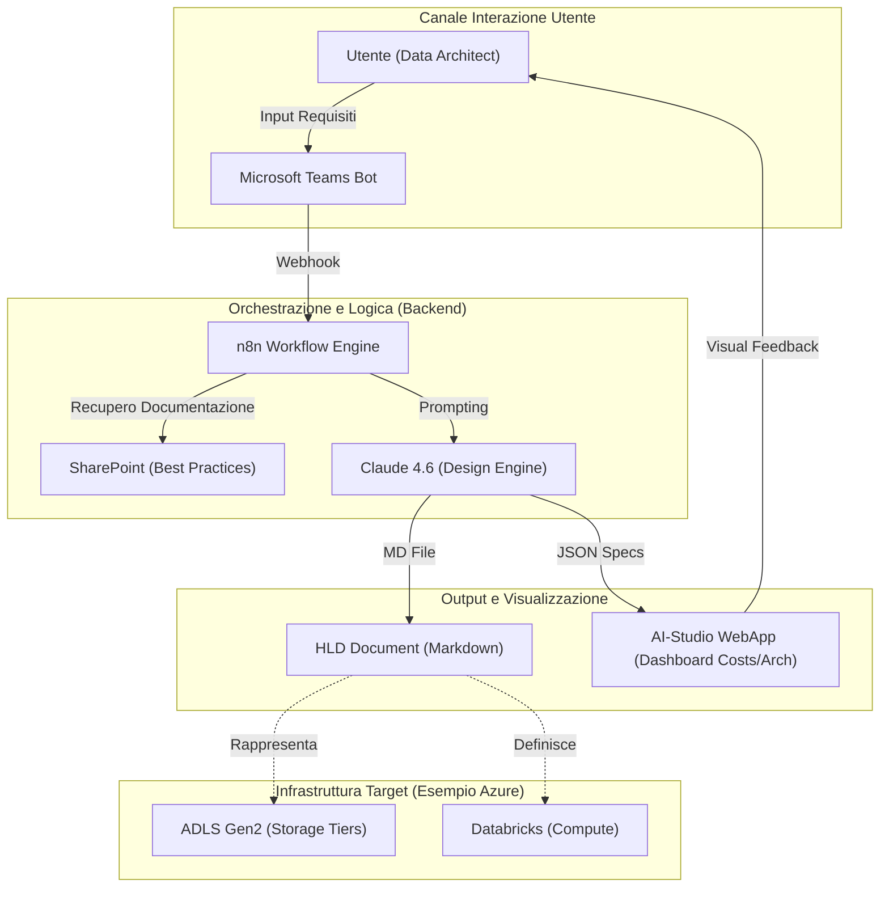
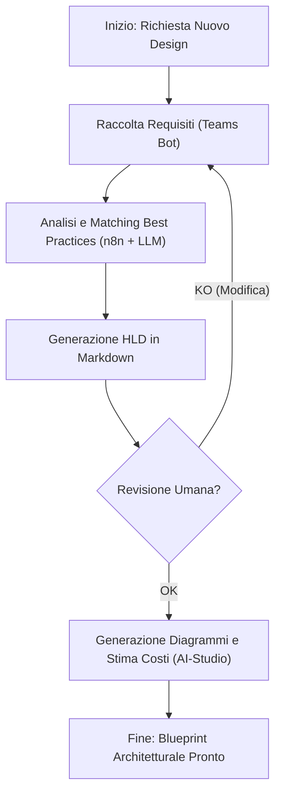
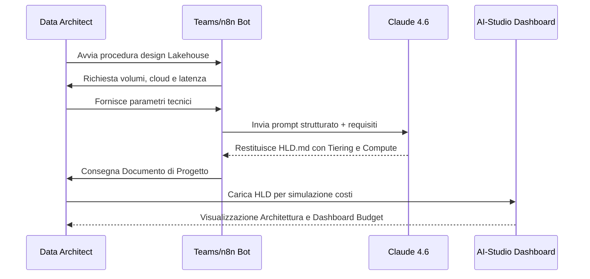

# Blueprint GenAI: Efficentamento della "Progettazione Data Lakehouse"

## 1. Descrizione del Caso d'Uso
**Categoria:** Database Management
**Titolo:** Progettazione Data Lakehouse
**Ruolo:** Data Architect
**Obiettivo Originale (da CSV):** Design architetturale di un Data Lakehouse per l'ingestion, la conservazione e l'analisi di dati strutturati e non strutturati. Definizione dei tier di storage (es. S3/ADLS) e dei layer di calcolo (es. Databricks/Snowflake).
**Obiettivo GenAI:** Automatizzare la generazione di un documento di High-Level Design (HLD) per un Data Lakehouse, definendo in modo intelligente i tier di storage (Bronze, Silver, Gold), le strategie di partizionamento, i formati (Parquet/Delta/Iceberg) e la selezione ottimale del layer di calcolo (Databricks, Snowflake o Native Cloud Tools) sulla base dei requisiti di throughput e latenza forniti dall'utente.

## 2. Fasi del Processo Efficentato

### Fase 1: Ingestion dei Requisiti Tecnici
In questa fase, l'utente interagisce con un bot su Microsoft Teams per fornire i parametri chiave: volumi di dati, sorgenti (Batch/Real-time), requisiti di governance e cloud provider di riferimento.
*   **Tool Principale Consigliato:** Microsoft Teams (Chatbot UI) + n8n
*   **Alternative:** 1. Accenture Amethyst (per analisi requisiti complessi), 2. ChatGPT Agent (Custom GPT)
*   **Modelli LLM Suggeriti:** OpenAI GPT-5.4 o Google Gemini 3 Deep Think
*   **Modalità di Utilizzo:** Configurazione di un workflow n8n che espone un Webhook a un bot Teams. Il bot guida l'utente con una serie di domande strutturate.
    *   **Bozza System Prompt per Bot Teams:**
        ```text
        Sei un Senior Data Architect AI. Il tuo compito è raccogliere i requisiti per la progettazione di un Data Lakehouse. 
        Chiedi all'utente in modo sequenziale: 
        1. Cloud Provider (Azure/AWS/GCP/On-prem).
        2. Volume stimato giornaliero (GB/TB).
        3. Frequenza di aggiornamento (Real-time vs Batch).
        4. Tipologia dati (CSV, JSON, SQL, Immagini).
        5. Destinazione d'uso (BI, ML, Reporting).
        Salva le risposte e passale allo step successivo di generazione design.
        ```
*   **Azione Umana Richiesta:** L'architetto deve confermare la completezza dei dati raccolti dal bot.
*   **Stima Reale di Efficienza:** 
    *   *Tempo As-Is (Manuale):* 2 ore (meeting e raccolta manuale).
    *   *Tempo To-Be (GenAI):* 10 minuti.
    *   *Risparmio %:* 92%.
    *   *Motivazione:* Eliminazione di meeting ridondanti grazie alla raccolta asincrona e strutturata dei dati.

### Fase 2: Sintesi Architetturale e Generazione HLD
L'LLM elabora i dati raccolti per generare la proposta di tiering (S3/ADLS), i motori di calcolo (Databricks Clusters, Snowflake Warehouses) e le policy di data retention.
*   **Tool Principale Consigliato:** claude-code
*   **Alternative:** 1. gemini-cli, 2. VisualStudio + Copilot
*   **Modelli LLM Suggeriti:** Anthropic Claude Sonnet 4.6 (per la sua eccellenza nella strutturazione di logiche dati complesse)
*   **Modalità di Utilizzo:** Utilizzo di `claude-code` via CLI per generare un file Markdown strutturato con il design completo, includendo tabelle di confronto costi e performance.
    *   **Esempio di comando CLI:**
        ```bash
        claude-code "Genera un HLD per un Data Lakehouse su Azure basato su ADLS Gen2 e Databricks. Definisci i tier Bronze (Raw), Silver (Cleaned) e Gold (Business Ready). Specifica i formati Delta Lake e i criteri di partizionamento per dati di vendita globali." > HLD_Lakehouse_Design.md
        ```
*   **Azione Umana Richiesta:** Revisione critica dei tier proposti e della configurazione dei cluster di calcolo.
*   **Stima Reale di Efficienza:** 
    *   *Tempo As-Is (Manuale):* 6 ore (scrittura documento e ricerca best practices).
    *   *Tempo To-Be (GenAI):* 15 minuti.
    *   *Risparmio %:* 96%.
    *   *Motivazione:* L'AI conosce istantaneamente le quote e le best practices aggiornate dei vari cloud provider.

### Fase 3: Visualizzazione Architettura e Validazione Costi
Generazione automatica dei diagrammi architetturali e stima dei costi del cloud provider scelto.
*   **Tool Principale Consigliato:** AI-Studio Google (per Build di una Dashboard interattiva FE)
*   **Alternative:** 1. Mermaid.js (via Claude), 2. n8n (con integrazione API Cloud Cost)
*   **Modelli LLM Suggeriti:** Google Gemini 3.1 Pro
*   **Modalità di Utilizzo:** Utilizzo della funzione "Build" di AI-Studio per creare una mini-web-app che visualizza graficamente l'architettura proposta e permette all'utente di variare i volumi di dati per vedere l'impatto sui costi stimati in tempo reale.
*   **Azione Umana Richiesta:** Approvazione finale del design e del budget stimato.
*   **Stima Reale di Efficienza:** 
    *   *Tempo As-Is (Manuale):* 4 ore (disegno diagrammi in Visio/Lucidchart e calcolo manuale costi).
    *   *Tempo To-Be (GenAI):* 20 minuti.
    *   *Risparmio %:* 91%.
    *   *Motivazione:* Generazione istantanea di grafici e calcoli economici tramite modelli di ragionamento.

## 3. Descrizione del Flusso Logico
Il flusso è lineare e segue un approccio **Single-Agent** potenziato da workflow di orchestrazione (n8n). Il processo inizia con un bot Teams (UI familiare) che funge da interfaccia per l'ingestion dei requisiti. I dati vengono passati a un agente di design (Claude) che redige il documento tecnico HLD. Infine, i parametri architetturali vengono inviati a una WebApp generata in AI-Studio per la visualizzazione e la stima economica. Questo approccio evita la complessità di una rete multi-agente, mantenendo la responsabilità della decisione finale sull'architetto umano (Human-in-the-loop).

## 4. Diagrammi UML (Mermaid.js)

### 4.1 Application & System Architecture Diagram


### 4.2 Process Diagram


### 4.3 Sequence Diagram


## 5. Guida all'Implementazione Tecnica

### Prerequisiti
- Account **n8n** (Cloud o Self-hosted).
- Licenza **Microsoft Teams** con accesso a Copilot Studio o Developer Portal.
- API Key per **Anthropic Claude** (Claude 4.6).
- Accesso a **Google AI-Studio**.
- Repository **SharePoint** contenente i template HLD aziendali.

### Step 1: Configurazione n8n e Teams
1. Crea un workflow in n8n con un nodo "Microsoft Teams Trigger".
2. Configura una serie di nodi "Question" per guidare l'architetto nella definizione dello scope.
3. Integra un nodo "HTTP Request" per inviare il payload finale (JSON con i requisiti) all'LLM.

### Step 2: Ingegneria del Prompt (Generazione HLD)
Configura il nodo LLM in n8n (o usa `claude-code`) con il seguente **System Prompt**:
```text
Sei un esperto di architetture Big Data. Genera un documento HLD per un Data Lakehouse.
Usa la struttura:
1. Executive Summary.
2. Tiering Strategy (Bronze: Parquet Raw, Silver: Delta Optimized, Gold: Business Views).
3. Compute Strategy (es. Databricks SQL Warehouse con Autoscaling).
4. Data Governance & Security (IAM, Unity Catalog).
5. Tabella Comparativa Formati (Delta vs Iceberg).
```

### Step 3: Visualizzazione in AI-Studio
1. Entra in AI-Studio.
2. Carica lo schema JSON generato dallo step precedente.
3. Usa la funzione "Build App" descrivendo: "Crea una dashboard che mostri i tier del Data Lakehouse come blocchi logici e permetta di calcolare il costo mensile variando uno slider dei Terabyte gestiti".

## 6. Rischi e Mitigazioni
- **Rischio 1: Scelta sottodimensionata delle istanze di calcolo** -> **Mitigazione:** Inserire nel prompt un vincolo di "Buffer del 20%" sulla capacità calcolata e validazione obbligatoria dell'architetto.
- **Rischio 2: Esposizione dati sensibili nel prompt** -> **Mitigazione:** Utilizzare istanze Enterprise (Accenture Amethyst o OpenClaw) per garantire che i dati del cliente non vengano usati per il training pubblico dei modelli.
- **Rischio 3: Incompatibilità tra formati storage (es. Delta vs Hudi)** -> **Mitigazione:** Il sistema deve sempre generare una matrice di compatibilità basata sulle versioni correnti del cloud provider scelto.
