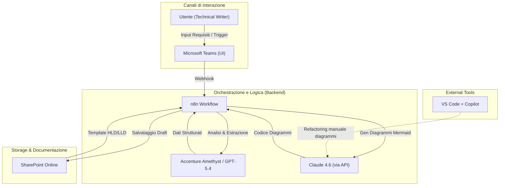
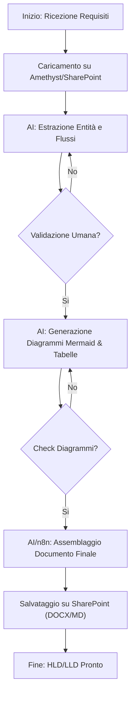
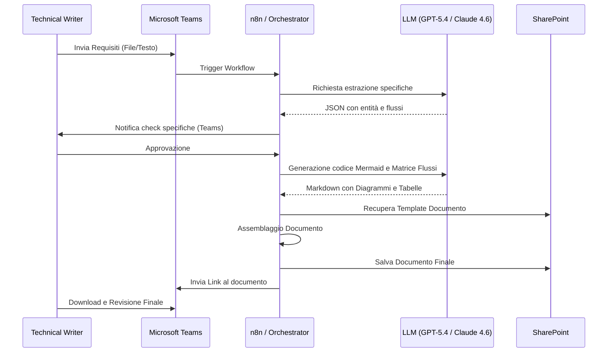

# Blueprint GenAI: Efficentamento della "Realizzazione HLD e LLD"

## 1. Descrizione del Caso d'Uso
**Categoria:** Documentation
**Titolo:** Realizzazione HLD e LLD
**Ruolo:** Technical Writer
**Obiettivo Originale (da CSV):** Stesura e aggiornamento continuo di High Level Design (HLD) e Low Level Design (LLD) a partire dai requisiti di business. Traduzione delle specifiche in diagrammi di rete, tabelle di dimensionamento e matrici dei flussi di comunicazione.
**Obiettivo GenAI:** Automatizzare la generazione di documenti tecnici strutturati (HLD/LLD), inclusi diagrammi in formato Mermaid.js, tabelle di dimensionamento e matrici dei flussi, partendo da requisiti grezzi o verbali di riunione tecnica.

## 2. Fasi del Processo Efficentato

### Fase 1: Analisi Requisiti ed Estrazione Specifiche
In questa fase, l'LLM analizza i documenti di input (requisiti di business, email, appunti di workshop) per estrarre le entità architetturali, i vincoli di rete e le necessità di dimensionamento.
*   **Tool Principale Consigliato:** `accenture ametyst`
*   **Alternative:** 1. ChatGPT Agent (Enterprise), 2. Claude-Code (per analisi input tecnici)
*   **Modelli LLM Suggeriti:** OpenAI GPT-5.4 (per capacità di sintesi e ragionamento logico)
*   **Modalità di Utilizzo:** Caricamento dei file di input in una sessione protetta di Amethyst. Utilizzo di un System Prompt specifico per l'estrazione dei dati in formato JSON o Markdown tabellare.
    *   *Esempio Prompt:* "Analizza i seguenti requisiti e identifica: 1. Nodi di rete, 2. Protocolli di comunicazione, 3. Requisiti di calcolo (CPU/RAM/Storage), 4. Vincoli di sicurezza. Produci una tabella riassuntiva."
*   **Azione Umana Richiesta:** Validazione della tabella dei requisiti estratti per confermare che non vi siano omissioni critiche.
*   **Stima Reale di Efficienza:** 
    *   *Tempo As-Is (Manuale):* 4 ore
    *   *Tempo To-Be (GenAI):* 20 minuti
    *   *Risparmio %:* 92%
    *   *Motivazione:* L'AI elimina la lettura manuale sequenziale e la sintesi manuale dei documenti sparsi.

### Fase 2: Generazione Diagrammi e Matrici dei Flussi
Generazione automatica del codice Mermaid.js per diagrammi di rete e sequenza, e della matrice dei flussi (Source, Destination, Port, Protocol).
*   **Tool Principale Consigliato:** `visualstudio + copilot`
*   **Alternative:** 1. AI-Studio Google (per visualizzazione), 2. gemini-cli
*   **Modelli LLM Suggeriti:** Anthropic Claude Sonnet 4.6 (eccellente nella generazione di codice Mermaid privo di errori sintattici)
*   **Modalità di Utilizzo:** Inserimento della sintesi della Fase 1 nel Copilot di VS Code con richiesta di generazione diagramma.
    *   *Esempio Prompt:* "Basandoti sulla lista dei nodi [X, Y, Z], genera un diagramma Mermaid `flowchart TD` che rappresenti l'architettura di rete DMZ e una tabella Markdown per la matrice dei flussi firewall."
*   **Azione Umana Richiesta:** Revisione tecnica del diagramma (check logico dei collegamenti).
*   **Stima Reale di Efficienza:** 
    *   *Tempo As-Is (Manuale):* 6 ore (disegno manuale su Visio/Draw.io)
    *   *Tempo To-Be (GenAI):* 30 minuti
    *   *Risparmio %:* 91%
    *   *Motivazione:* Il passaggio dal testo al diagramma vettoriale è istantaneo; la modifica del diagramma avviene via prompt invece che trascinando icone.

### Fase 3: Assemblaggio Documento HLD/LLD
Unione delle sezioni testuali, diagrammi e tabelle in un template standard di progetto.
*   **Tool Principale Consigliato:** `n8n` (per orchestrazione e salvataggio su SharePoint)
*   **Alternative:** 1. Microsoft Teams (Chatbot UI per trigger), 2. Copilot Studio
*   **Modelli LLM Suggeriti:** Google Gemini 3.1 Pro (per gestire context window ampie durante l'assemblaggio di documenti lunghi)
*   **Modalità di Utilizzo:** Workflow n8n che prende gli output delle fasi precedenti, li inserisce in un file `.md` o `.docx` basato su un template aziendale e lo salva in una cartella SharePoint dedicata.
*   **Azione Umana Richiesta:** Revisione finale del Technical Writer per lo stile linguistico e la formattazione.
*   **Stima Reale di Efficienza:** 
    *   *Tempo As-Is (Manuale):* 6 ore
    *   *Tempo To-Be (GenAI):* 10 minuti
    *   *Risparmio %:* 97%
    *   *Motivazione:* L'automazione del "copia-incolla" e della formattazione strutturata abbatte i tempi morti di editing.

## 3. Descrizione del Flusso Logico
Il flusso è gestito da un approccio **Single-Agent** (Technical Design Assistant). L'agente riceve i requisiti iniziali tramite un'interfaccia Teams (connessa a n8n) o direttamente in Amethyst. L'agente esegue tre task sequenziali: analisi, generazione tecnica (diagrammi/tabelle) e formattazione finale. I dati persistono su **SharePoint** per garantire il versionamento. L'umano interviene come "Validatore" ad ogni checkpoint critico (fine analisi e fine generazione diagrammi) per assicurare la coerenza tecnica prima della produzione del documento finale.

## 4. Diagrammi UML (Mermaid.js)

### 4.1 Application & System Architecture Schematic

### 4.2 Process Diagram

### 4.3 Sequence Diagram

## 5. Guida all'Implementazione Tecnica

### Prerequisiti
- Accesso ad **Accenture Amethyst** (ambiente sandbox sicuro).
- Licenza **n8n** (self-hosted o cloud) con credenziali SharePoint.
- Licenza **Claude API** o **OpenAI API** (tramite Amethyst o Azure OpenAI).
- Repository **SharePoint** con cartelle "Input", "Templates" e "Output".

### Step 1: Configurazione n8n
1. Creare un workflow con un nodo **HTTP Webhook** (ricezione da Teams) o **SharePoint Trigger** (nuovo file caricato).
2. Aggiungere nodi **AI Agent** o **HTTP Request** per chiamare gli LLM (GPT-5.4 per il testo, Claude 4.6 per Mermaid).
3. Configurare il prompt di sistema dell'agente con le specifiche del template HLD/LLD aziendale.

### Step 2: Definizione dei Prompt di Generazione
Configurare un "System Message" per l'LLM:
*"Sei un assistente alla documentazione tecnica. Riceverai requisiti grezzi. Produci l'output in formato Markdown. Per i diagrammi usa ESCLUSIVAMENTE la sintassi Mermaid.js `flowchart TD`. Per le tabelle di dimensionamento usa il formato Markdown standard. Mantieni un tono professionale e tecnico."*

### Step 3: Integrazione Teams
1. Utilizzare **Copilot Studio** o un semplice bot n8n per creare una chat dove il Technical Writer può scrivere "Genera HLD per il progetto X" e allegare i file.

## 6. Rischi e Mitigazioni
- **Rischio: Errori Sintattici Mermaid:** L'AI potrebbe generare codice Mermaid che non renderizza correttamente. -> **Mitigazione:** Utilizzare Claude 4.6 (noto per l'eccellenza nel codice) e includere uno step di validazione visiva tramite plugin VS Code.
- **Rischio: Allucinazioni sui limiti HW:** L'AI potrebbe suggerire dimensionamenti errati. -> **Mitigazione:** L'agente deve sempre citare la fonte del requisito o utilizzare un VectorDB (RAG) caricato con le "Standard Reference Architecture" aziendali.
- **Rischio: Sicurezza Dati:** Trattamento di dati sensibili del cliente. -> **Mitigazione:** Utilizzo esclusivo di **Accenture Amethyst** o istanze Enterprise (Azure OpenAI) che garantiscono il non-allenamento dei modelli sui dati di input.
