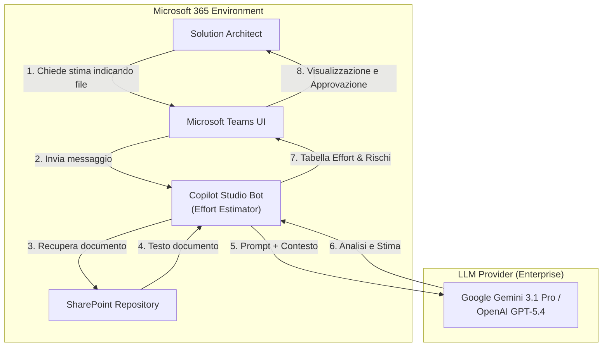
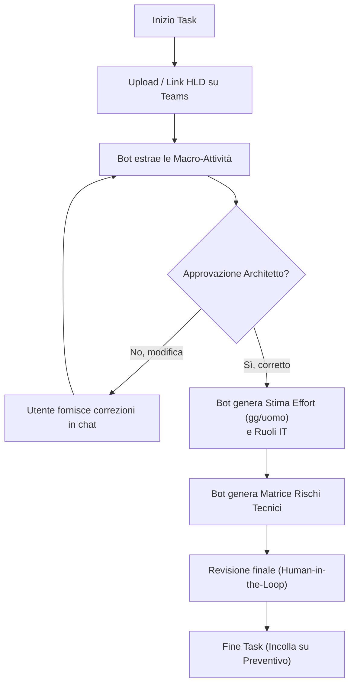
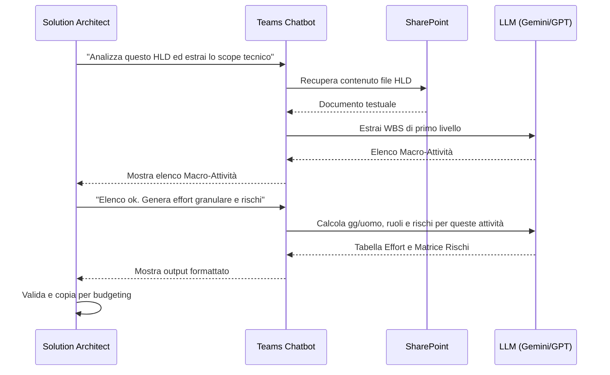

# Blueprint GenAI: Efficentamento del "Stima Effort Tecnico (Technical Scoping)"

## 1. Descrizione del Caso d'Uso
**Categoria:** Governance & PM
**Titolo:** Stima Effort Tecnico (Technical Scoping)
**Ruolo:** Solution Architect
**Obiettivo Originale (da CSV):** Valutazione granulare delle giornate/persona, delle competenze necessarie e dei rischi tecnologici associati alla realizzazione di una nuova architettura o migrazione, fornendo input cruciali in fase di prevendita o budgeting.
**Obiettivo GenAI:** Automatizzare l'estrazione delle macro-attività tecniche da un documento di progetto (es. HLD o Capitolato), generando istantaneamente una stima granulare delle giornate/persona, i profili necessari e la matrice dei rischi tramite un assistente conversazionale su Microsoft Teams.

## 2. Fasi del Processo Efficentato

### Fase 1: Ingestion Documentazione e Analisi Macro-Attività
Il Solution Architect fornisce in chat il documento di architettura o i requisiti del cliente (tramite link SharePoint o upload diretto). L'assistente analizza il documento ed estrae in automatico le macro-componenti tecnologiche da realizzare o migrare (WBS di primo livello).
*   **Tool Principale Consigliato:** `copilot studio` (per creazione bot e pubblicazione su Microsoft Teams)
*   **Alternative:** 1. `accenture ametyst`, 2. `Microsoft Teams (Chatbot UI)` integrato via n8n
*   **Modelli LLM Suggeriti:** Google Gemini 3.1 Pro o OpenAI GPT-5.4 (eccellenti per comprensione e contestualizzazione di ampi documenti tecnici)
*   **Modalità di Utilizzo:** Integrazione nativa dello SharePoint aziendale. L'utente invia un messaggio su Teams.
    *Bozza System Prompt per Copilot Studio:*
    ```markdown
    Sei un IT Solution Architect esperto in stime di effort. 
    Il tuo compito è leggere il documento di architettura fornito dall'utente.
    Estrai un elenco puntato delle "Macro-Attività Tecniche" (es. Setup Landing Zone, Migrazione DB Oracle, Configurazione WAF).
    Non stimare ancora nulla. Limitati a fornire la lista per l'approvazione dell'utente.
    ```
*   **Azione Umana Richiesta:** Il Solution Architect legge l'elenco generato dal bot, aggiunge eventuali task mancanti o rimuove quelli superflui, e dà l'ok per procedere alla stima.
*   **Stima Reale di Efficienza:** 
    *   *Tempo As-Is (Manuale):* 3 ore
    *   *Tempo To-Be (GenAI):* 15 minuti
    *   *Risparmio %:* 91%
    *   *Motivazione:* L'AI esegue una lettura analitica immediata del documento (spesso di decine di pagine) estraendo le componenti tecniche da implementare senza che l'utente debba leggerlo parola per parola.

### Fase 2: Generazione Stima Effort e Matrice Rischi
Una volta approvate le macro-attività, l'assistente compila una tabella con la scomposizione granulare (giornate/persona), i ruoli IT coinvolti (es. DevOps, DBA, Network Engineer) e una valutazione dei rischi tecnologici associati (es. downtime, incompatibilità).
*   **Tool Principale Consigliato:** `copilot studio`
*   **Alternative:** 1. `chatgpt agent`, 2. `gemini-cli`
*   **Modelli LLM Suggeriti:** Google Gemini 3.1 Pro o OpenAI GPT-5.4
*   **Modalità di Utilizzo:** Continuazione della conversazione su Teams.
    *Bozza Prompt Utente:*
    ```text
    Le macro-attività sono approvate. Ora genera una tabella Markdown con: 
    1. Task granulare 
    2. Ruolo IT richiesto 
    3. Stima Effort (min-max giornate/persona)
    A seguire, compila una Matrice dei Rischi Tecnologici con probabilità, impatto e azioni di mitigazione per questa specifica infrastruttura.
    ```
*   **Azione Umana Richiesta (Human-in-the-loop):** Validazione finale rigorosa. Il Solution Architect deve revisionare le stime (aggiustandole in base al contesto reale e alle capacità del team) e confermare le mitigazioni dei rischi prima dell'inserimento nel budget aziendale.
*   **Stima Reale di Efficienza:** 
    *   *Tempo As-Is (Manuale):* 4 ore
    *   *Tempo To-Be (GenAI):* 20 minuti
    *   *Risparmio %:* 91%
    *   *Motivazione:* La redazione della WBS dettagliata e l'identificazione standardizzata dei rischi richiedono solitamente un intenso lavoro di scrittura e consultazione storica. L'AI genera la base di lavoro in pochi secondi.

## 3. Descrizione del Flusso Logico
L'architettura proposta segue un approccio **Single-Agent** per massimizzare la semplicità operativa. Tutto il processo si svolge all'interno di Microsoft Teams tramite un chatbot creato in Copilot Studio. Il bot è dotato di connettori sicuri (SharePoint/OneDrive) che gli permettono di recuperare il documento architettonico indicato dall'utente. Il processo è diviso in due step per garantire il controllo (Human-in-the-loop): prima l'agente estrapola lo scope tecnico (che viene validato dall'Architetto) e solo successivamente genera i numeri (effort e ruoli) e i rischi. Al termine, l'utente può copiare le tabelle generate per incollarle nei sistemi di preventivazione aziendale.

## 4. Diagrammi UML (Mermaid.js)

### 4.1 Architecture Diagram


### 4.2 Process Diagram


### 4.3 Sequence Diagram


## 5. Guida all'Implementazione Tecnica
### Prerequisiti
- Licenza Microsoft Copilot Studio (o framework equivalente integrabile in Teams).
- Accesso ai repository SharePoint aziendali contenenti la documentazione tecnica.
- Subscription Enterprise per LLM (es. Azure OpenAI o Google Vertex AI) abilitato in Copilot Studio.

### Step 1: Creazione del Copilot in Copilot Studio
1. Accedere al portale di Microsoft Copilot Studio.
2. Cliccare su "Nuovo Copilot" e nominarlo `TechEffortEstimator`.
3. Nella sezione **Generative AI** (o System Prompt), incollare la bozza di prompt fornita nella Fase 1, definendo esplicitamente il ruolo di "IT Solution Architect esperto in stime".

### Step 2: Connessione ai Dati (SharePoint)
1. Andare nella sezione **Knowledge / Dati**.
2. Aggiungere una fonte dati selezionando "SharePoint".
3. Fornire l'URL del sito SharePoint aziendale dove risiedono i documenti di progetto. Questo permetterà al bot di accedere e leggere i file linkati in chat rispettando i permessi dell'utente che interroga il bot.

### Step 3: Test e Calibrazione delle Stime
1. Utilizzare il pannello di test di Copilot Studio.
2. Inviare un HLD fittizio e verificare la scomposizione della WBS.
3. Se l'effort stimato dall'AI è sistematicamente errato rispetto agli standard aziendali, aggiornare il System Prompt includendo alcune metriche base (es. *"Considera che una migrazione standard di un DB Oracle su AWS RDS richiede mediamente 5-7 gg/uomo"*).

### Step 4: Pubblicazione su Microsoft Teams
1. Andare nella sezione **Canali** (Channels) di Copilot Studio.
2. Selezionare "Microsoft Teams" e abilitare l'integrazione.
3. Copiare l'App ID generato o scaricare il manifest zip.
4. Caricare l'app nel centro di amministrazione di Teams o condividerla direttamente con il gruppo "Infrastrutture T&A".

## 6. Rischi e Mitigazioni
- **Rischio 1 (Sottostima/Sovrastima Effort):** L'LLM potrebbe non avere contezza delle effettive velocità e capacità tecniche del team interno, producendo stime irrealistiche. -> **Mitigazione:** Processo strettamente *Human-in-the-loop*. Le tabelle generate dal bot sono considerate "Draft". È obbligo del Solution Architect ricalibrare i giorni inserendo il giudizio esperto.
- **Rischio 2 (Rischi Generici):** La matrice dei rischi prodotta potrebbe essere troppo teorica o vaga. -> **Mitigazione:** Istruire l'agente (tramite System Prompt) a concentrarsi solo su rischi puramente infrastrutturali (es. *Latenza di rete tra on-prem e cloud*, *Incompatibilità versione OS*), escludendo rischi organizzativi o commerciali.
- **Rischio 3 (Data Privacy):** I documenti HLD spesso contengono architetture sensibili dei clienti. -> **Mitigazione:** L'utilizzo esclusivo di tenant Enterprise (Copilot Studio protetto, Azure OpenAI / Google Workspace) garantisce che i dati non vengano utilizzati per l'addestramento dei modelli pubblici.