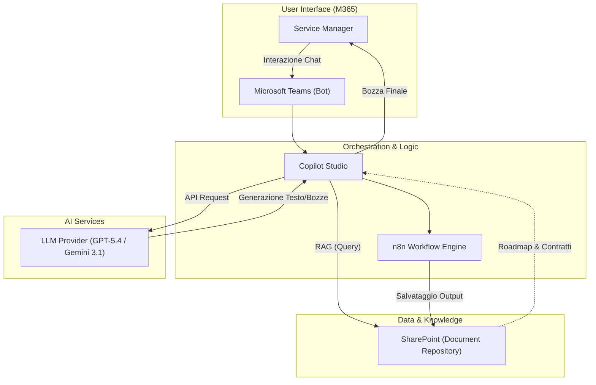
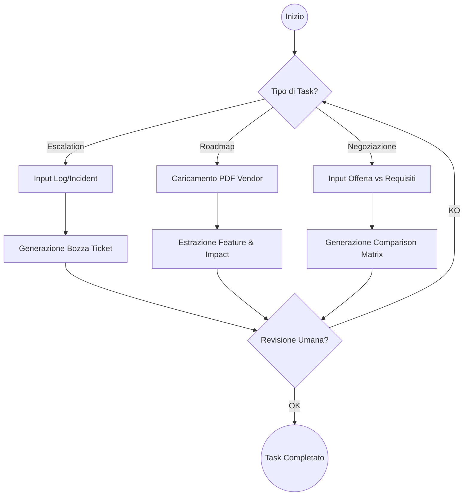
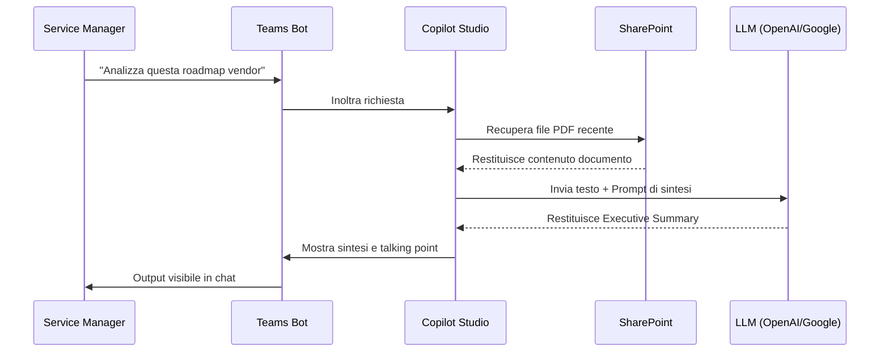

# Blueprint GenAI: Efficentamento del "Gestione Fornitori e Vendor IT"

## 1. Descrizione del Caso d'Uso
**Categoria:** Governance & PM
**Titolo:** Gestione Fornitori e Vendor IT
**Ruolo:** Service Manager
**Obiettivo Originale (da CSV):** Interazione tecnica con i fornitori di cloud provider o vendor software per la gestione delle escalation di supporto (apertura ticket vendor), valutazione di nuove roadmap di prodotto e negoziazione tecnica delle soluzioni.
**Obiettivo GenAI:** Automatizzare la sintesi delle roadmap dei vendor, la generazione di bozze per ticket di escalation tecnica e la creazione di matrici di confronto per la negoziazione, centralizzando l'interazione su Microsoft Teams.

## 2. Fasi del Processo Efficentato

### Fase 1: Supporto all'Escalation (Ticket Drafting)
L'utente fornisce i dettagli di un incidente interno o un log di errore e l'AI genera una bozza formale di escalation tecnica per il vendor (es. Microsoft, AWS, Oracle), adattando il linguaggio ai requisiti del supporto "Premier/Enterprise".
*   **Tool Principale Consigliato:** Accenture Amethyst (per la protezione dei dati sensibili dei log).
*   **Alternative:** 1. Microsoft Teams (Chatbot UI) via Copilot Studio, 2. gemini-cli.
*   **Modelli LLM Suggeriti:** OpenAI GPT-5.4 (per la precisione nel tono formale e tecnico).
*   **Modalità di Utilizzo:** Creazione di un "Escalation Agent" che riceve in input l'Incident Report e produce un file .txt pronto per il portale vendor.
    *   **Bozza Prompt:** *"Agisci come un Senior Service Manager. Analizza questo log di errore [LOG] e scrivi una richiesta di escalation tecnica per il supporto AWS Support. Includi: Severità (Business Impact), Passi per riprodurre, Analisi tecnica preliminare e Richiesta di intervento immediato."*
*   **Azione Umana Richiesta:** Revisione finale della bozza prima dell'invio sul portale del vendor.
*   **Stima Reale di Efficienza:** 
    *   *Tempo As-Is (Manuale):* 45 minuti (raccolta log + scrittura formale).
    *   *Tempo To-Be (GenAI):* 5 minuti.
    *   *Risparmio %:* 89%
    *   *Motivazione:* L'AI struttura istantaneamente i dati tecnici in un formato standard accettato dai vendor.

### Fase 2: Analisi Roadmap e Release Notes
Ingestion automatica di documenti PDF o link web riguardanti le roadmap di prodotto dei vendor per estrarre solo le feature rilevanti per l'infrastruttura T&A aziendale.
*   **Tool Principale Consigliato:** n8n (per workflow di ingestion) + SharePoint (repository).
*   **Alternative:** 1. Claude-code (per analisi documentazione tecnica estesa), 2. ChatGPT Agent.
*   **Modelli LLM Suggeriti:** Google Gemini 3.1 Pro (per l'ampia context window necessaria ad analizzare lunghi documenti di roadmap).
*   **Modalità di Utilizzo:** Un workflow n8n monitora una cartella SharePoint. Al caricamento di un PDF "Roadmap_Vendor.pdf", l'AI genera un Executive Summary di 1 pagina evidenziando impatti su costi, sicurezza e obsolescenza.
*   **Azione Umana Richiesta:** Validazione della pertinenza delle feature estratte rispetto al piano strategico annuale.
*   **Stima Reale di Efficienza:** 
    *   *Tempo As-Is (Manuale):* 2 ore (lettura integrale e sintesi).
    *   *Tempo To-Be (GenAI):* 10 minuti.
    *   *Risparmio %:* 92%
    *   *Motivazione:* L'AI filtra il "rumore" del marketing vendor focalizzandosi sui dati tecnici e di timeline.

### Fase 3: Supporto alla Negoziazione Tecnica
Confronto tra i requisiti tecnici interni e l'offerta del vendor per identificare gap o punti di forza durante i meeting di revisione contrattuale.
*   **Tool Principale Consigliato:** Microsoft Teams (Chatbot UI) via Copilot Studio.
*   **Alternative:** 1. Accenture Amethyst, 2. AI-Studio Google (per dashboard di confronto).
*   **Modelli LLM Suggeriti:** Anthropic Claude 4.6 Sonnet (per capacità di ragionamento logico-comparativo).
*   **Modalità di Utilizzo:** Bot su Teams configurato per accedere via RAG (Retrieval-Augmented Generation) ai capitolati tecnici interni e alle offerte vendor salvate su SharePoint.
*   **Azione Umana Richiesta:** Utilizzo dei talking point generati durante il meeting con il vendor.
*   **Stima Reale di Efficienza:** 
    *   *Tempo As-Is (Manuale):* 3 ore (cross-check manuale dei documenti).
    *   *Tempo To-Be (GenAI):* 15 minuti.
    *   *Risparmio %:* 91%
    *   *Motivazione:* Recupero immediato dei requisiti non soddisfatti dall'offerta vendor.

## 3. Descrizione del Flusso Logico
Il flusso è progettato come un approccio **Single-Agent** orchestrato da **Copilot Studio** su Teams, che funge da punto di ingresso unico per il Service Manager. 
1. Il Service Manager interagisce con il Bot chiedendo assistenza per un'attività specifica (Escalation, Roadmap o Negoziazione).
2. Il Bot utilizza connettori nativi per leggere i documenti necessari da **SharePoint**.
3. Se l'attività richiede automazione di file (es. salvataggio sintesi), viene attivato un workflow **n8n** tramite Webhook.
4. L'output finale viene restituito direttamente nella chat di Teams o salvato come file pronto all'uso.

## 4. Diagrammi UML (Mermaid.js)

### 4.1 Architecture Diagram

### 4.2 Process Diagram

### 4.3 Sequence Diagram

## 5. Guida all'Implementazione Tecnica

### Prerequisiti
- Licenza **Microsoft Copilot Studio**.
- Accesso a un'istanza **n8n** (Cloud o Self-hosted) per automazioni avanzate.
- Repository **SharePoint** strutturato (Cartelle: `/Roadmaps`, `/Escalations`, `/Contracts`).
- API Key per il modello LLM scelto (via Azure OpenAI o Google Cloud Vertex AI).

### Step 1: Configurazione Knowledge Base su SharePoint
1. Creare una Document Library in SharePoint denominata `Vendor_Intelligence`.
2. Configurare Copilot Studio affinché utilizzi questa libreria come fonte dati per le risposte generative (RAG).

### Step 2: Creazione del Bot in Copilot Studio
1. Creare un nuovo Copilot chiamato "Vendor Assistant".
2. Configurare i **Topics**:
    - **Topic Escalation:** Richiede l'upload o l'incollo del log, invia i dati a un'azione "Generative Answers" con un System Prompt specifico per il ticketing.
    - **Topic Roadmap:** Avvia un flusso Power Automate o n8n che estrae il testo dai nuovi PDF caricati e lo invia all'LLM per la sintesi.
3. Configurare il **System Prompt** generale: *"Sei un assistente esperto in Vendor Management IT. Sii conciso, evidenzia rischi di costi e compatibilità tecnica."*

### Step 3: Integrazione Canale Teams
1. All'interno di Copilot Studio, andare su "Publish" e selezionare il canale "Microsoft Teams".
2. Distribuire il bot al team "Infrastructure Governance".

## 6. Rischi e Mitigazioni
- **Rischio 1: Data Leakage nei log** -> **Mitigazione:** Utilizzo di istanze Enterprise (Amethyst o Azure OpenAI) con clausole di non-addestramento sui dati utente. Screening preventivo automatizzato per mascherare IP o nomi server sensibili nel prompt.
- **Rischio 2: Allucinazioni su date roadmap** -> **Mitigazione:** Il bot deve sempre citare la fonte (link al file SharePoint) e l'umano deve verificare le date critiche.
