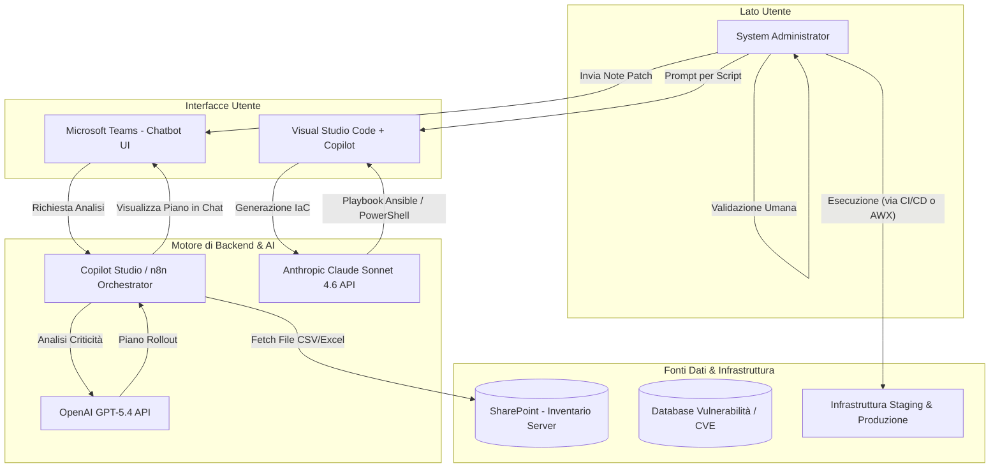
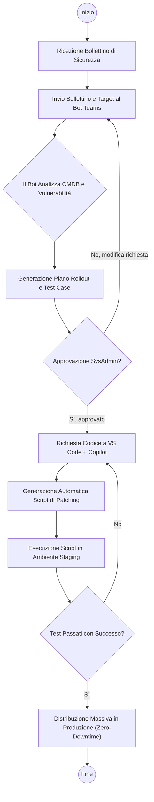
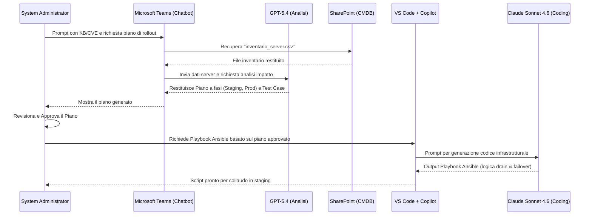

# Blueprint GenAI: Efficentamento del "Patch Management Strutturato"

## 1. Descrizione del Caso d'Uso
**Categoria:** Operations & Maintenance
**Titolo:** Patch Management Strutturato
**Ruolo:** System Administrator
**Obiettivo Originale (da CSV):** Pianificazione, test in ambiente di staging e successiva distribuzione massiva di patch di sicurezza critiche su un vasto parco di server Windows e Linux, minimizzando l'impatto sui servizi erogati (zero-downtime patching).
**Obiettivo GenAI:** Automatizzare l'analisi dei bollettini di sicurezza (release notes/CVE), generando istantaneamente un piano di rollout sicuro per lo staging, i test case di validazione e gli script di automazione (Ansible/PowerShell) per la distribuzione massiva con logica zero-downtime.

## 2. Fasi del Processo Efficentato

### Fase 1: Analisi Patch e Generazione Piano di Rollout
L'amministratore di sistema fornisce al chatbot le note di rilascio della patch (o gli ID delle CVE) e l'accesso all'inventario dei server esportato dal CMDB. L'AI valuta le dipendenze, identifica l'impatto sui servizi (es. riavvio necessario) e genera un piano a fasi per minimizzare il downtime dell'infrastruttura.
*   **Tool Principale Consigliato:** Microsoft Teams (Chatbot UI)
*   **Alternative:** 1. Copilot Studio, 2. n8n
*   **Modelli LLM Suggeriti:** OpenAI GPT-5.4
*   **Modalità di Utilizzo:** Integrazione di un chatbot su Microsoft Teams connesso a una cartella aziendale sicura (SharePoint) contenente l'inventario server e l'architettura dei cluster. L'utente interagisce in chat.
    ```text
    **Prompt Utente (su Teams):**
    "Analizza la patch KB5022842 per Windows Server e le vulnerabilità CVE-2023-XXXX per Linux. 
    Controlla il file 'inventario_server_prod.csv' su SharePoint. 
    Genera un piano di rollout a 3 fasi (Staging, Pre-Prod, Prod) garantendo il failover dei cluster per mantenere lo zero-downtime. Fornisci i test case da eseguire sui servizi principali post-patching."
    ```
*   **Azione Umana Richiesta:** Il System Administrator deve validare attentamente il piano di rollout proposto e i test case prima di autorizzare la stesura del codice di automazione.
*   **Stima Reale di Efficienza:** 
    *   *Tempo As-Is (Manuale):* 4-6 ore
    *   *Tempo To-Be (GenAI):* 15 minuti
    *   *Risparmio %:* ~95%
    *   *Motivazione:* L'incrocio manuale tra bollettini di sicurezza, dipendenze dei servizi e server impact richiede una minuziosa attività di analisi. L'AI correla le matrici in pochi secondi producendo un piano strutturato.

### Fase 2: Generazione Automatica degli Script di Patching (IaC)
A seguito dell'approvazione del piano, si passa all'ambiente di sviluppo dove l'assistente AI genera gli script di automazione specifici per l'infrastruttura (Playbook Ansible per Linux, script PowerShell/DSC per Windows). Gli script includeranno i comandi di drain dei nodi dai Load Balancer per garantire il patching senza interruzione di servizio.
*   **Tool Principale Consigliato:** visualstudio + copilot
*   **Alternative:** 1. claude-code (per automazione da CLI), 2. OpenClaw (per generazione offline su dati sensibili)
*   **Modelli LLM Suggeriti:** Anthropic Claude Sonnet 4.6 (eccellente per il coding infrastrutturale Ansible/Terraform)
*   **Modalità di Utilizzo:** Il System Administrator utilizza Visual Studio Code con l'estensione Copilot per tradurre il piano approvato in codice eseguibile.
    ```markdown
    **System Prompt / Istruzione per Copilot (in VS Code):**
    "Genera un Ansible Playbook per applicare le ultime patch di sicurezza sui server Linux del gruppo 'web-servers'. 
    Il playbook deve rigorosamente:
    1. Mettere in maintenance mode il nodo corrente sul Load Balancer (HAProxy).
    2. Applicare gli aggiornamenti via 'apt' ignorando pacchetti esplicitamente esclusi.
    3. Riavviare il server solo se richiesto dall'aggiornamento del kernel.
    4. Eseguire un check HTTP sulla porta 8080 per verificare il corretto avvio del servizio.
    5. Ripristinare il nodo sul Load Balancer.
    Imposta 'serial: 1' per garantire zero-downtime e procedi al nodo successivo."
    ```
*   **Azione Umana Richiesta:** L'amministratore deve revisionare il codice generato, verificare le logiche di drain dei nodi ed eseguire lo script tassativamente in ambiente di staging per i test finali.
*   **Stima Reale di Efficienza:** 
    *   *Tempo As-Is (Manuale):* 3-5 ore
    *   *Tempo To-Be (GenAI):* 20 minuti
    *   *Risparmio %:* ~90%
    *   *Motivazione:* La scrittura e il debug di logiche infrastrutturali complesse come l'orchestrazione del drain/failover nei playbook richiedono molto tempo. L'AI produce rapidamente un template di alta qualità aderente alle best practice.

## 3. Descrizione del Flusso Logico
La soluzione è strutturata con un'architettura **Single-Agent** per la prima fase interattiva e un assistente di programmazione per la seconda. Il processo prende avvio direttamente dall'interfaccia di Microsoft Teams, dove il System Administrator dialoga con il Chatbot. Quest'ultimo, recuperando le informazioni critiche dall'inventario ospitato su SharePoint, valuta il rischio e genera il **Patch Rollout Plan** e la documentazione di test. Dopo aver analizzato e validato mentalmente questo piano, l'operatore si sposta nel proprio IDE (Visual Studio Code). Fornendo il piano all'AI integrata nell'editor, genera in automatico il codice infrastrutturale (Playbook Ansible, script PowerShell) necessario per eseguire le patch applicando la logica di *zero-downtime*. Il codice viene infine collaudato nell'infrastruttura di test prima del deploy massivo in produzione.

## 4. Diagrammi UML (Mermaid.js)

### 4.1 Architecture Diagram


### 4.2 Process Diagram


### 4.3 Sequence Diagram


## 5. Guida all'Implementazione Tecnica
### Prerequisiti
- Licenza Microsoft 365 con accesso a SharePoint Online.
- Licenza Copilot Studio (per il deploy nativo del bot su Teams).
- Accesso API a modelli Enterprise (Azure OpenAI GPT-5.4 e Anthropic Claude).
- Repository di codice (Git) per la gestione del versioning degli script.
- Visual Studio Code installato con estensione GitHub Copilot.

### Step 1: Configurazione del Bot su Microsoft Teams
1. Accedere al portale **Microsoft Copilot Studio** utilizzando l'account aziendale.
2. Creare un nuovo Copilot nominandolo "Patching Assistant".
3. Nella sezione "Generative AI", aggiungere una **Connessione Dati (Knowledge Base)** fornendo l'URL del sito SharePoint in cui viene mantenuto il file `inventario_server.csv` aggiornato dal CMDB.
4. Nelle impostazioni del comportamento, definire il **System Prompt**:
   *Sei un assistente per System Administrator. Incrocia i dati delle vulnerabilità fornite in chat con l'inventario server di SharePoint. Suggerisci piani di patching a fasi per minimizzare il downtime e definisci test case di validazione dei servizi post-reboot.*
5. Cliccare su **Publish** e abilitare il canale **Microsoft Teams** per renderlo disponibile nella barra laterale dell'applicazione per i team di Operations.

### Step 2: Utilizzo e Generazione del Codice in VS Code
1. Aprire il progetto locale relativo alle configurazioni dell'infrastruttura su **Visual Studio Code**.
2. Verificare l'autenticazione a Copilot cliccando sull'icona nella barra di stato in basso.
3. Aprire il pannello Chat di Copilot e utilizzare il prompt indicato nella Fase 2, incollando le direttive del piano di rollout generato dal bot su Teams.
4. Salvare il file generato (es. `patch_web_cluster.yml` per Ansible o `Update-Cluster.ps1` per Windows).

### Step 3: Deployment e Validazione
1. Eseguire gli script generati lanciandoli esclusivamente contro l'inventory list dell'ambiente di Staging o Pre-Produzione.
2. Validare empiricamente il mantenimento del servizio controllando i Load Balancer (il traffico deve svuotarsi correttamente dal nodo in patching senza generare errori applicativi).

## 6. Rischi e Mitigazioni
- **Rischio 1: Allucinazioni negli Script di Automazione.** L'AI potrebbe inserire comandi distruttivi o ignorare direttive critiche del load balancer. -> **Mitigazione:** Code review obbligatoria. Tutti gli script generati devono essere trattati come bozze e testati su un nodo dummy in staging prima dell'approvazione per la produzione.
- **Rischio 2: Errata associazione delle dipendenze.** Il bot potrebbe non comprendere che un server backend è critico per un servizio frontend. -> **Mitigazione:** La qualità del piano dipende dalla precisione del file di inventario. Il CMDB deve includere esplicitamente tag di dipendenza e appartenenza a cluster HA.
- **Rischio 3: Esfiltrazione di dati infrastrutturali.** Condividere l'inventario server con modelli pubblici espone a rischi di sicurezza. -> **Mitigazione:** Utilizzare esclusivamente istanze LLM con contratti Enterprise (Zero Data Retention) per impedire che l'inventario dei server venga memorizzato o usato per l'addestramento dell'AI.
