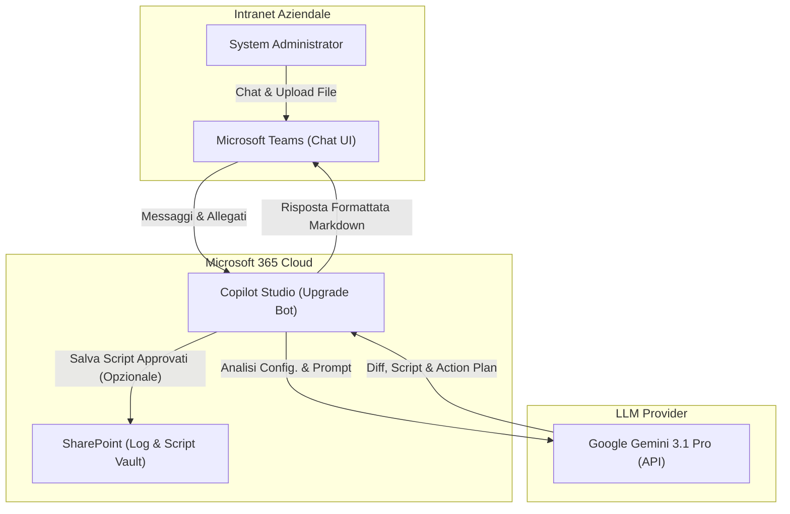
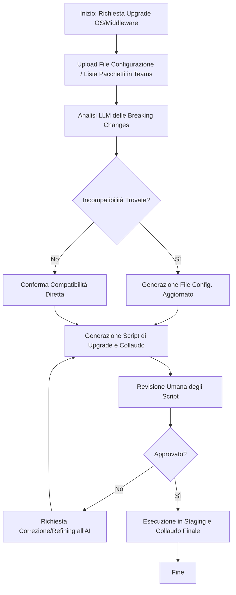
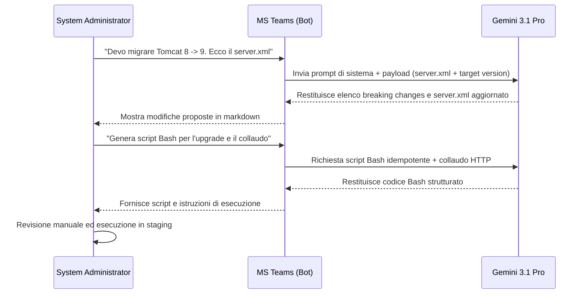

# Blueprint GenAI: Efficentamento del "Upgrade Major Version Middleware/OS"

## 1. Descrizione del Caso d'Uso
**Categoria:** Operations & Maintenance
**Titolo:** Upgrade Major Version Middleware/OS
**Ruolo:** System Administrator
**Obiettivo Originale (da CSV):** Esecuzione di progetti complessi per l'aggiornamento di major release di sistemi operativi o application server (es. da RHEL 7 a 8, o da Tomcat 8 a 9), gestendo la risoluzione delle dipendenze applicative e i collaudi.
**Obiettivo GenAI:** Automatizzare l'analisi delle "breaking changes" tra versioni major, risolvere le dipendenze dei file di configurazione obsoleti e generare automaticamente gli script di aggiornamento e i test di validazione (collaudo) post-upgrade.

## 2. Fasi del Processo Efficentato

### Fase 1: Analisi Configurazione e Risoluzione Dipendenze
Il System Administrator fornisce al bot la versione di partenza, la versione di destinazione e l'export delle configurazioni attuali (es. `server.xml` per Tomcat, o lista pacchetti OS). L'AI identifica le funzionalità deprecate e genera il file di configurazione aggiornato per la nuova major release.
*   **Tool Principale Consigliato:** Microsoft Teams (Chatbot UI) tramite Copilot Studio
*   **Alternative:** 1. gemini-cli (per uso diretto da terminale server), 2. Accenture Amethyst
*   **Modelli LLM Suggeriti:** Google Gemini 3.1 Pro (eccellente per analisi di file di configurazione complessi e codice)
*   **Modalità di Utilizzo:** Il SysAdmin interagisce con il bot su Teams caricando i file.
    **Esempio di System Prompt per il Bot:**
    ```text
    Sei un Expert System Administrator Assistant. Il tuo compito è assistere nell'upgrade di major version di OS e Middleware.
    Riceverai in input la tecnologia, la versione di partenza, la versione target e un file di configurazione o lista di pacchetti.
    1. Elenca le "breaking changes" principali che impattano la configurazione fornita.
    2. Restituisci il file di configurazione corretto, rifattorizzato e compatibile con la versione target.
    3. Evidenzia quali dipendenze o librerie accessorie devono essere aggiornate o rimosse.
    ```
*   **Azione Umana Richiesta:** Il SysAdmin deve revisionare le "breaking changes" segnalate e validare il nuovo file di configurazione proposto prima di applicarlo al server.
*   **Stima Reale di Efficienza:** 
    *   *Tempo As-Is (Manuale):* 8 ore (lettura release notes, test manuali, correzione errori di sintassi)
    *   *Tempo To-Be (GenAI):* 30 minuti
    *   *Risparmio %:* 93%
    *   *Motivazione:* L'AI conosce già la documentazione delle release notes e adatta istantaneamente le direttive di configurazione deprecate, azzerando il tempo di ricerca e troubleshooting preventivo.

### Fase 2: Generazione Script di Aggiornamento e Collaudo
Sulla base del piano generato, l'AI produce uno script Bash o PowerShell per automatizzare i passaggi di upgrade e uno script di test per il collaudo post-intervento (es. check porte, validazione log, curl su endpoint).
*   **Tool Principale Consigliato:** Microsoft Teams (Chatbot UI) tramite Copilot Studio
*   **Alternative:** 1. gemini-cli, 2. visualstudio + copilot
*   **Modelli LLM Suggeriti:** Google Gemini 3.1 Pro
*   **Modalità di Utilizzo:** Proseguendo la conversazione nel contesto, l'utente richiede la creazione degli script operativi.
    **Esempio di Prompt dell'Utente in Chat:**
    ```text
    Sulla base del nuovo file server.xml che hai generato, scrivimi uno script Bash idempotente per eseguire l'aggiornamento da Tomcat 8 a 9. Genera anche uno script separato per il collaudo che verifichi che il servizio systemd sia attivo e che la porta 8080 risponda con HTTP 200.
    ```
*   **Azione Umana Richiesta:** Revisione del codice degli script per evitare comandi distruttivi. Esecuzione controllata degli script in ambiente di staging/pre-produzione e verifica degli output del collaudo.
*   **Stima Reale di Efficienza:** 
    *   *Tempo As-Is (Manuale):* 4 ore (scrittura e debug script di test e installazione)
    *   *Tempo To-Be (GenAI):* 15 minuti
    *   *Risparmio %:* 93%
    *   *Motivazione:* La scrittura di codice boilerplate e script di validazione viene demandata interamente all'LLM, che produce script già commentati e pronti all'uso.

## 3. Descrizione del Flusso Logico
Il flusso adotta un approccio **Single-Agent** per garantire la massima semplicità, centralizzando l'interazione all'interno della chat di Microsoft Teams. Il System Administrator inizia la conversazione con l'"Upgrade Assistant Bot" indicando il contesto (es. "Devo migrare un'app da RHEL 7 a 8"). L'agente richiede i file di configurazione o la lista dei pacchetti attuali. Una volta ricevuti tramite upload diretto nella chat, l'LLM analizza il contenuto incrociandolo con la propria base di conoscenza sulle *release notes*, identifica le incompatibilità e fornisce immediatamente il nuovo file di configurazione corretto. Successivamente, su specifica richiesta dell'utente, l'agente genera gli script operativi bash/PowerShell per eseguire l'aggiornamento e i test di collaudo. L'utente valida il tutto e procede all'applicazione delle modifiche sui sistemi di test.

## 4. Diagrammi UML (Mermaid.js)

### 4.1 Architecture Diagram


### 4.2 Process Diagram


### 4.3 Sequence Diagram


## 5. Guida all'Implementazione Tecnica

### Prerequisiti
- Licenza Microsoft Copilot Studio (o Microsoft Power Virtual Agents).
- Accesso amministrativo a Microsoft Teams per l'approvazione e pubblicazione dell'App/Bot nel tenant.
- API Key per Google Gemini 3.1 Pro (o modello LLM equivalente) configurata.

### Step 1: Creazione dell'Upgrade Assistant Bot
1. Accedere al portale [Microsoft Copilot Studio](https://copilotstudio.microsoft.com).
2. Creare un nuovo Copilot nominandolo "Upgrade Assistant Bot".
3. Nelle impostazioni di **Generative AI** e orchestrazione, inserire il System Prompt indicato nella Fase 1 per specializzare il bot sull'analisi di configurazioni infrastrutturali e identificazione di breaking changes.

### Step 2: Configurazione della Gestione File in Chat
1. All'interno del Topic principale in Copilot Studio, abilitare l'opzione che permette agli utenti di caricare file (es. `.xml`, `.conf`, `.txt`, `.sh`).
2. Mappare il contenuto testuale estratto dal file in una variabile globale, ad esempio `User_Config_Content`.

### Step 3: Integrazione dell'Endpoint LLM (API)
1. Inserire un nodo di tipo **"Call an action"** o **"HTTP Request"** nel flusso di conversazione.
2. Puntare l'endpoint URL alle API di Google Gemini 3.1 Pro.
3. Costruire il JSON body unendo il messaggio dell'utente (variabile di sistema) e il contenuto del file (variabile `User_Config_Content`).
4. Mappare la risposta JSON (il testo generato dal modello) in una variabile `AI_Response`.

### Step 4: Pubblicazione e Rollout
1. Utilizzare un nodo **"Send a message"** per stampare il contenuto di `AI_Response` nella chat di Teams, assicurandosi che il Markdown sia supportato per formattare correttamente i blocchi di codice.
2. Cliccare su "Publish" e selezionare il canale **Microsoft Teams**.
3. Seguire le istruzioni per approvare l'app nel Teams Admin Center e distribuirla al team di System Administration.

## 6. Rischi e Mitigazioni
- **Rischio 1:** Allucinazioni nella risoluzione delle dipendenze (l'AI inventa pacchetti inesistenti o versioni non compatibili). -> **Mitigazione:** Validazione obbligatoria (Human-in-the-loop) di tutti gli script proposti in un ambiente Sandbox/Staging rigoroso prima del deployment in produzione.
- **Rischio 2:** Esposizione di dati sensibili (es. password in chiaro nei file di configurazione caricati su Teams). -> **Mitigazione:** Istruire i SysAdmin tramite policy aziendali a sanitizzare (mascherare) i secreti (es. password del DB) nei file `.conf`/`.xml` prima dell'upload. In alternativa, implementare un nodo Power Automate / Regex in Copilot Studio che scarti file contenenti stringhe simili a credenziali o chiavi API.