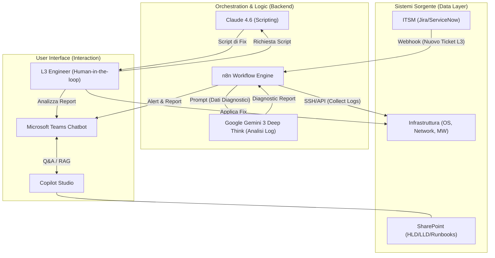
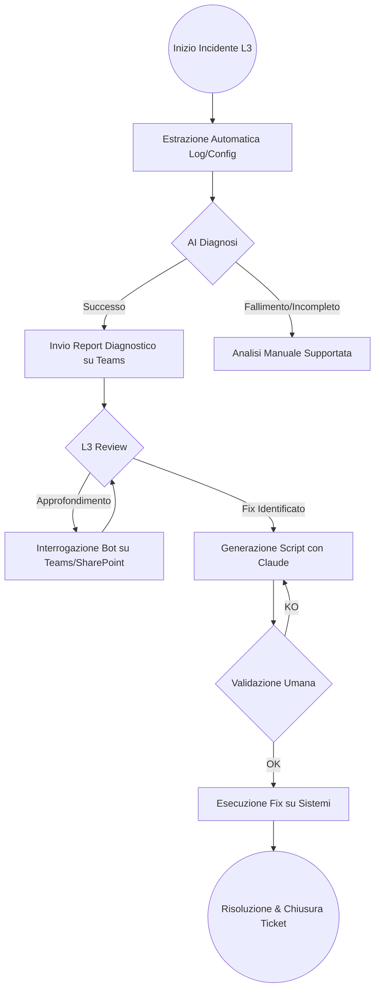
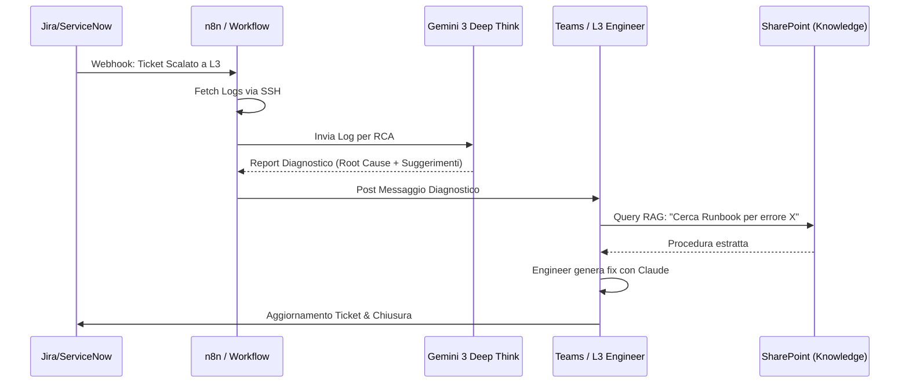

# Blueprint GenAI: Efficentamento del "Troubleshooting e Gestione Ticket L3"

## 1. Descrizione del Caso d'Uso
**Categoria:** Operations & Maintenance
**Titolo:** Troubleshooting e Gestione Ticket L3
**Ruolo:** IT Support Level 3
**Obiettivo Originale (da CSV):** Presa in carico, analisi tecnica profonda e risoluzione di incidenti infrastrutturali complessi scalati dal livello 2. Intervento diretto su configurazioni OS, network routing e parametri middleware in emergenza.
**Obiettivo GenAI:** Automatizzare l'analisi diagnostica iniziale, il parsing dei log multi-sorgente e la generazione di suggerimenti di risoluzione (root cause analysis assistita) per ridurre il MTTR (Mean Time To Resolution) di incidenti critici L3.

## 2. Fasi del Processo Efficentato

### Fase 1: Ingestione e Diagnostica Automatizzata
In questa fase, non appena un ticket viene scalato a L3, un workflow raccoglie automaticamente i log, le configurazioni di rete e lo stato del middleware dai sistemi interessati.
*   **Tool Principale Consigliato:** `n8n`
*   **Alternative:** 1. `Google Antigravity`, 2. `gemini-cli`
*   **Modelli LLM Suggeriti:** *Google Gemini 3 Deep Think* (ideale per il ragionamento logico su grandi moli di log non strutturati).
*   **Modalità di Utilizzo:** Workflow n8n attivato da un Webhook dell'ITSM (es. Jira/ServiceNow). Il workflow usa nodi SSH o API per prelevare gli ultimi 1000 righe di log e l'output di comandi diagnostici (es. `netstat`, `top`, `df -h`). I dati vengono inviati a Gemini con un prompt di analisi tecnica.
    *   **Bozza Prompt per n8n:**
    ```text
    "Agisci come un esperto SRE L3. Analizza i seguenti log e output di sistema: [LOG_DATA]. 
    Identifica: 1. Eventuali errori critici o anomalie temporali. 2. Correlazioni tra network routing e latenza middleware. 
    Produci un report sintetico con la probabile Root Cause e 3 azioni correttive immediate."
    ```
*   **Azione Umana Richiesta:** L'operatore L3 riceve il report pre-analizzato su Teams invece di dover estrarre i log manualmente.
*   **Stima Reale di Efficienza:** 
    *   *Tempo As-Is (Manuale):* 60 minuti (estrazione log, grep manuale, correlazione).
    *   *Tempo To-Be (GenAI):* 3 minuti.
    *   *Risparmio %:* 95%.
    *   *Motivazione:* L'AI esegue il pattern matching su migliaia di righe in secondi, identificando anomalie che l'occhio umano impiegherebbe decine di minuti a isolare.

### Fase 2: Troubleshooting Interattivo via Teams
L'operatore L3 interagisce con un assistente specializzato per raffinare la diagnosi o testare ipotesi di fix in un ambiente sicuro.
*   **Tool Principale Consigliato:** `Microsoft Teams (Chatbot UI)` via `Copilot Studio`
*   **Alternative:** 1. `Accenture Amethyst`, 2. `OpenClaw` (per dati ultra-sensibili)
*   **Modelli LLM Suggeriti:** *OpenAI GPT-5.4* (per le eccellenti capacità conversazionali e di tool-use).
*   **Modalità di Utilizzo:** Creazione di un Bot su Teams collegato via RAG (Retrieval-Augmented Generation) allo SharePoint aziendale contenente le HLD/LLD e le guide operative (Runbook). L'utente interroga il bot: "Come è configurato il routing per il DB Cluster X?" o "Generami il comando per verificare la saturazione della coda middleware Y".
*   **Azione Umana Richiesta:** Validazione della query suggerita dal bot prima dell'esecuzione sul server.
*   **Stima Reale di Efficienza:** 
    *   *Tempo As-Is (Manuale):* 30 minuti (ricerca documentazione e runbook).
    *   *Tempo To-Be (GenAI):* 2 minuti.
    *   *Risparmio %:* 93%.
    *   *Motivazione:* Accesso istantaneo alla conoscenza documentale e correlazione con il contesto del ticket corrente.

### Fase 3: Generazione e Validazione Script di Ripristino
Generazione dello script specifico (Bash, PowerShell, Python o Terraform) per applicare la patch o la modifica di configurazione necessaria.
*   **Tool Principale Consigliato:** `claude-code`
*   **Alternative:** 1. `visualstudio + copilot`, 2. `OpenAI Codex`
*   **Modelli LLM Suggeriti:** *Anthropic Claude 4.6 Sonnet* (il top per precisione sintattica e coding sicuro).
*   **Modalità di Utilizzo:** L'operatore usa `claude-code` direttamente da terminale o via chat per generare lo script di fix basato sulla diagnosi della Fase 1.
    *   **Esempio comando:** `claude "Genera uno script bash per ruotare i certificati SSL su Nginx e riavviare il servizio solo se la sintassi è corretta"`.
*   **Azione Umana Richiesta:** Revisione obbligatoria del codice ("Human-in-the-loop") e test in ambiente di staging se possibile.
*   **Stima Reale di Efficienza:** 
    *   *Tempo As-Is (Manuale):* 45 minuti (scrittura e debugging script).
    *   *Tempo To-Be (GenAI):* 5 minuti.
    *   *Risparmio %:* 89%.
    *   *Motivazione:* Claude genera codice boilerplate e logica complessa istantaneamente, riducendo errori di sintassi.

## 3. Descrizione del Flusso Logico
Il flusso è progettato come **Single-Agent orchestrato da n8n**. Il workflow n8n funge da "sistema nervoso centrale": riceve il trigger dal sistema di ticketing, orchestra il recupero dei dati dai server (via SSH/API) e interroga l'LLM per la diagnostica. L'output non è un'azione automatica (troppo rischioso per L3), ma un "Diagnostic Briefing" inviato sul canale Teams del team L3. L'operatore umano prende il controllo, usa il bot Teams per approfondire e `claude-code` per produrre il fix tecnico.

## 4. Diagrammi UML (Mermaid.js)

### 4.1 Architecture Diagram


### 4.2 Process Diagram


### 4.3 Sequence Diagram


## 5. Guida all'Implementazione Tecnica

### Prerequisiti
- Licenza **n8n** (self-hosted o cloud).
- API Key per **Google Gemini API** (Vertex AI).
- Licenza **Microsoft Copilot Studio** e accesso all'admin center di Teams.
- Accesso in lettura (SSH Key o Service Account) ai server target per l'estrazione log.

### Step 1: Configurazione Workflow n8n
1.  Crea un nodo **Webhook** per ricevere notifiche dal tuo sistema di ticketing.
2.  Aggiungi nodi **Execute Command** (SSH) per raccogliere i dati (es. `tail -n 500 /var/log/syslog`).
3.  Inserisci un nodo **AI Agent** con il modello *Gemini 3 Deep Think*. Configura il System Prompt per focalizzarsi su Troubleshooting infrastrutturale.
4.  Aggiungi un nodo **Microsoft Teams** per postare il risultato in un canale specifico.

### Step 2: Configurazione Bot su Teams (Copilot Studio)
1.  Apri Copilot Studio e crea un nuovo bot "L3 Infra Assistant".
2.  Nella sezione "Knowledge", connetti il sito **SharePoint** dove sono archiviati i documenti tecnici (HLD, LLD, PDF di runbook).
3.  Configura il "Generative Answers" per rispondere usando solo la documentazione caricata.
4.  Pubblica il bot sul canale Teams del team Operations.

### Step 3: Deployment Claude-Code
1.  Installa `claude-code` sulle workstation dei tecnici L3 via terminale.
2.  Autentica il tool con le credenziali aziendali Anthropic.
3.  Istruisci il team sull'uso del comando `claude` per la generazione rapida di script "one-liner" o piccoli tool di automazione in emergenza.

## 6. Rischi e Mitigazioni
- **Rischio: Allucinazioni nei comandi di fix** -> **Mitigazione:** È tassativamente vietata l'esecuzione automatica degli script generati. L'operatore L3 deve validare ogni comando prima del lancio ("Human-in-the-loop").
- **Rischio: Esposizione dati sensibili nei log (es. PII)** -> **Mitigazione:** Utilizzare il nodo di "Data Masking" in n8n prima di inviare i log all'API dell'LLM, oppure utilizzare modelli locali via **OpenClaw** (Llama 4 Scout) se la policy aziendale è restrittiva.
- **Rischio: Documentazione obsoleta su SharePoint** -> **Mitigazione:** Implementare un processo di revisione trimestrale dei runbook; il bot deve sempre citare la fonte (link al file) per permettere all'operatore di verificare la data del documento.
