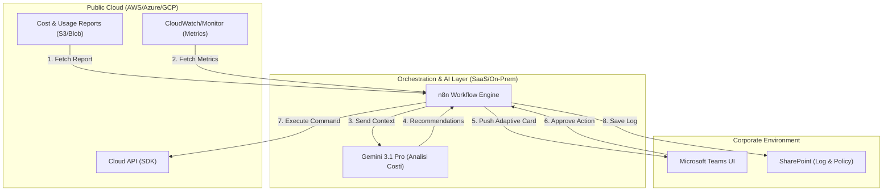
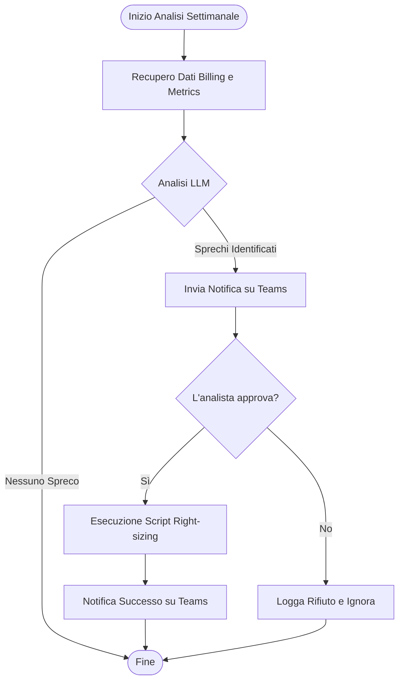
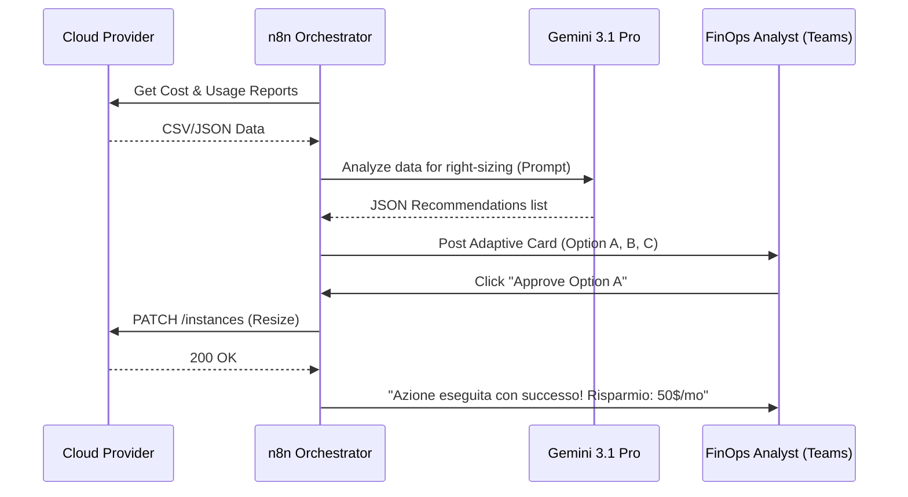

# Blueprint GenAI: Efficentamento del "Ottimizzazione Costi Cloud (FinOps)"

## 1. Descrizione del Caso d'Uso
**Categoria:** Operations & Maintenance
**Titolo:** Ottimizzazione Costi Cloud (FinOps)
**Ruolo:** FinOps Analyst
**Obiettivo Originale (da CSV):** Analisi continua della reportistica di billing cloud per identificare sprechi. Esecuzione di azioni di right-sizing (ridimensionamento istanze), spegnimento programmato di ambienti non produttivi e acquisto di Reserved Instances.
**Obiettivo GenAI:** Automatizzare l'analisi massiva dei file di reportistica di costo (CUR/CSV) tramite LLM per identificare pattern di inefficienza e generare automaticamente un piano d'azione prioritizzato (Right-sizing, RI/SP, Scheduling) notificando l'analista su Microsoft Teams per l'approvazione finale.

## 2. Fasi del Processo Efficentato

### Fase 1: Ingestion e Analisi Intelligente del Billing
Il sistema recupera periodicamente i file di billing (es. AWS Cost & Usage Report) da bucket S3/Blob Storage e li analizza cercando risorse con utilizzo medio di CPU/RAM inferiore al 10% o istanze non utilizzate durante il weekend.
*   **Tool Principale Consigliato:** `n8n`
*   **Alternative:** 1. `gemini-cli` (per script locali), 2. `Google Antigravity` (per orchestrazione complessa).
*   **Modelli LLM Suggeriti:** *Google Gemini 3.1 Pro* (grazie alla sua enorme context window di 2M+ token, ideale per processare file di log/billing molto lunghi).
*   **Modalità di Utilizzo:** Workflow n8n che scarica il CSV, lo segmenta se necessario, e invia un prompt strutturato a Gemini.
    *   **Bozza System Prompt:** 
    ```text
    Sei un esperto FinOps Analyst. Analizza il seguente estratto di billing cloud. 
    Identifica: 
    1. Risorse 'zombie' (costo > 0, utilizzo < 1%).
    2. Opportunità di Right-sizing (es. t3.large con CPU avg < 5% -> suggerisci t3.medium).
    3. Risorse non produttive (tag: 'Dev', 'Test') attive h24.
    Formatta l'output in JSON con campi: [Risorsa, Azione_Suggerita, Risparmio_Mensile_Stimato, Motivazione].
    ```
*   **Azione Umana Richiesta:** Nessuna in questa fase (automazione batch).
*   **Stima Reale di Efficienza:** 
    *   *Tempo As-Is (Manuale):* 8 ore (incrocio dati Excel/CloudWatch).
    *   *Tempo To-Be (GenAI):* 5 minuti (elaborazione n8n + LLM).
    *   *Risparmio %:* 99%
    *   *Motivazione:* L'AI identifica istantaneamente correlazioni tra costo e utilizzo su migliaia di righe che un umano dovrebbe filtrare manualmente.

### Fase 2: Reporting e Approvazione su Microsoft Teams
Le raccomandazioni vengono presentate all'analista FinOps via Microsoft Teams come una serie di Adaptive Cards.
*   **Tool Principale Consigliato:** `copilot studio` + `Microsoft Teams (Chatbot UI)`
*   **Alternative:** 1. `n8n` (via bot node), 2. `accenture ametyst` (per analisi interattiva).
*   **Modelli LLM Suggeriti:** *OpenAI GPT-5.4* (ottimo per interazione conversazionale e gestione di task agentici).
*   **Modalità di Utilizzo:** Il bot invia un messaggio: "Ho trovato 12 opportunità di risparmio per un totale di 450€/mese. Vuoi procedere con la revisione?". L'utente visualizza le card e clicca su "Approva" o "Rifiuta".
*   **Azione Umana Richiesta:** Validazione tecnica delle proposte (es. "Sì, questa istanza può essere ridimensionata").
*   **Stima Reale di Efficienza:** 
    *   *Tempo As-Is (Manuale):* 2 ore (preparazione report per il management).
    *   *Tempo To-Be (GenAI):* 10 minuti (revisione su chat).
    *   *Risparmio %:* 92%
    *   *Motivazione:* Eliminazione della necessità di creare slide o report PDF; l'interazione avviene nel flusso di lavoro quotidiano.

### Fase 3: Esecuzione Automatica (Opzionale/Human-in-the-loop)
Una volta approvato, il sistema invia un comando API al cloud provider per eseguire il ridimensionamento o impostare lo scheduling di spegnimento.
*   **Tool Principale Consigliato:** `n8n` (con nodi AWS/Azure SDK)
*   **Alternative:** 1. `visualstudio + copilot` (per scrivere lo script Python di esecuzione), 2. `MCP (Model Context Protocol)` per connettere l'agente direttamente alle API Cloud.
*   **Modelli LLM Suggeriti:** *Anthropic Claude Sonnet 4.6* (per generazione di script di automazione sicuri).
*   **Modalità di Utilizzo:** n8n riceve il webhook di approvazione da Teams e scatena una funzione Lambda o uno script Python che esegue l'azione.
*   **Azione Umana Richiesta:** Supervisione finale del log di esecuzione.
*   **Stima Reale di Efficienza:** 
    *   *Tempo As-Is (Manuale):* 1 ora (accesso a console, modifica manuale).
    *   *Tempo To-Be (GenAI):* 1 minuto (esecuzione automatica).
    *   *Risparmio %:* 98%
    *   *Motivazione:* L'integrazione API elimina errori manuali e tempi di login/navigazione console.

## 3. Descrizione del Flusso Logico
Il flusso è progettato come un'architettura **Single-Agent** orchestrata da **n8n**. Un workflow schedulato funge da "Collector" dei dati di billing. Questi dati vengono passati a un motore di analisi LLM (Gemini 3.1 Pro) che agisce come analista virtuale. Il risultato dell'analisi non viene però eseguito "alla cieca": il sistema utilizza un pattern **Human-in-the-loop** integrato in **Microsoft Teams**. L'agente presenta le scoperte all'analista umano sotto forma di decisioni atomiche. Solo dopo il clic di conferma dell'umano, n8n procede all'interazione con le API del cloud provider (AWS/Azure/GCP) per applicare le modifiche.

## 4. Diagrammi UML (Mermaid.js)

### 4.1 Architecture Diagram


### 4.2 Process Diagram


### 4.3 Sequence Diagram


## 5. Guida all'Implementazione Tecnica

### Prerequisiti
- Istanza **n8n** (Cloud o Self-hosted).
- API Key per **Google Gemini API** (AI Studio).
- Accesso a **Microsoft Teams** con permessi per installare App/Webhook o licenza Copilot Studio.
- Credenziali IAM con permessi di sola lettura per il billing e (opzionale) permessi di modifica per il right-sizing.

### Step 1: Configurazione Ingestion su n8n
1.  Crea un workflow con un nodo **Schedule**.
2.  Usa il nodo **AWS S3** o **HTTP Request** per scaricare l'ultimo CUR.
3.  Usa un nodo **Code** (Javascript) per pulire il file e inviare solo le colonne rilevanti (ProductCode, Cost, UsageType, ResourceId, UsageAmount) per risparmiare token.

### Step 2: Prompt Engineering e Analisi
1.  Aggiungi un nodo **AI Agent** o **Google Gemini**.
2.  Configura il Model come `gemini-3.1-pro`.
3.  Incolla il System Prompt fornito nella Fase 1. Collega i dati del billing come input.

### Step 3: Integrazione Teams (Adaptive Cards)
1.  In n8n, usa il nodo **Microsoft Teams**.
2.  Configura il messaggio come "Adaptive Card". Puoi generare il JSON della card usando un altro nodo LLM o il [Designer di Adaptive Cards](https://adaptivecards.io/designer/).
3.  Includi pulsanti `Action.Execute` che puntano a un webhook di n8n per gestire la risposta.

### Step 4: Automazione delle Azioni (Facoltativo)
1.  Crea un nuovo workflow n8n che parte da un **Webhook**.
2.  In base all'ID risorsa e all'azione ricevuti dal webhook di Teams, usa il nodo **AWS EC2** (o Azure Compute) per eseguire l'azione `ModifyInstanceAttribute`.

## 6. Rischi e Mitigazioni
- **Rischio 1: Right-sizing aggressivo (Downsizing)** -> **Mitigazione:** L'AI deve analizzare almeno 30 giorni di metriche di picco (non solo medie) prima di suggerire un downgrade. L'umano deve sempre convalidare.
- **Rischio 2: Esposizione dati di costo** -> **Mitigazione:** Utilizzo di istanze LLM Enterprise (es. Vertex AI o Azure OpenAI) dove i dati non vengono usati per il training.
- **Rischio 3: Errore nello script di spegnimento** -> **Mitigazione:** Implementazione di un "Dry Run" mode dove lo script logga solo quello che farebbe senza eseguirlo effettivamente, per i primi 2 cicli di test.
