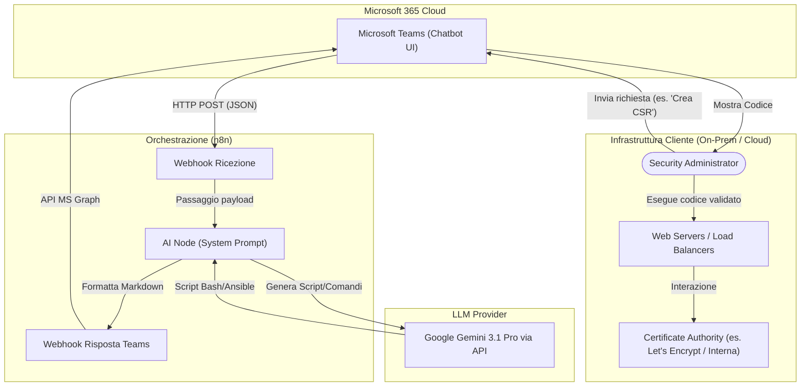
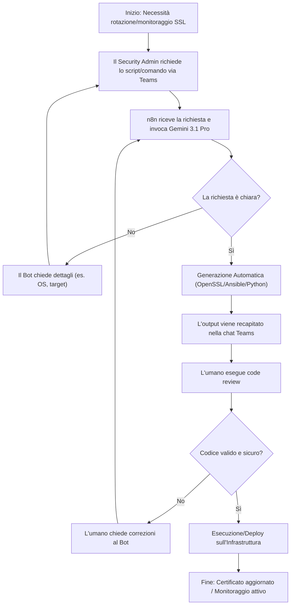
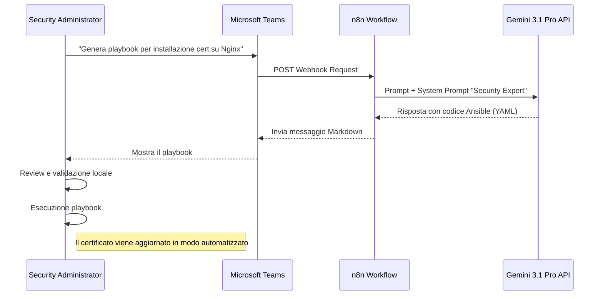

# Blueprint GenAI: Efficentamento del "Gestione e Rotazione Certificati SSL"

## 1. Descrizione del Caso d'Uso
**Categoria:** Operations & Maintenance
**Titolo:** Gestione e Rotazione Certificati SSL
**Ruolo:** Security Administrator
**Obiettivo Originale (da CSV):** Monitoraggio proattivo delle scadenze dei certificati crittografici. Generazione di nuove CSR, interazione con le CA, installazione dei nuovi certificati su web server/load balancer e configurazione dell'automazione (es. certbot).
**Obiettivo GenAI:** Automatizzare la stesura di script personalizzati per il monitoraggio delle scadenze SSL, la generazione complessa di comandi OpenSSL (CSR con SAN multipli) e la creazione on-demand di playbook (es. Ansible) o file di configurazione (es. Certbot) per il deployment dei certificati sui vari apparati, tramite un'interfaccia conversazionale.

## 2. Fasi del Processo Efficentato

### Fase 1: Generazione Automatica di CSR, Script e Playbook
In questa fase, il Security Administrator utilizza un chatbot su Microsoft Teams per generare istantaneamente configurazioni, script di automazione e comandi crittografici specifici per l'infrastruttura di destinazione, senza dover cercare o consultare la documentazione tecnica dei singoli vendor (es. F5, Nginx, AWS ACM).

*   **Tool Principale Consigliato:** `Microsoft Teams (Chatbot UI)` (orchestrato tramite n8n)
*   **Alternative:** 1. `gemini-cli` (per uso diretto da terminale), 2. `Copilot Studio`
*   **Modelli LLM Suggeriti:** Google Gemini 3.1 Pro (eccellente per la generazione di codice infrastrutturale e script bash/Python).
*   **Modalità di Utilizzo:** Configurazione di un bot su Teams collegato a un webhook n8n che inoltra la richiesta a Gemini. Il bot è pre-istruito tramite un System Prompt per restituire solo codice e comandi diretti.

    **Bozza System Prompt per l'Agent (in n8n):**
    ```markdown
    Sei un Security Automation Expert. Il tuo compito è fornire al Security Administrator i comandi esatti (OpenSSL, Certbot) o i playbook (Ansible) per la gestione dei certificati SSL.
    Regole:
    1. Se l'utente chiede una CSR, fornisci il comando OpenSSL esatto in un blocco di codice bash.
    2. Se chiede un'automazione, fornisci uno script Python o Bash o un playbook Ansible minimale, sicuro e commentato.
    3. Non inventare chiavi private; genera solo il codice per crearle in locale.
    ```
    *Esempio di interazione su Teams:*
    **Utente:** "Generami un playbook Ansible per installare un certificato SSL esistente su 5 server Nginx Ubuntu e fagli ricaricare il servizio."
    **Bot:** Restituisce il file `.yml` pronto al copia-incolla e le istruzioni per l'uso.

*   **Azione Umana Richiesta:** Il Security Administrator deve obbligatoriamente revisionare il codice generato prima di eseguirlo o inserirlo in pipeline CI/CD, al fine di garantire l'aderenza alle policy di sicurezza aziendali.
*   **Stima Reale di Efficienza:** 
    *   *Tempo As-Is (Manuale):* 2 ore (ricerca documentazione, scrittura playbook, debug dei comandi OpenSSL).
    *   *Tempo To-Be (GenAI):* 10 minuti.
    *   *Risparmio %:* 91%.
    *   *Motivazione:* L'AI abbatte totalmente il tempo di "blank page" e di ricerca della sintassi corretta per i comandi crittografici e le automazioni infrastrutturali, restituendo artefatti pronti all'uso.

## 3. Descrizione del Flusso Logico
L'approccio scelto è **Single-Agent** basato su interazione "Human-in-the-loop" via chat. Il Security Administrator interagisce con il Bot su Microsoft Teams richiedendo gli script o le configurazioni necessarie per l'operazione del momento (es. rinnovo, monitoraggio, installazione). Il Bot, tramite un orchestratore (n8n), invia il prompt contestualizzato al modello LLM (Gemini 3.1 Pro). L'LLM elabora la richiesta restituendo i comandi OpenSSL, le configurazioni di Certbot o i playbook Ansible necessari. Il risultato viene presentato all'utente direttamente in Teams, pronto per essere copiato, revisionato ed eseguito negli ambienti target o inserito in pipeline di automazione (es. Jenkins/GitLab CI).

## 4. Diagrammi UML (Mermaid.js)

### 4.1 Architecture Diagram


### 4.2 Process Diagram


### 4.3 Sequence Diagram


## 5. Guida all'Implementazione Tecnica

### Prerequisiti
- Licenza e permessi amministrativi per Microsoft Teams.
- Istanza di n8n (Cloud o Self-Hosted) raggiungibile da Microsoft Teams.
- API Key attiva per Google Gemini (Google AI Studio o Vertex AI).
- Credenziali Azure AD (Entra ID) per registrare il Bot e ottenere le credenziali MS Graph API.

### Step 1: Configurazione del Bot in Azure/Teams
1. Accedere al portale Azure (Entra ID) e registrare una nuova **App Registration** per il bot.
2. Generare un *Client Secret* e copiare *Client ID* e *Tenant ID*.
3. Abilitare le autorizzazioni API necessarie (es. `Chat.ReadWrite.All`).
4. Da Microsoft Teams Developer Portal, creare una nuova App di tipo Bot, configurando come endpoint di messaggistica l'URL Webhook fornito da n8n.

### Step 2: Creazione del Workflow in n8n
1. Creare un nuovo workflow in n8n.
2. Aggiungere un nodo **Webhook** in modalità ascolto (`POST`) per ricevere i messaggi in ingresso da Teams.
3. Aggiungere un nodo **Google Gemini** e configurare le credenziali tramite l'API Key. Selezionare il modello `gemini-1.5-pro` (o la versione 3.1 Pro più recente disponibile).
4. Nel nodo Gemini, configurare l'operazione su *Generate Text* o *Chat* e inserire il System Prompt definito nella Fase 1. Mappare dinamicamente la domanda in ingresso dal payload del Webhook.
5. Aggiungere un nodo **Microsoft Teams** o **HTTP Request** per inviare la risposta testuale formattata (Markdown) indietro al canale o alla chat 1-to-1 dell'utente, utilizzando l'API Graph di Microsoft.

### Step 3: Test e Rilascio
1. Salvare e attivare il workflow in n8n.
2. Interagire con il bot da Teams richiedendo comandi base, es: "Come genero una CSR con 3 Subject Alternative Names per apache2?".
3. Verificare che la formattazione del codice sia corretta e utilizzabile tramite copia-incolla.
4. Rilasciare l'app nel catalogo Teams aziendale per gli utenti del gruppo Security.

## 6. Rischi e Mitigazioni
- **Rischio 1:** Esposizione o generazione accidentale di materiale crittografico (es. chiavi private reali) nell'ambiente cloud tramite l'LLM.
  -> **Mitigazione:** Istruire rigorosamente il System Prompt affinché l'AI generi *esclusivamente i comandi/script* e non le chiavi stesse. Avvisare gli utenti di non incollare mai chiavi private o password nei prompt su Teams.
- **Rischio 2:** Script di automazione (es. playbook) errati che interrompono il servizio web (es. ricarico configurazione nginx malformata).
  -> **Mitigazione:** Formazione obbligatoria per il personale umano: ogni artefatto generato dall'AI deve essere revisionato e preferibilmente testato in un ambiente non produttivo prima di applicarlo al sistema in esercizio. Implementare backup dei file di configurazione negli script generati.
- **Rischio 3:** Allucinazioni nella sintassi dei comandi OpenSSL complessi.
  -> **Mitigazione:** Uso di modelli avanzati (Gemini 3.1 Pro) altamente affidabili sul coding e validazione "Human-in-the-loop" indispensabile prima di lanciare i comandi. Utilizzo della flag di `--dry-run` suggerita automaticamente nei playbook.