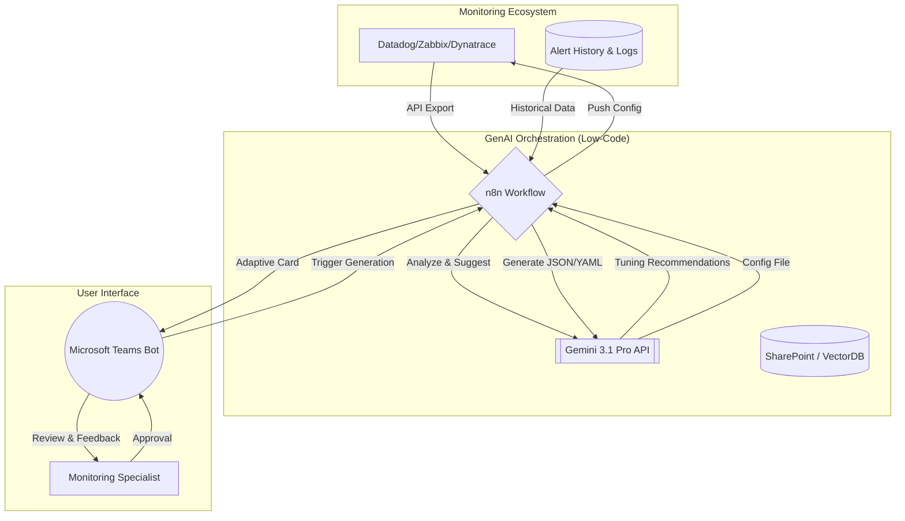
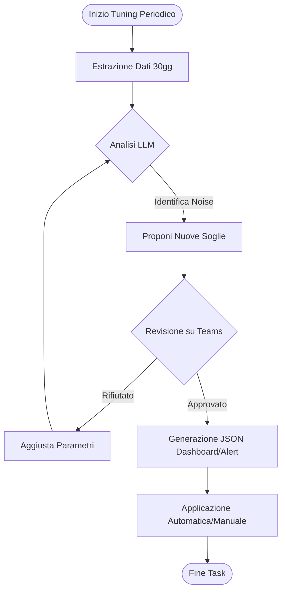
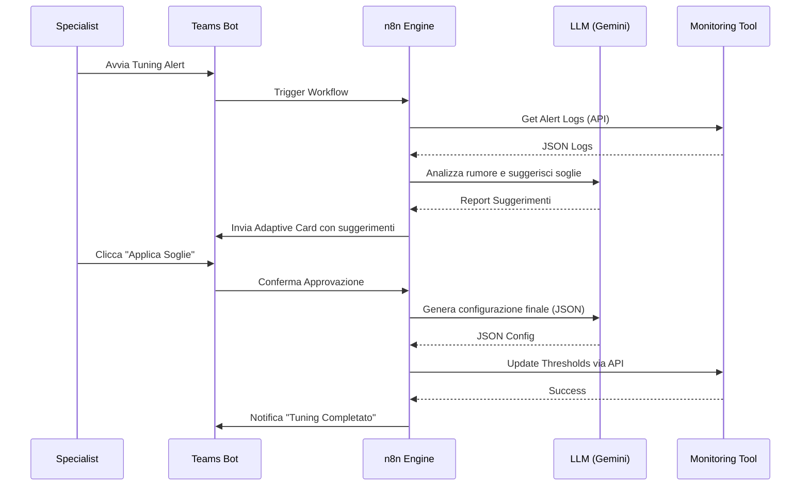

# Blueprint GenAI: Efficentamento del "Tuning Piattaforme di Monitoraggio"

## 1. Descrizione del Caso d'Uso
**Categoria:** Operations & Maintenance
**Titolo:** Tuning Piattaforme di Monitoraggio
**Ruolo:** Monitoring Specialist
**Obiettivo Originale (da CSV):** Configurazione avanzata di strumenti di monitoraggio (es. Datadog, Dynatrace, Zabbix). Definizione di dashboard custom, calibrazione delle soglie di allarme per ridurre i falsi positivi e integrazione degli alert verso Microsoft Teams.
**Obiettivo GenAI:** Automatizzare l'analisi storica degli alert per identificare pattern di "rumore", suggerire soglie di allarme dinamiche (tuning) e generare automaticamente definizioni di dashboard (JSON/YAML) basate sui KPI rilevanti, integrando il feedback via Microsoft Teams.

## 2. Fasi del Processo Efficentato

### Fase 1: Analisi Storica e Noise Reduction
In questa fase, i log degli alert passati vengono estratti dalla piattaforma di monitoraggio e analizzati per identificare fluttuazioni che portano a falsi positivi.
*   **Tool Principale Consigliato:** `n8n` (Orchestratore) + `gemini-cli`
*   **Alternative:** 1. `OpenClaw` (per analisi on-premise), 2. `Accenture Amethyst`
*   **Modelli LLM Suggeriti:** Google Gemini 3 Deep Think (ideale per analisi statistica e correlazione)
*   **Modalità di Utilizzo:** Workflow n8n che interroga le API di Datadog/Zabbix, estrae gli alert degli ultimi 30 giorni e li invia all'LLM con un prompt di analisi statistica per identificare soglie "troppo strette".
*   **Bozza Prompt:**
    ```text
    Analizza i seguenti alert JSON estratti da [TOOL]. Identifica gli eventi 'flapping' (alert che si aprono e chiudono in meno di 5 minuti). Suggerisci nuove soglie di Warning e Critical per la metrica [METRICA] basandoti sul 95° percentile dei dati forniti per minimizzare i falsi positivi. Fornisci il risultato in formato tabellare.
    ```
*   **Azione Umana Richiesta:** Validazione dei suggerimenti di tuning proposti dall'AI.
*   **Stima Reale di Efficienza:** 
    *   *Tempo As-Is (Manuale):* 6 ore (analisi manuale log/excel)
    *   *Tempo To-Be (GenAI):* 20 minuti
    *   *Risparmio %:* 94%
    *   *Motivazione:* L'LLM processa migliaia di righe di log istantaneamente individuando correlazioni invisibili all'occhio umano.

### Fase 2: Generazione Dashboard e Configurazione Alert
Creazione assistita delle configurazioni tecniche per la piattaforma di monitoraggio (es. JSON per Datadog Dashboard o XML per Zabbix Template).
*   **Tool Principale Consigliato:** `visualstudio + copilot`
*   **Alternative:** 1. `AI-Studio google` (per dashboard FE custom), 2. `ChatGPT Agent`
*   **Modelli LLM Suggeriti:** Anthropic Claude Sonnet 4.6 (eccellente per generazione di formati strutturati JSON/XML)
*   **Modalità di Utilizzo:** Utilizzo di un System Prompt specializzato che trasforma requisiti di business ("Voglio monitorare la latenza del DB e il carico CPU") in codice di configurazione per il tool specifico.
*   **Esempio System Prompt (Agent .md):**
    ```markdown
    # Monitoring Architect Agent
    Sei un esperto di Datadog e Zabbix. Il tuo compito è ricevere una lista di KPI e generare il JSON per una dashboard ottimizzata.
    Regole:
    1. Usa sempre i widget 'Timeseries' per le metriche di performance.
    2. Includi marker per le soglie suggerite nella Fase 1.
    3. Output: Solo codice JSON valido.
    ```
*   **Azione Umana Richiesta:** Applicazione della configurazione generata nell'ambiente di test/prod.
*   **Stima Reale di Efficienza:** 
    *   *Tempo As-Is (Manuale):* 4 ore (configurazione manuale widget per widget)
    *   *Tempo To-Be (GenAI):* 10 minuti
    *   *Risparmio %:* 96%
    *   *Motivazione:* La scrittura manuale di JSON complessi è soggetta a errori di sintassi e richiede tempo; l'AI lo genera perfettamente in pochi secondi.

### Fase 3: Integrazione e Loop di Feedback su Teams
Configurazione di un bot che non solo notifica l'alert, ma permette all'operatore di fornire feedback "Real/Fake" per migliorare il tuning futuro.
*   **Tool Principale Consigliato:** `copilot studio` + `Microsoft Teams (Chatbot UI)`
*   **Alternative:** 1. `n8n` (via Webhook Teams)
*   **Modelli LLM Suggeriti:** OpenAI GPT-5.4 (per interazione naturale)
*   **Modalità di Utilizzo:** Creazione di una Adaptive Card su Teams. Quando scatta un alert, il bot chiede: "Questo alert è utile?". Il feedback viene salvato su uno SharePoint o VectorDB per il prossimo ciclo di tuning.
*   **Azione Umana Richiesta:** Cliccare su "Feedback" nella chat di Teams durante la gestione degli incidenti.
*   **Stima Reale di Efficienza:** 
    *   *Tempo As-Is (Manuale):* Feedback disperso in mail o chat informali.
    *   *Tempo To-Be (GenAI):* 1 minuto per interazione.
    *   *Risparmio %:* N/A (Miglioramento qualitativo della precisione del monitoraggio nel tempo).

## 3. Descrizione del Flusso Logico
Il flusso è un ciclo di miglioramento continuo (**Single-Agent** per semplicità). `n8n` funge da motore di integrazione: estrae i dati dalle piattaforme di monitoraggio (Input), invia il contesto all'LLM (Gemini) per l'analisi e il suggerimento delle soglie. I risultati vengono presentati all'esperto su **Microsoft Teams**. Una volta approvati, l'LLM genera il file di configurazione finale (JSON/XML) pronto per l'importazione. Il feedback raccolto tramite Teams alimenta un database di "Lezioni Apprese" per affinare ulteriormente le soglie nel tempo.

## 4. Diagrammi UML (Mermaid.js)

### 4.1 Architecture Diagram


### 4.2 Process Diagram


### 4.3 Sequence Diagram


## 5. Guida all'Implementazione Tecnica
### Prerequisiti
- Accesso API alle piattaforme di monitoraggio (es. Datadog API Key / App Key).
- Licenza `n8n` (Self-hosted o Cloud).
- API Key per Google Gemini.
- Permessi di pubblicazione App su Microsoft Teams.

### Step 1: Configurazione Workflow n8n
1.  Crea un nodo **HTTP Request** per autenticarti e scaricare gli alert storici dal tool di monitoraggio.
2.  Aggiungi un nodo **AI Agent** o **Basic LLM Chain** collegato a Gemini 3.1 Pro.
3.  Configura il prompt per analizzare il campo `message` o `tags` degli alert per trovare pattern ripetitivi.

### Step 2: Integrazione Teams via Adaptive Cards
1.  Utilizza il nodo **Microsoft Teams** in n8n.
2.  Progetta una card (tramite [Adaptive Cards Designer](https://adaptivecards.io/designer/)) che mostri: Metrica, Vecchia Soglia, Nuova Soglia Suggerita, Pulsante "Approva".
3.  Gestisci la risposta del pulsante tramite un **Webhook** di ritorno in n8n per procedere con l'applicazione.

### Step 3: Generazione Automatica Config
1.  Crea un template nel prompt dell'LLM che rispetti lo schema esatto (es. Datadog Dashboard Schema).
2.  Invia il file generato a un folder **SharePoint** o caricalo direttamente tramite API `POST /api/v1/dashboard`.

## 6. Rischi e Mitigazioni
- **Rischio: Under-alerting (Soglie troppo permissive) ->** **Mitigazione:** L'LLM deve sempre proporre un "Safety Margin" del 10% rispetto al valore calcolato; l'approvazione finale è sempre in capo allo Specialist (Human-in-the-loop).
- **Rischio: Errori di sintassi JSON/XML ->** **Mitigazione:** Implementare un nodo di validazione schema (JSON Schema) in n8n prima dell'applicazione sui sistemi di produzione.
- **Rischio: Privacy dei dati (Nomi host/IP nei log) ->** **Mitigazione:** Usare `OpenClaw` con modelli locali se le policy aziendali vietano l'invio di metadati infrastrutturali a LLM public cloud.
