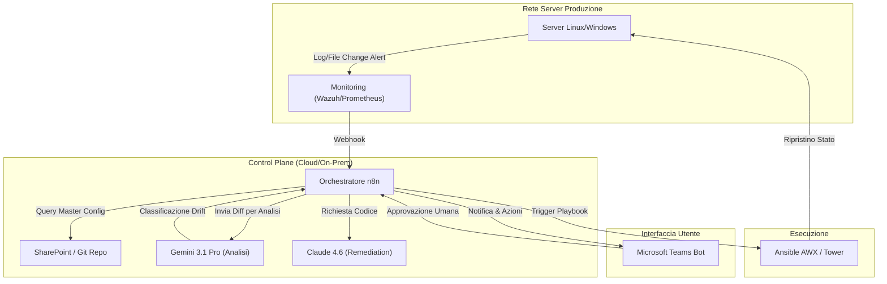
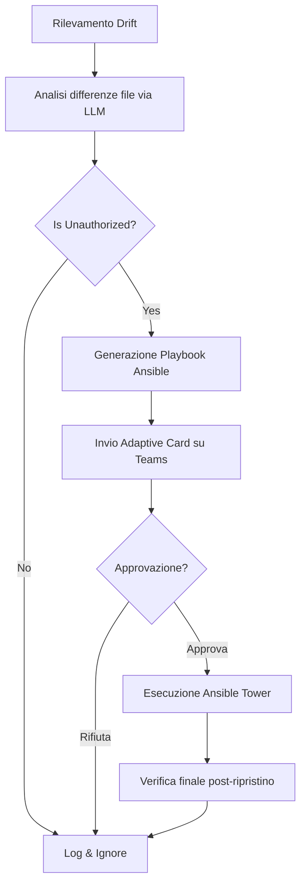
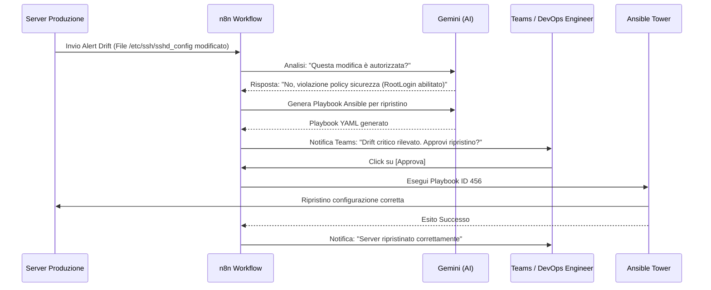

# Blueprint GenAI: Efficentamento del "Gestione Configuration Management Drift"

## 1. Descrizione del Caso d'Uso
**Categoria:** Operations & Maintenance
**Titolo:** Gestione Configuration Management Drift
**Ruolo:** DevOps Engineer
**Obiettivo Originale (da CSV):** Implementazione di processi per rilevare in tempo reale le deviazioni non autorizzate dalle configurazioni standard sui server in produzione (configuration drift) e ripristino automatico dello stato desiderato tramite Ansible/Puppet.
**Obiettivo GenAI:** Automatizzare il rilevamento intelligente e la classificazione dei drift di configurazione tramite LLM, generando istantaneamente il piano di ripristino (Ansible Playbook) e gestendo l'approvazione umana tramite Microsoft Teams per garantire sicurezza e tracciabilità.

## 2. Fasi del Processo Efficentato

### Fase 1: Ingestion e Analisi Intelligente del Drift
Il sistema di monitoraggio (es. Prometheus, Wazuh o log di sistema) rileva una modifica file/configurazione e invia un alert a un workflow n8n. L'LLM analizza il diff rispetto alla "Golden Configuration" memorizzata su SharePoint/Git.
*   **Tool Principale Consigliato:** `gemini-cli` (integrato in workflow n8n)
*   **Alternative:** 1. `OpenClaw` (per analisi on-premise), 2. `accenture ametyst`
*   **Modelli LLM Suggeriti:** `Google Gemini 3.1 Pro`
*   **Modalità di Utilizzo:** Script Python richiamato da n8n che confronta lo stato attuale del server con lo stato desiderato (YAML/JSON) e chiede all'LLM di determinare se il drift è critico o un falso positivo.
*   **Azione Umana Richiesta:** Nessuna (fase totalmente automatizzata).
*   **Stima Reale di Efficienza:** 
    *   *Tempo As-Is (Manuale):* 45 minuti (check manuale dei log e confronto file)
    *   *Tempo To-Be (GenAI):* 2 minuti
    *   *Risparmio %:* 95%
    *   *Motivazione:* L'LLM identifica istantaneamente discrepanze sintattiche e semantiche in file di configurazione complessi.

### Fase 2: Generazione Piano di Remediation (Ansible)
Se il drift è confermato come "non autorizzato", l'AI genera il playbook Ansible specifico per riportare il parametro deviato al valore corretto, senza dover rieseguire l'intero deployment massivo.
*   **Tool Principale Consigliato:** `visualstudio + copilot` (tramite API di coding assistito)
*   **Alternative:** 1. `OpenAI Codex`, 2. `claude-code`
*   **Modelli LLM Suggeriti:** `Anthropic Claude Sonnet 4.6`
*   **Modalità di Utilizzo:** Prompt strutturato che fornisce il diff del drift e richiede la generazione di un task Ansible atomico e sicuro (con clausola `check_mode`).
    ```yaml
    # Esempio Prompt per l'Agente:
    "Analizza questo drift rilevato sul server PROD-DB-01: il parametro 'max_connections' in postgresql.conf è 500, ma il valore standard è 200. Genera un playbook Ansible per ripristinare il valore, includendo il riavvio del servizio solo se necessario e la validazione finale."
    ```
*   **Azione Umana Richiesta:** Supervisione del codice generato (nella fase successiva).
*   **Stima Reale di Efficienza:** 
    *   *Tempo As-Is (Manuale):* 30 minuti (scrittura e test script)
    *   *Tempo To-Be (GenAI):* 1 minuto
    *   *Risparmio %:* 96%
    *   *Motivazione:* Generazione istantanea di codice conforme agli standard aziendali.

### Fase 3: Approvazione e Orchestrazione su Teams
Il report del drift e il codice di remediation vengono inviati all'utente su Microsoft Teams. L'operatore può approvare, rifiutare o modificare il piano con un click.
*   **Tool Principale Consigliato:** `copilot studio` + `Microsoft Teams (Chatbot UI)`
*   **Alternative:** 1. `n8n` (con nodi MS Teams), 2. `ChatGPT Agent`
*   **Modelli LLM Suggeriti:** `OpenAI GPT-5.4`
*   **Modalità di Utilizzo:** Un bot Teams notifica il DevOps Engineer: "Rilevato Drift su Server X. Azione proposta: Ripristino valore Y. Visualizza Playbook [Link]. Approvi?". Al click su "Approva", n8n triggera l'esecuzione su AWX/Ansible Tower.
*   **Azione Umana Richiesta:** Validazione finale e click di autorizzazione (Human-in-the-loop).
*   **Stima Reale di Efficienza:** 
    *   *Tempo As-Is (Manuale):* 20 minuti (comunicazione via mail/ticket e autorizzazione)
    *   *Tempo To-Be (GenAI):* 30 secondi
    *   *Risparmio %:* 97%
    *   *Motivazione:* Interfaccia chat centralizzata che elimina i tempi morti di context-switching.

## 3. Descrizione del Flusso Logico
Il flusso è un'architettura **Single-Agent** orchestrata centralmente da **n8n**. Il trigger è un evento di sistema (Webhook). n8n consulta lo **SharePoint** aziendale per recuperare i file di configurazione "Master". Invia il diff al modello **Gemini 3.1 Pro** per l'analisi critica. Se il drift è classificato come intrusione o errore, viene invocato **Claude 4.6** per scrivere il playbook di correzione. Infine, tramite **Copilot Studio**, viene presentata una "Adaptive Card" su **Microsoft Teams** all'operatore di turno. Solo dopo il "clic" di approvazione, il comando viene inviato ai server di produzione.

## 4. Diagrammi UML (Mermaid.js)

### 4.1 Architecture Diagram


### 4.2 Process Diagram


### 4.3 Sequence Diagram


## 5. Guida all'Implementazione Tecnica

### Prerequisiti
- Istanza **n8n** (self-hosted o cloud).
- Account **Microsoft Teams** con permessi per creare bot/webhooks.
- API Key per **Google Gemini** e **Anthropic**.
- **Ansible Tower / AWX** con API abilitate per il trigger dei job.

### Step 1: Configurazione n8n e Analisi
- Crea un workflow che parte da un nodo "Webhook" per ricevere gli alert dai server.
- Usa un nodo "HTTP Request" per recuperare il file di configurazione "Golden" da SharePoint via Microsoft Graph API.
- Configura un nodo "AI Agent" con il modello `gemini-3.1-pro` per confrontare i due testi e restituire un JSON con la gravità del drift.

### Step 2: Integrazione Microsoft Teams
- Utilizza il nodo "Microsoft Teams" in n8n per inviare una **Adaptive Card**. 
- La card deve contenere il riepilogo del drift e due bottoni (Approva/Rifiuta) collegati a un "Wait for Webhook" node per gestire l'asincronicità dell'approvazione umana.

### Step 3: Trigger Remediation
- Una volta ricevuto il segnale di approvazione, usa un nodo "HTTP Request" verso Ansible Tower inviando il codice generato dall'LLM (o puntando a un template pre-configurato con variabili dinamiche iniettate dall'AI).

## 6. Rischi e Mitigazioni
- **Rischio: Applicazione di configurazioni errate che causano outage.** -> **Mitigazione:** L'LLM genera il codice ma l'esecuzione avviene sempre in `check_mode` (dry-run) inizialmente, con validazione umana obbligatoria tramite Teams prima del "commit" finale.
- **Rischio: Allucinazione dell'AI sulla sintassi del Playbook.** -> **Mitigazione:** Utilizzo di modelli LLM specializzati nel coding (Claude 4.6) e integrazione di un linter automatico nel workflow n8n prima dell'invio ad Ansible.
- **Rischio: Accesso non autorizzato al bot Teams.** -> **Mitigazione:** Restrizione dell'accesso al bot tramite policy di Azure AD, permettendo l'interazione solo ai membri del gruppo "Infrastructure-Admins".
