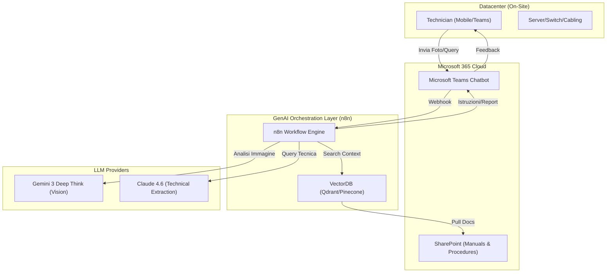
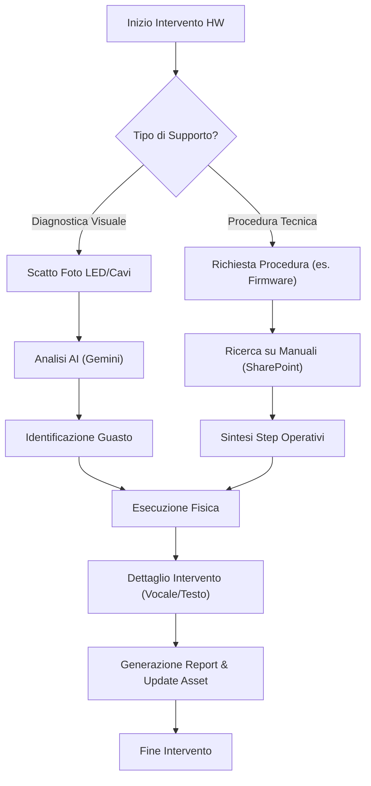
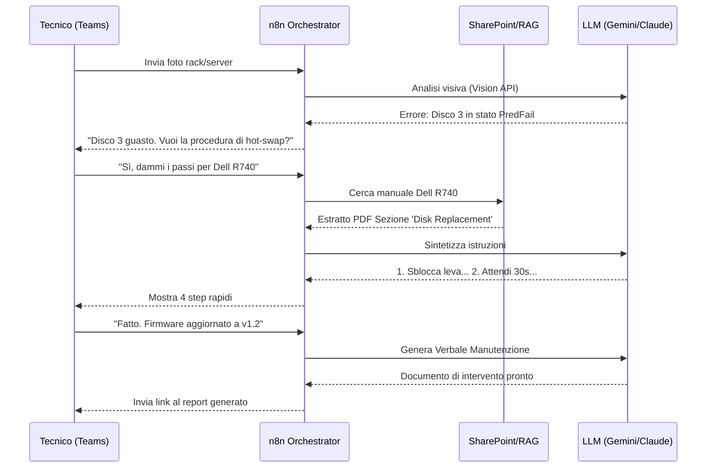

# Blueprint GenAI: Efficentamento del "Manutenzione Hardware e Cablaggio (On-Premise)"

## 1. Descrizione del Caso d'Uso
**Categoria:** Operations & Maintenance
**Titolo:** Manutenzione Hardware e Cablaggio (On-Premise)
**Ruolo:** Datacenter Technician
**Obiettivo Originale (da CSV):** Pianificazione ed esecuzione di interventi fisici nei datacenter aziendali. Sostituzione di dischi guasti, espansione banchi RAM, cablaggio strutturato a rack e aggiornamento firmware delle schede madri e switch.
**Obiettivo GenAI:** Automatizzare il supporto decisionale e documentale durante le fasi di manutenzione fisica. Nello specifico: diagnostica visuale dei guasti (tramite foto di LED/cavi), accesso immediato alle procedure di sostituzione (RAG su manuali PDF) e generazione automatica del verbale di intervento.

## 2. Fasi del Processo Efficentato

### Fase 1: Diagnostica Visuale e Troubleshooting Real-time
Il tecnico in sala macchine scatta una foto al server (LED di errore, etichette dischi o schema di cablaggio) e la invia tramite Microsoft Teams. L'AI analizza l'immagine per identificare il componente guasto o l'errore di cablaggio rispetto allo schema ideale.
*   **Tool Principale Consigliato:** `Microsoft Teams (Chatbot UI)` integrato con `n8n`.
*   **Alternative:** 1. `ChatGPT Agent` (Mobile App), 2. `Gemini-cli`.
*   **Modelli LLM Suggeriti:** `Google Gemini 3 Deep Think` (eccellente nelle capacità di Computer Vision e ragionamento spaziale).
*   **Modalità di Utilizzo:** Implementazione di un workflow n8n che riceve l'immagine via Webhook da Teams, la invia alle API di Gemini con un prompt specifico per la diagnostica hardware.
    *   **Esempio Prompt (System):** *"Sei un esperto Datacenter Engineer. Analizza questa foto di un server [Modello]. Identifica il codice errore mostrato dai LED frontali o verifica se il cablaggio fibra nei moduli SFP è corretto seguendo lo standard TIA-568. Rispondi in modo conciso con lo step di risoluzione."*
*   **Azione Umana Richiesta:** Scatto della fotografia e conferma della corretta identificazione del componente.
*   **Stima Reale di Efficienza:** 
    *   *Tempo As-Is (Manuale):* 30 min (ricerca codici errore sui manuali cartacei/online).
    *   *Tempo To-Be (GenAI):* 2 min.
    *   *Risparmio %:* 93%
    *   *Motivazione:* L'AI traduce istantaneamente segnali visivi (LED) in istruzioni operative.

### Fase 2: Consultazione Smart Procedure e Firmware (RAG)
Il tecnico richiede le istruzioni specifiche per l'aggiornamento firmware o la sostituzione RAM per un modello specifico di switch o server, interrogando la base documentale aziendale (SharePoint).
*   **Tool Principale Consigliato:** `Accenture Amethyst` (per accesso sicuro ai manuali tecnici interni).
*   **Alternative:** 1. `n8n` (con nodo VectorDB), 2. `Copilot Studio`.
*   **Modelli LLM Suggeriti:** `Anthropic Claude 4.6 Sonnet` (per l'estrazione precisa di parametri tecnici da tabelle PDF).
*   **Modalità di Utilizzo:** Configurazione di un indice RAG su SharePoint. Il tecnico chiede: "Qual è la sequenza di boot per l'update firmware del Dell PowerEdge R750?". L'AI recupera la pagina esatta del manuale e sintetizza i comandi CLI necessari.
*   **Azione Umana Richiesta:** Esecuzione fisica del comando o dell'intervento hardware.
*   **Stima Reale di Efficienza:** 
    *   *Tempo As-Is (Manuale):* 45 min (sfogliare PDF di centinaia di pagine).
    *   *Tempo To-Be (GenAI):* 3 min.
    *   *Risparmio %:* 93%
    *   *Motivazione:* Eliminazione della ricerca manuale in documentazione non strutturata.

### Fase 3: Reportistica e Chiusura Ticket Automatica
A fine intervento, il tecnico descrive vocalmente o via chat cosa ha fatto. L'AI genera un "Maintenance Report" formattato e aggiorna lo stato dell'asset nel sistema di inventory.
*   **Tool Principale Consigliato:** `n8n` (Orchestrazione tra Teams e DB Asset).
*   **Alternative:** 1. `Copilot Studio`, 2. `gemini-cli`.
*   **Modelli LLM Suggeriti:** `OpenAI GPT-5.4`.
*   **Modalità di Utilizzo:** Lo script riceve l'input vocale/testuale (es. "Sostituito disco 4 slot B, firmware portato a v2.1") e genera un file Markdown o un aggiornamento JSON per l'asset management.
*   **Azione Umana Richiesta:** Revisione finale del report prima dell'invio.
*   **Stima Reale di Efficienza:** 
    *   *Tempo As-Is (Manuale):* 20 min (scrittura verbale e aggiornamento manuale Excel/Inventory).
    *   *Tempo To-Be (GenAI):* 2 min.
    *   *Risparmio %:* 90%
    *   *Motivazione:* Automazione della burocrazia post-intervento.

## 3. Descrizione del Flusso Logico
Il flusso è progettato per essere **Single-Agent** orchestrato da **n8n**. L'interfaccia utente è esclusivamente **Microsoft Teams**, che funge da punto di ingresso per foto, testo e comandi vocali. 
1. Il tecnico invia un input (foto o testo).
2. Il "Maintenance Agent" su n8n decide se attivare il modulo di Visione (Gemini) o il modulo RAG (SharePoint) in base alla richiesta.
3. L'output viene restituito su Teams come istruzione pratica.
4. Al termine, il medesimo agente raccoglie i dati per la reportistica finale.

## 4. Diagrammi UML (Mermaid.js)

### 4.1 Architecture Diagram

### 4.2 Process Diagram

### 4.3 Sequence Diagram

## 5. Guida all'Implementazione Tecnica

### Prerequisiti
- Account **n8n** (Self-hosted o Cloud).
- API Key per **Google Gemini API** (per Vision) e **Anthropic** (per RAG).
- Accesso a **Microsoft Teams** con permessi per creare bot (via Developer Portal o Copilot Studio).
- Libreria Documentale (Manuali PDF) caricata su **SharePoint Online**.

### Step 1: Configurazione RAG su SharePoint
1. Caricare i manuali tecnici dei server/switch in una cartella SharePoint dedicata.
2. Utilizzare un loader (es. in n8n o LangChain) per indicizzare i file.
3. Creare un VectorDB (anche locale su n8n tramite il nodo *InMemory Vector Store* per semplicità iniziale) per memorizzare gli embedding.

### Step 2: Sviluppo Workflow n8n (Core)
1. **Trigger:** Nodo "Microsoft Teams" (On Message).
2. **Router:** Se il messaggio contiene un'immagine, vai al nodo "Gemini Vision". Se contiene testo, vai al nodo "Vector Store Retrieval".
3. **Prompt Engineering:**
   - Creare un System Prompt che istruisca l'LLM a non inventare comandi ma a citare solo quanto presente nei manuali.
   - Per la visione: *"Estrai il 'Service Tag' dalla foto e indica se ci sono LED ambra accesi."*

### Step 3: Integrazione Teams
1. Registrare l'app su Azure AD (Entra ID).
2. Configurare il bot in n8n usando le credenziali (Client ID, Secret).
3. Distribuire l'app ai tecnici tramite il catalogo app aziendale.

## 6. Rischi e Mitigazioni
- **Rischio 1: Interpretazione errata dei LED (Allucinazione Visiva)** -> **Mitigazione:** L'AI deve sempre chiedere conferma: "Vedo un LED rosso sul disco 4, confermi?". Non procedere senza validazione umana.
- **Rischio 2: Versioni Firmware Obsolete** -> **Mitigazione:** Il sistema RAG deve dare priorità ai documenti caricati più recentemente su SharePoint (ordinamento per data).
- **Rischio 3: Connettività in Sala Macchine** -> **Mitigazione:** Prevedere una modalità cache locale o l'uso di connettività Wi-Fi/4G dedicata per i tecnici.
