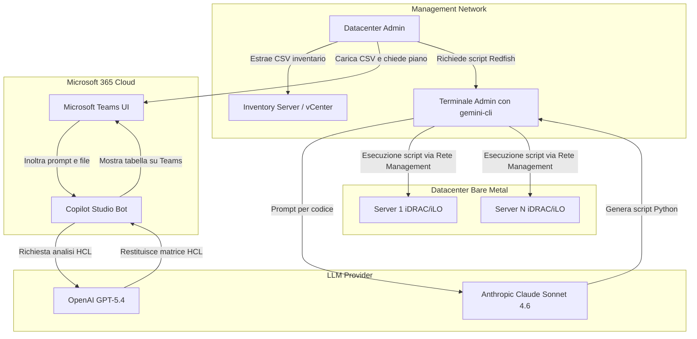
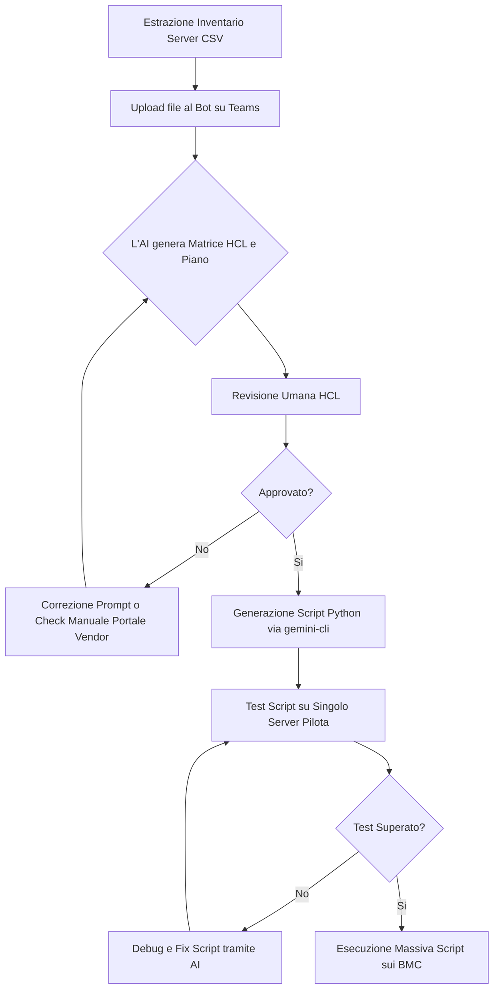
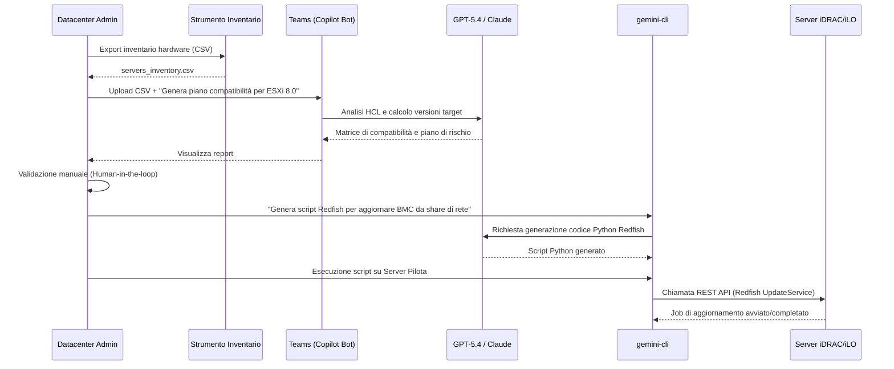

# Blueprint GenAI: Efficentamento del "Gestione Aggiornamenti Firmware (Bare Metal)"

## 1. Descrizione del Caso d'Uso
**Categoria:** Operations & Maintenance
**Titolo:** Gestione Aggiornamenti Firmware (Bare Metal)
**Ruolo:** Datacenter Administrator
**Obiettivo Originale (da CSV):** Pianificazione ed esecuzione massiva degli aggiornamenti firmware per server fisici (BIOS, iDRAC/iLO, schede di rete e HBA) garantendo la compatibilità con l'hypervisor e i sistemi operativi.
**Obiettivo GenAI:** Automatizzare la verifica incrociata della compatibilità hardware (HCL) e la generazione dei piani di aggiornamento e script di automazione (es. via API Redfish/RACADM) per i server fisici.

## 2. Fasi del Processo Efficentato

### Fase 1: Verifica Compatibilità e Generazione Piano di Aggiornamento
L'amministratore carica un'estrazione dell'inventario hardware attuale (es. da vCenter, OpenManage o OneView) sulla chat. L'AI analizza i livelli di firmware attuali (BIOS, iDRAC/iLO, HBA) e genera una matrice di compatibilità rispetto all'Hypervisor/OS target, indicando quali componenti necessitano di un upgrade.
*   **Tool Principale Consigliato:** Microsoft Teams (Chatbot UI) tramite Copilot Studio
*   **Alternative:** 1. Accenture Amethyst, 2. ChatGPT Agent
*   **Modelli LLM Suggeriti:** OpenAI GPT-5.4 o Google Gemini 3.1 Pro (per ragionamento logico su matrici di dati)
*   **Modalità di Utilizzo:** Integrazione in Teams. L'utente allega l'inventario in formato CSV/JSON e utilizza il seguente prompt:
    ```text
    Agisci come Datacenter Expert. Analizza il file di inventario allegato contenente i server fisici e i loro attuali livelli di firmware (BIOS, BMC, NIC, HBA). L'obiettivo è aggiornare tutti i server per supportare [ESXi 8.0 U2 / Windows Server 2025]. 
    1. Identifica quali versioni firmware sono obsolete rispetto alle Hardware Compatibility List (HCL) standard.
    2. Crea una tabella con: Nome Server, Componente, Versione Attuale, Versione Target Richiesta, Rischio di Incompatibilità.
    3. Segnala eventuali dipendenze (es. aggiornare prima iDRAC e poi il BIOS).
    ```
*   **Azione Umana Richiesta:** Il Datacenter Administrator deve revisionare e approvare la matrice di compatibilità generata prima di procedere, confermando le versioni target sui portali vendor ufficiali.
*   **Stima Reale di Efficienza:** 
    *   *Tempo As-Is (Manuale):* 6 ore (ricerca manuale su portali vendor, incrocio matrici HCL per decine di modelli)
    *   *Tempo To-Be (GenAI):* 20 minuti
    *   *Risparmio %:* 94%
    *   *Motivazione:* L'AI processa istantaneamente il file CSV incrociandolo con la propria knowledge base sulle regole di compatibilità standard, abbattendo il tempo di lookup manuale e riducendo l'errore umano.

### Fase 2: Generazione Script di Automazione (Redfish API)
Una volta approvato il piano, l'AI genera script customizzati (in Python o PowerShell) per applicare massivamente gli aggiornamenti tramite le interfacce di management out-of-band (iDRAC/iLO) sfruttando lo standard Redfish.
*   **Tool Principale Consigliato:** gemini-cli
*   **Alternative:** 1. VisualStudio + Copilot, 2. OpenAI Codex
*   **Modelli LLM Suggeriti:** Anthropic Claude Sonnet 4.6 o Google Gemini 3 Deep Think
*   **Modalità di Utilizzo:** Scripting rapido da riga di comando sul terminale di management.
    ```bash
    gemini-cli "Crea uno script Python che utilizzi la libreria 'redfish' per collegarsi a una lista di IP fornita nel file 'servers.csv'. Lo script deve istruire il BMC di ciascun server per scaricare e installare l'aggiornamento BIOS da questo percorso di rete: '\\share\firmware\bios.exe'. Includi la gestione degli errori e il riavvio controllato." > update_firmware.py
    ```
*   **Azione Umana Richiesta:** Test in ambiente di pre-produzione (su un singolo server) dello script generato prima di avviarlo sull'intero cluster.
*   **Stima Reale di Efficienza:** 
    *   *Tempo As-Is (Manuale):* 3 ore (scrittura e debug script Redfish/RACADM o aggiornamento manuale via GUI)
    *   *Tempo To-Be (GenAI):* 10 minuti
    *   *Risparmio %:* 94%
    *   *Motivazione:* La generazione del codice boilerplate per le chiamate REST/Redfish è immediata e personalizzata sulle esatte specifiche dell'infrastruttura.

## 3. Descrizione del Flusso Logico
Il flusso adotta un approccio **Single-Agent** (tramite Copilot Studio integrato in Teams per l'interazione umana) affiancato dall'uso on-demand di `gemini-cli` per il task di coding puro. L'amministratore estrae l'inventario dei server dai tool di monitoring esistenti e lo fornisce al bot su Microsoft Teams. Il bot agisce da consulente architetturale (Fase 1), restituendo una tabella di compatibilità e un piano di aggiornamento strutturato, evidenziando prerequisiti e rischi. L'umano ("Human-in-the-loop") verifica il piano, confermando le versioni. Successivamente, l'operatore utilizza la CLI sul proprio terminale per farsi generare il codice di automazione Redfish (Fase 2) necessario a pushare l'aggiornamento sui nodi. Lo script viene testato su un nodo pilota dall'umano e infine mandato in esecuzione massiva.

## 4. Diagrammi UML (Mermaid.js)

### 4.1 Architecture Diagram


### 4.2 Process Diagram


### 4.3 Sequence Diagram


## 5. Guida all'Implementazione Tecnica

### Prerequisiti
- Accesso a Microsoft Teams e licenze per Copilot Studio (o Microsoft Copilot for M365).
- Accesso a un ambiente di shell con `gemini-cli` installato e API Key di un LLM (es. Anthropic o Google) configurata.
- Credenziali di accesso out-of-band (IPMI/Redfish) per i server fisici.
- Un repository di rete interno (SMB/NFS o HTTP) dove sono ospitati i binari dei firmware scaricati.

### Step 1: Configurazione del Copilot su Microsoft Teams
1. Accedere a Microsoft Copilot Studio (copilotstudio.microsoft.com).
2. Creare un nuovo Copilot nominandolo "Datacenter Ops Assistant".
3. Nelle impostazioni di Generative AI, inserire come System Prompt: *"Sei un esperto Datacenter Administrator. Il tuo compito è analizzare file CSV contenenti inventari di server fisici (Dell, HPE, Cisco) e confrontare le versioni firmware correnti con le best practice e le matrici di compatibilità HCL pubbliche, fornendo piani di aggiornamento strutturati in formato tabellare."*
4. Abilitare la funzionalità di "File Upload" affinché l'utente possa allegare i CSV in chat.
5. Pubblicare il bot e aggiungerlo al team Microsoft Teams del gruppo Operations.

### Step 2: Utilizzo della CLI per Automazione Redfish
1. Dal terminale di amministrazione del Datacenter (es. un jump-server Linux o Windows), verificare che `gemini-cli` sia operativo.
2. Preparare la cartella condivisa con i binari firmware (es. `\\nas\firmwares\`).
3. Richiedere a `gemini-cli` di creare lo script Python per le chiamate Redfish passando i dettagli specifici del vendor (es. iDRAC per Dell).
4. Eseguire `pip install redfish` per installare le dipendenze Python necessarie richieste dallo script generato.
5. Lanciare lo script passando in input il CSV o un file di configurazione parziale per eseguire il deployment.

## 6. Rischi e Mitigazioni
- **Rischio 1:** Allucinazioni dell'AI sulle versioni HCL (es. suggerire una versione firmware in realtà buggata o ritirata dal vendor). -> **Mitigazione:** La fase 1 richiede obbligatoriamente un "Human-in-the-loop". Il Datacenter Admin deve validare le versioni target suggerite incrociandole rapidamente con il portale ufficiale del vendor prima di procedere.
- **Rischio 2:** Script Redfish errato che causa il bricking della scheda di rete o del BMC. -> **Mitigazione:** Testare *sempre* lo script generato su un singolo nodo isolato o di test prima di avviarlo sul parco macchine completo. Verificare che lo script implementi controlli sugli hash dei file o sui return code HTTP delle API.
- **Rischio 3:** Inserimento di credenziali in chiaro nello script generato. -> **Mitigazione:** Istruire la CLI nel prompt per fare in modo che lo script legga le credenziali da variabili d'ambiente o da un sistema di vault segreto (es. HashiCorp Vault), evitando l'hardcoding nel codice sorgente.