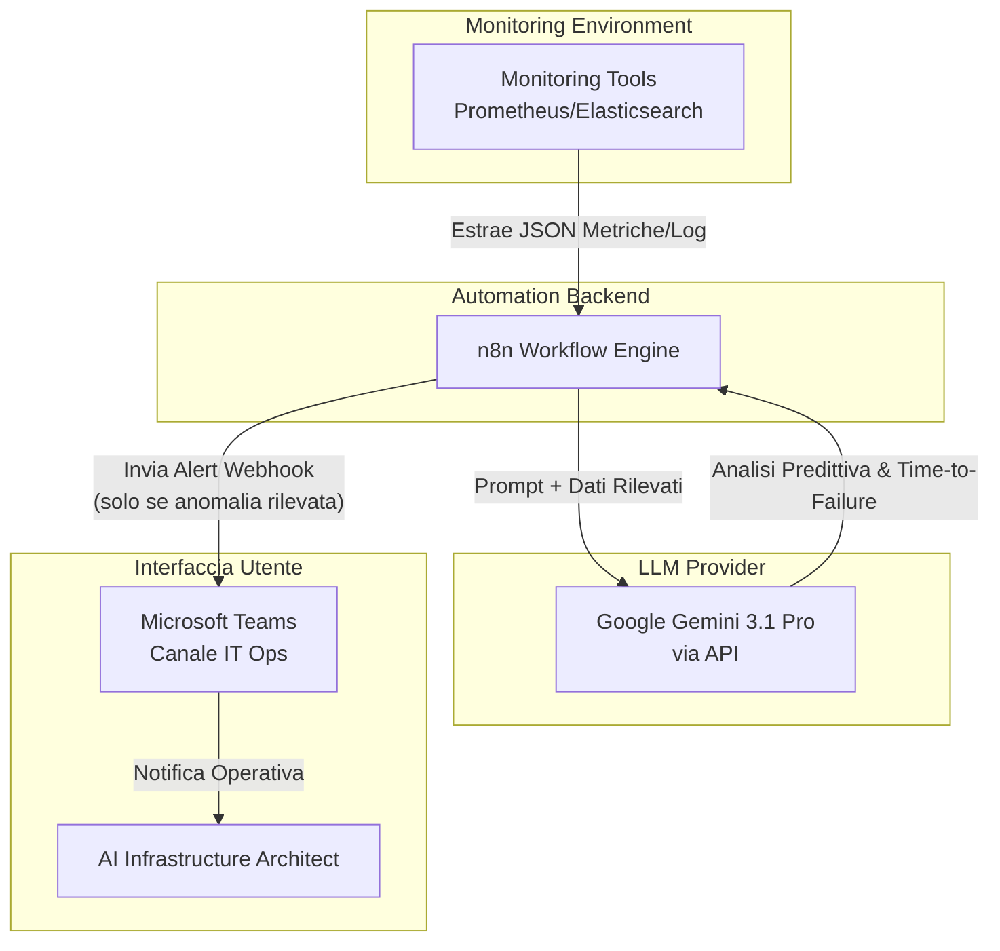
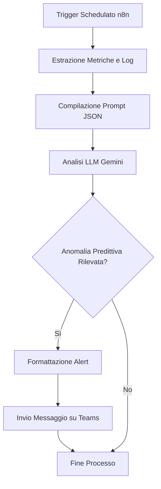
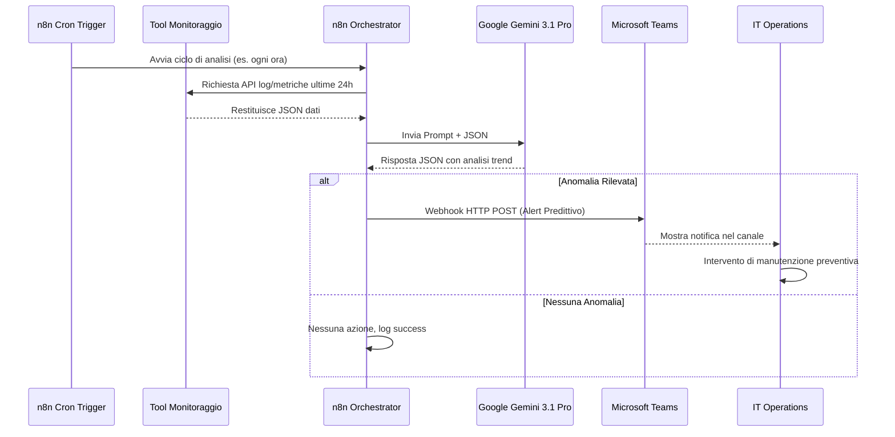

# Blueprint GenAI: Efficentamento del "AIOps - Manutenzione Predittiva"

## 1. Descrizione del Caso d'Uso
**Categoria:** Operations & Maintenance
**Titolo:** AIOps - Manutenzione Predittiva
**Ruolo:** AI Infrastructure Architect
**Obiettivo Originale (da CSV):** Implementazione di modelli di Machine Learning per l'analisi dei log storici e delle metriche di sistema al fine di prevedere guasti hardware o esaurimento risorse (disk space, memory leak) prima che si verifichi l'incidente.
**Obiettivo GenAI:** Automatizzare l'analisi periodica di log e metriche di sistema tramite LLM per prevedere tempestivamente esaurimento risorse (disco, memoria) o anomalie hardware, inviando alert predittivi prima dell'incidente, evitando la complessa creazione di modelli ML tradizionali da zero.

## 2. Fasi del Processo Efficentato

### Fase 1: Estrazione e Analisi Predittiva delle Metriche/Log
L'automazione estrae periodicamente (es. ogni ora) un set di metriche chiave e log di sistema dagli strumenti di monitoraggio e li invia a un LLM affinché identifichi pattern di degrado o trend di esaurimento risorse.
*   **Tool Principale Consigliato:** `n8n`
*   **Alternative:** 1. `gemini-cli` (via script bash in cron), 2. `Google Antigravity`
*   **Modelli LLM Suggeriti:** Google Gemini 3.1 Pro (ottimale per analizzare grandi finestre di contesto come i log)
*   **Modalità di Utilizzo:** Creazione di un workflow n8n schedulato che interroga le API del sistema di monitoraggio (es. Prometheus, Elasticsearch) per raccogliere le metriche delle ultime ore. Il payload viene poi inviato al nodo LLM con il seguente prompt:
    ```json
    {
      "system_prompt": "Sei un AI Infrastructure Architect esperto in AIOps. Analizza i log e le metriche allegate per scopi di manutenzione predittiva.",
      "user_prompt": "Analizza il seguente JSON contenente log e metriche (CPU, RAM, Disk, Error Logs) delle ultime 24 ore.\n1. Identifica trend di crescita anomala (es. memory leak, riempimento disco).\n2. Segnala pattern nei log che precedono guasti hardware.\n3. Se rilevi un problema potenziale, fornisci una stima del 'Time to Failure' e una raccomandazione.\nRispondi in JSON strutturato con chiavi: 'anomalia_rilevata' (booleano), 'dettagli', 'time_to_failure'.\n\nMetriche/Log:\n{{ $json.metrics_and_logs }}"
    }
    ```
*   **Azione Umana Richiesta:** Il sistemista o l'architetto supervisiona gli alert predittivi generati e decide se applicare la mitigazione suggerita.
*   **Stima Reale di Efficienza:** 
    *   *Tempo As-Is (Manuale):* 4 ore/settimana (per analisi manuale dei trend o training e tuning di modelli ML custom)
    *   *Tempo To-Be (GenAI):* 10 minuti/settimana (solo validazione degli alert predittivi)
    *   *Risparmio %:* 95%
    *   *Motivazione:* L'uso di n8n combinato con un LLM general-purpose con ampio contesto elimina la necessità di sviluppare, addestrare e manutenere complessi modelli di Machine Learning ad-hoc, fornendo insight immediati.

### Fase 2: Notifica e Alerting su Microsoft Teams
Se l'LLM identifica un'anomalia predittiva, il workflow inoltra immediatamente un alert dettagliato sul canale Teams del team operativo.
*   **Tool Principale Consigliato:** `Microsoft Teams (Chatbot UI)` (tramite webhook da n8n)
*   **Alternative:** Nessuna (requisito stringente di familiarità)
*   **Modelli LLM Suggeriti:** N/A (l'output arriva dalla Fase 1)
*   **Modalità di Utilizzo:** Aggiunta di un nodo "Microsoft Teams" o "HTTP Request" in n8n che, condizionato al flag `anomalia_rilevata: true` nella risposta dell'LLM, invia un messaggio formattato al canale IT Operations contenente l'analisi e il "Time to Failure" previsto.
*   **Azione Umana Richiesta:** Lettura dell'alert sul canale Teams e presa in carico dell'intervento preventivo.
*   **Stima Reale di Efficienza:** 
    *   *Tempo As-Is (Manuale):* 1 ora (per reportistica manuale delle anomalie)
    *   *Tempo To-Be (GenAI):* 0 minuti (completamente automatizzato)
    *   *Risparmio %:* 100%
    *   *Motivazione:* La comunicazione dell'insight predittivo avviene in tempo reale e senza alcun effort manuale di compilazione report o ticket.

## 3. Descrizione del Flusso Logico
Il processo segue un approccio **Single-Agent** orchestrato da n8n per favorire la massima semplicità. Un trigger temporale (cron) avvia il workflow che estrae le metriche di sistema e i log di errore dai tool di monitoring esistenti. Questi dati vengono raggruppati in un payload JSON e passati all'LLM (Google Gemini 3.1 Pro) con un prompt specializzato nell'individuazione di trend anomali. L'LLM agisce come analista logico: se determina che c'è un rischio imminente (es. un disco si riempirà entro 48 ore in base al rate di scrittura attuale, o un memory leak porterà a un OOM), risponde affermativamente in formato JSON. L'orchestratore filtra l'output tramite un nodo condizionale e, in caso positivo, invia un alert predittivo tramite Webhook al canale Microsoft Teams del team Operations. L'intervento umano è richiesto unicamente per validare l'allarme e operare la mitigazione.

## 4. Diagrammi UML (Mermaid.js)

### 4.1 Architecture Diagram


### 4.2 Process Diagram


### 4.3 Sequence Diagram


## 5. Guida all'Implementazione Tecnica
### Prerequisiti
- Server n8n (on-premise o cloud) installato e funzionante.
- API Key di Google AI Studio (per l'utilizzo di Gemini 3.1 Pro).
- Accesso in lettura alle API dei sistemi di monitoraggio (es. endpoint HTTP di Prometheus o Elasticsearch).
- Webhook URL generato per un canale Microsoft Teams tramite l'app "Connettori in ingresso" o "Workflow".

### Step 1: Configurazione del Workflow in n8n
1. Accedere all'interfaccia di n8n e creare un nuovo workflow.
2. Aggiungere un nodo **Schedule Trigger** impostandolo per l'esecuzione oraria (o con la frequenza desiderata).
3. Aggiungere un nodo **HTTP Request** per interrogare le API del sistema di monitoraggio. Inserire l'URL di Prometheus/Elasticsearch e configurare l'autenticazione.

### Step 2: Integrazione con l'LLM
1. Aggiungere un nodo **Google Gemini** o un nodo **HTTP Request** puntato alle API di Google AI Studio.
2. Configurare l'autenticazione inserendo l'API Key.
3. Selezionare il modello `gemini-3.1-pro`.
4. Nel campo del prompt, richiedere esplicitamente l'output in formato JSON `{"anomalia_rilevata": true/false, "dettagli": "...", "time_to_failure": "..."}`.
5. Iniettare i risultati del nodo precedente usando la sintassi n8n (es. `{{ $json.data }}`).

### Step 3: Logica Condizionale e Alerting
1. Aggiungere un nodo **If** per valutare la risposta JSON dell'LLM (condizione: `{{ $json.anomalia_rilevata }} == true`).
2. Collegare l'uscita `true` del nodo "If" a un nuovo nodo **HTTP Request** configurato con metodo `POST`.
3. Nell'URL del nodo, inserire il Webhook del canale Microsoft Teams.
4. Nel body della richiesta, inviare un payload strutturato per Teams inserendo i dettagli dell'allarme generati dall'AI (es. `{{ $json.dettagli }}` e `{{ $json.time_to_failure }}`).
5. Salvare e attivare il workflow.

## 6. Rischi e Mitigazioni
- **Rischio 1: Falsi Positivi e Allucinazioni dell'AI** -> **Mitigazione:** Istruire rigorosamente l'LLM nel prompt a segnalare solo trend evidenti e limitare la confidenza. Mantenere sempre l'umano nel loop per valutare l'alert prima di intraprendere azioni distruttive.
- **Rischio 2: Costi API ed Esaurimento Token** -> **Mitigazione:** Filtrare i log in ingresso tramite un nodo n8n prima di inviarli all'LLM (es. inviando solo i log `ERROR` o `WARN` e tagliando quelli `INFO`), riducendo drasticamente le dimensioni del payload.
- **Rischio 3: Esposizione di Dati Sensibili nei Log** -> **Mitigazione:** Utilizzare un nodo di pre-processing (es. Regex in JavaScript) in n8n per mascherare eventuali PII o credenziali presenti nei log, oppure utilizzare un modello locale on-premise (es. Llama 4 via OpenClaw) se i dati non possono uscire dall'azienda.