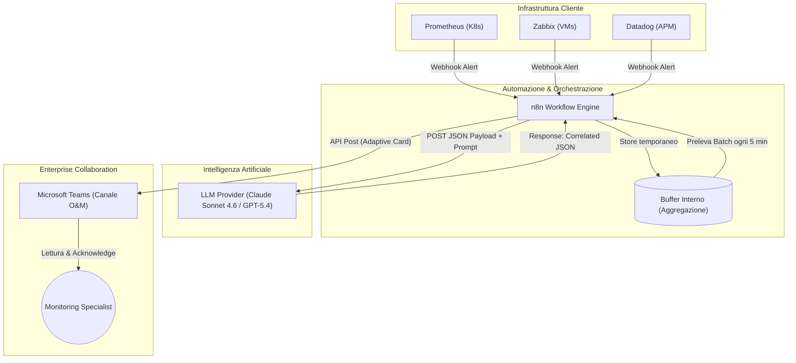
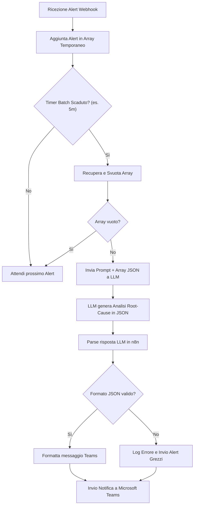
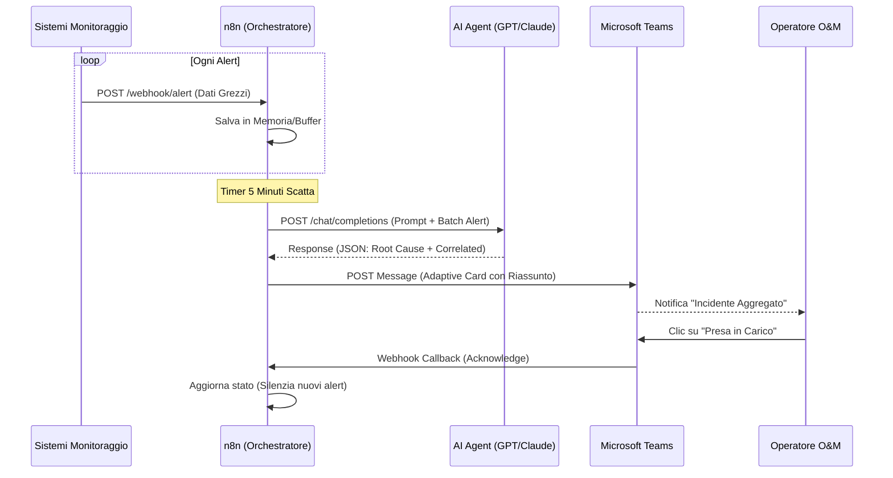

# Blueprint GenAI: Efficentamento del "AIOps - Raggruppamento Intelligente Allarmi (Alert Correlation)"

## 1. Descrizione del Caso d'Uso
**Categoria:** Operations & Maintenance
**Titolo:** AIOps - Raggruppamento Intelligente Allarmi (Alert Correlation)
**Ruolo:** Monitoring Specialist
**Obiettivo Originale (da CSV):** Configurazione di algoritmi AIOps per correlare e raggruppare dinamicamente centinaia di allarmi di monitoraggio in singoli incidenti root-cause, riducendo drasticamente l'alert fatigue per i team operativi.
**Obiettivo GenAI:** Automatizzare l'ingestion e l'aggregazione di un elevato numero di allarmi grezzi, demandando a un LLM l'analisi semantica e temporale per dedurre un'unica Root-Cause e notificare un singolo incidente riepilogativo al team operativo, eliminando l'alert fatigue.

## 2. Fasi del Processo Efficentato

### Fase 1: Ingestion e Batching Temporale degli Allarmi
Raccogliere gli allarmi continui (spesso ridondanti) dai vari tool di monitoraggio (es. Prometheus, Zabbix, Datadog) e accumularli in un buffer temporale per prepararli all'analisi.
*   **Tool Principale Consigliato:** `n8n`
*   **Alternative:** 1. `Google Antigravity` (per integrazioni cloud-native), 2. Script Python
*   **Modelli LLM Suggeriti:** N/A (Fase di orchestrazione e code-logic)
*   **Modalità di Utilizzo:** Configurazione di un workflow in n8n che espone un endpoint Webhook. Ogni alert ricevuto viene accodato in una lista temporanea. Un nodo "Cron" o "Wait" interviene ogni X minuti (es. 5 minuti) prelevando tutti gli alert accumulati per inviarli alla fase successiva come un singolo array JSON.
*   **Azione Umana Richiesta:** Nessuna.
*   **Stima Reale di Efficienza:** 
    *   *Tempo As-Is (Manuale):* Ricezione frammentata di 50+ email/notifiche all'ora, con conseguente perdita di tempo nel leggerle tutte.
    *   *Tempo To-Be (GenAI):* 0 minuti.
    *   *Risparmio %:* 100%
    *   *Motivazione:* L'accumulo è totalmente demandato alla piattaforma di automazione.

### Fase 2: Correlazione e Deduzione Root-Cause tramite LLM
Il blocco di allarmi viene analizzato dall'AI per comprendere le dipendenze (es. la perdita di rete ha generato alert sui nodi DB e sui Frontend a cascata) ed estrarre il problema reale.
*   **Tool Principale Consigliato:** `n8n` (Nodo LLM / HTTP Request)
*   **Alternative:** `gemini-cli` (richiamato via shell per analisi offline di file di log)
*   **Modelli LLM Suggeriti:** `Anthropic Claude Sonnet 4.6` o `OpenAI GPT-5.4` (eccellenti per l'analisi logica di JSON, log strutturati e pattern recognition).
*   **Modalità di Utilizzo:** n8n invia l'array JSON al modello tramite prompt. Di seguito un esempio del System Prompt:

```text
Sei un esperto AIOps (IT Operations).
Di seguito ti viene fornito un array JSON contenente gli alert scattati negli ultimi 5 minuti nei nostri sistemi.
Il tuo obiettivo è abbattere l'"alert fatigue" unendo gli alert correlati.

{BATCH_ALERTS_JSON}

Esegui queste operazioni:
1. Raggruppa gli allarmi derivanti dalla stessa causa scatenante (es. un down di rete genera timeout sui servizi).
2. Individua la singola Root-Cause probabile.
3. Restituisci la risposta ESCLUSIVAMENTE in formato JSON valido con la seguente struttura:
{
  "incident_title": "Breve titolo dell'incidente aggregato",
  "root_cause_analysis": "Spiegazione sintetica della causa primaria dedotta",
  "severity": "CRITICAL, HIGH, MEDIUM o LOW",
  "affected_systems": ["sistema1", "sistema2"],
  "correlated_alerts_count": <numero di alert unificati>
}
Non inserire spiegazioni o testo fuori dal JSON.
```
*   **Azione Umana Richiesta:** Nessuna. Elaborazione in background.
*   **Stima Reale di Efficienza:** 
    *   *Tempo As-Is (Manuale):* 45 minuti per analizzare manualmente decine di log durante un'anomalia ("alert storm") per trovare l'evento "Paziente Zero".
    *   *Tempo To-Be (GenAI):* 1 minuto (tempo di inferenza dell'LLM).
    *   *Risparmio %:* ~98%
    *   *Motivazione:* L'LLM elabora istantaneamente correlazioni logiche complesse analizzando il contesto globale degli allarmi in parallelo.

### Fase 3: Notifica Centralizzata su Microsoft Teams
Il risultato JSON generato dall'LLM viene formattato in una card leggibile e inviato al team operativo, sostituendo le decine di notifiche grezze.
*   **Tool Principale Consigliato:** `Microsoft Teams (Chatbot UI)` (pilotato da `n8n`)
*   **Alternative:** 1. Integrazione API con ServiceNow/Jira
*   **Modelli LLM Suggeriti:** N/A (Orchestrazione)
*   **Modalità di Utilizzo:** n8n utilizza il nodo "Microsoft Teams" per postare una "Adaptive Card" sul canale `O&M Alerts`. La card mostra in modo evidente l'`incident_title`, la `root_cause_analysis` e la `severity`, includendo un bottone di "Acknowledge" (Presa in carico) che, se cliccato, invia un webhook di ritorno a n8n per silenziare temporaneamente futuri alert simili o aprire un ticket su ITSM.
*   **Azione Umana Richiesta:** Il Monitoring Specialist legge un'unica notifica comprensibile, ne valuta la correttezza e clicca "Acknowledge" per avviare la remediation.
*   **Stima Reale di Efficienza:** 
    *   *Tempo As-Is (Manuale):* 15 minuti per creare un ticket riepilogativo manuale di comunicazione.
    *   *Tempo To-Be (GenAI):* 1 minuto (lettura ed engagement).
    *   *Risparmio %:* 93%
    *   *Motivazione:* La comunicazione avviene in tempo reale e con un formato già sintetizzato ed "actionable".

## 3. Descrizione del Flusso Logico
La soluzione è disegnata attorno a un'architettura **Single-Agent** orientata al task, con un workflow di integrazione continuo. I vari sistemi di monitoraggio infrastrutturale convergono verso un unico webhook esposto da n8n. Questo strumento aggrega temporaneamente (batching) gli eventi ed evita di disturbare gli operatori. Ad intervalli regolari, n8n passa l'intero payload raccolto a un potente LLM che funge da correlatore cognitivo: la sua capacità di analizzare testo e JSON permette di unire i puntini tra un alert di rete e un alert di database fallito. Il risultato di questa deduzione è un singolo payload JSON, che n8n traduce in un messaggio Teams altamente leggibile, permettendo al tecnico umano di supervisionare (Human-in-the-loop) l'output e decidere la risoluzione in pochi secondi, azzerando di fatto il rumore di fondo.

## 4. Diagrammi UML (Mermaid.js)

### 4.1 Architecture Diagram


### 4.2 Process Diagram


### 4.3 Sequence Diagram


## 5. Guida all'Implementazione Tecnica

### Prerequisiti
- Istanza di `n8n` operativa (Cloud o Self-Hosted).
- API Key attiva per Anthropic (Claude 4.6) o OpenAI (GPT-5.4).
- Accesso amministrativo ai sistemi di monitoraggio per configurare l'invio Webhook.
- Integrazione autorizzata n8n - Microsoft Teams (creazione di un'app in Azure AD o Webhook in ingresso sul Canale Teams).

### Step 1: Configurazione Webhook e Aggregazione su n8n
1. In `n8n`, crea un nuovo workflow.
2. Aggiungi il nodo **Webhook** impostato su metodo POST per ricevere i JSON dai sistemi di monitoraggio.
3. Collega un nodo **Code** (JavaScript) o utilizzalo per salvare i dati in una struttura in memoria globale, oppure usa il design pattern del nodo **Wait** combinato ad un **Schedule Trigger** che legge i dati da un mini database temporaneo (es. SQLite nativo di n8n o Google Sheets).

### Step 2: Integrazione dell'LLM
1. Aggiungi il nodo **OpenAI** o **Anthropic** in n8n (o un generico **HTTP Request** se usi MCP).
2. Seleziona l'azione di Chat/Generazione Testo.
3. Inserisci nel campo "System Message" o "Instruction" la bozza di prompt riportata nella Fase 2.
4. Come input per il prompt, passa dinamicamente (es. espressione `{{ $json.batchData }}`) l'array contenente tutti gli alert accumulati negli ultimi minuti.
5. Richiedi esplicitamente in n8n il formato di risposta in "JSON Object" se supportato dal provider.

### Step 3: Parse e Invio a Teams
1. Aggiungi un nodo **Code** o **JSON Parse** per assicurarti che la risposta dell'LLM sia correttamente strutturata.
2. Aggiungi il nodo **Microsoft Teams**. Scegli l'operazione "Send a message" (o via Webhook).
3. Utilizza le variabili restituite dall'LLM (es. `{{ $json.incident_title }}`, `{{ $json.root_cause_analysis }}`) per comporre il testo del messaggio o la struttura di un'Adaptive Card interattiva.
4. Attiva il Workflow e invia alert di test da Prometheus per validare la correlazione e la formattazione su Teams.

## 6. Rischi e Mitigazioni
- **Rischio Allucinazioni:** L'LLM potrebbe dedurre una Root-Cause completamente scollegata dalla realtà o ignorare alert critici isolati. 
  -> **Mitigazione:** Forzare un prompt deterministico imponendo all'AI di elencare i `correlated_alerts_ids` per garantire tracciabilità, e impostare un formato JSON rigido. Mantenere l'accesso ai log grezzi per l'operatore (link nella notifica Teams).
- **Rischio Latenza ed Escalation:** Il batching temporale (es. attendere 5 minuti) ritarda la ricezione dell'alert.
  -> **Mitigazione:** Mantenere regole di "Bypass" in n8n: se l'alert originale ha severity "SEV-1/FATAL", n8n deve inviare la notifica immediatamente senza attendere il batch, bypassando la correlazione.
- **Rischio Costi API (Token):** Centinaia di alert generano enormi moli di token ad ogni invocazione dell'LLM.
  -> **Mitigazione:** Prima di inviare il payload all'LLM, utilizzare un nodo in n8n per sfoltire i log grezzi (rimuovere stack trace lunghi, timestamp non utili) inviando all'AI solo Titolo, Severity, Hostname e Messaggio dell'alert.